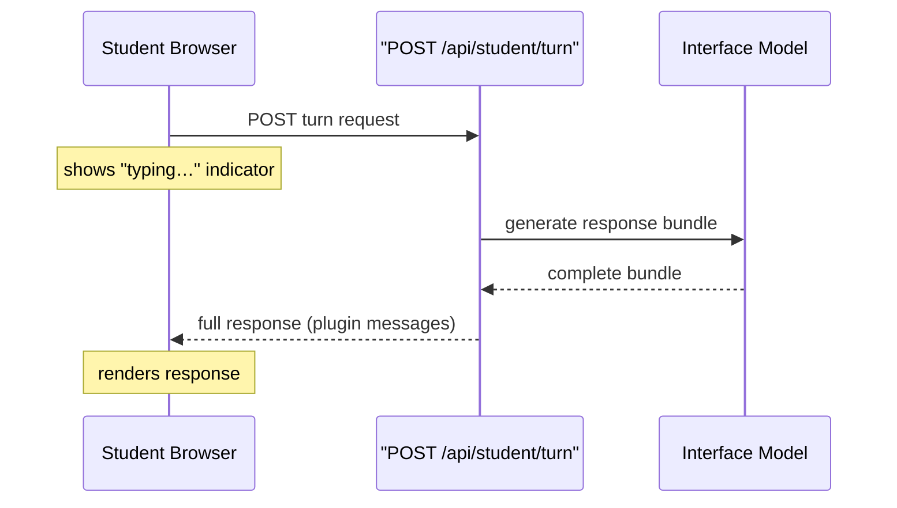
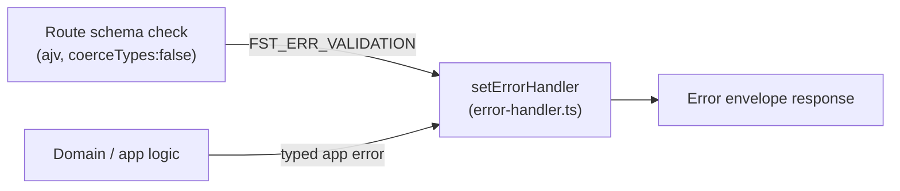

The server's HTTP surface for MVP is deliberately small: one endpoint drives the entire student–tutor loop. Every design choice — the route shape, the transport model, the validation rules — follows from a single principle: one schema-validated contract, no silent surprises.

## One flat route, one complete contract

Student input goes to `POST /api/student/turn` with a JSON body:

```json
{
  "schemaVersion": "1",
  "sessionId": "<server-issued session id>",
  "message": "What does osmosis mean?"
}
```

An earlier design used `POST /api/student/session/:id/turn`, placing the session ID in the URL path. That was dropped because a path parameter and a request body are two separate schemas — you cannot express the full `TurnRequest` as one type in the shared contracts package. Fastify was chosen precisely for per-route JSON Schema validation; splitting one logical request across two schemas works against that choice.

A turn is also a **command**, not a sub-resource. No turn collection exists, and no individual turn is ever addressed by ID, so REST-style path nesting bought nothing structurally. The flat route is the honest shape.

The `sessionId` in the body must refer to a real server-issued session row. A client-invented value the server ignores was also rejected: an identifier that resolves to nothing is worse than no identifier at all when the schema is busy checking its shape.

## Plain request/response — no streaming

A tutor turn follows a normal HTTP request/response cycle. The student POSTs their message; the server returns the **complete response bundle** (a list of plugin messages) once generation finishes; the frontend shows a "typing…" indicator while it waits.

Token-by-token streaming was considered and dropped as an over-commitment. The student-facing turn runs on the fast Interface model (a few seconds), so a typing cue is enough responsiveness. The slower Expert model runs off the turn loop and never blocks the student.



Because the server never needs to push a message the student did not ask for in MVP (checkpoint updates arrive in the next turn; the silence-nudge is a client-side timer), SSE, WebSockets, and any persistent connection are unnecessary. This removes reconnect logic, proxy-buffering configuration, and the connection-registry-vs-Redis question from MVP scope entirely.

:::note[Revisit trigger]
If a future feature needs an unprompted server → student message — a live nudge or a real-time plugin — only the transport would need to change. The response is already a list of messages, so the shape is ready.
:::

## Strict validation: ajv coercion is disabled

Fastify uses **ajv** (a JSON Schema validator) to check every request body before a route handler runs. By default, ajv *coerces* scalar types: if a field is declared `{ type: 'string' }` but the client sends the number `123`, ajv silently converts it to `"123"` and passes it through as valid. The route handler sees a clean body and returns `200` — the type mismatch is invisible.

This quietly defeats the error-envelope contract. A wrong-typed field should return a structured `400`. With coercion on, no validation failure is ever raised, so the error handler is never invoked.

The fix is a single setting at the Fastify construction site in `server/src/app.ts`:

```ts
const app = fastify({
  loggerInstance: ctx.logger as never,
  ajv: { customOptions: { coerceTypes: false } },
});
```

With coercion off, every route validates the *actual* type the client sent. The setting lives at the composition root so it applies to every route without each route defending itself. The alternative — leaving coercion on — was rejected: coercion's convenience is worth nothing here (no route wants `"123"` from `123`), while the failure mode is silent and affects every future route automatically.

:::caution[Test instances]
A test that constructs its own bare `fastify()` instance does **not** inherit this setting — Fastify applies framework defaults. Any hand-built test instance must re-apply `coerceTypes: false` explicitly, or a malformed-body assertion can pass for the wrong reason.
:::

The guard is proven by a dedicated type-mismatch test in `server/test/error-handler.test.ts` that is independent of any application route. It was verified the hard way: temporarily removing `coerceTypes: false` from `app.ts` caused the test to fail with `expected 200 to be 400`; restoring the setting made it green again. The `echo-turn` stopgap route can be deleted in a later sprint without removing the guard's only proof.

## Validation errors and the error envelope

Fastify's schema validation produces its own error code — `FST_ERR_VALIDATION` — outside the application's typed-error hierarchy. Without explicit handling, a request that fails route-schema validation (before reaching any domain code) would bypass the standard error envelope and return Fastify's raw, unstructured response.

A single `setErrorHandler` in `server/src/api/error-handler.ts` intercepts all errors and maps them to the envelope shape:



Every HTTP error a client receives has the same structure, whether the failure came from the framework's own schema check or from application logic deeper in the stack. The two pieces work together: disabling coercion ensures type mismatches actually raise `FST_ERR_VALIDATION`, and the error handler ensures that error surfaces as a structured envelope rather than raw Fastify output.

## Route-table test coverage

Because any new route could unintentionally expand the API surface, the route table is covered by a CI allowlist check. Fastify registers plugins **lazily** — `app.register(...)` only queues a plugin; the routes inside it do not exist until `app.ready()` runs. This creates a narrow window for route introspection:

```
app.register(routes)          // queues the plugin
app.addHook('onRoute', collect)  // ← attach here
await app.ready()             // routes register; hook fires
```

Hooking `onRoute` after `app.ready()` fires for nothing — the set is empty. Never calling `app.ready()` means routes do not exist yet — also empty. An empty set can pass vacuously when the check looks for "no forbidden route found", appearing green while observing nothing.

The `onRoute` hook delivers a structured `{ method, url }` per route as it registers, enabling an exact `Set` comparison against the pinned allowlist. `printRoutes()` was considered and rejected — it returns a formatted tree string that is not a stable contract and would need to be parsed. The set-equality assertion fires on an extra undeclared route and equally on a removed route whose allowlist entry was left behind.
