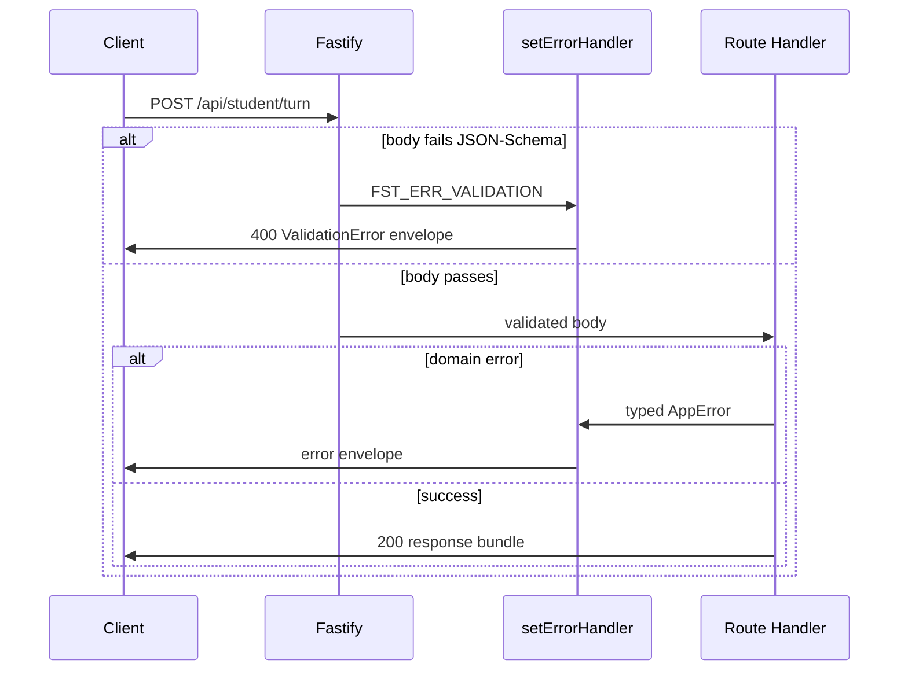

The Stemolly backend exposes a small HTTP API built on **Fastify**. Every student interaction goes through a single route. Responses are complete JSON bundles — no streaming. A strict validation contract ensures that every bad request, whether rejected by the framework or by the application, returns the same shaped error.

---

## The Turn Route

A student's turn is sent as:

```
POST /api/student/turn
```

```json
{
  "schemaVersion": "1",
  "sessionId": "srv-issued-id",
  "message": "Can you explain this again?"
}
```

The entire request — session identity and message — lives in the **body**, not in the URL.

### Why not a nested route?

An earlier design used `POST /api/student/session/:id/turn`, placing the session ID in the URL path. That was rejected for one concrete reason: the session ID would then live in a *params* schema while the rest of the request lived in a *body* schema, making it impossible to express `TurnRequest` as a single type in the shared contracts package.

The project rule is that every artifact crossing a service boundary is validated as a single schema-validated contract. Splitting one logical request across two schemas breaks that rule — and, with type coercion disabled app-wide (see below), a params surface is more awkward still.

A turn is also a **command**, not a sub-resource. No turn collection exists, and no individual turn is ever addressed by ID, so REST-style path nesting bought nothing structurally. The flat route is the honest shape.

The `sessionId` in the body must resolve to a real server-issued session row. A client-invented value that the server silently ignores was also rejected: an identifier that refers to nothing is worse than no identifier at all when a schema is validating its shape.

---

## Transport: Request/Response with a Typing Indicator

A tutor turn is a **plain HTTP request/response**. The student POSTs; the server returns the complete response bundle (a list of plugin messages) when generation finishes; the frontend shows a "typing…" indicator while waiting.

Token-by-token streaming was considered and dropped. The student-facing turn runs on the fast **Interface** model, which finishes in a few seconds — a typing indicator is enough responsiveness. The slow **Expert** model runs off the turn loop and never blocks the student.

There is no unprompted server→student message in MVP:

- Checkpoint updates arrive with the *next* turn response.
- The silent-stall nudge is a **client-side timer**, not a server push.

Because the server never needs to push a message the student did not ask for, SSE, WebSockets, and any push channel are unnecessary. Removing them also removes long-lived connections, reconnect logic, proxy-buffering configuration, and the connection-registry-vs-Redis question entirely.

**When to revisit:** if any future feature needs an unprompted server→student message (a live nudge, a real-time plugin), only the transport would change — the response is already a list of messages, so the shape stays the same.

---

## Validation: One Envelope for Every Error



### One error handler, all errors

Fastify validates each route's request body against a JSON Schema before the route handler runs. When validation fails, Fastify raises `FST_ERR_VALIDATION` — its own error type, outside the application's typed-error hierarchy.

The project maps this framework error to the same envelope shape used everywhere else. A single `setErrorHandler` in `server/src/api/error-handler.ts` handles both cases:

- An `FST_ERR_VALIDATION` from Fastify → serialised as a `ValidationError` envelope.
- Any typed `AppError` thrown by a domain module → serialised as its own envelope variant.

The client always receives the same structure, regardless of where the failure originated.

### Why coercion must be off

This mapping has a hidden precondition. Under Fastify's **default** ajv configuration, scalar types are **coerced before** schema validation runs. If a client sends `{ "message": 123 }` and the schema says `{ type: "string" }`, Fastify silently converts `123` to `"123"` and the validation passes. The route sees a well-formed body and returns `200`. `FST_ERR_VALIDATION` is never raised, so the error handler is never invoked — the envelope contract is broken without any visible warning.

The fix is to disable coercion **once**, at the single `fastify()` construction site in `server/src/app.ts`:

```ts
const app = fastify({
  loggerInstance: ctx.logger as never,
  ajv: { customOptions: { coerceTypes: false } },
});
```

With coercion off, every route's schema validates the request's *actual* type. A wrong-typed field now raises `FST_ERR_VALIDATION`, which the error handler catches and wraps into the envelope.

The alternative — leaving coercion on and having each route defend itself — was rejected. Coercion's convenience is worth nothing here (no route wants the string `"123"` from the number `123`), while the failure mode is silent and applies to every route added in the future. Disabling it once at the composition site is the only place the constraint holds globally.

> **Test instances inherit nothing.** A test that constructs its own bare `fastify()` instance does **not** inherit this setting. Hand-built test instances must re-apply `coerceTypes: false` explicitly, or a malformed-body assertion will pass for the wrong reason.

### Coercion guard is route-independent

Originally the only test for this rule was coupled to a temporary `echo-turn` route. If that route were deleted, the test would disappear with it — leaving the coercion guard without any proof.

The guard is now pinned independently: `server/test/error-handler.test.ts` contains a dedicated type-mismatch case (a numeric value against a `{ type: "string" }` field) that does not depend on any application route. The fix was verified the hard way — `coerceTypes: false` was temporarily removed from `app.ts`, the new test was re-run and failed with `expected 200 to be 400`, then `app.ts` was restored and the test passed again. The `echo-turn` route can be deleted in a later sprint without losing the guard's coverage.

---

## Fastify Plugin Registration: Timing Matters

Fastify's plugin system is **lazy**. Calling `app.register(...)` does not mount routes immediately — it queues the plugin. Routes are only registered when `app.ready()` is awaited during boot.

This matters for any test or fitness function that introspects the route table. There is one narrow window in which to attach a collector:

```
app.register(routes)   ← queues the plugin
app.addHook('onRoute', collect)   ← ✓ attach here
await app.ready()   ← routes register, hook fires
```

If the `onRoute` hook is attached after `app.ready()`, it fires for nothing and the collected set is empty. If `app.ready()` is never called, the routes do not exist yet — also empty.

An empty set can fail silently: if the check looks for "no forbidden route was found", an empty set passes vacuously, appearing green while observing nothing at all.

The `onRoute` hook is the right instrument for route-table introspection because it delivers a structured `{ method, url }` object per route as each registers. This enables an exact `Set` comparison against a pinned allowlist. `printRoutes()` returns a formatted tree string whose shape is not a stable contract — it would need to be parsed. The set-equality assertion fires on an extra route *and* equally on a removed route whose allowlist entry was left behind.
