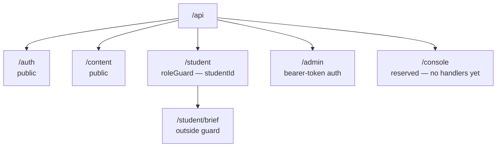
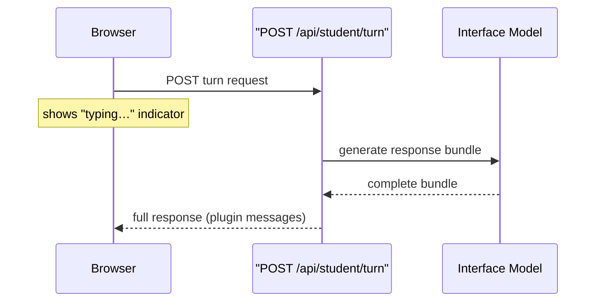
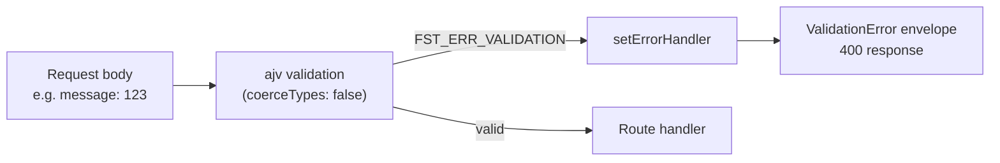

Stemolly's HTTP API is built with Fastify. Every request flows through one shared pipeline that stamps trace IDs, validates request bodies against JSON Schemas, and formats every error — framework-level or application-level — into the same typed envelope. The student-facing surface is deliberately small: plain request/response, no persistent connections, no streaming in the MVP.

## One pipeline, applied to every request

`buildServer(ctx)` is the single place where application-wide HTTP behavior is established. It constructs Fastify with `ajv.customOptions.coerceTypes = false` and `removeAdditional = false`, decorates every incoming request with a freshly minted `traceId`, converts `request.log` into a trace-scoped child logger, and installs the global error handler — all before any routes are registered. Because these settings live at the construction site rather than inside each route, they are guaranteed to apply uniformly.

The error handler is the only place in the server that produces HTTP error bodies. `DomainError` instances thrown by application code, Fastify's own schema-validation failures, and unexpected errors are all normalized into the same shared error envelope. A caller always receives one predictable shape, regardless of where in the stack something went wrong.

The typed-error taxonomy available to domain modules is: `ValidationError`, `NotFoundError`, `ConflictError`, `AuthError`, `ForbiddenError`, `ProviderError`, `ProviderTimeoutError`, and `NotImplementedError`. Each subclass declares a stable `code` and `statusCode`; the API layer maps them to the envelope — domain modules never produce HTTP bodies themselves.

## Namespace layout and authentication

`registerApi()` mounts a single `/api` plugin and uses Fastify's **prefix-scoped nested plugins** to attach authentication to whole namespaces rather than to individual routes. This means a new route added inside a namespace inherits its auth policy automatically.



- `/auth` and `/content` are intentionally public — the browser flows that call them do not carry a session or token.
- `/student` and `/console` have the `roleGuard` pre-handler keyed to the configured `studentId` and tutor module.
- `/admin` uses bearer-token authentication via `createAdminBearerAuth(config.contentAdminToken)`.
- `/student/brief` is deliberately mounted outside the student guard, also for the same "no session yet" browser flow reason.
- `/console` is reserved and currently empty — the `routes/console/` directory contains only `.gitkeep`. Operator capabilities therefore still ship through `/api/admin`: `POST /assignments` ingests assignment content and `GET /belief-state` reads the student's current belief state. The `/belief-state` route's own docblock describes this as an interim diagnostic surface ahead of the real Console channel.

## Student session lifecycle

The student API is organized as a **session state machine**: each route declares an `eligibility` requirement, and `roleGuard` enforces that declaration before the handler runs. Student handlers never inspect ownership or session phase themselves.

| Phase | Routes | Eligibility |
|---|---|---|
| Pre-session | `GET /assignments`, `POST /session/start` | `none` |
| Live session | `GET /board`, `POST /board-event`, `POST /turn`, `POST /session/close` | `session-open` |
| After session | `GET /review/:assignmentId` | `session-completed` |

The phase boundaries are enforced at the HTTP boundary, not scattered through handler code. `roleGuard` resolves `sessionId` from `request.body.sessionId` first and then `request.query.sessionId`, and rejects a missing eligibility declaration or a missing/non-string session ID with `ForbiddenError`. It then calls `tutor.checkSessionEligibility(config.identity.studentId, sessionId)` to confirm the caller owns a session in the required phase.

**Student identity is server-configured**, not browser-supplied. The student's ID comes from the `STEMOLLY_STUDENT_ID` environment variable at boot time. No `studentId` appears on Student-app wire contracts — the browser never chooses who evidence is about. Sessions are scoped to the assignment the student picks, with at most one open session per `(studentId, briefSnapshotId)` pair.

## A flat turn command, not a nested resource

A tutor turn is submitted as `POST /api/student/turn` with the full request in the body:

```json
{
  "schemaVersion": "1",
  "sessionId": "<server-issued session id>",
  "message": "What does osmosis mean?"
}
```

An earlier design used `POST /api/student/session/:id/turn`, placing the session ID in the URL path. That form was rejected because a path parameter and a body are two separate schemas — you cannot express `TurnRequest` as a single type in the shared contracts package when part of it lives in a path parameter. Fastify was chosen precisely for per-route JSON Schema validation; splitting one logical request across two schemas works against that choice. Disabled AJV coercion also makes a path-params surface more awkward to reason about.

A turn is also a **command**, not a sub-resource. No turn collection exists, and no individual turn is addressed by ID, so REST-style nesting bought nothing.

The `sessionId` must refer to a real server-issued session row. A client-invented value the server ignores was rejected: an identifier that resolves to nothing is more dangerous than no identifier at all when the schema is already checking its shape.

### No streaming in the MVP

The server returns the **complete response bundle** — a list of plugin messages — once generation finishes. The frontend shows a "typing…" indicator while it waits, the same cue any messaging app uses.

Token-by-token streaming was considered and dropped as an over-commitment. The student-facing turn runs on the fast Interface model (a few seconds). The slower Expert model runs off the turn loop and never blocks the student.



Because the server never needs to push a message the student did not ask for in MVP — checkpoint updates arrive with the next turn, and the silence-nudge is a client-side timer — SSE, WebSockets, and any persistent connection are all unnecessary. This removes reconnect logic, proxy-buffering configuration, and the connection-registry question from MVP scope entirely.

:::note
If a future feature needs an unprompted server → student message (a live nudge or real-time plugin), only the transport would change. The response is already a list of plugin messages, so the payload shape is ready.
:::

## Board: two write paths, one read

The board protocol uses two distinct write routes because they have different semantics.

- **`POST /api/student/board-event`** accepts `{ sessionId, kind, payload }`, fixes `author: 'student'` server-side, and delegates to `tutor.appendBoardEvent()`. It records a student board action without running a tutor turn.
- **`POST /api/student/turn`** delegates the conversational step to `tutor.takeTurn()` and allows the special `{ kind: 'submit' }` commitment message that signals the student is done.

Reads are unified across both phases. `GET /board` (eligibility: `session-open`) and `GET /review/:assignmentId` (eligibility: `session-completed`) both return `tutor.getBoardView(sessionId)`. The route eligibility decides whether you are reading a live board or a completed one — the view itself is the same call.

## Validation that actually catches type errors

Fastify uses ajv (a JSON Schema validator) to check every request body. By default, ajv **coerces scalar types** before validation runs: a number `123` posted against a `{ type: 'string' }` field silently becomes the string `"123"` and passes. The handler sees a clean body and returns `200` — the type mismatch is invisible and never reaches the error handler.

This quietly defeats the error-envelope contract. The fix is disabling coercion at the single `fastify()` construction site in `server/src/app.ts`:

```ts
const app = fastify({
  loggerInstance: ctx.logger as never,
  ajv: { customOptions: { coerceTypes: false } },
});
```

With coercion off, every route validates the *actual* type the client sent. Fastify then raises `FST_ERR_VALIDATION` for any mismatch, which the global `setErrorHandler` maps to the `ValidationError` envelope. The two pieces depend on each other: coercion off ensures type mismatches actually raise `FST_ERR_VALIDATION`; the error handler ensures that error reaches the client as a structured envelope rather than Fastify's raw response.



Leaving coercion enabled and having each route defend itself was rejected. Coercion buys nothing here — no route wants `"123"` from `123` — while its failure mode is silent and would apply to every route added in the future. One setting at the composition root is the only guarantee that holds globally.

:::caution
A test that constructs its own bare `fastify()` instance does **not** inherit this setting — Fastify applies framework defaults. Any hand-built test instance must re-apply `coerceTypes: false` explicitly, or a malformed-body assertion can pass for the wrong reason.
:::

The guard was verified the hard way: `coerceTypes: false` was temporarily removed, the type-mismatch test was run, and it failed with `AssertionError: expected 200 to be 400`. The mistyped field was silently coerced and passed validation — exactly the failure mode the setting exists to prevent. The test in `server/test/error-handler.test.ts` is independent of any specific route, so it stays green even if an interim stopgap route is later removed.

## Contracts: Zod first, JSON Schema second

The `packages/contracts` package defines every shared boundary shape with **Zod** and exports the matching TypeScript types via `z.infer`. One schema is the source for both runtime validation and compile-time types. Server route adapters call `z.toJSONSchema(..., { io: 'input', target: 'draft-7' })` on those schemas to produce the JSON Schema Fastify needs — rather than maintaining separate handwritten route bodies.

The tests in the contracts package intentionally pin architectural choices such as closed unions, strict submit messages, and version field placement. That makes `packages/contracts` the canonical definition, with server renderings downstream.

**Wire contracts carry a `schemaVersion` at the root level.** `TurnRequestSchema`, `TurnResponseSchema`, `SessionCloseRequestSchema`, and `ErrorEnvelopeSchema` all place `schemaVersion` as a top-level sibling of the payload. A consumer can branch on version before inspecting payload internals. The package's tests reject nested placement and wrong literals.

**Internal shared shapes carry no version.** `StudyAnchorSchema` and `AssignmentListItemSchema` are internal coordination types, not trust-boundary envelopes, so they deliberately omit `schemaVersion`. The schema shape itself encodes whether a type crosses a trust boundary.

## Route-table introspection: a timing detail

Fastify registers prefix-scoped plugins **lazily**. Calling `app.register(...)` only queues a plugin; the routes inside it do not exist until `app.ready()` runs. Any CI check that introspects the full route table must attach its `onRoute` hook in one narrow window: after registration, before `ready()`.

```
app.register(routes)              // queues the plugin — no routes yet
app.addHook('onRoute', collect)   // ← attach collector here
await app.ready()                 // plugins execute; onRoute fires per route
// now compare collected set against the allowlist
```

Hooking `onRoute` after `app.ready()` fires for nothing; reading the route table before `app.ready()` finds nothing. Either way the set is empty — and an empty set compared against "no forbidden route found" logic passes vacuously, appearing green while observing nothing. The `onRoute` hook delivers structured `{ method, url }` per route as it registers, which enables exact set-equality comparison. `printRoutes()` was considered and rejected: it returns a formatted tree string with no stable parse contract. The assertion checks both directions — it fails on an extra undeclared route and equally on a removed route whose allowlist entry was left behind.
