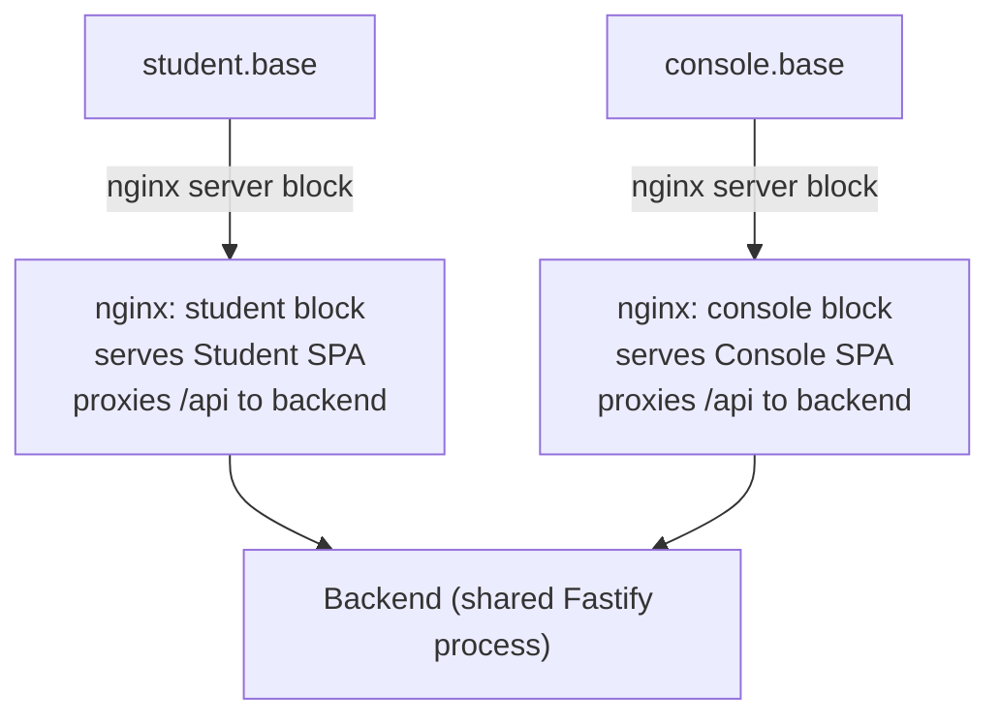
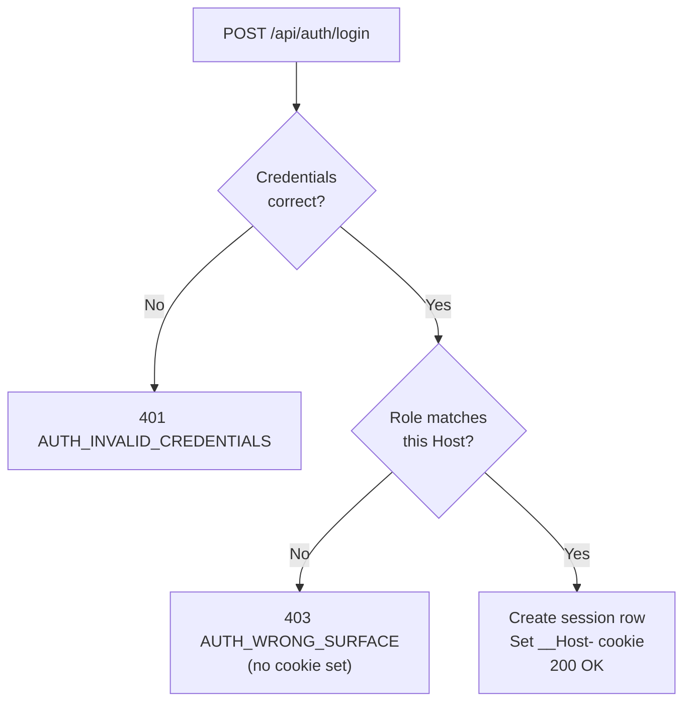

Stemolly's authentication model is deliberately simple: invite-only access, email + password credentials, server-side sessions, and three fixed roles. Every decision in this layer was made to match the actual threat model of a small product handling minors' data — not to follow a generic best-practice checklist. The sections below walk through each piece in order, from how a user enters the system to how the browser cookie stays in the right place.

## Who Can Log In, and How

There is no public sign-up. An Admin invites a user by email and assigns them a role. The invitee receives a link, sets a password, and their account activates on the app that role unlocks. That is the only way an account is created.

**Passwords** are hashed with `argon2id`. This is the current best practice for password hashing — it is slow by design and resistant to GPU and side-channel attacks.

**Sessions** are server-side rows in Postgres. The browser receives an `httpOnly + Secure + SameSite` cookie that references the session row. Because the session lives on the server, it can be revoked instantly — logout works, and an Admin re-inviting a user is also the password-reset path.

### Why not JWT?

JSON Web Tokens (JWTs) are stateless: the server does not store them, so there is no way to revoke one before it expires. Statelessness solves a scaling problem (avoiding a shared session store across many servers), but Stemolly does not have that problem. The cost — losing revocation — was not worth paying.

### Why not a third-party auth provider?

Auth0, Clerk, Supabase Auth, and similar services would add a vendor dependency that handles the personal data of minors. The invite flow is simple enough to build directly, so that dependency was rejected.

### Why not an RBAC framework?

"RBAC" (Role-Based Access Control) frameworks are designed for many roles and fine-grained permissions. Stemolly has exactly three fixed roles. A full RBAC table would be speculative complexity for something that fits in a single enum.

---

## Three Roles, Fixed at Invite Time

| Role | What it accesses |
|---|---|
| `admin` | Full access — manages users and invites |
| `console` | The Console app — the instructor-facing product (combines Author and Observer) |
| `student` | The Student app only |

Role is set when the Admin creates the invite. There is no in-app role-change UI. If a role must change, the Admin re-invites the user. This keeps the authorization model auditable: reading the invite record tells you everything about what an account can do.

---

## Subdomain Topology: Why Ports Were Not Enough

The natural first instinct for separating two apps in development is to run them on different ports — for example, `localhost:3000` for the Student app and `localhost:4000` for the Console. That approach was tested and rejected because of how browsers handle cookies.

**Cookies are scoped by hostname, never by port.** This is specified in RFC 6265 and is not a quirk — it was a deliberate choice in the cookie specification. A cookie set on `localhost:7777` is sent to `localhost:7778`. This was verified with a Playwright spike across both Chromium and Firefox. The consequence: separate ports cannot isolate two session cookies. The isolation would work in production and silently fail in development — exactly the wrong place for a security mechanism to break.

Separate hostnames *do* isolate cookie jars, including `*.localhost` subdomains. That is why Stemolly uses subdomains.

### The Topology



One nginx process runs two server blocks — one per hostname. Each block serves that app's static bundle and proxies `/api` to the same shared backend. Both apps live under one `STEMOLLY_PUBLIC_BASE_DOMAIN` environment variable: `localhost` in development, the real domain in production. Only that variable changes between environments; no code path differs.

Because each SPA calls `/api` on its **own** origin, there is no cross-origin request. `SameSite` cookies remain sufficient for CSRF protection — no extra CSRF token is needed.

### The `__Host-` Cookie Prefix

Session cookies carry the `__Host-` prefix. This is a browser-enforced rule: a `__Host-` cookie must not have a `Domain` attribute, so it is bound to exactly the hostname that set it. A later configuration mistake adding `Domain=.stemolly.com` would simply be rejected by the browser. The "never shared across subdomains" property is an invariant the browser enforces, not a convention someone could accidentally undo.

> **Important:** Subdomains are not the security boundary for data. A request to `student.<base>/api/console/*` reaches the exact same backend and is refused by the role guard — not by the hostname. Subdomains buy UI separation and cookie isolation; the role guard is what actually protects data.

---

## Surface-Aware Login: One Session, One Host

Separate origins alone are not enough. A student who types the Console's address still reaches its login page — a public login page cannot be hidden from someone who knows its URL. If login only checked the password, a student's valid credentials would mint a Console session, producing a shell where every data call returns 403. That is the "403 zone" the whole origin split was designed to prevent.

The solution is **surface-aware login**: the login endpoint derives the *surface* — which app is being accessed — from the request's `Host` header. It then checks whether the user's role belongs on that surface.



The port is stripped from the `Host` header before checking, because development carries a port and production does not — stripping it keeps the logic identical in both environments.

**Why `Host` and not the URL path?** The `Host` header and the cookie's destination are both derived from the same URL, so they cannot disagree. A client *chooses* the path freely — it could call a student login endpoint from a Console page — but the cookie would still land on the Console host.

**Accept-invite closes the other door by construction.** The accept-invite endpoint sets the password and then redirects the user to the login page on their role's correct host. It never creates a session itself. So there is exactly one endpoint in the system that can create a session: the surface-aware login endpoint. The invariant is a property of the design, not a rule that two endpoints must both remember to follow.

---

## 401 vs 403: A Contract the Frontend Relies On

On all role-gated routes, `401` and `403` have distinct, strict meanings:

| Code | Meaning |
|---|---|
| `401` | No valid session — absent or expired. Retry with login. |
| `403` | Valid session, wrong role or wrong surface. Retrying will not help. |

This is not just convention. The API client uses a generic rule: any `401` received outside `/api/auth/*` triggers the session-expiry handler and redirects the user to the login page. If a permission error returned `401`, the SPA would bounce a logged-in user to a login page with no explanation — a confusing loop that looks like a session bug.

Note that the login endpoint itself uses a different contract (it returns `401` for bad credentials and `403` for correct credentials on the wrong surface). Those are `/api/auth/*` responses, and the api-client deliberately exempts that prefix from the generic session-expiry rule.

---

## The Public Namespace Problem

Login and accept-invite must run before the caller has any session or role. They cannot live inside the role-gated namespaces (`/api/student/*`, `/api/console/*`, `/api/admin/*`) without breaking the deny-by-default property that makes those namespaces auditable.

They live instead in a fourth prefix: `/api/auth/*`. This prefix carries no role guard — it is deliberately public.

The problem is that this inverts the failure mode. In a gated namespace, forgetting a guard is loud: the route returns 403 immediately. In `/api/auth/*`, there is no guard to forget. A carelessly added route is public, works perfectly, passes its tests, and produces no symptom.

The name makes this worse: `/api/auth/*` naturally attracts credential-handling routes — password reset, session check, email verification — into the one namespace without a lock.

**The mitigation is a CI-checked allowlist.** A CI step asserts that the actual route table of `/api/auth/*` matches an explicit list of approved routes. Adding a new public route without updating the allowlist fails the build. The allowlist does not prevent a route from being made public, but it prevents it from being made public *accidentally*. Editing the allowlist is the human gate where someone must ask: "Should this really be public?"

---

## The Fail-Closed Role Guard

The three role-scoped namespaces were created with their role guard wired in **before** any session logic existed anywhere in the codebase. The guard (`roleGuard` in `server/src/api/plugins/auth.ts`) starts as a placeholder whose body unconditionally throws `403`.

This is intentional. Two properties make it safe to build this way:

1. **Plugin-scope attachment.** The hook is registered on the plugin (`studentApp.addHook('onRequest', roleGuard)`), not on individual routes. Fastify's encapsulation means every route added to that namespace later is automatically covered — the lock is on the room, not on each door.
2. **Stable exported signature.** When the real session logic arrives, only the function body changes. None of the registration call sites need to be touched.

The alternative — waiting until sessions existed before creating the namespaces — would have left every route added in the meantime unprotected by default and required a retrofit later. Building the gate first inverts the default: everything is denied until something explicitly opens it.

---

## Invite Token Security

### Atomic Single-Use

An invite token can be redeemed exactly once. Single-use is enforced by a single atomic SQL statement, not a read-then-write pair:

```sql
UPDATE identity.invite_tokens
SET    redeemed_at = $now
WHERE  token_hash  = $1
  AND  redeemed_at IS NULL
  AND  expires_at  > $now
RETURNING *
```

Postgres acquires a row-level lock during the update scan, making the "unused and unexpired" check and the write indivisible. Of two concurrent redemption attempts, exactly one matches the `WHERE` clause and gets the row; the other gets nothing. A read-then-write sequence would reopen a TOCTOU window (Time-Of-Check to Time-Of-Use — a race condition where the state changes between reading it and acting on it).

### Hash-Only Storage

Only the SHA-256 hash of the token is stored. The raw 256-bit token (32 random bytes) exists only in the emailed link. A database dump yields nothing redeemable.

The raw token is high-entropy random, not a password. For passwords, slow hashing (like argon2id) is necessary because the input space is small and predictable. For a 256-bit random token, the input space is astronomical — a fast hash like SHA-256 is correct here, and the non-constant-time comparison on the redeem path is similarly unexploitable at this entropy level.

### The Account-Takeover Risk (and Its Fix)

An earlier version of the invite redemption function returned only the user's role — it discarded the email address that the same database query had already fetched. The accept-invite endpoint needed to know *whose* password to set, and with only a role available, the obvious shortcut was to read the email from the request body.

That is account takeover: an attacker who holds a valid invite for their own address could submit an administrator's email in the request body and set the password on that account.

The fix is for the redemption function to return `{ email, role }`. The caller can then identify the account from the server-verified email without trusting any client input. The lesson: when specifying a security-relevant interface, derive its return shape from what the *caller* needs in order to act safely — not from the minimum the current task requires.

---

## Seeding vs. Migrations

A migration runs in **every** environment by design. Placing fixture data — such as a demo admin account with a known password — in a migration means it reaches production automatically. That is why seeds are never migrations.

Instead, seed data is applied by idempotent application code keyed on a deterministic natural key. Re-running it is always a no-op.

There are two distinct classes of seed data, and they differ in an important way:

| Type | Example | Must reach production? | Config gate |
|---|---|---|---|
| Dev/demo fixtures | Demo admin account | **No** — must be absent | Config flag required |
| Product content | Curricula, briefs, catalogs | **Yes** | No gate |

A single "seeds are off in production" rule would be wrong for product content that needs to be there. The two classes share only idempotency and the rule "not in migrations"; everything else is decided per class.

The absence of demo fixtures in production is checked behaviourally: with the demo flag unset, migrate and boot must leave no fixture rows. This catches fixtures hidden inside migrations because migrations run regardless of the flag.
