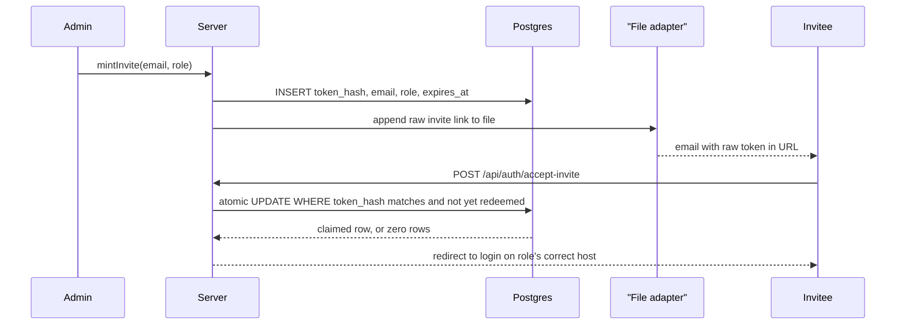
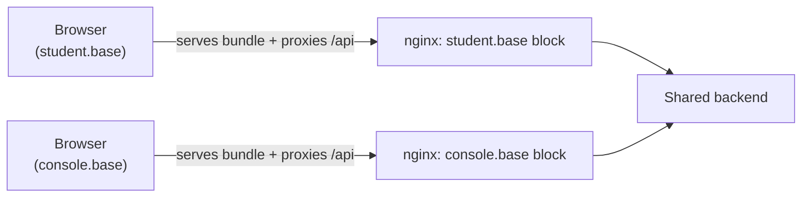
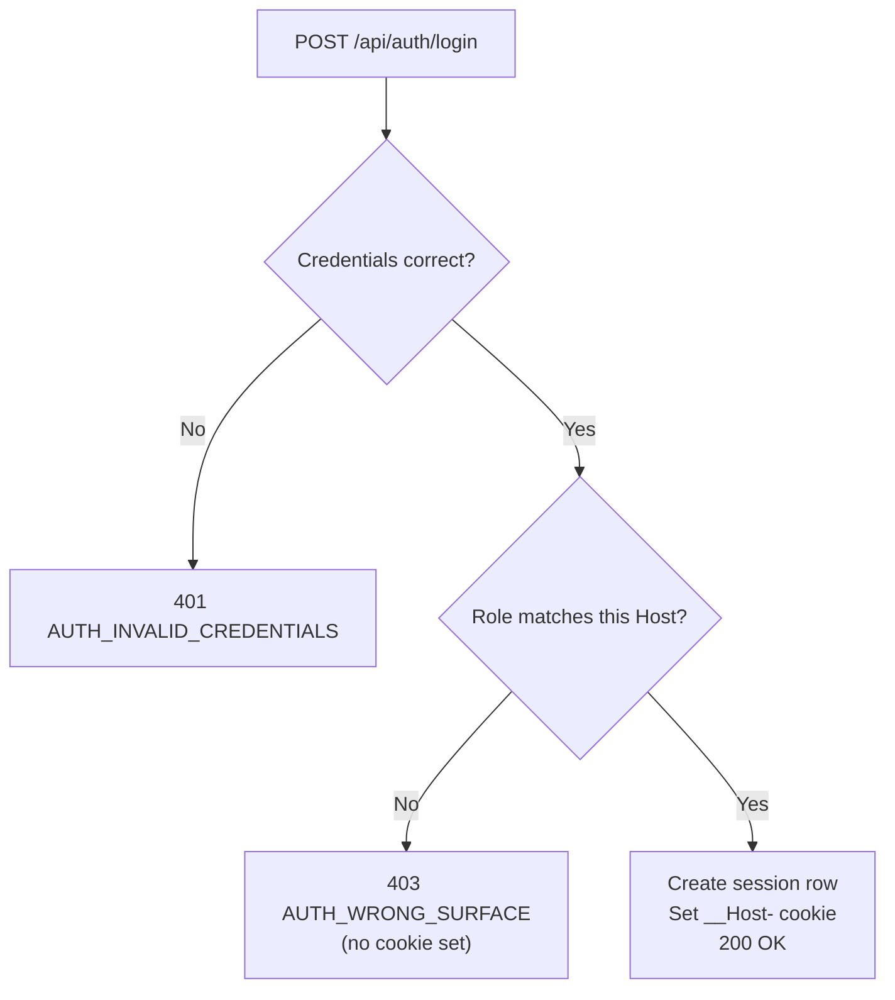
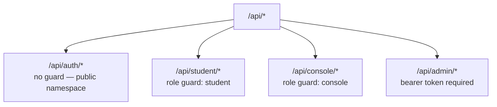

Stemolly has no public registration. Every user account begins with an Admin sending an invite; the system then applies a layered set of mechanisms — atomic invite tokens, cookie-isolated subdomains, fail-closed API guards, and server-side sessions — to make sure each role sees exactly what it should.

## Who Can Be Here: Roles and the Invite Model

Three roles exist, and each maps to exactly one surface:

| Role | Surface | Access |
|---|---|---|
| **Admin** | `console.base` | Onboards users; full access |
| **Console** | `console.base` | Combined Author + Observer for the teaching team |
| **Student** | `student.base` | Student app only |

An Admin invites someone by email and assigns a role. The invitee sets a password through the invite link; the account then activates and routes to the correct app. No in-app UI exists to change a role after the fact. Password reset is handled by an Admin re-inviting the same user.

Email-and-password was chosen to keep the system self-contained: a third-party auth provider (Auth0, Clerk, Supabase) would introduce a dependency that handles data belonging to K–11 minors. The parental-consent acknowledgment is lightweight for now; a full consent workflow is deferred past MVP.

The three-role set is a **closed enum enforced at two levels**. In code, `domain/role.ts` defines `Role` as the literal union `'admin' | 'console' | 'student'` and exports an `isRole()` validator. `mintInvite()` deliberately accepts a raw `string` so out-of-range values become `ValidationError`s at the input boundary rather than silent TypeScript gaps. In the database, `invite_tokens_role_check` repeats the same restriction, so a raw SQL insert that bypasses the application also fails.

## The Invite Lifecycle

`mintInvite()` runs when an Admin creates an invite. It normalises the email (lowercase, trimmed), generates a 32-byte random token, computes its SHA-256 hex digest, stores **only the hash** in `identity.invite_tokens`, and hands the raw token to the email adapter.



The raw token appears only inside the emailed link; a database dump yields nothing redeemable because only the SHA-256 digest is persisted.

**Why SHA-256 without a salt?** Password hashing uses slow algorithms (argon2id) to resist brute-force attacks, because passwords have a small, predictable input space. Invite tokens are different: the raw token is 32 bytes of cryptographic randomness — 64 hex characters — so the search space is enormous regardless of hash speed. A fast, unsalted SHA-256 is the correct choice here, and non-constant-time comparison is equally fine at this entropy level.

**Redemption is atomic.** The database claim is one statement:

```sql
UPDATE identity.invite_tokens
SET redeemed_at = $now
WHERE token_hash = $1
  AND redeemed_at IS NULL
  AND expires_at > $now
RETURNING *
```

Postgres locks the row during the update scan, so the "unused and unexpired" check and the write are indivisible. Of two concurrent redemption attempts, exactly one gets a row back. A read-then-write pair would reopen a TOCTOU window — a race condition where both callers see an unredeemed row at the same time. This was verified against a real Postgres container with two concurrent requests.

If the claim returns zero rows, `redeemInvite()` does a read-only lookup to classify the failure: **unknown token** → `NotFoundError`, **already redeemed** → `ConflictError`, **expired** → `ValidationError`.

**The return value matters for security.** An early version of `redeemInvite()` returned only the role, discarding the email the same database query had already fetched. The accept-invite endpoint must set a password for a specific account — so with only a role, it had no server-verified way to know *whose* account that was. The available shortcut was to read the email from the request body. That is account takeover: an attacker with a valid invite for their own address submits an administrator's email and resets that account's password. The fix is for `redeemInvite()` to return `{ email, role }`, letting the endpoint identify the account without trusting client input.

After setting the password, accept-invite redirects to the login page on the role's correct host. It **mints no session**. There is exactly one path through which a session can be created; accept-invite is not on it.

:::note
The current email adapter writes invite links to a configured file on disk rather than sending real email. `FileEmailAdapter.sendInvite()` appends the raw link to the configured path. No SMTP adapter exists yet.
:::

## Session Model: Server-Side Rows, Not Tokens

Authenticated sessions are rows in Postgres, referenced by an `httpOnly; Secure; SameSite` cookie. The server has instant revocation: logout deletes the row. Passwords use argon2id hashing.

JWTs were explicitly ruled out. The argument for them — stateless horizontal scaling — does not apply here (there is one backend process), and the cost — no instant revocation — does apply. A third-party auth provider was ruled out for the same reason as avoiding OAuth: it introduces a dependency handling data that belongs to minors.

Authorization is a single role enum checked by middleware at the namespace level — no permission tables, no RBAC framework. Three fixed roles do not need one.

:::caution
**The session mechanism is not implemented yet.** `/api/auth/login`, `/api/auth/logout`, and `/api/auth/accept-invite` currently return `{ status: 'not-implemented' }`. No `httpOnly` cookie is issued anywhere in the codebase; no `@fastify/cookie` or `@fastify/session` package is present. Current request identity is derived from a hardcoded process-level config value (`config.identity.studentId`) rather than from a session. The design described above is the target state.
:::

## Subdomain Isolation and the Cookie Port Problem

A session cookie must never leak from the Student surface to the Console surface. The obvious approach — serve them on the same host with different ports — does not work for cookies.

Browser cookies predate the same-origin policy and their key is **host + path only, never port**. A cookie set on `localhost:7777` is sent to `localhost:7778`. RFC 6265 §8.5 specifies this explicitly under the heading "Weak Confidentiality." A Playwright spike confirmed the behaviour on both Chromium and Firefox. Port separation holds for JavaScript, CORS, and storage, but silently fails for the very mechanism being tested. Isolation would work in production and break in development, with no visible symptom.

The solution is **separate hostnames**: `student.${STEMOLLY_PUBLIC_BASE_DOMAIN}` and `console.${STEMOLLY_PUBLIC_BASE_DOMAIN}`. In development the base domain is `localhost`; in production it is the real domain. Nothing in the codebase changes between environments — only the env-var value.



Each nginx server block serves that app's static bundle and proxies `/api` to the same shared backend process. Because each SPA calls its API on its own origin, there is no CORS and `SameSite` alone is enough for CSRF protection.

The session cookie carries the `__Host-` prefix. The browser enforces a strict invariant: it rejects any `__Host-` cookie that also carries a `Domain=` attribute. This makes "cookie never shared across subdomains" a browser-enforced property rather than a convention that a later configuration change could quietly break.

:::note
Subdomains are the **cookie isolation** boundary, not the data boundary. `student.base/api/console/*` reaches the same backend process and is refused by the **role guard**, not by hostname. The role guard protects data; the subdomain keeps each app's cookie in its own jar.
:::

## Surface-Aware Login

Separate subdomains close the cookie-sharing gap but leave another door open. A student who types the Console's URL still reaches its login page — a public login page cannot be hidden. If login only checked the password, valid student credentials would mint a Console session, loading a shell in which every data call returns 403. That 403-filled shell is exactly what the split is meant to prevent.

Login is therefore **surface-aware**: it derives the expected surface from the request's `Host` header (port stripped, so dev and production behave identically), then checks whether the authenticating role belongs to that surface.



The server uses `Host` rather than a URL path because `Host` and the cookie's destination are both derived from the same origin and cannot disagree. A client freely controls the URL path — it could call a "student login" endpoint from a Console page — but the cookie still lands on the Console host. `Host` eliminates that gap.

(`Host` is not a security boundary: it can be forged outside a browser, but that wins nothing because the role guard on each route is what actually protects data.)

## Protecting the API: Namespaces, Guards, and Status Codes

All API routes live in one of four prefix-scoped namespaces, each with a different gate:



**The three role-gated namespaces are fail-closed.** The `roleGuard` hook is attached at plugin scope — `studentApp.addHook('onRequest', roleGuard)` — so every route added to the namespace is automatically protected. A new route in a gated namespace returns 403 until the session logic selectively opens it; it cannot accidentally be public.

The guard was mounted with a placeholder body that unconditionally throws 403, before any session mechanism existed. Building the gate first means denial is the default; each later piece of work opens exactly what it intends to open. The alternative — deferring the namespaces until sessions existed — would have left every interim route unprotected and required a later retrofit.

**The `/api/auth/*` exception inverts the failure mode.** Login and accept-invite must be public — they run before any session exists — so they get their own prefix with no role guard. In a gated namespace, a forgotten guard announces itself as a 403; in `/api/auth/*`, a carelessly added route is silently public: it works, passes tests, and produces no symptom. The mitigation is a CI check asserting the namespace's route table equals an explicit allowlist. Editing the allowlist is the human gate where someone decides whether a route really should be public.

**The 401 / 403 contract is strict.** The frontend API client has one rule: any `401` received outside `/api/auth/*` triggers the session-expiry handler and redirects to login. The role-guard contract must therefore be:

| Code | Meaning on protected routes |
|---|---|
| `401` | Session is absent or expired — **only** this |
| `403` | Anything else: wrong role, active refusal |

A wrong-role `401` would redirect a legitimately logged-in user to the login page, looking like a session bug. The login endpoint itself uses `401` for bad credentials and `403` for a correct-credentials-wrong-surface rejection — those are `/api/auth/*` responses, explicitly exempt from the frontend rule, and must not be conflated with the role-guard contract.

## Admin Authentication: Token-Based, Not Session-Based

The `/api/admin` namespace uses HTTP token authentication rather than session cookies. Requests must carry an `Authorization` header with a token value matching the configured `contentAdminToken`. The `createAdminBearerAuth()` hook compares equal-length buffers using `timingSafeEqual()` to prevent timing-based leaks. If the configured token is unset, the hook **fails closed** — no request gets through.

On `/api/admin`, a `401` means token-credential failure — not the session-expiry meaning that `401` carries on student and console routes.

## What Students Never See: Content Redaction

Answer keys must never cross the browser boundary for student requests. The architecture enforces this inside the content module, not at the route layer.

`toStudentView(record)` projects an `AssignmentRecord` to only the fields a student may receive — `briefSnapshotId`, `anchorId`, `slugs`, `nonKeyContent`, and `cropRefs` — dropping both `answerKey` and `board` **at the type level**. This projection runs inside `content/core` before a brief reaches any route handler. No route handler needs to remember to redact: the TypeScript type makes it structurally impossible to forward key material.

The answer key is also excluded from blob-store delivery. Anything served through `urlFor` sits outside the role-guarded routes, so the key must not appear there at all. This design (ADR-050) overturned an earlier proof-of-concept posture — "ship everything together, there is no server" — once a server existed to withhold the key.

:::caution
**Content URL expiry is not enforced.** `urlFor(key, ttlSeconds)` returns `/api/content/{key}?ttl={ttlSeconds}`, but the content proxy route never reads or validates the `ttl` parameter and forwards any key indefinitely. Once a student's crop URL is known, the proxy path remains reachable past the advertised expiry. The design positions `urlFor` as a bounded-time capability; the current adapter under-delivers that promise.
:::

## Operational Risks

**Seed data must not reach production through migrations.** Migrations run in every environment by definition, so a fixture placed in a migration — a demo admin account with a known password, for example — lands in production automatically. The rule: migrations define schema only. Demo and development fixtures are applied by idempotent application code that requires an explicit config flag; with the flag absent, running migrations and booting the server leaves no fixture rows.

There are two classes of seed data and they differ:

| Class | Example | Reaches production? | Requires flag? |
|---|---|---|---|
| Dev / demo fixtures | Demo admin account | **No** — must be absent | Yes |
| Product content | Curricula, briefs, catalogs | **Yes** | No |

A single "seeds off in production" rule would be wrong for product content that must be there. The absence of demo fixtures in production is checked behaviourally: with the demo flag unset, migrate and boot must leave no fixture rows. This catches fixtures hidden inside migrations because migrations run regardless of the flag.

**The MCP server trusts deployment boundaries.** The MCP HTTP path does not authenticate callers internally. Once a request reaches `handleHttpRequest()`, the code builds the configured role's server and serves its tools. The accepted trade-off is that the operator must bind the container to loopback only and place an edge token check in front. An operator who publishes the MCP container publicly exposes an unauthenticated write surface — operator-role tools include graph seeding, catalog approval, study-anchor mutation, concept-gap moderation, and node merges.
