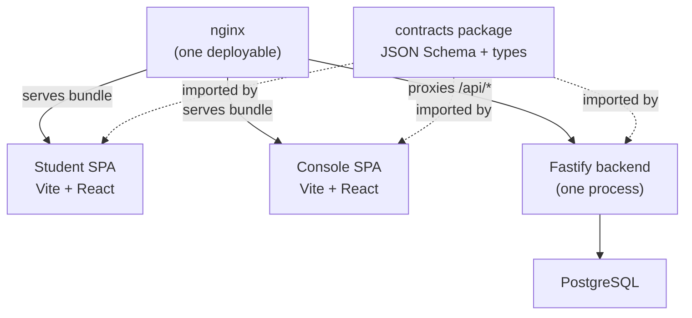
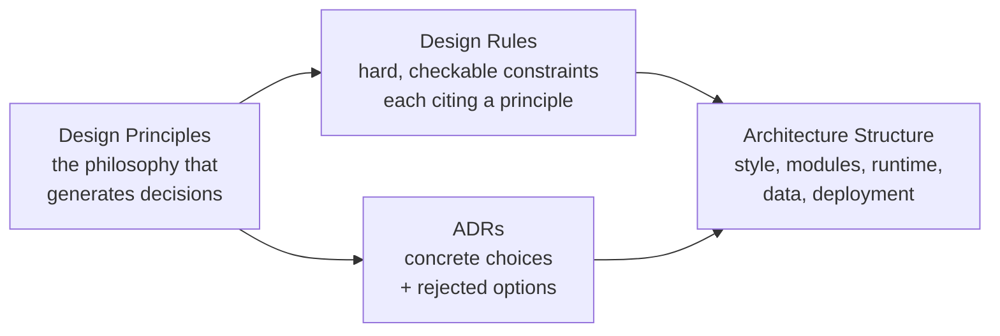
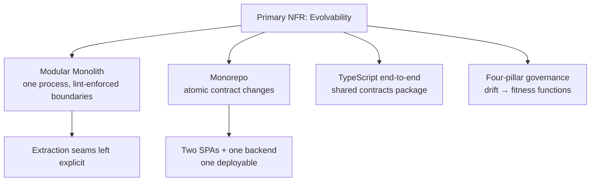

Stemolly's architecture is built around one primary goal: **staying cheap to change**. MVP-1 is a validation instrument — it exists to test the belief-graph engine against real learners, and the team should expect to be wrong on specifics and to rewire based on what they discover. Everything in this document — the monorepo layout, the single-process backend, the language choice, the governance model — flows from that single requirement.

---

## Evolvability as the Primary NFR

A non-functional requirement (NFR) is a quality the system must have beyond just "does the feature work" — things like speed, security, or maintainability. For Stemolly, the primary NFR is **evolvability**: the architecture must be cheap to extend (add subjects, modes, pedagogies) and cheap to pivot (change direction mid-validation).

This shapes the decisions concretely:

- The **engine core** must stay untouched when pedagogy or subject changes.
- **Pedagogy** is a pluggable per-session strategy, not baked in.
- **Node identity and graph structure** are chosen so new subjects and curricula slot in without a rebuild.

The technology stack is not a product requirement — it is an architecture decision, made at the right altitude and for explicit reasons, which the rest of this page explains.

---

## What You Are Building On: One Monorepo, One Deployable

The project lives in a single **pnpm workspace monorepo** and ships as a single deployable unit. Here is what that looks like at runtime:

There are **two SPAs** because the Student app and the Console serve different audiences — students vs. the internal team. That difference is a frontend fact. The backend is shared because the domain is shared: the Console authors briefs that Student sessions consume, and sessions write evidence that the Console observes.

The backend exposes one API with four namespaces:

| Namespace | Access |
|---|---|
| `/api/student/*` | Role-gated to student callers |
| `/api/console/*` | Role-gated to console users |
| `/api/admin/*` | Role-gated to admins |
| `/api/auth/*` | Ungated — login and invite routes run before a role exists |

**Why not two backends or two deployables?** Blast-radius isolation only works if database credentials also split. At MVP scale, the exposed surface is already the least-privileged one. The seam for a future split is left explicit and can be extracted when a measured constraint forces it — external Console users, or self-serve Student registration.

**Why not multiple repos?** The shared `contracts` package (JSON Schema + generated TypeScript types) is imported by both frontends and the server. A monorepo keeps high-churn contract changes atomic and type-checked across all three consumers in one commit.

---

## One Process, Strict Boundaries: The Modular Monolith

The backend is one OS process. It is not a set of microservices. But it is not a big ball of mud either — it is a **modular monolith**: a single process containing modules with boundaries enforced by tooling.

The modules are: `engine`, `tutor`, `pedagogy`, `content`, `identity`, `llm`, `judge`, `authoring-ai`, `metering`, `jobs`, and `api`. The rules are simple:

- The `engine` module imports nothing upward.
- No deep cross-module imports — modules talk through defined interfaces.

These rules are enforced by `dependency-cruiser` and `eslint-boundaries` in CI, not by your discipline. The lint must be CI-blocking from the first sprint; without it, nothing physically prevents a boundary violation.

**Why not microservices?** Because distribution at this stage directly fights the primary NFR.

Think of it this way: briefs, evidence, and reports interact everywhere. Every pivot that crosses a module seam — moving a field from a brief to a session, say — would become a multi-repo, multi-deploy, contract-versioned change in a microservices world. At tens-of-students scale, that overhead buys no measurable benefit and costs a great deal of agility.

The service-extraction seams are left explicit. When a measured constraint appears — scale, isolation, team structure — a module can be promoted to a service. Until then, keep them in one process.

---

## The Tech Stack: TypeScript End-to-End

Every layer of the system uses TypeScript. This is not a default choice — it is an explicit decision for a specific reason: the `contracts` package sits at the seam between frontends and backend. A shared language means a type error anywhere in that seam fails a single build, not a cross-language integration test.

| Layer | Technology |
|---|---|
| Student SPA | Vite + React + TypeScript |
| Console SPA | Vite + React + TypeScript |
| Backend | Fastify + TypeScript |
| Shared contracts | JSON Schema + generated types |
| Database | PostgreSQL (thin SQL layer) |
| Monorepo tooling | pnpm workspaces |

**Why Fastify and not Express?** Fastify offers native per-route JSON-Schema validation — exactly the contracts strategy the design mandates. Its prefix-scoped encapsulated plugins map one-to-one onto the role-gated API namespaces. It is an explicit router with no meta-framework magic, which is what you want when you need predictable control flow.

**Why not Next.js or Remix?** Both hide control flow and offer SSR, which has no benefit for two auth-walled SPAs. The opacity is a cost, not a feature.

**Why not a Python backend?** LLM use in Stemolly is API orchestration, not local model inference. A Python backend would split the language across the highest-churn seam in the project — the contracts package — for no runtime gain.

**Why no heavy ORM?** Append-only tables use database triggers, and some queries use recursive CTEs (common table expressions). Both need to be legible SQL. A heavy ORM layer obscures them.

---

## Keeping It Honest: The Four-Pillar Governance Model

Good intentions drift. The governance model exists to keep the evolvability NFR true during implementation, not just at design time.

The architecture is documented and enforced through four pillars:

**ADRs** (Architecture Decision Records) capture concrete choices with their rejected alternatives — including the reasoning behind each rejection. Adding a module, datastore, external service, or process boundary requires a new ADR.

**Design principles** are the philosophy that generates decisions. They are not rules — they are the "why" behind the rules.

**Design rules** are hard, checkable constraints. Each rule cites the principle it enforces. Rules without a way to check them are not rules.

**Architecture structure** describes style, modules, runtime, data, and deployment — the shape of the thing at any given moment.

Drift is prevented by **fitness functions**: automated checks ordered from strongest to weakest:

1. **Machine-in-CI** — dependency lint for module boundaries, grep deny-lists for vendor or domain leakage.
2. **Runtime-enforced** — database triggers for append-only tables, runtime assertions in the LLM gateway.
3. **Human process** — ADR reviews for structural changes.

Every design rule maps to at least one fitness function. If you cannot automate the check, the rule is treated as weaker than one you can.

**Cross-cutting concerns** — auth, errors, logging, idempotency, config, resilience — are decided at the architecture phase (their seam and invariant are fixed), then filled with specifics at design time. Deferring them entirely lets each module choose differently, which is how you end up with five inconsistent error formats.

---

## The Shape at a Glance

Every structural choice traces back to the same root: MVP-1 must be cheap to change. The monolith keeps pivots cheap today. The explicit seams mean you can extract a service when a real constraint forces it. The shared language keeps the contracts seam type-safe. The governance model keeps the boundaries honest as the codebase grows.
