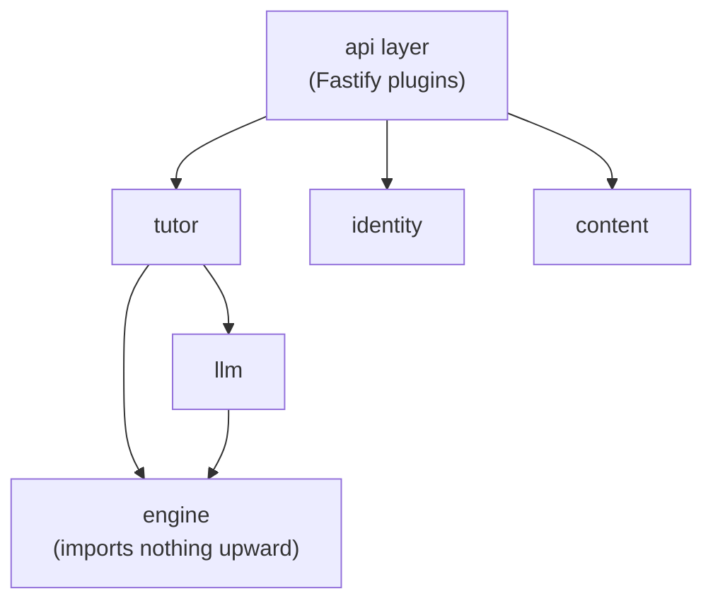
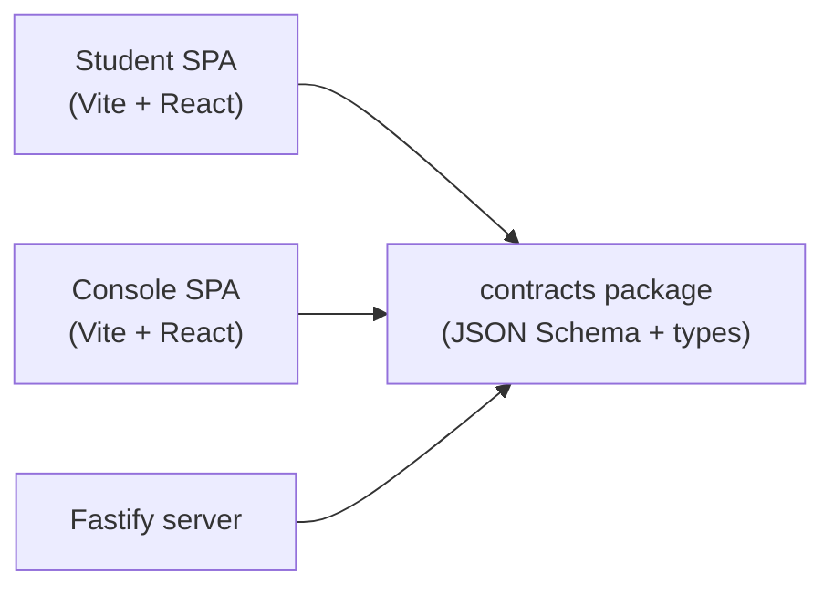
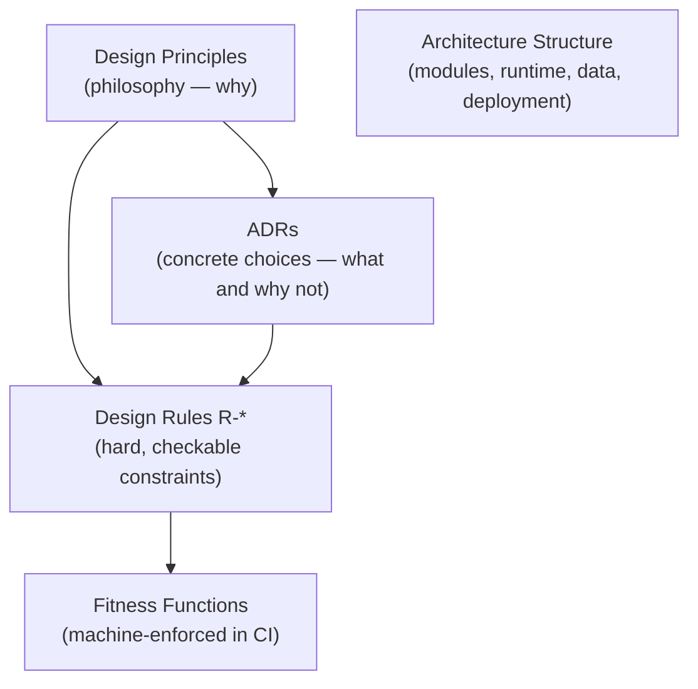

Stemolly is designed to be easy to change. That goal — called *evolvability* — is the primary non-functional requirement, and it drives every structural choice described on this page. Understanding why the architecture looks the way it does starts there.

## One Monorepo, One Deployable

The project serves two audiences: students and the internal team (Console users). These are separate web apps with separate UIs, but they share a domain — Console authors the briefs that student sessions consume, and sessions write evidence the Console then observes. Splitting them into two separate backends would only make sense if the data were also separate, and it isn't.

So the structure is:

```
monorepo
├── apps/student         ← Vite + React SPA
├── apps/console         ← Vite + React SPA
├── packages/contracts   ← shared JSON Schema + generated TypeScript types
└── server               ← one Fastify backend process
```

All three runtime artifacts — nginx, the server image, and Postgres — ship together as **one deployable**. A multi-repo layout was rejected because the `contracts` package is imported by both frontends and the server; keeping everything in one repo means cross-cutting contract changes are atomic and type-checked in a single pull request.

Two backends (for blast-radius isolation) were also considered and stay on the table as an extraction seam. They become worthwhile once the Console gains external users or the Student app opens self-serve registration — but at current scale the split would not actually reduce risk without also splitting the database credentials, and the cost to agility would be immediate.

## The Backend: a Modular Monolith

The server is **one process** containing modules with strict boundaries. There is no microservices split, no network between modules. The modules are:

`engine`, `tutor`, `pedagogy`, `content`, `identity`, `llm`, `judge`, `authoring-ai`, `metering`, `jobs`, `api`

Boundaries are enforced by **dependency lint** (`dependency-cruiser` + `eslint-boundaries`), not by the network. The `engine` module imports nothing upward; no module reaches deep into another. This lint check must be CI-blocking from the first sprint — if it can be bypassed, the entire model collapses.



Why not microservices? The core domain concepts — briefs, evidence, reports — interact across every module. Any pivot that crosses a seam would become a multi-repo, multi-deploy, contract-versioned change. At current scale, **distribution fights the primary evolvability goal.** The seams are intentionally visible so a team can extract a service later when a measured constraint (traffic, team size, isolation need) actually justifies the cost.

## API Surface: Four Namespaces

The single backend exposes four namespaces:

| Namespace | Who can call it | Gated? |
|---|---|---|
| `/api/student/*` | Student app | ✅ role-scoped, deny by default |
| `/api/console/*` | Console app | ✅ role-scoped, deny by default |
| `/api/admin/*` | Internal admins | ✅ role-scoped, deny by default |
| `/api/auth/*` | Anyone (pre-session) | ❌ deliberately ungated |

The `/api/auth/*` namespace is ungated because its endpoints — login, accept-invite — run before a caller has a role. All other namespaces are deny-by-default; a request with the wrong role is rejected at the prefix level before it reaches any handler.

## The Stack: TypeScript End-to-End

Every layer uses TypeScript. The shared `contracts` package is the connective tissue: it publishes JSON Schema definitions and generated TypeScript types, imported by both frontends and the server.



**Fastify** was chosen over Express (an earlier assumption) for two concrete reasons: native per-route JSON Schema validation matches exactly how the `contracts` package works, and prefix-scoped encapsulated plugins map directly onto the four API namespaces. It is an explicit router with no meta-framework magic.

Alternatives that were rejected:

- **Next.js / Remix** — hidden control flow; no SSR benefit for two auth-walled apps.
- **Python + FastAPI** — splits the language across the high-churn contracts seam; the LLM usage here is API orchestration, not local ML inference.
- **Heavy ORMs** — rejected to keep append-only DB triggers and recursive CTEs readable as plain SQL.

## Governance: Four Pillars

The architecture is kept honest through four layers of documentation and enforcement. The governance model exists specifically to keep the evolvability goal true during implementation, not just at design time.



- **Design Principles** — the philosophy; the "why" that generates every decision.
- **ADRs** — capture a concrete choice and list what was rejected and why. Adding a module, datastore, external service, or process boundary requires an ADR.
- **Design Rules (`R-*`)** — hard, checkable constraints, each citing a principle. Every rule maps to at least one fitness function.
- **Architecture Structure** — the living record of modules, runtime behaviour, data model, and deployment.

**Fitness functions** are the enforcement layer, ordered by strength:

1. **Machine in CI** (strongest) — dependency-lint for module boundaries, a grep deny-list for vendor/domain leakage.
2. **Runtime-enforced** — DB triggers for append-only tables, runtime assertions in the LLM gateway.
3. **Human process** (fallback) — manual review where automation is not yet practical.

Cross-cutting concerns — auth, errors, logging, idempotency, config, resilience — are decided at the architecture phase (seam and invariants fixed), then filled in with specifics only at design time. Deferring them any later lets individual modules choose differently, creating the kind of inconsistency that is expensive to unwind.

### What Belongs in an ADR — and What Doesn't

An ADR's body is **immutable** in this project. Changing a decision means writing a new ADR that supersedes the old one, never editing the original. This immutability creates a precise rule about what can appear in an ADR's *Decision* section.

:::caution[Filenames and paths do not belong in an ADR]
If a filename appears in an ADR's Decision section, renaming that file makes an accepted record literally false. The only remedy is a supersession — expensive ceremony for what may be a routine rename.
:::

The division that avoids this:

- **ADRs name roles and invariants.** Example: "the driving contract never imports the driven contracts."
- **Design rules (`R-*`) name the files** that hold those roles. Example: R-28 lists `core/driving.ts`, `core/driven.ts`.

Rules are amended in ordinary work — a rule's file list can change without touching the ADR it backs. Layout evolves at rules speed; the decision record stays truthful.

ADR-023 demonstrated the failure by writing a specific directory layout into its Decision section. Any later rename contradicted an accepted record, forcing a supersession. ADR-029 was written to the principle above instead: five roles, no filenames, with R-28 and R-30 carrying the paths.

### ADR Scope: Boundaries, Not Transports

An ADR is binding on work that outlives the sprint that wrote it. Its `Scope` line must therefore name a **durable boundary**, not a temporary artifact that will be replaced.

The PoC's MCP surface is an example of a temporary artifact: it is the current carrier of the model-facing engine boundary, but the full app replaces it with an in-process `tutor` → `engine` call. The engine and its schema are the durable part. An ADR scoped to the MCP files becomes silently void once the PoC is retired.

The correct way to write scope:

> *"The engine module's model-facing boundary, whichever transport carries it: the PoC's MCP tool surface today, the in-process checkpoint-job call later."*

Findings drawn from a temporary artifact belong in the `Evidence` section — they read as observations about the current instance rather than as the permanent limit of what the decision governs. The rule of thumb: **if an identifier can be retired on a schedule, it cannot appear in a document that outlives schedules.** Boundaries and capabilities survive a rewrite; file paths into a disposable shell do not.

### When to Supersede vs. Correct in Place

Immutability has a boundary, and understanding it prevents two opposite mistakes: editing a record that should be superseded, and superseding a record that should simply be corrected.

**Over-broad wording in an accepted ADR** — when an accepted ADR forbids more than its own reasoning supports, the remedy is supersession even when a direct edit would be cheaper by citation count. The citation count is not the deciding factor for two reasons. First, another accepted ADR may name the first as a `Precedent:` — editing the body moves the ground under a record that is itself binding. Second, "it was only a drafting error" is permanently available as an argument against any record someone later disagrees with, including an agent running unattended; the corpus's only protection is that bodies do not move. The superseding record is the better artifact anyway: it restates the rule at the granularity that was always meant, carries surviving clauses forward verbatim, and leaves the original on disk as history — where the over-broad sentence explains why the forbidden capability was never built.

**False verified claims in an uncommitted draft** — a same-session draft that has not yet been committed or cited by anything is a draft, not case law. Superseding it would preserve the false claim in the corpus forever, which is worse for future readers than a clean correction. The safeguards that keep this from becoming a loophole: the correction is disclosed rather than silent, the decision that rested on the false fact is re-derived rather than patched, and the option that was wrongly rejected because of it is written into the record's `Rejected options` as what was drafted before the file was actually read.

:::note[The upstream lesson]
A `verified` label is only worth what the verification actually touched. A claim about which files compose a surface must be checked against the file that composes it — not against files whose names suggest they do.
:::

The two rules together draw a clear line: **commitment and citation are the threshold**. Before that threshold, correct the record cleanly. After it, supersede.
