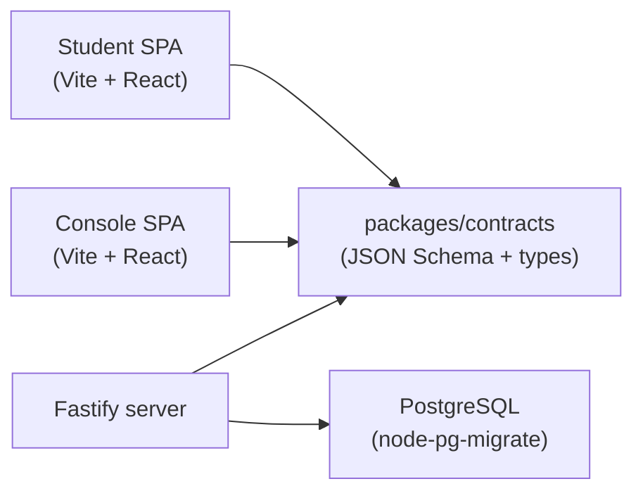
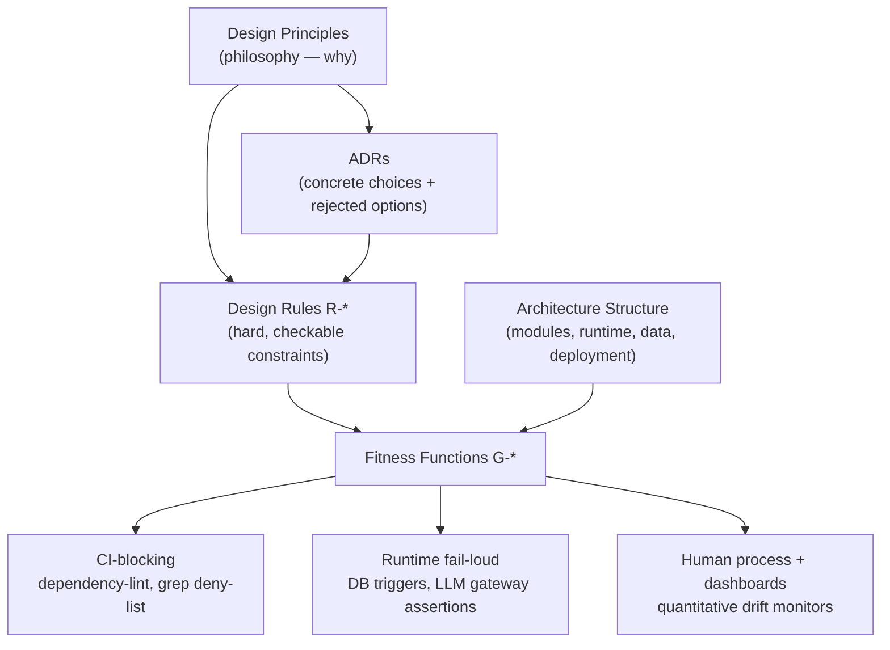
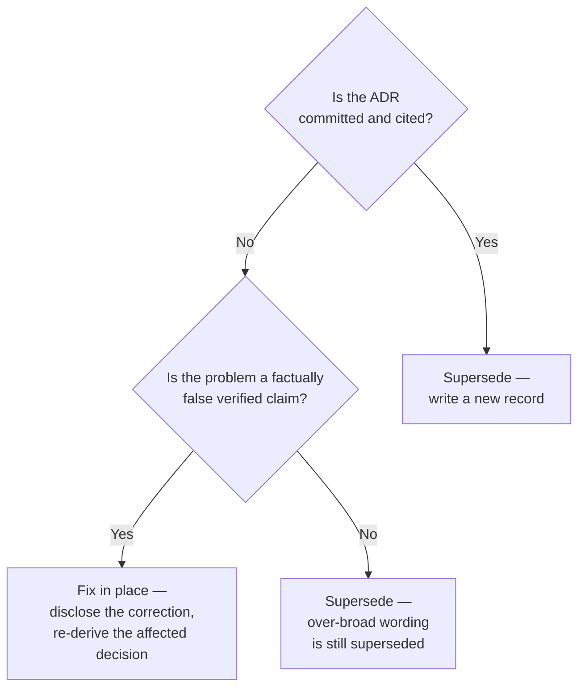

Every structural choice in Stemolly — where code lives, how the backend is split, which framework was picked — traces back to a single quality attribute: **evolvability**. At MVP scale the riskiest thing is locking in a shape that makes the next pivot expensive. That pressure ruled out microservices, split repositories, and meta-frameworks, and it is the same pressure that demands machine-enforced module boundaries and an immutable decision record.

## One repo, one deployable

The project lives in a single `pnpm` workspace monorepo and ships as a single deployable unit: **nginx** serving two SPA bundles, **one server image**, and **Postgres**.

```
┌──────────────────────────────────────────────────┐
│                   nginx (one host)               │
│    apps/student/dist        apps/console/dist    │
└───────────────────┬──────────────────────────────┘
                    │
          ┌─────────▼─────────┐
          │   Fastify server  │
          │  /api/student/*   │  ← deny-by-default, role-scoped
          │  /api/console/*   │  ← deny-by-default, role-scoped
          │  /api/admin/*     │  ← deny-by-default, role-scoped
          │  /api/auth/*      │  ← ungated (pre-session routes)
          └─────────┬─────────┘
                    │
              ┌─────▼─────┐
              │  Postgres  │
              └───────────┘
```

The two SPAs serve different audiences — students and the internal Console team — but that difference lives entirely at the frontend. The backend is shared because the domain is shared: the Console authors briefs that student sessions consume, and those sessions write evidence the Console later observes.

**Why one repo?** A `packages/contracts` package (JSON Schema + generated TypeScript types) is imported by both frontends *and* the server. In a multi-repo setup, every change to these high-churn contracts becomes a cross-repo coordination exercise. A monorepo keeps those changes atomic and type-checked in a single commit.

**Why one deployable?** Splitting into two deployables only reduces blast radius if the database credentials also split. At current scale the benefit is speculative; the cost — every cross-seam pivot becomes a multi-deploy, contract-versioned change — is real and fights evolvability. The boundary is kept as an explicit extraction seam for when measured constraints (scale, team size, or the Console gaining external users) make a split worthwhile.

:::note[Scope of "one deployable"]
This decision covers the **Student/Console web topology** only. Other service groups — for example, the operator/student MCP surface — can live in the same `docker-compose.yml` as a matter of monorepo convenience without violating this decision. They are an orthogonal deployable governed by a separate ADR; the web-app topology rule was never scoped to govern them.
:::

## Modular monolith backend

The server is a **single process** with eleven strict internal modules:

`engine` · `tutor` · `pedagogy` · `content` · `identity` · `llm` · `judge` · `authoring-ai` · `metering` · `jobs` · `api`

Boundaries are enforced by **`dependency-cruiser`** and **`eslint-boundaries`** configuration, not by the network. The `engine` module imports nothing upward; no module reaches deep into another module's internals. This lint check must be **CI-blocking from the first sprint** — if it can be bypassed, the entire model collapses.

Microservices were rejected because every meaningful pivot in this domain crosses module seams (briefs, evidence, and reports interact everywhere). With microservices, each such pivot becomes a multi-repo, multi-deploy, contract-versioned change — exactly what the evolvability NFR rules out. Service-extraction seams are left explicit for the moment a real, measured constraint forces a physical split.

## TypeScript end-to-end

Every layer shares one language. The shared `contracts` package is the connective tissue: JSON Schema definitions plus generated TypeScript types, imported by both frontends and the server.



**Fastify** replaced an earlier Express assumption. Fastify's native per-route JSON Schema validation is exactly the contracts strategy the design mandates, and its prefix-scoped encapsulated plugins map one-to-one onto the four API namespaces. It stays a plain explicit router — no meta-framework hidden control flow.

Alternatives ruled out:

| Option | Reason rejected |
|---|---|
| Next.js / Remix | Hidden control flow; no SSR benefit for two auth-walled SPAs |
| Python + FastAPI | Splits the language across the high-churn contracts seam; LLM use is API orchestration, not local ML |
| Heavy ORMs | Obscure the append-only triggers and recursive CTEs the data model relies on |

## Four-pillar governance

Good architecture has a shelf life only if the structure is actively maintained. Stemolly governs through four pillars and a layered set of enforcement mechanisms:



The ordering matters: **CI-blocking machine checks first**, then runtime fail-loud, then human process. Every design rule (`R-*`) maps to at least one fitness function (`G-*`). The governance document records deliberate blind spots where automation is impractical, treating review-backed semantic checks as first-class architecture rather than an afterthought.

Adding a module, a datastore, an external service, or a process boundary always requires an ADR. Cross-cutting concerns — auth, errors, logging, idempotency, config, resilience — are settled at the architecture phase so that each module does not later make an independent, incompatible choice.

The architecture corpus lives in the umbrella repo under `docs/design/` (ADRs and rules), `docs/prd/` (product requirements), `CLAUDE.md` (contributor conventions), and `.context/decisions/index.md` (the lookup surface for code-area hooks). Accepted ADRs are binding on implementation even when the product code lives in a gitignored sub-repo.

:::caution[Durable docs avoid sprint numbers]
Sprint numbers are not stable identifiers — inserted sprints renumber the roadmap. Architecture docs, ADRs, and rules should cite **capabilities or gates** instead, so they remain retrievable even when the delivery schedule is re-cut.
:::

## ADR hygiene: the rules that keep governance honest

ADRs only work as durable case law if their bodies stay stable. Four rules enforce that stability.

### Supersede, never edit

An accepted ADR's body is **immutable**. When a decision changes — or its wording is found to forbid more than its own reasoning supports — the right response is a new superseding record, not an edit. Only the `Status:` line of the original may change.

This holds even when a direct edit looks cheaper by citation count. The real delta between editing and superseding is one new file. Two costs do not shrink with the citation count:

1. An accepted ADR may be named as `Precedent:` by another accepted ADR — editing one body moves the ground under a record that is itself binding.
2. "It was only a drafting error" is permanently available as an argument against any record; the corpus's only protection is that bodies do not move.

The superseding record is also the better artifact: it restates the rule at the granularity that was always meant, carries surviving clauses forward verbatim, and leaves the original on disk as history.

**One exception — uncommitted drafts with factually false verified claims.** Supersession protects *case law*: records that are committed and cited by other decisions. A draft that has not been committed, is not yet cited, and was written in the same session is not yet case law. If its `Evidence` section states a verified fact that is simply untrue, superseding it would preserve the false claim in the corpus forever. Correct the draft in place — but disclose the correction, re-derive any decision that rested on the false fact, and record the wrongly-rejected option.



### Scope to the boundary, not the transport

An ADR governs something *durable* — a module boundary, a contract shape, an invariant — not a temporary artifact that will be replaced.

The PoC's MCP tool surface is the current carrier of the engine's model-facing boundary, but the full app replaces that with an in-process `tutor` → `engine` call. An ADR scoped to "the MCP tool files" becomes void the moment the PoC is retired, even though the boundary itself persists.

The correct form names the boundary and lists current carriers as instances:

> *"The engine module's model-facing boundary — carried by the PoC's MCP tool surface today, by the in-process checkpoint-job call later."*

Findings from the temporary carrier belong under `Evidence`, where they read as observations about the current instance rather than as the permanent limit of the decision. The test: **if the identifier can be retired on a schedule, it cannot appear in a scope line.**

### ADRs name roles; rules name files

An ADR's Decision section should name **roles and invariants** — "the driving contract never imports the driven contracts." The concrete files that hold those roles — `core/driving.ts`, `core/driven.ts` — belong in the design rules (`R-*`).

Rules change in ordinary work; a layout rename edits an `R-*` entry without touching the ADR behind it. Writing filenames into an ADR body turns every future rename into a supersession — expensive ceremony for what should be routine housekeeping. ADR-023 demonstrated the failure; ADR-029 corrected it: five roles, no filenames, with R-28 and R-30 carrying the paths.

:::caution[Filenames in an ADR body become permanent commitments]
Rename the file → the ADR body becomes literally false → the only remedy is a supersession. Keep filenames in `R-*` rules instead.
:::

### Avoid sprint numbers in durable docs

Sprint numbers are not stable identifiers. When a sprint is inserted the roadmap renumbers, making any document that names a sprint silently wrong. Architecture docs, ADRs, rules, and notes should cite **capabilities or gates** instead, so they remain retrievable even when the delivery schedule is re-cut.
