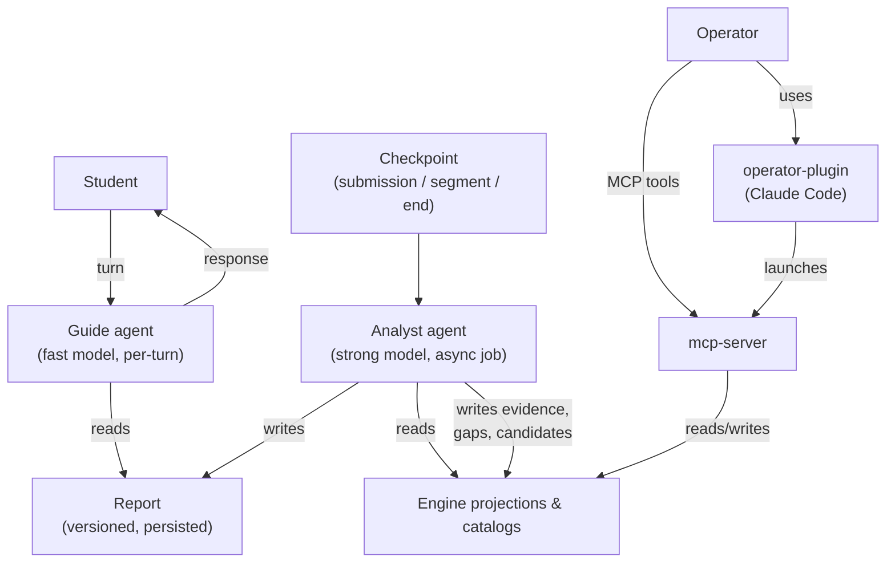
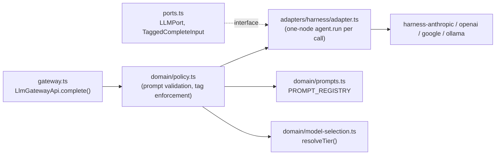
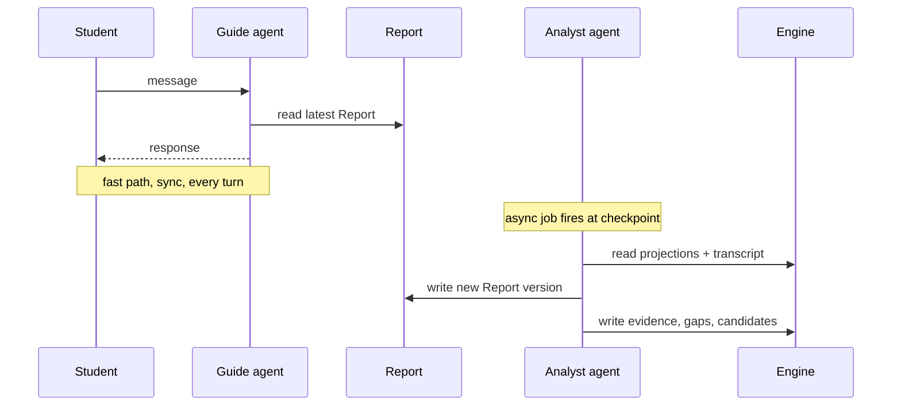
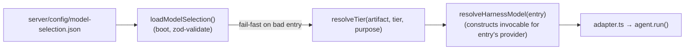
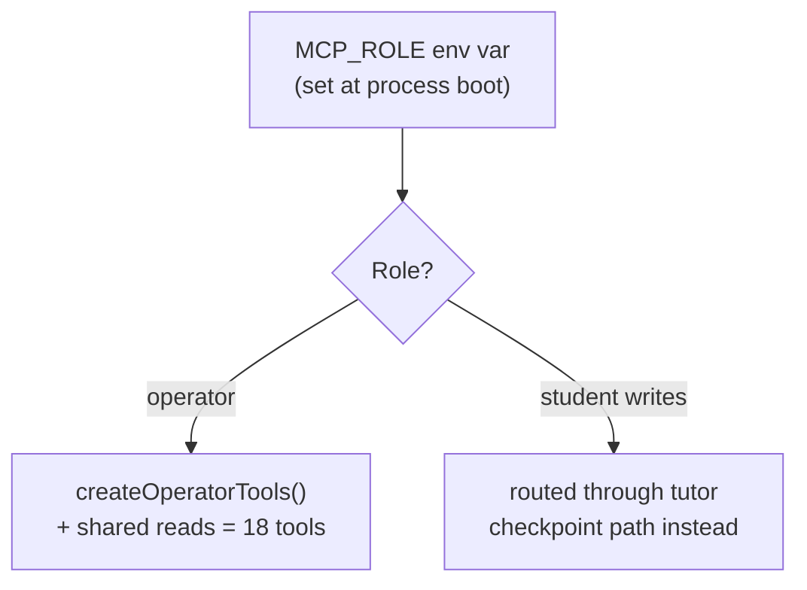

Stemolly's AI layer has two parts that work closely together. The first is how LLM calls are made — a vendor-agnostic substrate built on the in-house `@noetaris/harness` framework, a tiered two-agent tutor (Guide + Analyst), a boot-validated model-selection registry, and versioned prompt management. The second is how human operators interact with the knowledge engine directly — the MCP server that exposes engine tools over stdio or HTTP, and the `operator-plugin` that wraps it into a Claude Code workflow. The two parts connect through the belief-graph engine: the Analyst writes evidence to it on every checkpoint, and operators curate it via MCP tools.

---

## The @noetaris/harness substrate

Stemolly's agents are built on **`@noetaris/harness`**, an in-house TypeScript agent framework that we own entirely. Harness models an agent as a directed graph of steps with a typed field schema for state. Dependencies — including the LLM itself — are injected via `h.provide()`, and the LLM is a named `model` slot that can be replaced without touching the agent logic.

The earlier approach was to hand-write provider adapters and a full gateway layer. That was replaced by harness for two reasons:

1. **Vendor confinement.** Provider SDKs (Anthropic, OpenAI, Google, Ollama) now live entirely in adapter packages outside our repo (`harness-anthropic`, `harness-openai`, etc.), all implementing the same `harness-types` `LLM` interface. We do not touch vendor code directly.
2. **Explicit ownership over framework magic.** Harness is straightforward and fully controlled — unlike LangChain or similar frameworks where behaviour emerges from conventions. This aligns with the "explicit over magic" principle. Crucially, because we own harness upstream, when Stemolly needs something harness does not yet provide, we extend it upstream rather than working around it.

### The llm module: a thin policy layer

The `server/src/llm` module is the server-side LLM boundary. With harness in place it shrinks from a full gateway to a **thin policy layer** with four jobs:

- **`gateway.ts`** exposes `LlmGatewayApi.complete(input)` to the rest of the server. It adds no other behaviour — it wires domain policy to an injected `LLMPort`.
- **`ports.ts`** defines the internal provider seam: vendor-shaped message types, the required call tags (`agentRole`, `tier`, `purpose`, `promptId`, `promptVersion`), and the `LLMPort` interface that adapters implement. Prompt and tag enforcement happens in the gateway path, not inside adapters.
- **`domain/policy.ts`** validates that every call has a registered prompt and a known purpose before any model is touched.
- **`domain/model-selection.ts`** loads and owns the model-selection artifact (see [Model-selection registry](#model-selection-registry-adr-061)).
- **`adapters/harness/adapter.ts`** is the one concrete `LLMPort` implementation; it never calls vendor SDKs directly.

### How a completion reaches the model: agent.run()

The adapter wraps each completion in a **one-node `agent.run()` call**. The single step inside calls `ctx.model.invoke(...)`. Each `complete()` call supplies a **fresh `model` runtime slot** when invoking the agent, which is how concurrent calls avoid sharing observer state.

This replaces an earlier workaround where the adapter called `model.invoke()` directly and manually drove `bindObserver()`, `onRunStart`, and `onRunEnd` by hand — which required fabricating a `RunContext`. Reading harness's `create-agent.ts` and `loop-executor.ts` source showed the workaround was unnecessary: `agent.run()` auto-calls `bindObserver()` on every `ObserverAware` resource slot and drives `onRunStart`/`onRunEnd` on every exit path, so `harness-otel` spans open under a real run root-span.

One subtlety to know: **`agent.run()` never rejects on a step/domain error.** A throwing step resolves as `{ signal: '$error', state: { $error } }`. The adapter branches on `outcome.signal` and rethrows `outcome.state.$error` to preserve the rejecting-promise contract callers expect. Harness construction errors (e.g. `NoNextStepError`) do still reject — and should, because those are bugs.

Timeout handling uses `Promise.race` plus `handle.stop()`, so a hung provider becomes a typed `ProviderTimeoutError` rather than an indefinitely stuck request.

---

## The two-agent tutor: Guide and Analyst

Think of a tutoring centre: an expert teacher analyses a student's work in depth between sessions, then passes structured guidance to the front-line tutor who actually runs the session. The expert never interrupts mid-session; the front tutor never guesses at diagnoses. Stemolly follows the same model.

### What each agent does

| | Guide | Analyst |
|---|---|---|
| **Model tier** | Fast, cheap, bilingual | Strong, expensive |
| **Fires when** | Every student turn (synchronous) | At checkpoints: submission / segment / lesson end (async job) |
| **Reads** | Latest Report, brief snapshot, conversation window | Engine projections, transcript, catalogs |
| **Writes** | Nothing to the engine | Evidence, misconceptions, fragility, predictions, probe plan, pedagogy decision |
| **LLM call tags** | `agentRole:guide`, `purpose:guide-turn`, `tier:fast` | `agentRole:analyst`, `purpose:analyst-checkpoint`, `tier:strong` |

The Guide **does not diagnose, does not write beliefs, and does not generate the lesson content it is teaching.** It renders what the Analyst concluded. The Analyst **never participates in the student-visible turn projection.** In code, `tutor/core/guide.ts` builds a six-field prompt from the folded board, transcript tail, student utterance, and answer key. `tutor/core/analyst.ts` expects machine-readable JSON back (not freeform tutor text), repairs one unparseable reply, and drops observations whose `nodeSlug` is outside the probed anchor set before writing anything to the engine.

Because the Analyst runs off-turn as an async job, its cost does not add to conversational latency. This is the core of Stemolly's cost model: expensive reasoning runs rarely, cheap rendering carries the volume.

### Naming note

Older documents call these agents **Interface** (front) and **Expert** (back). Those names were replaced because "Interface" collided with too many other meanings — plugin interfaces, API contracts, the UI surface. The current canonical names, **Guide** and **Analyst**, are the `agentRole` enum values used in metering and in tier/purpose routing.

### The Report: the only channel between them

The **Report** is the only Analyst→Guide channel. There are no side channels. The Analyst writes a new Report version to storage; the Guide reads from storage. The Guide is never coupled to a live Analyst call.

The Report is:
- **Versioned** — carries a `schemaVersion` validated at the API boundary.
- **Persisted before use** — the Guide always reads a stored artifact.
- **Inspectable** — the Console's Observe area can display and score the Analyst's reasoning from the stored Report without extra instrumentation.

If a checkpoint job fails or arrives late, the Guide keeps serving on the previous Report — degraded guidance, never a stalled conversation. The job retries in the background.

### Open design gap: the Report schema

The envelope-level guarantees above are settled. The **concrete field-by-field schema is not yet designed**, and this is the single most load-bearing open task in the architecture.

The fields that still need definition include:
- The **guidance payload** — what structured instructions the Guide actually reads.
- **Contingent guidance** — "if the student tries X, do Y" branches. The Guide may serve several turns from a single Report between checkpoints; it needs enough information to handle branching situations without calling the Analyst again.
- The **probe-plan** and **prediction** fields.

:::caution[Critical open task]
If the Report schema cannot express contingent guidance well, pressure will build to call the Analyst on every turn — quietly collapsing the cost-tiering model the two-agent split exists to protect. As of mid-2026, `app/packages/contracts/src` contains only `error-envelope.ts`; the Report schema has not yet been designed or coded.
:::

### Implementation reality check

The current codebase has not yet built the full persisted-Report handoff. Today, `runAnalystCheckpoint` is called directly and inline — it writes evidence, concept gaps, and catalog candidates immediately, with no `Report` type or repository involved. The durable checkpoint record stores only session/problem ordinals and transcript/board window bounds, not the Analyst's full reasoning payload.

The Analyst reply does have a concrete transient schema already: the model must return JSON with an `observations` array, and may also return `conceptGaps` and `catalogCandidates`, each item field-narrowed before use. That machine-readable shape is committed in code — but only as an in-process LLM reply schema, not as the versioned persisted artifact the architecture describes. Building the persisted Report is the bridge still to cross.

---

## Reasoning language is per-domain, not hardcoded English

The Analyst does not always reason in English. The rule is: **use whichever language avoids a lossy translation round-trip on the student's own reasoning**.

- For English-content domains (IELTS writing, SAT) the Analyst works in English natively — no translation needed.
- For Vietnamese-content domains (K11 Math) forcing English would wrap a Vietnamese→English→Vietnamese hop around exactly the evidence that feeds misconception detection. The Analyst instead reasons in the content language.

Reasoning language is a **per-domain configuration** on the Analyst, defaulting to the content language. The assumed English performance edge in LLMs is small and, for math (which is largely symbolic), outweighed by the translation cost.

One consistency rule applies regardless: **belief-graph node IDs are always canonical English**, since those IDs must be language-neutral for the graph to work across domains.

---

## Model-selection registry (ADR-061)

### From a code table to a boot-validated artifact

The original tier registry was a plain TypeScript `(purpose, tier) → {model, rate}` code table. ADR-061 (accepted 2026-09-05) replaced it with a **model-selection artifact**: a committed default JSON file (`server/config/model-selection.json`) plus an optional per-environment override path via `STEMOLLY_MODEL_SELECTION_PATH`.

The artifact is parsed and zod-validated **once at boot** with fail-fast behavior. An unknown provider, a missing field, or a `promptVersion` absent from the prompt registry stops the process. The old process-wide `STEMOLLY_LLM_PROVIDER` switch is gone; each artifact entry now carries `{ provider, model, rate, promptVersion }` together. That means Guide-on-one-vendor and Analyst-on-another-vendor is expressible by construction, and `rate` cannot drift away from the model whose metering row it prices.

`resolveTier` is the **first statement** in `adapter.ts`'s `complete()`. An unregistered `purpose` throws immediately — before any model is invoked and before any metering row is written. The resolved entry is handed whole to `resolveHarnessModel(entry)`, which constructs the invocable object for that entry's provider. The two responsibilities stay separate: `resolveTier` decides *which* model, rate, and provider; `resolveHarnessModel` decides *how* to build it.

### The two-axis lookup grid

`purpose` and `tier` are two **independent** lookup axes, not a single combined key.

- **`purpose`** (`guide-turn`, `analyst-checkpoint`, `echo-turn`) selects the prompt template and the metering tag.
- **`tier`** (`fast` | `strong`) requests a model weight class — cheap and quick versus capable but slower.

The caller supplies both on every call. `resolveTier(artifact, tier, purpose)` returns `artifact[purpose][tier]`. The zod schema requires every purpose to declare both a `fast` and a `strong` entry, so the committed artifact holds six cells — but the running app exercises only two: `guide-turn.fast` and `analyst-checkpoint.strong`. The other four, and the whole `echo-turn` row (tests and demos only), are schema-required placeholders. Keeping the axes separate means a purpose is not permanently welded to one weight class — the Guide could request `strong` for a difficult turn without a schema change.

### Prompt versioning

Prompt text lives in versioned modules: `prompts/guide-turn/v1.ts`, `prompts/analyst-checkpoint/v1.ts`, `prompts/analyst-checkpoint/v2.ts`, and so on. `domain/prompts.ts` statically imports them into a `PROMPT_REGISTRY[promptId][promptVersion]` code table.

The rules are strict:
- Missing or empty `promptVersion` is always rejected.
- `resolvePromptText()` throws for any unregistered `(promptId, promptVersion)` pair.
- `loadModelSelection()` cross-validates each artifact entry's `promptVersion` against the prompt registry at boot.

Versions are **additive, not mutable in place**: `analyst-checkpoint` keeps version `1` registered while version `2` adds optional `conceptGaps` and `catalogCandidates` output fields. Old versions remain accessible so a rollback does not require a schema migration.

### Known risk: model-string drift

`loadModelSelection()` validates `provider` against an enum and `promptVersion` against the registered prompt table. But `model` remains any non-empty string, and `purpose` names are only coordinated implicitly between call sites, prompt IDs, and artifact keys. Vendor model-ID renames or a caller/artifact purpose mismatch are caught only at invoke time — not by a provider-specific schema. There is no automated check that a given model string still exists in the vendor's catalog.

---

## Testing without real LLMs: the mock-slot rule

Because harness exposes the LLM as a swappable `model` slot, every automated test uses a **deterministic mock LLM** or the free local Ollama adapter. No automated test ever calls a real provider. This is a firm rule.

| Level | What it proves | How |
|---|---|---|
| Level 0 | The plumbing works (routing, metering, error handling) | Mock/local slot + `@noetaris/harness-testing` (`runStep`, `MockObserver`) |
| Level 1 | The belief model is true (diagnosis quality, groundedness) | Offline evaluation harness, real Claude adapter |

A CI fitness-function test asserts that `NODE_ENV=test` never resolves to a real vendor provider — it iterates every artifact entry and checks that all name `mock`. Switching any agent from mock to real Claude is a one-line slot change. This is the same mechanism that keeps LLM-agnosticism concrete rather than aspirational.

---

## Operational observability: cost and latency by agent role

Stemolly has two distinct observability jobs that must not be conflated.

**Validation observability** ("is the engine true?") — groundedness precision, predictive validity, belief-graph inspection — is a functional capability in the Console's Observe area.

**Operational observability** ("is the system healthy and affordable?") is a non-functional requirement covering:

- **Cost** — LLM spend and token counts per turn, session, student, lesson, and domain, split by model tier and by agent role.
- **Performance** — latency per agent role, error/timeout/retry rates, model-routing visibility, throughput.
- **Reliability** — persistence failures, guardrail violations.

The per-agent-role breakdown is load-bearing: the two-agent split rests on the assumption that the expensive Analyst fires rarely and the cheap Guide carries the volume. Only watching cost and latency broken down by `agentRole` can verify that assumption. If Analyst calls start appearing too frequently, it is an early warning that the Report schema is not holding — visible in metrics before it appears in invoices.

---

## MCP operator surface

### What the mcp-server package is

`app/mcp` is the app's Model Context Protocol adapter. Its only job is to **map MCP calls onto engine ports**. All the actual knowledge-graph operations live in `@stemolly/server/engine`; the MCP package is a thin driving layer over those engine APIs.

At boot, `mcp-server.ts` reads process config once (`MCP_ROLE`, `MCP_TRANSPORT`, `DATABASE_URL`, `DISPLAY_LANG`), creates one `pg.Pool` from `DATABASE_URL`, wires it directly into the engine's Postgres repositories — `PgGraphRepository`, `PgCatalogRepository`, `PgEvidenceRepository`, and others — then selects the tool set for the resolved role. There is no hop through Fastify or the REST API; the MCP process talks to the database directly.

### Role-split tool surfaces

The MCP server boots as exactly one role. That role cannot change at request time.

**Operator tools** expose eighteen tools total:
- *Graph seeding:* `seed_node`, `seed_edge`
- *Catalog lifecycle:* `seed_catalog`, `approve_candidate`, `reject_candidate`, `reopen_candidate`
- *Study-anchor maintenance:* `create_study_anchor`, `set_study_anchor_nodes`
- *Concept-gap moderation:* `list_concept_gaps`, `resolve_concept_gap`, `dismiss_concept_gap`, `reopen_concept_gap`
- *Evidence inspection:* `get_evidence_trail`
- *Node curation (operator-only):* `match_nodes`, `merge_nodes`
- *Shared reads (added by `server.ts`):* `get_belief_state`, `match_catalog`, `get_study_anchor`

Every handler is a thin delegate into the engine API — no orchestration logic lives in the MCP layer.

**Student engine writes are no longer a separate MCP role.** ADR-063 moved every engine write originating from a student session into `tutor`'s checkpoint path. The Analyst reply now grows additive `conceptGaps` and `catalogCandidates` lists that follow the checkpoint path's existing parse-failure and idempotency rules. The MCP remains an operator-only surface; the former student role, student-specific config, and public student-host deployment have been removed from the design.

:::note[Shared reads]
`shared-reads.ts` factors three read tools across role surfaces: `get_belief_state`, `match_catalog`, and `get_study_anchor`. The operator surface receives `get_belief_state` unchanged — it can query any `studentId` supplied on the wire. A student-facing caller would inject the process-configured `studentId` instead, so the trust boundary differs even though the underlying operation is the same.
:::

### Transport: stdio or stateless HTTP

`main.ts` resolves `MCP_TRANSPORT` to either `stdio` or HTTP. The HTTP branch serves a **stateless `StreamableHTTPServerTransport`** — it constructs a fresh `McpServer` per request. ADR-034 records the intended remote deployment model: one process per role, TLS and caller authentication at the edge reverse proxy, and loopback-only publication of the MCP container. The Dockerfile keeps `MCP_ROLE`, `MCP_TRANSPORT`, and `DATABASE_URL` out of the image so the same built artifact can start as different role/transport combinations.

---

## operator-plugin: AI-assisted human curation

The `operator-plugin` package is a **Claude Code plugin** (identified in `plugin.json` as `operator-plugin` v0.0.1). It is not the engine itself; it is a client-side wrapper that gives Claude Code seven operator skills bundled into two phases:

**Content-preparation loop:** `seed-content`, `process-material`, `ingest-assignment`, `deliver-assignment`

**Operator-audit loop:** `curate-catalog`, `triage-concept-gaps`, `review-evidence`

The plugin reads and writes operator-owned workspace files under `${CLAUDE_PROJECT_DIR}` (`materials/`, `assignments/`, `progress.md`) rather than committing generated artifacts to the repository.

### Judgment before execution

Every skill consistently separates the AI-assisted judgment step from the actual write:

- `seed-content` drafts nodes, prereq edges, and catalog candidates **before** any `seed_*` MCP call.
- `ingest-assignment` drafts the assignment breakdown, node coverage, answers, and anchor scope **before** `create_study_anchor` or brief writes.
- `triage-concept-gaps` and `curate-catalog` show each item **before** resolving, dismissing, approving, rejecting, or reopening it.
- `process-material` confirms a rendered sample **before** the full crop run.
- `deliver-assignment` is the exception — it performs no content judgment and only relays the result of its deterministic push script.

The pattern keeps the human in the decision loop: Claude proposes, the operator approves, the MCP tool executes.

### How the plugin connects to the MCP server

`.mcp.json` defines one MCP server entry — `engine-operator` — which runs `node ${CLAUDE_PLUGIN_ROOT}/../mcp/dist/index.js` with `MCP_ROLE=operator` and `MCP_TRANSPORT=stdio`. The same config threads `DATABASE_URL` and `DISPLAY_LANG` from the Claude session environment. Claude Code spawns this stdio server when launched with `--plugin-dir`; operators do not run a separate long-lived MCP daemon.
