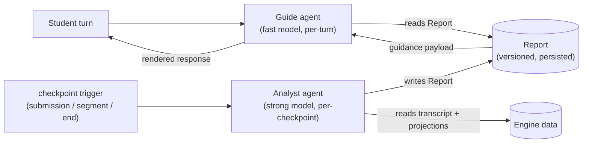

Stemolly is not tied to any single AI provider. The system uses multiple LLMs at once, each matched to its task: cheap, fast models handle high-volume conversational turns; powerful (and expensive) models do the reasoning work that fires much less often. No part of the codebase may assume a specific vendor — Claude, GPT, Gemini, or a local model are all swappable. The agents that drive the tutor experience sit on top of this interchangeable model layer.

This page explains the substrate those agents are built on, the two-agent design at the heart of the tutor, how the agents talk to each other, and the operational decisions that keep the system testable, routable, and observable.

---

## The @noetaris/harness substrate

Stemolly's agents are built on **`@noetaris/harness`**, an in-house TypeScript agent framework that we own entirely. Harness models an agent as a directed graph of steps with a typed field schema for state. Dependencies — including the LLM itself — are injected via `h.provide()`, and the LLM is a named `model` slot that can be replaced without touching the agent logic.

The earlier approach was to hand-write provider adapters and a full gateway layer. That was replaced by harness for two reasons:

1. **Vendor confinement.** Provider SDKs (Anthropic, OpenAI, Google, Ollama) now live entirely in adapter packages outside our repo (`harness-anthropic`, `harness-openai`, etc.), all implementing the same `harness-types` `LLM` interface. We do not touch vendor code.
2. **Explicit ownership over framework magic.** Harness is straightforward and fully controlled — unlike LangChain or similar frameworks where behaviour emerges from conventions. This aligns with the project's "explicit over magic" principle.

With harness in place, the `llm` module shrinks from a full gateway to a **thin policy layer** with four jobs:

- **Tier registry** — maps `(tier, purpose)` pairs to a specific model and rate.
- **Versioned prompt registry** — stores and retrieves prompt templates by version.
- **Tagged metering** — writes `llm_calls` rows riding on `harness-otel` spans.
- **Runtime assertions** — guards against unregistered purposes or malformed calls.

```
┌─────────────────────────────────────────────┐
│               llm module                    │
│  tier registry → resolveTier(tier, purpose) │
│  prompt registry → versioned templates      │
│  metering wrapper → llm_calls rows (otel)   │
│  runtime assertions → guard rails           │
└────────────────┬────────────────────────────┘
                 │ harness-types LLM interface
     ┌───────────┼───────────┐
     ▼           ▼           ▼
anthropic     openai      ollama
 adapter      adapter     adapter
```

### How a completion reaches the model: agent.run()

The adapter used to drive a completion by calling `model.invoke()` directly, then manually wiring up observer lifecycle calls (`bindObserver()`, `onRunStart`, `onRunEnd`) by hand. That was a workaround — it required faking a `RunContext` that harness expects to create itself.

Reading harness's own `create-agent.ts` and `loop-executor.ts` source showed the workaround was unnecessary. The adapter now wraps each completion in a **one-node `agent.run()` call**. Harness calls `bindObserver()` automatically on every resource slot and drives `onRunStart`/`onRunEnd` on every exit path — including failures. This means the `harness-otel` span opens under a real run root-span rather than a fabricated one.

One subtlety to be aware of: `agent.run()` **never rejects** on a step error. A step that throws resolves as `{ signal: '$error', state: { $error } }`. The adapter branches on `outcome.signal` and rethrows `outcome.state.$error` to preserve the `LLMPort.complete()` rejecting-promise contract that callers expect. Harness construction errors (e.g. `NoNextStepError`) do still reject — and should, because those are bugs.

---

## The two-agent tutor: Guide and Analyst

The tutor experience is driven by **two agents working in different modes**.

Think of a tutoring centre: an expert teacher analyses a student's work in depth between sessions, then passes structured guidance to the front-line tutor who runs the actual session. Stemolly follows the same model.



### Guide — the fast front agent

The **Guide** runs on a light, fast, bilingual model. It fires on every student turn and is responsible for:

- Delivering responses in the student's language.
- Rendering lesson plugins and UI artifacts.
- Handling routine back-and-forth conversation.

The Guide **does not diagnose or reason**. It never invents a misconception, never updates the belief graph, and never generates the content it is teaching. It renders what the Analyst concluded; it does not decide what that conclusion should be.

### Analyst — the strong background agent

The **Analyst** runs on a powerful model as an **asynchronous job**. It fires at meaningful checkpoints — after a submission, after a lesson segment, or at lesson end — not on every turn. It is responsible for:

- Diagnosing the student's understanding.
- Writing typed evidence observations, catalog matches, a probe plan, and predictions to the belief graph.
- Making the pedagogy decision (what the Guide should do next).
- Producing content-language artifacts where needed (for example, a corrected English sentence for an IELTS exercise).

Because the Analyst runs off-turn, its cost does not add to conversational latency. This is the core of Stemolly's cost and latency model: the expensive work runs rarely, the cheap work carries the volume.

### Naming note

Older documents call these agents **Interface** (front) and **Expert** (back). Those names were replaced because "Interface" collided with too many other meanings in the system — plugin interfaces, API contracts, the UI surface. The current canonical names are **Guide** and **Analyst**. They are the `agentRole` enum values used in metering and in tier/purpose routing (`role=guide`, `role=analyst`).

---

## How Guide and Analyst communicate: the Report

The **Report** is the only channel between the Analyst and the Guide. There are no side channels. This is a deliberate constraint.

The Report is:
- **Versioned** — carries a `schemaVersion` that is validated at the API boundary.
- **Persisted before use** — the Analyst writes the Report to storage before the Guide reads it. The Guide is always reading from storage, never from a live Analyst call.
- **The Observe-inspectable reasoning record** — because the Report is a stored artifact, the Console's Observe area can display and score the Analyst's reasoning without any extra instrumentation.

If a checkpoint job fails or arrives late, the Guide keeps serving on the **previous Report**. The student's conversation continues — with slightly stale guidance, but never stalled. The job retries in the background.

### Open design gap: the Report schema

The envelope-level guarantees above are settled. The **concrete field-by-field schema is not yet designed**.

The fields that still need definition include:

- The **guidance payload** — what structured instructions the Guide actually reads.
- **Contingent guidance** — "if the student tries X, do Y" branches. This matters because the Guide may serve several turns from a single Report between checkpoints; it needs enough information to handle branching situations without calling the Analyst again.
- The **probe-plan** and **prediction** fields.

This is flagged in the design's own self-review as the **single most load-bearing open task** in the architecture. If the schema cannot express contingent guidance well, there will be pressure to run the Analyst on every turn — which would collapse the cost model the two-agent split exists to protect. As of mid-July 2026, `app/packages/contracts/src` contains only `error-envelope.ts`; the Report schema has not been coded yet.

---

## Reasoning language is per-domain, not hardcoded English

The Analyst does not always reason in English. The rule is: **use whichever language avoids a lossy translation round-trip on the student's own work**.

- For English-content domains (IELTS writing, SAT) the Analyst works in English natively.
- For non-English content domains (Vietnamese K11 Math) forcing English would mean translating the student's Vietnamese reasoning into English so the Analyst can process it, then translating the result back — wrapping a lossy translation hop around exactly the evidence that feeds misconception detection. The Analyst instead reasons in the content language.

Reasoning language is a **per-domain configuration** on the Analyst, defaulting to the content language. The assumed English performance edge in LLMs is small and, for math (which is largely symbolic), outweighed by the translation cost.

One consistency rule applies regardless of reasoning language: **belief-graph node IDs are always canonical English**, since those IDs need to be language-neutral for the graph to work across domains.

---

## Tier and purpose routing: resolveTier()

Every LLM call goes through `resolveTier(tier, purpose)` before a model is constructed. This function is the sole authority that maps a `(tier, purpose)` pair to a specific model ID and billing rate.

`resolveTier()` is the **first statement** in `adapter.ts`'s `createLlmProviderAdapter.complete()`. If the `purpose` is not registered, the call throws immediately — before any model is invoked and before any metering row is written. Previously, an unregistered purpose would silently invoke a model and write a billing row at whatever rate happened to be in a flattened lookup table; that table has been removed.

The resolved `modelConfig.model` is passed as a required second parameter to `resolveHarnessModel(config, modelId)`, which knows only how to construct the invocable object for a given provider. The two responsibilities stay separate: `resolveTier` decides *which* model and rate; `resolveHarnessModel` decides *how* to build it.

### Keeping the registry maintainable

The tier registry currently lives in `llm/domain/tiers.ts` alongside the `resolveTier` and `computeCost` logic. These are expected to change at different rates: the registry data changes often (new purposes, new models, updated rates); the resolution logic changes rarely. Mixing them means a maintainer editing a rate must read through throw logic they do not need.

The planned fix (tracked as issue #30) is to split them into separate files:
- `tier-types.ts` — shared `Tier` and `ModelConfig` types (no logic, no data).
- `tier-registry.ts` — the `TIER_REGISTRY` data table, importing from `tier-types.ts`.
- `tiers.ts` (or equivalent) — the `resolveTier`/`computeCost` logic, also importing from `tier-types.ts`.

This keeps the import graph a one-directional DAG: neither data file nor logic file imports from the other. The registry stays as plain TypeScript (not YAML or JSON), a decision made in ADR-005 under the "explicit over magic" principle and not reopened.

---

## Testing without real LLMs: the mock-slot rule

Because harness exposes the LLM as a swappable `model` slot, every automated test uses a **deterministic mock LLM** (or the free local Ollama adapter). No automated test ever calls a real provider. This is a firm rule.

The split is:

| Level | What it proves | How |
|-------|---------------|-----|
| Level 0 | The plumbing works (routing, metering, error handling) | Mock/local slot + `@noetaris/harness-testing` |
| Level 1 | The belief model is true (diagnosis quality, groundedness) | Offline evaluation harness, real Claude adapter |

A CI fitness-function test asserts that `NODE_ENV=test` never resolves to a real vendor provider. Switching any agent from mock to real Claude is a one-line slot change — the same mechanism that makes LLM-agnosticism concrete rather than aspirational.

---

## Operational observability is a separate concern

Stemolly has **two distinct observability jobs** that must not be confused with each other.

**Validation observability** ("is the engine true?") checks whether the belief model is accurate — groundedness precision, predictive validity, belief-graph inspection. This is a functional capability realized in the Console's Observe area.

**Operational observability** ("is the system healthy and affordable?") is a non-functional requirement. It covers:

- **Cost** — LLM spend and token counts per turn, session, student, lesson, and domain, broken down by model tier and by agent role (`guide` / `analyst`).
- **LLM performance** — latency per agent role, error/timeout/retry rates, model-routing visibility, throughput.
- **Reliability signals** — persistence failures, guardrail violations.

The agent-role breakdown matters for a specific reason: the two-agent split is built on the assumption that the Analyst (expensive) runs rarely and the Guide (cheap) carries the volume. That assumption can only be verified by watching cost and latency split by agent role. If those numbers drift — if Analyst calls start appearing too frequently — it is an early signal that the Report schema design is not holding up under real usage.
