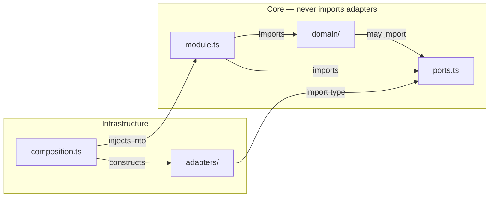

# Module Structure

Every backend module in the server follows the same internal shape. Business logic lives in `domain/`, dependency interfaces in `ports.ts`, concrete implementations (database, harness bindings) in `adapters/`, and the public surface in `index.ts`. This is hexagonal architecture applied at the micro level — each module is its own small hexagon, with a clean boundary between the core that defines behaviour and the adapters that speak to infrastructure.

The shape was established during the backend-pattern-foundation work, using the `llm` and `metering` modules as the first working example.

---

## The Standard Four-Folder Shape

```
server/src/<module>/
├── domain/          ← business logic: projections, rules, value objects
├── ports.ts         ← interfaces the core needs from infrastructure
├── adapters/        ← concrete implementations (Postgres repos, harness calls, …)
├── module.ts        ← orchestration / application wiring
└── index.ts         ← re-exports only — the module's public surface
```

Each part has a clear charter:

- **`domain/`** holds code that is purely about the problem. No database calls, no HTTP, no I/O. Pure functions and types.
- **`ports.ts`** declares the interfaces that `domain/` and `module.ts` need from the outside world — a `LessonRepository`, an `LlmGateway`, and so on. Think of it as the socket that infrastructure must plug into.
- **`adapters/`** contains the plugs — one file per concrete technology that satisfies a port.
- **`module.ts`** orchestrates: it receives adapters already constructed and wired, calls `domain/` functions, and coordinates across ports.
- **`index.ts`** re-exports the module's public API. Nothing else.

Edge modules whose charter is purely routing or scheduling — `api` and `jobs` — are explicitly exempt from having a `domain/` folder, since their job is to have no domain logic.

---

## The Inward-Only Rule

The core of a module — `domain/`, `ports.ts`, and `module.ts` — must **never import from `adapters/`** in the same module. Adapters are constructed elsewhere and injected in; the core does not reach for them.



One thing worth calling out: **`domain/` may freely import `ports.ts`**. Ports are the interfaces the core defines — they live inside the hexagon boundary, not outside it. Forbidding `domain/ → ports.ts` is a stricter pattern called *functional core / imperative shell*; this project did not adopt that stricter form.

An important consequence falls out of this: shared record types (e.g. a `Lesson` shape) are declared once in `domain/` and imported outward by `ports.ts`. Declaring the same shape in both layers would mean type-checking succeeds only through TypeScript's structural equivalence — a coincidence, not a contract. If one side changes, nothing catches the drift.

---

## Adapters Are Leaves

The second half of the invariant concerns what an adapter is allowed to be. An adapter must be a **leaf**:

1. It implements **exactly one port**.
2. It holds **no other port** as a dependency — no constructor field typed as `*Port`, `*Repository`, or `*Store`.
3. It contains **no decision** that could be written without I/O. If logic is expressible in pure code, it belongs in `domain/`.

Orchestration — calling two repositories, merging their results — belongs in `module.ts`. Rules that govern the domain — "never downgrade a catalog item on reseed" — belong in `domain/`. An adapter that starts coordinating across ports is absorbing responsibility that should stay in the core, and becomes harder to replace when the infrastructure changes.

These two clauses — "core never imports adapters" and "adapters are leaves" — are recorded together as ADR-023 because recording only the first is what allowed the second to drift unnoticed. The `identity` module conforms to both and is named as the reference implementation.

---

## Barrel Files: Re-Exports Only

Every `index.ts` is a **barrel** — a file that only re-exports from sibling files. No schemas, no classes, no factory functions defined inline. All real implementation lives in dedicated `.ts` files that `index.ts` then re-exports.

```ts
// ✅ Correct: index.ts re-exports only
export { createLlmGateway } from './llm-gateway';
export type { LlmPort } from './ports';

// ❌ Wrong: implementation inline in index.ts
export function createLlmGateway(deps: Deps): LlmPort {
  return { … };
}
```

This rule was codified after several modules — including `contracts`, `errors`, `logger`, `persistence`, `metering`, and `llm` — were found defining real logic directly in their `index.ts` files. The `server/src/index.ts` process entry point and empty placeholder stubs are explicitly exempt.

---

## Dependency-Cruiser: The Machine-Readable Architecture

The file `app/.dependency-cruiser.cjs` is the **machine-readable module architecture**. It encodes the allowed inter-module import graph (e.g. `tutor → engine, content, pedagogy, llm`; `engine → nothing`) plus four rule families:

| Rule | What it enforces |
|------|-----------------|
| `engine-no-upward-deps` | The domain core imports nothing from orchestration/edge modules |
| `declared-edges-only` | A module may only import from modules listed in its allowed edges |
| `no-deep-cross-module-imports` | A module is reachable only through its `index.ts` |
| `domain-no-adapters-import` | A module's `domain/` may not import its own `adapters/` |

Because this config file **is** the architecture, a PR that changes an allowed edge is by definition an architecture change and must cite an ADR. This gate runs in CI as `depcruise:check` and was proven to bite by deliberately triggering each rule violation in a test run.

### What dependency-cruiser cannot see

Dependency-cruiser reasons at file-import granularity. Every adapter in a module legitimately imports `ports.ts` — that is exactly how it should work. The violation of the leaf-adapter rule exists at *symbol* granularity: an adapter holding two port-typed fields while importing the same single `ports.ts` file looks clean to dependency-cruiser. For three consecutive issues, a passing `depcruise` run was taken as evidence of a healthy module boundary when it could never have detected that defect.

This is why the leaf-adapter rule requires a separate enforcement mechanism.

---

## Enforcing the Leaf Rule: G-21

The fitness function **G-21** is an ESLint `no-restricted-syntax` rule scoped to `server/src/*/adapters/**/*.ts`. It flags any class property, constructor parameter property, or dependency-interface field whose type name ends with `Port`, `Repository`, or `Store`.

```ts
// G-21 flags this in an adapter class:
constructor(
  private readonly lessonRepo: LessonRepository,  // ❌ holds a port
  private readonly catalog: CatalogPort,           // ❌ holds a port
) {}

// This is fine — implementing a port is allowed:
class PostgresLessonRepository implements LessonRepository { … } // ✅
```

G-21 carries a stated blind spot: it keys on the naming convention. A port type named without one of the three suffixes (`Port`, `Repository`, `Store`) is invisible to it. The naming convention is therefore **load-bearing** — it is what makes the rule work — not a cosmetic preference.

---

## Composition Root: Explicit Factories, Not a DI Container

Server bootstrap wires every module together by hand in one composition root, calling explicit factory functions:

```ts
// composition.ts (sketch)
const pool = createPool(config.db);
const llm = createLlmGateway({ httpClient });
const metering = createMeteringModule({ db: pool });
const engine = createEngineModule({ llm, metering, db: pool });
```

No decorators, no reflection, no auto-wiring. Each factory — `createLlmGateway(deps)`, `createMeteringModule(deps)` — is a plain function that receives its dependencies and returns the module's public API.

This was a deliberate choice: a DI container would hide the dependency graph inside metadata, exactly where the modular-monolith's boundary discipline needs it visible. The same "explicit over magic" reasoning already drove two earlier choices — the in-house harness over LangChain, and Fastify over Next.js — so this follows a consistent principle across the project.

---

## A Note on the `persistence` Module

The `persistence` module does not follow the four-folder shape. Its `domain/`, `ports.ts`, and `adapters/` scaffold was deleted during Sprint 3. The module's entire job is to construct one `pg.Pool` and hand it to other modules; no one could name the future work that would ever populate `persistence/domain/`.

The original scaffold included a stub comment: *"intentionally empty until a later issue adds real business rules."* That comment was a false promise — it told every future reader to wait for something that was never coming. Removing it removes the misdirection. The module now contains only `pool.ts` and a re-export-only `index.ts`.

**This is not a general precedent.** Around thirty placeholder stubs exist across ten other modules — `engine`, `content`, `pedagogy`, `tutor`, and others — and for those the stub comment is true: their real code arrives in later sprints, so their stubs stay. The deletion of `persistence`'s scaffold was a one-off cleanup of a single module, not a policy shift.
