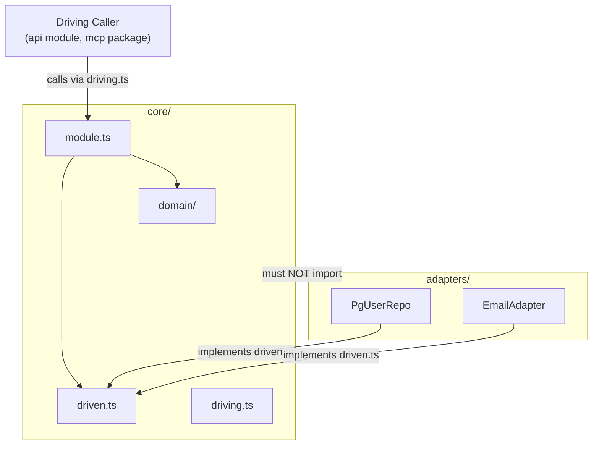

Every backend module in this codebase follows the same internal layout: a **core ring** containing all business logic, a surrounding **adapter ring** of concrete implementations, and a single public entry point. The shape comes from hexagonal architecture (also called ports-and-adapters), but the specific names, directory paths, and enforcement mechanisms are all project decisions — not generic hexagonal conventions. This page explains each layer, why it looks the way it does, and the rules that keep it intact.

## The Two-Ring Layout

Each module (`engine`, `tutor`, `llm`, `identity`, etc.) has this shape on disk:

```
<module>/
  core/
    driving.ts    ← driving contract (what callers can ask this module to do)
    driven.ts     ← driven contracts (what this module asks from infrastructure)
    module.ts     ← orchestration — wires domain + driven contracts together
    domain/       ← pure rules, projections, value types; no I/O
  adapters/
    pg-*.ts       ← driven adapters: Postgres repos, external services, etc.
  index.ts        ← public entry point; re-exports only
```

The **core ring** — everything under `<module>/core/` — is the inside of the hexagon. It contains domain rules, the interfaces the module exposes (`driving.ts`), and the interfaces the module *needs from* infrastructure (`driven.ts`). Crucially, nothing inside the core ring imports anything from `adapters/`. That single rule is the hexagonal boundary.

The **adapter ring** contains concrete implementations of the driven contracts: Postgres repositories, file-system bindings, third-party service clients. Adapters depend *inward* on the core (they implement an interface defined in `driven.ts`); the core never reaches *outward* to them.



### Why one directory, not a file list

Earlier versions of the rule named the core as a list of specific files (`domain/`, `ports.ts`, `module.ts`). That made enforcement fragile — every time a new file was added to the core, a dependency-cruiser rule had to be updated by hand. Collecting the core under one directory (`<module>/core/`) means the check is a single path pattern: anything under `core/` must not import anything under `adapters/`. It covers files nobody has written yet, automatically.

### Naming: driving.ts and driven.ts

The contract files were previously called `api.ts` and `ports.ts`. Neither name indicated direction. `api` collided with the top-level `api` module name. `ports.ts` sounded like "all the ports" but held only the outbound half.

The new names reuse the vocabulary that the rules and ADRs already speak — "driving surface" and "driven ports" — so there is only one word pair across the whole codebase. The practical cost is that `driving.ts` and `driven.ts` differ by three characters and can be misread. That cost is bounded: a dependency-cruiser rule forbids the two files from importing each other, so picking the wrong one fails CI immediately.

### domain/ may freely import driven.ts

A common misreading of hexagonal architecture is that `domain/` must not import anything outside itself, including the port interfaces in `driven.ts`. This project does not take that position. The driven contracts live *inside* the hexagon — they are part of the core ring — so `domain/` is free to import `core/driven.ts`. What `domain/` must never import is `adapters/`.

Forbidding `domain/ → driven.ts` is the stricter *functional core / imperative shell* style. It is a valid choice, but it is not the choice made here.

## The Leaf-Adapter Rule

The core/adapters split defines where code lives. A second rule defines what an adapter *is*:

> A driven adapter implements **exactly one** driven contract, holds no other port as a dependency, and contains no decision that could be written without I/O.

Think of an adapter as a thin translation layer — it speaks the language of an external system (SQL, HTTP, a file path) and nothing else. Orchestration — deciding *which* adapters to call, and in what order — belongs in `module.ts`. Domain rules belong in `domain/`. An adapter that starts accumulating logic is an adapter that has taken on a role that belongs somewhere else.

This rule and the core-no-adapters rule are recorded together for a reason: recording only the first is what let the second drift. The `identity` module conforms to both and is the reference implementation. `metering` violated the first clause (importing its own adapter into the core) until corrected.

### Why the adapter ring only holds driven adapters

The `adapters/` directory contains driven (outbound) adapters only. There is no driving (inbound) adapter inside a module. The driving side lives outside the module entirely: the `api` module's Fastify routes for the application, or the `mcp/` workspace package for the engine PoC.

This is true across all four modules with real content and was true from the first module, but it went unwritten until recently. The cost of leaving it unstated: a reader familiar with hexagonal architecture opens `adapters/`, sees only repositories, and concludes the layout is incomplete. It is not — the asymmetry is structural and consistent. It follows from the monolith topology: the driving side is always another module or another package, never a nested directory of the module being driven.

## Enforcement: dependency-cruiser and ESLint

Two separate tools enforce the two separate invariants, because neither tool can enforce what the other one checks.

### dependency-cruiser (file-granularity rules)

`app/.dependency-cruiser.cjs` is the machine-readable architecture for this project. A PR that changes an allowed edge is by definition an architecture change and must cite an ADR.

The config encodes four rule families:

| Rule | What it checks |
|---|---|
| `engine-no-upward-deps` | The domain core imports nothing from orchestration or edge modules |
| `declared-edges-only` | Any undeclared cross-module import is an error |
| `no-deep-cross-module-imports` | A module is reachable only through its `index.ts` |
| `core-no-adapters-import` | Nothing under `<module>/core/` imports `<module>/adapters/` |

Run in CI as `depcruise:check`. The config is only meaningful if it actually fails on violations — the CI gate was verified by planting a deliberate forbidden import and confirming the build went red.

#### What dependency-cruiser cannot check

`dependency-cruiser` reasons at file granularity: it sees that file A imports file B, nothing more. The leaf-adapter rule — "this adapter holds only one port" — is a *symbol-granularity* rule. Every adapter legitimately imports the same `driven.ts` file regardless of how many ports it holds as a dependency. A clean `depcruise` run cannot tell the difference between a leaf adapter and an adapter that secretly holds three ports. For three consecutive issues, a clean `depcruise` run was read as proof of a healthy boundary when it could never have detected the defect.

There is one technique that can move a symbol-granularity concern into file-granularity: put the two sides in separate files. Once `driving.ts` and `driven.ts` are distinct files, "these two contracts must not mirror each other" becomes "these two files must not import each other" — a rule a path-based tool can express. That mutual-import rule ships as two `from`/`to` entries (one per direction) because a single entry only checks one direction.

### ESLint AST rule G-21 (leaf-adapter enforcement)

Because `dependency-cruiser` cannot express the leaf-adapter rule, it is enforced by an ESLint `no-restricted-syntax` rule (G-21) scoped to `server/src/*/adapters/**/*.ts`. The rule flags any class property, constructor parameter property, or deps-interface field whose type name ends in `Port`, `Repository`, or `Store`. Implementing a port is a `TSClassImplements` node and is untouched — an adapter may still declare the interface it satisfies; it simply may not *hold* one as a dependency.

G-21 carries a stated blind spot: it keys on the naming suffix convention. A port type named outside those three suffixes is invisible to it. The naming convention is therefore load-bearing, not cosmetic.

## ESLint Flat Config Gotchas

The project uses ESLint flat config (`eslint.config.js`). Two related bugs bit the `no-restricted-syntax` blocks during development and are worth knowing.

### Silent merge-back on severity-only override

When a later config block sets a rule to a value that contains no options — for example `['error']` or `['error', ...[]]` where the spread is empty — ESLint's config-array merge *does not clear* the earlier block's options. It keeps the earlier options and only swaps the severity. The later block appears to override the rule but silently inherits the earlier block's selectors back.

This hit `engine-poc/mcp/eslint.config.js` when an override computed its `no-restricted-syntax` value as a base list minus one selector, which happened to be empty at that point, collapsing to severity-only and re-inheriting the selector it was trying to remove.

**Fix:** exclude the file from the earlier block via `ignores: ['path/to/file.ts']` instead of relying on a later block to override. That way no cross-block merge is attempted at all.

### ignores exempts from the whole block, not one selector

The fix above has its own cost. In ESLint flat config, `ignores` operates at block level: it excludes matching files from *every* rule the block sets, not from one selector inside a combined rule. If a shared block bundles several `no-restricted-syntax` selectors together, adding a file to that block's `ignores` to spare it from one selector silently exempts it from all of them.

This happened in `app/eslint.config.js`: an `ignores` entry added for one selector's sake later silently dropped a second selector added to the same block — missed by two review passes.

**Fix:** never widen a shared block's `ignores` to solve one selector's exemption. Instead, leave the shared block's `ignores` untouched and add a separate trailing block for the files needing different treatment, restating whichever selectors should still apply there.

## Barrel-only index.ts

Every module's `index.ts` must contain re-exports only — no schemas, classes, interfaces, or factory functions defined inline. All implementation lives in dedicated sibling files that `index.ts` re-exports. This was discovered as a gap at Sprint 1 review, when several modules (`contracts`, `errors`, `logger`, `persistence`, `metering`, `llm`, and others) were found defining real logic directly in their `index.ts`.

```ts
// ✅ correct — index.ts is a barrel
export { createLlmGateway } from './gateway';
export type { LlmPort } from './core/driven';

// ❌ wrong — logic defined inline in index.ts
export function createLlmGateway(deps: Deps) { … }
```

The rule applies strictly: module factory functions are included. Exemptions: the process entry point `server/src/index.ts` and empty placeholder stub barrels. Enforced by a CI fitness function.

## Composition Root: Explicit Factory Wiring

At boot, every module's public factory (e.g. `createLlmGateway(deps)`, `createMeteringModule(deps)`) is wired together by hand in one composition root — `server/src/composition.ts`. The project does not use a DI container with decorator- or reflection-based auto-wiring.

The reason is the same "explicit over magic" principle that drove other decisions in this codebase: a container hides the dependency graph exactly where the modular monolith's boundary discipline needs it to be visible. When you read `composition.ts`, you see the full wiring in one place. When auto-wiring assembles it invisibly, violating a boundary has no visible consequence until something breaks at runtime.

## Test Placement

The core/adapters boundary applies to test files too. A path-based check cannot distinguish a test file from a source file, and should not — the exemption would be the hole in the boundary.

An **integration test** that constructs real adapter objects (e.g. a `PgUserRepository` against a real database) cannot live inside `core/` — it would import from `adapters/`, tripping the `core-no-adapters-import` rule. So the unit test and the integration test of the same subject part company:

- `core/module.test.ts` — lives with the file it tests, inside the core ring
- `module.integration.test.ts` — lives outside the core ring, as a sibling of `adapters/`

Vitest already separates the two suffixes into different runs, so this split follows an existing seam rather than creating a new one.

## The persistence Module Exception

The `persistence` module is a pure adapter module with no internal hexagonal layering. Its `domain/`, `ports.ts`, and `adapters/` scaffold was deleted, leaving only `pool.ts` and a re-export `index.ts`.

The deciding argument: the module's sole job is constructing a `pg.Pool` and handing it to other modules. No one could name the future work that would populate `persistence/domain/`. A stub comment saying *"intentionally empty until a later issue adds real business rules"* was a false promise — it told every future reader to wait for something that was never coming.

This is explicitly not a precedent for removing stubs elsewhere. Around thirty placeholder files exist across other modules (`engine`, `tutor`, `pedagogy`, etc.) where the matching business logic genuinely lands in a later sprint — those stubs stay. The persistence deletion is a two-way door: if a genuine port ever emerges, the folder comes back in one commit.

:::note
`persistence` joins `api` and `jobs` on the documented exemption from having a `domain/` folder. The "empty barrel is exempt from R-24" clause in the barrel-only rule survives and is still needed for the remaining 27 placeholder stubs in other modules.
:::
