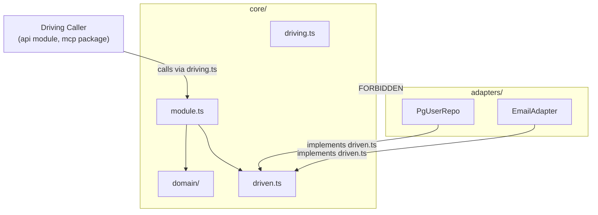
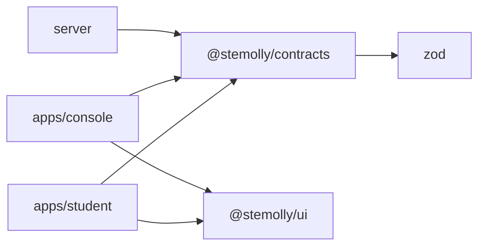
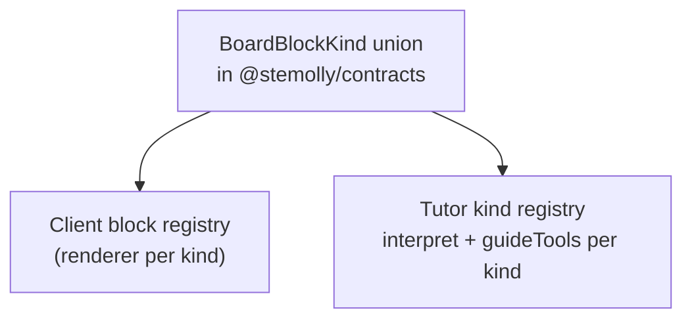

Two topics live on this page. The first is the internal shape of every backend module: a two-ring hexagonal layout with a set of invariants enforced by dependency-cruiser rules and ESLint fitness functions. The second is how code is shared across module and app boundaries through two dedicated packages — `@stemolly/contracts` for data schemas and types, and `@stemolly/ui` for frontend components.

## The Two-Ring Layout

Each module (for example `engine`, `tutor`, `llm`, `identity`) is divided into two rings.

```
<module>/
├── core/           ← inner ring: pure logic, no I/O
│   ├── driving.ts  ← driving contract (how callers invoke this module)
│   ├── driven.ts   ← driven contracts (interfaces the module needs from infrastructure)
│   ├── module.ts   ← orchestration: wires domain logic with driven ports
│   └── domain/     ← pure rules and domain types
├── adapters/       ← outer ring: concrete implementations (Postgres repos, harness bindings, etc.)
└── index.ts        ← the only file other modules may import
```

The core ring lives inside one directory — `<module>/core/` — for a specific reason: enforcement. When the core is one directory, the inward-only rule is one path pattern. Earlier, the core was described as a list of files (`domain/`, `ports.ts`, `module.ts`), which required one dependency-cruiser rule per file, hand-maintained, and broken every time a new core file was added. As one directory, the rule covers core files that do not exist yet.

## The Inward-Only Invariant

The most important rule: **nothing in the core ring imports from the adapter ring**. Adapters are constructed in `composition.ts` and injected inward, never pulled in from the core.

This rule has two halves that must be stated together, because recording only one is what allowed the other to drift.

**Half 1 — core never imports adapters.** This is expressed as the `core-no-adapters-import` dependency-cruiser rule. Earlier, the narrower `domain-no-adapters-import` rule covered only `domain/`; the module orchestration file `module.ts` sat outside it and could freely import adapters with the check green. The `identity` module did exactly that and passed every gate — demonstrating that the rule was too narrow. After it was widened to cover `^src/(<module>)/core/`, identity was fixed and is now the reference implementation. `metering` currently violates the invariant by importing its own adapter into `module.ts`.

**Half 2 — an adapter is a leaf.** A driven adapter implements exactly one port, holds no other port as a dependency, and contains no decision that could be written without I/O. Orchestration across ports belongs in `module.ts`; business rules belong in `domain/`. The `identity` module conforms to both halves and is the reference implementation.

:::note
The `metering` module still violates Half 1 as of the last audit — it imports its own adapter inside `module.ts`. Use `identity` for reference, not `metering`.
:::



### Why Half 2 Cannot Use dependency-cruiser

Every adapter legitimately imports the same `driven.ts` file — to declare the port it implements. So the violation (holding *two* ports) and the correct case (holding one) look identical to a file-level import graph tool. Dependency-cruiser cannot distinguish them.

The leaf-adapter rule is enforced instead by an ESLint AST rule (G-21). A clean `depcruise` run is therefore not evidence that the leaf invariant holds — it was never checkable that way.

### One Nuance: domain/ May Import driven.ts

`core/domain/` may freely import `core/driven.ts`. This sometimes surprises people who know a stricter variant of hexagonal architecture called "functional core / imperative shell", where domain code may not touch port interfaces at all. That is a separate, stricter choice that Stemolly deliberately did not adopt. In standard ports-and-adapters, port interfaces *define* what the core needs — they live inside the hexagon, not outside it.

A practical consequence: shared record types are declared once in `domain/` and imported outward by `driven.ts`. Duplicating a type across both files creates a seam that only type-checks by coincidence, with nothing to catch drift when one side changes.

## Contract File Names: driving.ts and driven.ts

The two contract files are named `core/driving.ts` and `core/driven.ts`. These replaced `api.ts` and `ports.ts`.

- `ports.ts` read as "all the ports" but held only the outbound half.
- `api.ts` collided with the `api` module's own name.
- `inbound.ts` / `outbound.ts` was considered and rejected — the ADR corpus and rule set already say "driving surface" and "driven ports" throughout, so a second word pair would leave two vocabularies for one concept.

The known cost: `driving.ts` and `driven.ts` differ by three characters and are easy to misread. This cost is bounded: the two files are forbidden from importing each other by a dependency-cruiser rule, so grabbing the wrong one fails CI immediately.

Splitting the driving contract and driven contracts into separate files also serves enforcement. The rule "these two must not mirror each other" becomes "these two files must not import each other" — exactly the shape a path-based tool can express as a mutual pair of forbidden paths.

## Driven Adapters Are Always Outbound

The `<module>/adapters/` directory holds **driven (outbound) adapters only** — Postgres repositories, file-based email, LLM harness bindings. The driving (inbound) side is never placed there. It is the `api` module's Fastify routes for the app, or the `mcp/` workspace package for the engine proof-of-concept.

This is consistent across every module with real content (`identity`, `metering`, `llm`, `engine`) and was true from the first module. It was left unwritten until recently — which had a cost. A reader who knows hexagonal architecture opens a module, sees a directory called `adapters/`, and expects both sides; finding only repositories, they conclude something is missing. The directory is not missing anything. The asymmetry is structural. There is no CI check for it — nothing can distinguish a driving adapter from a driven one automatically — so it stays review-enforced.

:::tip
A driven port is named and shaped by what the **core needs from infrastructure**, never by how a caller invokes the module. A driving method and a driven port method having the same shape is always a coincidence, not a requirement.
:::

## The index.ts Barrel Rule

Every module's `index.ts` must contain **re-export statements only**. No schemas, classes, interfaces with logic, or factory functions may be defined inline. All implementation lives in dedicated sibling `.ts` files; `index.ts` re-exports them.

This was decided after a Sprint 1 review found multiple modules (`contracts`, `errors`, `logger`, `persistence`, `metering`, `llm`, `api`) defining real logic directly in their `index.ts`. The rule is enforced by a CI fitness function.

```ts
// ✅ correct — index.ts is a re-export barrel
export { createLlmGateway } from './gateway';
export type { LlmPort } from './core/driven';

// ❌ wrong — logic defined inline in index.ts
export function createLlmGateway(deps: Deps) { /* ... */ }
```

Two exemptions exist:
- The process entry point `server/src/index.ts`.
- Empty stub barrels in modules whose real code lands in a later sprint — these preserve reserved space and are exempt while the stubs are still accurate promises.

## Enforcement: dependency-cruiser as the Architecture Record

`app/.dependency-cruiser.cjs` is the machine-readable architecture. Changing an allowed edge in that file is by definition an architecture change and must cite an ADR. The config encodes:

| Rule | What it checks |
|---|---|
| `engine-no-upward-deps` (R-1) | Domain core imports nothing from orchestration or edge modules |
| `declared-edges-only` | Any undeclared cross-module import is an error |
| `no-deep-cross-module-imports` (R-3) | A module is reachable only through its `index.ts` |
| `core-no-adapters-import` | Nothing under `<module>/core/` imports `<module>/adapters/` |

The config runs in CI via `depcruise:check`. The negative case — CI going red on a deliberate violation — is what proves each gate actually bites.

### What dependency-cruiser cannot check

Dependency-cruiser reasons at file granularity. The leaf-adapter rule (Half 2 above) is a symbol-granularity rule: every adapter imports the same `driven.ts` regardless of how many ports it holds. A clean `depcruise` run cannot prove the leaf invariant holds — the violation and the correct case look the same to the tool.

There is one technique that converts a symbol-granularity rule into a file-granularity one: put the two sides in separate files. Once `driving.ts` and `driven.ts` are distinct files, "these two contracts must not mirror each other" becomes "these two files must not import each other" — a rule a path tool can enforce. That mutual-import rule ships as two `from`/`to` entries, one per direction, because a single entry only checks one direction.

## Special Case: Pure Adapter Modules

Some modules have no internal hexagonal layering at all. The `persistence` module's `domain/`, `ports.ts`, and `adapters/index.ts` were deleted, leaving only `pool.ts` and a re-export-only `index.ts`. The module's charter is constructing one database connection pool and handing it to other modules — there is no domain logic to protect.

The deciding argument was that no one could name the future work that would populate `persistence/domain/`. A stub comment saying *"intentionally empty until a later issue adds real business rules"* was a false promise, directing every reader to wait for something that was never coming.

The `api` and `jobs` modules are also explicitly exempted from having a `domain/` folder — their charter is "no domain logic."

:::caution
This is **not** a precedent for removing stubs elsewhere. About thirty placeholder files exist across ten other modules (`engine`, `content`, `pedagogy`, `tutor`, `judge`, …). For those modules, the stubs are true promises: their real code lands in later sprints.
:::

## Where Integration Tests Live

The inward-only rule applies to all files under `core/` — including test files. A path-based check cannot exempt tests, and should not; the exemption would be the hole.

An integration test that wires real `Pg*Repository` instances against a real database cannot sit inside `core/`. It would import from `adapters/`, tripping the rule correctly.

The unit test and the integration test of the same subject part company:

- `core/module.test.ts` — stays next to `module.ts` inside `core/`
- `module.integration.test.ts` — lives outside `core/`, as a sibling of the `adapters/` directory

The project's vitest configuration already separates these two suffixes into different test runs, so the split follows an existing seam.

## ESLint Flat-Config Pitfalls

The `no-restricted-syntax` rules enforcing G-21 and others are written in ESLint flat config. Two non-obvious pitfalls have each caused real bugs.

### Silent option inheritance on severity-only overrides

When a later config block sets a rule to a severity-only value — for example `['error']`, or `['error', ...someEmptyArray]` — the config-array merger keeps the *earlier* block's options rather than clearing them. Only the severity is swapped. A later block fully replaces an earlier one only when it carries its own options.

This caused an override in `engine-poc/mcp/eslint.config.js` to silently re-inherit the selector it was trying to suppress, defeating the override entirely. The safe fix is to exclude the file from the earlier block via `ignores` rather than relying on a later block to clear the rule.

### ignores exempts the whole block, not one selector

`ignores` operates at the block level. Adding a file to a block's `ignores` excludes it from every selector in that block's combined rule value — not just the one you intended to spare.

This caused problems three times in the same issue. Adding `**/*.test.ts` to an `ignores` entry meant only to spare test files from one new selector silently dropped the pre-existing selectors from those test files too. A third instance was missed by both review passes and caught only in outer-loop review.

**Fix:** never widen a shared block's `ignores` to solve one selector's exemption. Instead, add a dedicated trailing block scoped to the files needing different treatment, and explicitly restate the selectors that should still apply there.

## Wiring at Boot: Explicit Factories, No DI Container

Modules expose public factory functions — for example `createLlmGateway(deps)` or `createMeteringModule(deps)`. The server composition root calls these by hand to wire everything together at boot. There is no dependency-injection container with decorator or reflection-based auto-wiring.

Explicit factories were chosen to keep the dependency graph visible. A DI container hides exactly what the modular monolith's boundary discipline needs to be readable: who depends on whom, in what order, with what arguments.

:::tip
Governance identifiers such as `ADR-021` or `R-14` belong in **docblocks**, never in runtime error messages or log lines. Those strings reach operators and agents who do not hold the design documents. They also rot silently — decisions are designed to be superseded, so an embedded identifier eventually points at a rule that no longer governs. Put the rule's *content* in the message (`must match /^[a-z][a-z0-9-]*$/`) and the citation in the docblock.
:::

---

## Shared Packages

Two packages in `app/packages/` are shared across build targets. `@stemolly/contracts` carries the data schemas and types that both the server and clients depend on. `@stemolly/ui` carries the frontend components that both the Student app and the Console app use.



### @stemolly/contracts

`packages/contracts` exports the shared schemas and types for the whole monorepo: error envelopes, study anchors, board payloads, tutor turns, session close requests, and assignment list items. The package depends only on Zod and builds those definitions in isolation.

The pattern has two consumers following different conventions. Server routes generate HTTP JSON Schemas directly from the Zod definitions. Shipped clients import the inferred TypeScript types. One deliberate exception: the operator plugin mirrors one board contract without importing the package.

### @stemolly/ui

`app/packages/ui` is a private workspace package named `@stemolly/ui`. It is the **only home** for any UI component shared between the Student app and the Console app (ADR-058). A component that is genuinely app-private stays local to that app.

Both apps import components from `@stemolly/ui` and both import `@stemolly/ui/tokens.css` from their app entrypoints. The package exposes two entry points:

- **`src/index.ts`** — a re-export-only barrel exposing component barrels and the icon API. This follows the repo-wide barrel convention: no implementation inline.
- **`./tokens.css`** — a separate stylesheet entrypoint.

The shared layer is **mechanism, not product prose**. Copy and user-facing strings belong in each app's own `strings/` seam, not embedded into shared components.

#### Styling: CSS Modules and design tokens

Components are styled with co-located `*.module.css` files. There is no CSS-in-JS library or utility-class framework.

The token entrypoint `src/tokens/styles.css` fans into color, typography, spacing, effects, and base token files. Components consume values via CSS custom properties such as `--color-primary`, `--surface-card`, and `--space-*`. Pseudo-classes like `:hover` and `:focus-visible` move into the CSS Module; genuinely per-instance values stay on explicit `style` props. Icons inherit `currentColor` so colour stays token-driven without a freeform colour prop.

#### Component API conventions

Shared components declare explicit, narrow prop interfaces. Arbitrary DOM props are not forwarded wholesale; even `data-testid` test hooks are whitelisted property-by-property.

Stateful selectors (`NavRail`, `Tabs`, `ThemeSwitch`) offer both controlled (`value` + `onChange`) and uncontrolled (`defaultValue`) modes. The `onChange` callback returns a domain value — not a raw DOM event.

Accessibility wiring is centralized through `FieldShell` and `useId` so that every form primitive automatically gets `htmlFor` on its label, `aria-describedby` pointing to error or hint text, and `aria-invalid` on an errored field. The `Icon` primitive is decorative by default and becomes an announced image only when a label is supplied.

#### The learning subpackage

`components/learning` exports domain-shaped primitives for tutoring UI: `BeliefGraph`, `BeliefNode`, `BeliefStateLegend`, `ChatBubble`, `ThemeSwitch`, and `WhiteboardCard`/`WhiteboardNote`, plus belief-state constants.

These components encode tutoring concepts in their APIs — graph nodes sit at percentage positions, edges can be tentative, chat turns distinguish `tutor` and `student` — but they stay presentational: they accept data and callbacks through props and import neither frontend state containers nor backend modules. They provide a shared visual vocabulary for learning workflows without moving learning logic into the UI package.

### Board kinds: one name, three contributions

A board block kind touches two build targets and three code locations. Adding a kind means contributing to all three — which is why it is modelled as one name driving three exhaustive registries, not as a plugin or manifest loaded at runtime.

A kind is one name in the `BoardBlockKind` union in `@stemolly/contracts`. From that name, three contributions are required:

1. **Data shapes** — declared in `@stemolly/contracts` alongside the union.
2. **A renderer** — one entry in the client-side block registry.
3. **A server module** — one file per kind in the tutor module's kind registry, exporting `{ interpret, guideTools }`.



Both registries are exhaustive maps over the union. Adding a name fails both builds until every registry has an entry. A contribution that is not needed declares `'none'` explicitly rather than being absent — absence cannot be distinguished from a forgotten entry.

A dynamic plugin loader was considered and rejected. A plain map lookup does the same work and moves the "you forgot a piece" error from runtime to compile time.

The shipped union starts at `statement | choice`. `ink`, `photo`, `math`, and `annotation` join it when each is built. Two kinds were renamed at launch: `crop` became `statement` (because `crop` names the ingest artifact, not the board concept), and `strokes` became `ink` (the domain term, which also covers drawing and does not collide with the Guide's own marks).

