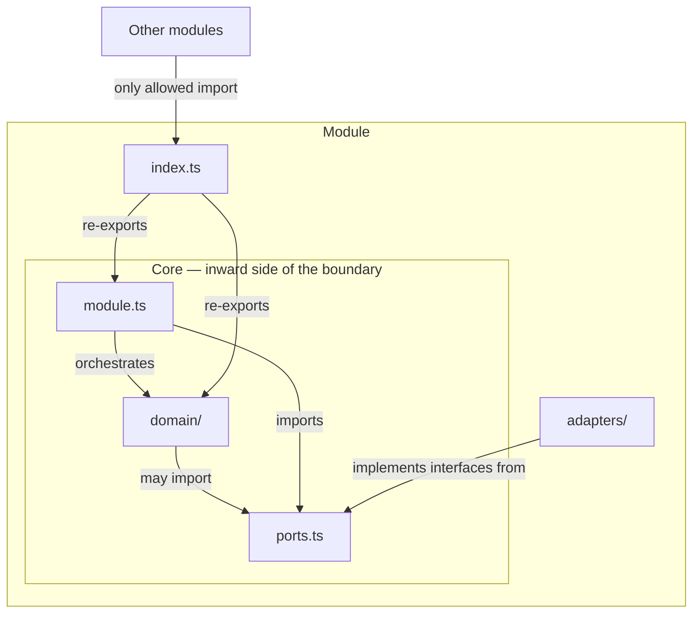

Every backend module in the server follows the same internal shape. Business logic lives in `domain/`, its dependency interfaces are declared in `ports.ts`, concrete implementations (Postgres repos, harness bindings) live in `adapters/`, and a single `index.ts` barrel is the only file other modules may import. This is hexagonal architecture — also called *ports and adapters* — applied at the module level.

The rules below are not guidelines. They are machine-enforced in CI and changing an allowed import edge requires an ADR.

---

## Anatomy of a module

Here is the standard layout for a domain-carrying module such as `engine` or `llm`:

```
server/src/<module>/
├── domain/          ← business logic: projections, rules, value objects
├── ports.ts         ← interfaces the core needs from infrastructure
├── adapters/        ← concrete implementations (Postgres repos, harness bindings, …)
├── module.ts        ← orchestration and application wiring
└── index.ts         ← re-exports only — the module's public surface
```

Think of the module as two zones split by a hard boundary:



Each part has a clear charter:

- **`domain/`** holds code that is purely about the problem. No database calls, no HTTP, no I/O — pure functions and types.
- **`ports.ts`** declares the interfaces that `domain/` and `module.ts` need from the outside world — a `LessonRepository`, an `LlmGateway`, and so on. Think of it as the socket that infrastructure must plug into.
- **`adapters/`** contains the plugs — one file per concrete technology that satisfies a port. An adapter is a **leaf** (more on this below).
- **`module.ts`** orchestrates: it receives adapters already constructed, calls `domain/` functions, and coordinates across ports.
- **`index.ts`** re-exports the public API. Nothing more.

---

## The core–adapter boundary

**The core — `domain/`, `ports.ts`, and `module.ts` — must never import from `adapters/` in the same module.** Adapters are constructed in `composition.ts` and injected; the core does not reach for them.

This is the first clause of ADR-023. It matters because the direction of dependency determines who controls whom. Adapters depend on port interfaces the *core* defines; if the core imports adapters, the dependency arrow reverses and the core becomes coupled to infrastructure.

One thing worth calling out: **`domain/` may freely import `ports.ts`**. Ports are interfaces the core defines — they live inside the hexagon boundary, not outside it. Forbidding `domain/ → ports.ts` would be a different pattern called *functional core / imperative shell*, which this project did not adopt.

A second consequence: shared record types — for example, a `Lesson` shape — are declared once in `domain/` and imported outward by `ports.ts`. Declaring the same shape in both layers means the type-checker only agrees by coincidence (TypeScript's structural typing). If one side changes, nothing catches the drift.

:::caution[A past mistake to know]
An early `dependency-cruiser` rule called `domain-no-adapters-import` encoded only a narrow version of this rule: its `from` clause was scoped to `domain/`, so a module-root file like `module.ts` could import its own adapters and every gate stayed green. The `identity` module did exactly that before the rule was widened to cover the whole core — `domain/`, `ports.ts`, and `module.ts`.
:::

---

## Adapters are leaves

The second clause of ADR-023 concerns what an adapter is allowed to *be*. An adapter must be a **leaf**:

1. It implements **exactly one port**.
2. It holds **no other port** as a constructor dependency — no field typed as `*Port`, `*Repository`, or `*Store`.
3. It contains **no decision** that could be written without I/O. If logic is expressible in pure code, it belongs in `domain/`.

Orchestration — calling two repositories and merging their results — belongs in `module.ts`. Business rules — "never downgrade a catalog item on reseed" — belong in `domain/`. An adapter that starts coordinating across ports absorbs responsibility that should stay in the core, and becomes harder to replace when the underlying technology changes.

The two clauses are recorded together as ADR-023 because recording only the first is what allowed the second to drift unnoticed. The `engine` module honoured clause 1 while violating clause 2. The `metering` module did the reverse — it imported its own adapter into `module.ts`. The `identity` module now conforms to both clauses and is the named reference implementation for future reviews.

---

## Barrel-only `index.ts`

Every `index.ts` is a **barrel** — a file that only re-exports from sibling files. No schemas, no classes, no factory functions may be defined inline.

```ts
// ✅ Correct — index.ts re-exports only
export { createLlmGateway } from './llm-gateway';
export type { LlmPort } from './ports';

// ❌ Wrong — implementation defined directly in index.ts
export function createLlmGateway(deps: Deps): LlmPort {
  // ...
}
```

This rule was added after a Sprint 1 review found multiple modules — `contracts`, `errors`, `logger`, `persistence`, `metering`, and `llm` among them — defining real logic directly in their `index.ts` files. The `server/src/index.ts` process entry point and empty placeholder stubs are explicitly exempt.

---

## Composition root: explicit factories, no DI container

Server bootstrap wires every module together by hand in one composition root, calling explicit factory functions:

```ts
// composition.ts (simplified)
const pool = createPool(config.db);
const llm = createLlmGateway({ httpClient });
const metering = createMeteringModule({ db: pool });
const engine = createEngineModule({ llm, metering, db: pool });
```

No decorators, no reflection, no auto-wiring. Each factory — `createLlmGateway(deps)`, `createMeteringModule(deps)` — is a plain function that receives its dependencies and returns the module's public API.

This was a deliberate choice: a DI container hides the dependency graph inside metadata, exactly where the modular monolith's boundary discipline needs it to be visible. The same "explicit over magic" principle already drove the choice of the in-house harness over LangChain, and Fastify over Next.js — the composition root follows that consistent pattern.

---

## How the boundaries are enforced

Two tools share this job. They operate at different granularities and cover different things.

### dependency-cruiser — file-level boundaries (G-1)

`app/.dependency-cruiser.cjs` is the **machine-readable module architecture**. A PR that changes an allowed edge in this file is, by definition, an architecture change and must cite an ADR (governance rule G-11). The file runs in CI as `depcruise:check`.

The rules relevant to module structure are:

| Rule | What it checks |
|------|----------------|
| `engine-no-upward-deps` | The domain core imports nothing from orchestration or edge modules (R-1) |
| `declared-edges-only` | A module may only import from modules listed in its allowed edges |
| `no-deep-cross-module-imports` | A module is reachable only through its `index.ts` (R-3) |
| `domain-no-adapters-import` | The full module core does not import its own `adapters/` |

### ESLint — symbol-level leaf check (G-21)

`dependency-cruiser` works at file-import granularity. It cannot detect the leaf-adapter violation: every adapter legitimately imports the same `ports.ts` file, so an adapter holding two port-typed fields looks clean to the tool. The violation only becomes visible when you look at which *symbols* a class holds as constructor dependencies — and for three consecutive issues, a clean `depcruise` run was read as evidence of a healthy boundary when it could never have detected the defect.

Fitness function **G-21** fills this gap. It is an ESLint `no-restricted-syntax` rule scoped to `server/src/*/adapters/**/*.ts` that flags any class property, constructor parameter, or dependency-interface field whose type name ends with `Port`, `Repository`, or `Store`. Implementing a port is allowed — only *holding* one is not.

```ts
// G-21 flags this:
constructor(
  private readonly lessonRepo: LessonRepository, // ❌ holds a port
  private readonly catalog: CatalogPort,          // ❌ holds a port
) {}

// G-21 permits this:
class PostgresLessonRepo implements LessonRepository { … } // ✅
```

:::note[G-21's stated blind spot]
G-21 keys on the `Port` / `Repository` / `Store` naming suffixes. A port type named outside those three suffixes is invisible to it. The naming convention is **load-bearing**, not cosmetic — if you add a new port interface, it must end in one of those suffixes for the rule to cover it.
:::

---

## When a module has no `domain/` folder

Not every module needs a full hexagonal scaffold. **Pure adapter modules — `api`, `jobs`, and `persistence` — have no `domain/` folder.** Their charter is to connect, not to reason.

`persistence` is the clearest example. Its entire job is constructing one `pg.Pool` and handing it to other modules. During Sprint 3 the original `persistence/domain/`, `persistence/ports.ts`, and `persistence/adapters/` scaffold was deleted. No one could name the work that would ever populate it. The stub comment *"intentionally empty until a later issue adds real business rules"* was a false promise — it told every future reader to wait for something that was never coming. The module now contains only `pool.ts` and a barrel `index.ts`.

**This is not a general precedent.** About thirty placeholder stubs exist across modules like `engine`, `content`, `pedagogy`, and `tutor`. For those the stubs are genuine reservations of space for code that arrives in later sprints — the comment is true, so the stubs stay.

---

## Convention: rule citations belong in docblocks, not error messages

When you write a `throw` site that enforces a module-structure rule, put the rule's *content* in the message and the rule's *identifier* in the docblock above the code.

```ts
// ✅ Correct
/**
 * @see ADR-023 — core must not import adapters
 */
throw new Error('dependency must be injected, not imported directly');

// ❌ Wrong
throw new Error('ADR-023: dependency must be injected, not imported directly');
```

An identifier like `ADR-023` in a log line or API response reaches an operator or a calling service — neither of whom holds the document. The identifier also rots silently: ADRs are designed to be superseded, so an embedded citation can eventually point at a decision that no longer governs, and no test will catch the drift. Put the actionable explanation in the message; put the citation where maintainers read it.
