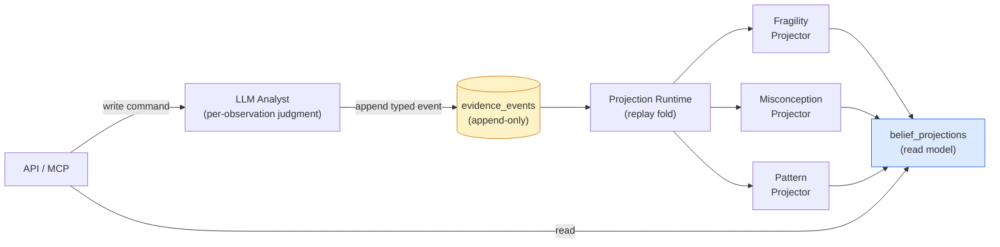
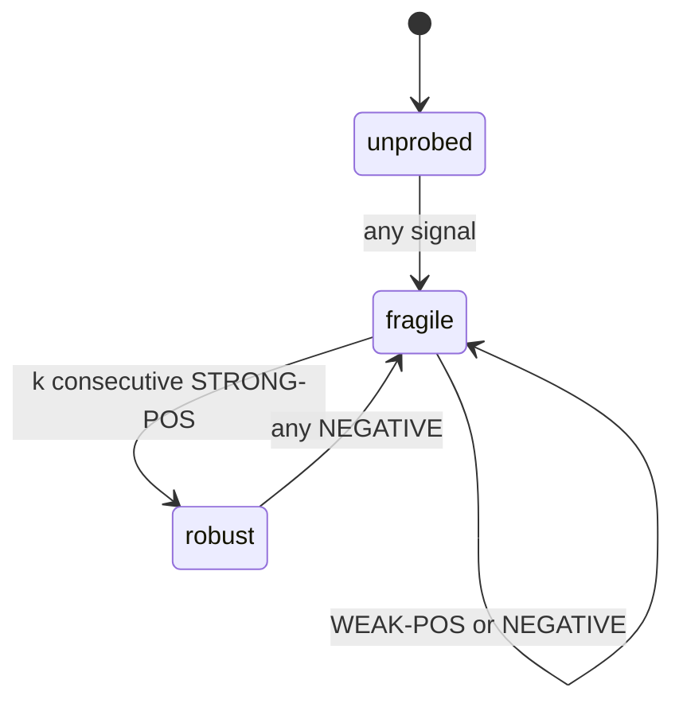
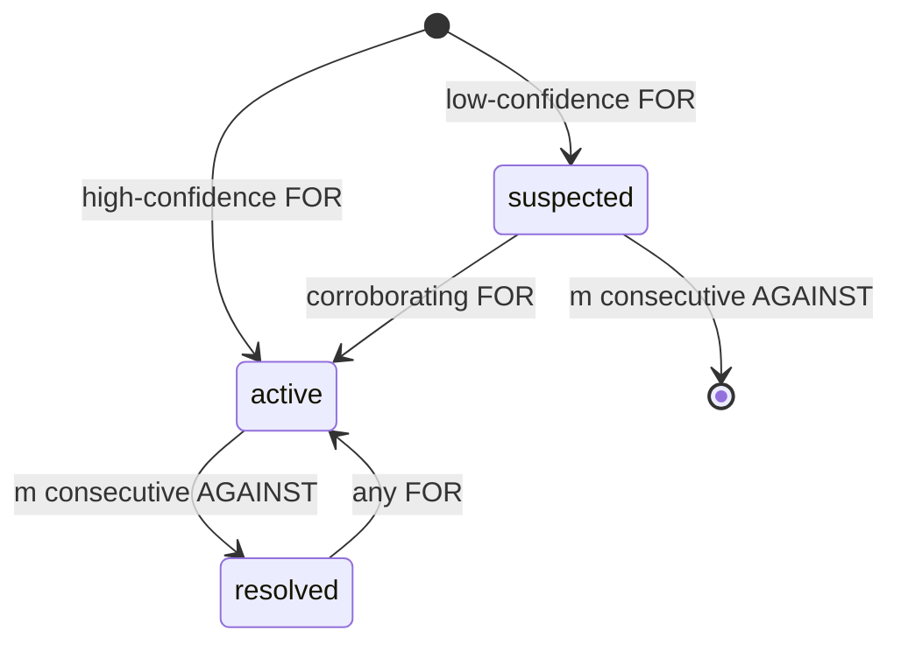
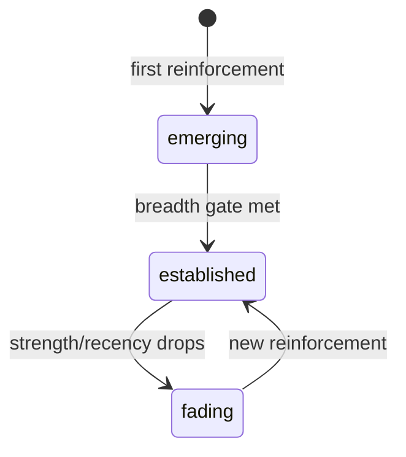
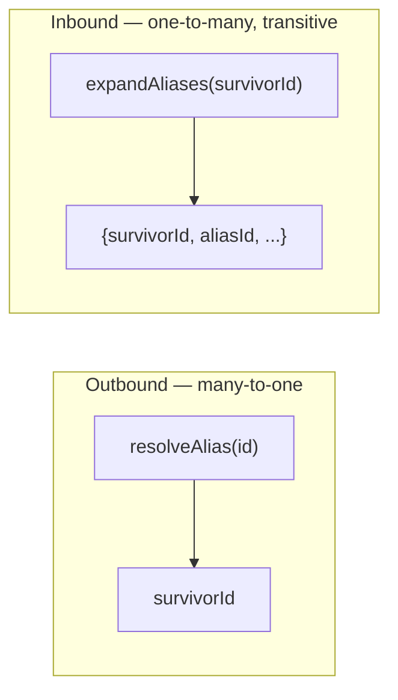

The Stemolly engine derives a student's belief state — what misconceptions they hold, how fragile their understanding is, what reasoning habits they show — from a permanent, append-only record of observations. No belief is ever written directly; every belief is *computed* from that record. This page explains how that works: the log that feeds it, the schema that shapes it, the three projectors that produce each belief layer, and the open gaps that still need closing.

---

## The Architecture: CQRS Over an Append-Only Log

The engine follows an "event-sourcing-lite" pattern. Only student-observation data is event-sourced; content, identity, and sessions use ordinary CRUD. The central property: **the evidence log is the only source of truth, and all belief state is a deterministic, rebuildable projection over it.**



The engine's `domain/` splits into a **command side** (`graph`, `catalog`, `evidence` — validate and append typed observations) and a **derive side** (`projections/` — replay the log into belief state). These two sides **never call each other**. They meet only through the persisted append-only log.

This separation is what makes `truncate → replay → identical state` sound. If the append path and the derive path could call each other, replay would diverge from the original live run, and the log would no longer be the single truth.

The payoff is evolvability. When the belief model turns out to be wrong — the *expected* case for a novel instrument — projection code is rewritten and replayed over the preserved cohort data instead of losing it. Being wrong is cheap. Replaying the log is a supported, tested operation.

---

## The Evidence Schema

### Envelope and Payload: Concentrating Irreversibility

Every evidence event splits into two zones of opposite reversibility (ADR-021).

| Zone | Form | Reversibility | What belongs here |
|------|------|---------------|-------------------|
| **Envelope** | Typed columns on the append-only table | One-way door — schema cannot change and old rows cannot grow columns | Fields the fold **keys or weights on**, or that audit queries **join on** |
| **Payload** | JSONB column | Reversible — new projection code can reinterpret old payloads on replay | Everything else |

The binding heuristic: **"when unsure, payload."** Envelope columns are `student`, `node_id`, `type`, `scaffold_stamp`, `checkpoint_id`, `session`, `brief_snapshot`, `ts`, `seq`, and the idempotency key columns. This concentrates all irreversibility in a small, deliberate set — especially important because this is a one-way door on a real student's irreplaceable data.

### Three Observation Types

The `type` field has exactly three values. Each names **an observation about thinking**, never a pedagogical action or domain concept:

- **`misconception_evidence`** — `catalogRef`, `polarity: for|against`, `confidence`, `excerpt`. Records "I saw evidence of this wrong belief."
- **`probe_outcome`** — `outcome: correct|incorrect|partial`, `confidence`, `excerpt`. Records whether understanding held under testing.
- **`pattern_evidence`** — `patternRef`, `confidence`, `excerpt`. Records a reasoning habit in action.

These three map one-to-one onto the three projectors. They were validated by running eight adversarial tutoring cases across Math (Socratic) and Language (Correct/Reinforce); no fourth type was needed.

The types must never name pedagogical mechanics (`socratic_hint`, `correction_issued`) or domain specifics. Those would bake a teaching mode into permanent, un-replayable data. Domain content belongs entirely in `catalogRef`/`patternRef` and the payload.

### The Altitude Rule: What the LLM Records vs What the Engine Derives

There is a sharp line between what the LLM writes and what the engine computes:

- **LLM writes** a *per-observation judgment* — a semantic call about one moment: "I saw evidence of misconception X here, high confidence."
- **Engine derives** *cross-observation state* — the mechanical bookkeeping of activation, fragility, and propagation over many such judgments.

Recording only raw text is insufficient (the engine cannot run an LLM). Recording belief state directly violates the append-only invariant. Every event must be a **self-contained fact** that references stable catalog IDs, not the belief state at write time.

The Analyst may *read* current belief state as context — to recognize that a clean solve is meaningful disconfirming evidence, for instance — but must *never re-emit that stored state as an event*. Re-firing a belief every checkpoint would double-count evidence, inflate the log, and record a conclusion rather than an observation. Any proposed "conclusion" event whose meaning depends on write-time belief state breaks replay and must be rejected.

**Write-boundary enforcement:** The evidence validator rejects any payload containing belief-state field names (`fragility`, `mastery`, `activation`, `beliefState`, `misconceptionState`, `stability`). A full per-type payload allowlist was considered and rejected — no consumer has fixed what the payload legitimately contains yet, so freezing a schema at the moment of least understanding would be premature. The denylist blocks the concrete risk without committing to a shape.

:::caution[One ceiling remains]
A belief-state field under an *unlisted* name still passes. The denylist must be kept current. It should be revisited into an allowlist once a real consumer fixes what the payload legitimately contains.
:::

### Grouping Attempts: `checkpoint_id`

Multiple events can describe one student attempt. A self-correction, for instance, produces both a `misconception_evidence(for)` and a `probe_outcome(correct)`. The belief folds must group same-attempt events before interpreting them, because the story is different depending on which checkpoint each event belongs to:

- **Same checkpoint:** `for` + `correct` → wobbled but recovered → weak-positive, concept stays fragile.
- **Different checkpoints:** `for` at one attempt, `correct` at a later one → genuine improvement across attempts.

`session_id` is too broad (many attempts per session); timestamp proximity has no clean boundary. `checkpoint_id` is an envelope column that stamps the batch produced by one Analyst run — one student attempt — by construction. The derive side processes checkpoints in `(min event ts, checkpoint_id)` order to keep replay deterministic.

---

## Idempotency Key: An Evolving Story

The uniqueness key on `evidence_events` went through three design iterations, each fixing a real data-integrity bug on an append-only table where mistakes are permanent.

### The Positional Key Problem

The original constraint was `(checkpoint_job_id, segment, observation_index)`. `observation_index` was a position within a semantic-identity sort. Inserting or removing one observation shifted every subsequent index. On a re-run of the same job with a changed observation set, `ON CONFLICT DO NOTHING` kept the stored occupant and silently discarded the new row — or duplicated another — with no error returned and no row count checked. The batch appeared to succeed while the log was corrupted.

### ADR-022: Identity-Scoped Keys

The fix replaced the positional constraint with `(checkpoint_id, segment, node_id, type, ref, occurrence)`.

- `occurrence` is scoped to its own identity group, so adding or removing one observation opens or closes its own group without shifting any other row's key.
- `ref` (`catalogRef` or `patternRef`) was promoted from JSONB into a dedicated nullable column so it could participate in the constraint.
- The constraint is scoped to the **checkpoint**, not the job — the checkpoint is the unit the folds treat as atomic.

`observation_index` was freed from identity duty — renamed to `occurrence` as the per-identity-group counter — and a new `seq` column was added separately to carry true emission order.

### ADR-026: Student ID as the Leading Column

ADR-022's key omitted `student_id`. Two students producing the same observation shape under the same `checkpoint_id` would collide — one row stored, one discarded, call returns success, loss is undetectable and uncorrectable. This was verified against real Postgres 16.

The read side had always scoped by student (`WHERE student_id = $1`), grouping by checkpoint only within those rows. Only the write constraint treated `checkpoint_id` as globally identifying. The asymmetry within one module went unnoticed because the bug is only reachable with more than one student.

**ADR-026** adds `student_id` as the leading key column. The full constraint is now:

```
UNIQUE (student_id, checkpoint_id, segment, node_id, type, ref, occurrence) NULLS NOT DISTINCT
```

Per-student uniqueness of `checkpoint_id` is all the folds need. Cross-student uniqueness was a stronger promise that nothing required and nothing enforced.

### NULLS NOT DISTINCT for Nullable Columns

`node_id` and `ref` are both nullable. In standard SQL, `NULL = NULL` evaluates to `UNKNOWN`, not `TRUE`, so a plain `UNIQUE` constraint treats two rows with NULL in the same keyed column as *different* and never deduplicates them. Under a plain `UNIQUE`, every retry of a checkpoint would duplicate every `probe_outcome` event — the type that legitimately carries no `ref` — permanently, in an append-only table, double-weighting the fragility fold.

`UNIQUE NULLS NOT DISTINCT` (Postgres 15+) compares with `IS NOT DISTINCT FROM` semantics so two NULLs count as equal. In this domain `ref = NULL` means "this observation type has no ref" — a definite fact, not an unknown value — so this is a genuine semantic fix, not a workaround.

### Emission Order: A Dedicated `seq` Column

The projection read originally used `ORDER BY ts, id`. This closed the replay-determinism gap (repeated reads now agree) but did not order by true observation sequence. `ts` is filled from `now()` at insert time — identical for every row in one `appendCheckpointBatch` statement — so the sort fell through to a random UUID. The fold was deterministic about an *arbitrary* order: a frozen random permutation drawn at insert time, permanently wrong.

This matters because the misconception fold is order-sensitive (see below). An `active` misconception meeting `[for, against, against]` resolves; the same events as `[against, against, for]` leave it `active`.

The fix adds a `seq bigserial NOT NULL` column. Postgres assigns `seq` from its own sequence — monotonic across the whole table, needing nothing from the caller. The projection read now orders on `seq` alone.

`seq` is **deliberately excluded from the uniqueness tuple**. That is what makes retry idempotency and ordering compatible: a retry must reproduce the same identity key to collide, and a DB-assigned counter never reproduces. Gaps in `seq` values are expected (a partial retry consumes sequence values for discarded rows) and harmless — `seq` is an ordering, not an identity.

:::note[General principle]
A stable sort key and a meaningful sort key are different requirements. Satisfying the first can look like satisfying the second. Replay determinism asks only that repeated reads agree — which any total order delivers, including a random one.
:::

---

## The Three Projectors

Each projector is a deterministic fold over the checkpoint-grouped event stream. All three are reversible: rewrite the code, replay the log, get the new belief state. Calibration knobs (`k`, `m`, `d`, thresholds) are left to tune against real data.

### Fragility: Consistency Over Time

**States:** `unprobed` → `fragile` → `robust`

Fragility is derived by a **two-stage fold** on `probe_outcome` events for a given concept node.

**Stage 1 — net each checkpoint into one signal:**

| Signal | Meaning |
|--------|---------|
| `STRONG-POS` | Correct, unassisted, high confidence |
| `WEAK-POS` | Correct but scaffolded, low confidence, or self-corrected |
| `NEGATIVE` | Incorrect, or a standing active misconception |

The `scaffold_stamp` envelope column and `confidence` determine which signal applies.

**Stage 2 — drive the FSM:**



One correct probe never reaches `robust` — even a clean first attempt goes to `fragile`. `robust` requires `k` consecutive `STRONG-POS` with no intervening `NEGATIVE` (default `k = 2`). A `WEAK-POS` resets the streak. A `NEGATIVE` regresses `robust → fragile` immediately — a robust concept that fails is the hidden-risk signal.

This gating is what makes fragility mean "holds up under real probing" rather than "got it right eventually."

### Misconception: Fast Activation, Slow Resolution

**States:** `suspected` → `active` → `resolved`

The misconception projector derives a per-`(student, node, catalogRef)` instance whose **asymmetry is the inverse of fragility's**.



**Activation is fast, gated by confidence.** One high-confidence `FOR` event goes straight to `active` — a wrong belief can be true from one clear observation. A low-confidence `FOR` lands in `suspected` and needs corroboration.

**Resolution is slow, requiring accumulation.** `active → resolved` needs `m` consecutive `AGAINST` events with no intervening `FOR` (default `m = 2`). Re-activation on a later `FOR` is sensitive.

The asymmetry reflects error cost. False positives hurt groundedness precision (the headline metric), so activation is confidence-gated. Premature resolution abandons a live misconception, so resolution is conservative.

The instance is keyed on the catalog entry's **home node** (not the surfacing node), which avoids cross-node duplicates. An instance is headline-trusted only when it is `active` **and** the catalog status is `seeded` or `approved` — two orthogonal trust gates.

**The catalog-status gate is read-time only.** When an operator approves a candidate catalog entry, the upgrade to trusted takes effect instantly — no replay needed, only a CRUD status flip. The fold never sees catalog status; the join happens at read time. This also preserves fold determinism.

**Propagation is read-time traversal, not stored state.** A root misconception's effect on downstream concepts is not written to those downstream nodes. The "at risk because of an upstream belief" view is computed by walking prerequisite edges upward when read. Materializing propagation was rejected because one new edge or upstream misconception would have to fan out and rewrite many rows, and replay would have to reproduce that fan-out exactly.

### Reasoning Patterns: Cross-Node Accumulation

**States (derived at read-time):** `emerging` → `established` ↔ `fading`



The pattern projector is keyed on `(student, patternRef)` — **cross-node**, unlike the per-node fragility and misconception folds. A pattern is a tendency whose status changes as time passes even with no new evidence, so the fold stores only **minimal accumulators**:

- The set of distinct concept nodes the pattern has appeared on
- Reinforcement points `(checkpoint, confidence)`
- First and last reinforced checkpoints

**Strength** (recency-weighted), **scope** (`|distinct_nodes|`), **status**, and **valence** are all derived at read-time from these accumulators.

Stage 1 netting reinforces a pattern at most once per checkpoint (net confidence = max) and unions all concept nodes that checkpoint referenced into the breadth set.

**Promotion to `established`** requires a breadth gate: reinforced on ≥ `d` distinct checkpoints spanning ≥ `d` distinct concepts. This prevents both concept-specific behavior and a single rich multi-concept attempt from being promoted to a cross-cutting habit. Strength and recency then govern the `established ↔ fading` transition.

**Valence** (`helpful` / `harmful`) lives as a nullable column on `pattern_catalog` (a misconception is harmful by definition, so `misconception_catalog` has no equivalent column). The belief-state overlay reads it from the matched catalog entry. Valence is what separates a habit worth reinforcing from one worth interrupting — a client reading `status` and `strength` without valence cannot tell whether an established pattern is good news or bad news.

**Patterns are the deliberate exception to belief stickiness.** A misconception does not vanish on its own; a wrong belief is a latent fact that stays true until disconfirmed. A habit is only as strong as its recent practice — so patterns *fade* when not reinforced rather than persisting unchanged. Fading is measured in **evidence-time** (checkpoint distance), with "now" defined as the log's latest checkpoint. Calendar-based fading was rejected: a wall-clock input would make derived status non-reproducible across replays of the same log.

---

## What Unifies the Three: Promotion Gates and the Honesty Rule

Each fold derives a strong claim only behind a promotion gate. The **shape of each gate matches what that layer claims**:

| Layer | What it asserts | Gate |
|-------|-----------------|------|
| Fragility | Consistency over time | Repetition — `k` consecutive strong-positive checkpoints |
| Misconception | A specific wrong belief | Confidence — one clear observation can establish it |
| Pattern | A cross-cutting habit | Breadth — seen across several distinct concepts |

The gates share a principle: a layer must not over-claim without the specific kind of evidence its claim demands.

**The floor beneath the gates: zero evidence must yield no instance.** Every state in every layer's vocabulary asserts that something was observed. `suspected` means "observed once, weakly." `emerging` means "reinforced at least once." None contain a word for "nothing is known." A fold that returns any state for a student it has no evidence about is making a claim.

This was violated in practice. The misconception fold collapsed an internal `unseen` sentinel to `suspected` on the way out, so the adapter could not distinguish "never observed" from "weakly suspected." Every read returned an entry for every approved misconception in the catalog — a new student appeared weakly suspected of all of them. The fix: `foldMisconception` returns `MisconceptionState | null`, and the adapter skips `null`. The pattern fold needed no change — an empty `reinforcements` list already signals absence.

**Only the misconception fold is order-sensitive.** Fragility's Stage 1 nets by scanning for any negative signal — same result regardless of order. The pattern fold takes max confidence and unions node IDs — both order-independent. The misconception fold counts *consecutive* `AGAINST` events and resets on `FOR`. Because of this, the misconception fold is the first place to check whenever the event pipeline's ordering changes.

---

## The Graph Read Model and Concept Identity

### Alias Merge: Read-Time Resolution (ADR-024)

When `mergeNodes(survivorId, aliasId)` is called, it writes exactly one column: `nodes.merged_into` on the alias row. No edges are remapped, no catalog rows are updated, no evidence rows are touched. Resolution happens at read-time in the module core — the only layer that can touch more than one port.

Read-time resolution is not just a choice; it is mandatory. `evidence_events` is append-only by database trigger, so `node_id` can never be rewritten. Any option that also remapped edges and catalog rows at merge time would add a second mechanism on top of the one still required — and would destroy the information needed to un-merge.

Evidence written with the raw node ID is resolved at fold time. Row identity stays stable under the identity-scoped key, and merging consolidates a student's history retroactively with no data migration.

**Two opposite operations are needed:**



`resolveAlias` applies to every node ID *leaving* the engine, and to `node_id` / `home_node_id` at fold and match time. `expandAliases` applies to every node ID *entering* a query against a table that stores historical IDs.

The backward direction is the non-obvious one. After E → F, F's prerequisites live on edges stored as `from_node_id = E`. Resolving the query input to F changes nothing — F has no edges of its own. The recursive CTE must seed on the set `{F, E}` and match with `= ANY(...)` on both the seed and the recursive join. An alias reached mid-chain would otherwise break the walk at that hop.

:::caution[Open performance gap]
`getMergeMap()` runs a sequential scan of every node on each call (`WHERE merged_into IS NOT NULL`, no index on `merged_into`). With 50,000 nodes of which 20 are merged: 658 buffer reads vs 3 with a partial index. A `getBeliefState` call also re-fetches this map for each node in its filter, with no intra-request reuse. A partial index (`ON engine.nodes (merged_into) WHERE merged_into IS NOT NULL`) reduces this to an index scan. Not yet added.
:::

### Edge Type Validation (ADR-025)

`engine.edges.type` carries two vocabularies. **Structural** relations the engine's code branches on (`prereq`; a taxonomy relation is chartered but not yet built). **Domain** relations the engine never interprets. The engine's domain neutrality rule governs only the second — `prereq` is graph-structural, not a subject or pedagogy.

The engine declares the relations it interprets as `STRUCTURAL_EDGE_TYPES` in `domain/graph/edge.ts` and accepts everything else as opaque. Validation at the module boundary is format-only: a single regex `/^[a-z][a-z0-9-]*$/` rejects `'Prereq'` and `'prereq '` at call time, while `'motivates'` or `'contrasts-with'` pass through untouched. No CHECK constraint — a CHECK would close the column against future domain relations. The traversal filters on the declared constant rather than a bare literal.

One miss: `'prerequisite'` is a well-formed slug and a different word from `'prereq'`, so it stores as a domain edge and is never walked. No format rule catches a synonym.

*(A note on naming: `misconception_catalog` and `pattern_catalog` look like violations of the engine's domain-neutrality rule on a quick reading. They are not — "misconception" and "pattern" are the project's own engine-level vocabulary, not subject content. The distinction is schema vs data: no column names a subject or teaching method, while catalog rows name real concepts, which is exactly where domain content belongs.)*

---

## Open Gaps

### Missing Ref Validation at the Write Boundary

`misconception_evidence` and `pattern_evidence` events carry a `catalogRef` or `patternRef` that the fold joins against catalog slugs. The Analyst never invents a ref — it either finds an existing entry or creates a candidate, which returns the slug to cite. The design states this explicitly: there is no checkpoint at which a `misconception_evidence` legitimately carries a null ref.

Envelope validation does not enforce this. It checks `type` and the payload denylist, but `catalogRef`/`patternRef` are optional in the type definition and nothing is required per type. An event with a null ref is stored, matches nothing in the fold, and is silently ignored forever — in an append-only table.

Rejecting at the write boundary is the safer outcome, not accepting: `appendCheckpointBatch` is all-or-nothing, so a throw is a clean, recoverable error — the Analyst proposes the candidate and retries. Accepting the null is what loses the observation permanently.

### Catalog Candidates Cannot Be Rejected

The catalog status vocabulary is `seeded | approved | candidate`. The only permitted transition is `candidate → approved`. The operator toolset offers `approve_candidate` with no rejecting counterpart. An operator who judges a proposed candidate wrong has no action available — it stays `candidate` indefinitely.

The safe half: a permanent candidate never appears in belief state, because reads fetch only `seeded`/`approved` entries. The unsafe half: `matchCatalog` with no status filter returns candidates, so the next Analyst finds it and reuses its slug. Evidence accumulates against a concept already judged wrong, in an append-only log, with the rejection decision recorded nowhere.

The worst case: a later mistaken approval retroactively activates every observation ever anchored to that slug in a single read — no replay, just a CRUD status flip, surfacing a long-standing and heavily corroborated misconception that was rejected months earlier.

A terminal `rejected` status is the cleanest available shape. Evidence anchored to it simply never folds (the safe outcome already in place). Deleting the catalog row instead would lose the audit trail and leave dangling evidence, since `ref` is a slug rather than a foreign key.

### `getBeliefState` Belongs in the Core, Not a Repository

The engine's design document declared the driving port surface (what callers invoke) but never declared the driven surface (what the core needs from infrastructure). The build filled this silence by duplicating the driving port names as repository interface names. For most operations — "store this / fetch that" — the duplication is harmless. It breaks on `getBeliefState`, which is a computation over three sources rather than a store read.

Naming it a repository method made it one by declaration. The repository then had to run the folds, so it needed catalog entries and prerequisites, so it had to hold two other ports — about 130 lines of belief-inference rules ended up sitting beside SQL. Reviews checked names against the design and found them matching, so the misclassification passed through three consecutive reviews. It was only visible by comparing all four adapters simultaneously.

---

## Related Pages

- For what fragility, misconceptions, and patterns *mean*, see [Mental Model](./mental-model.md).
- For how the engine's correctness is validated against fitness functions, see [Engine Validation](./engine-validation.md).
