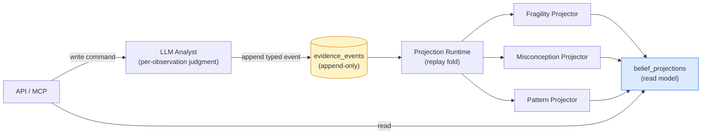
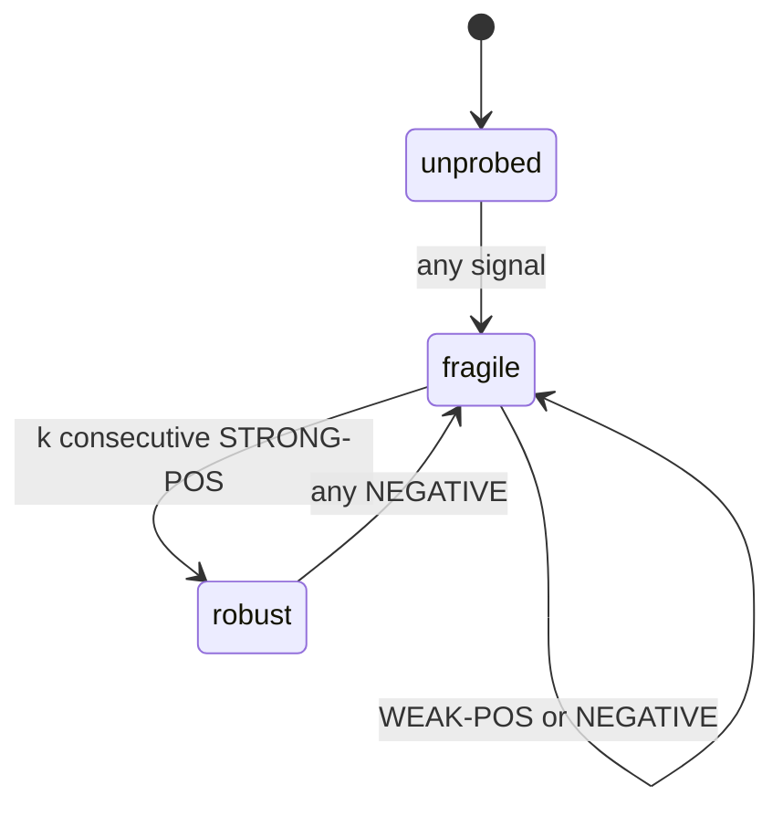
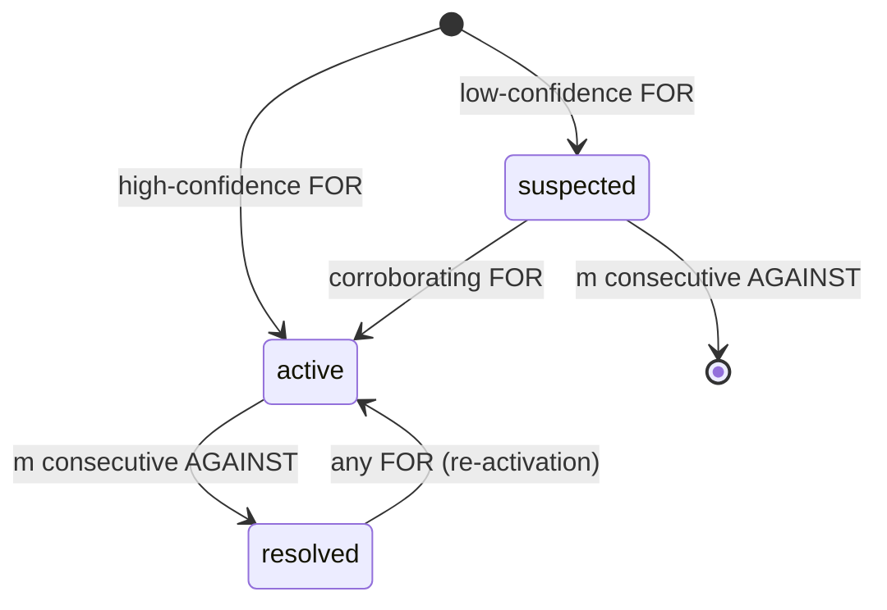

# Engine Implementation

The Stemolly engine derives a student's belief state — what misconceptions they hold, how fragile their understanding is, what reasoning habits they show — from a permanent, append-only record of observations. No belief is written directly; every belief is *computed* from that record. This page explains how that computation works end-to-end: the log that feeds it, the three projectors that produce each belief layer, the invariants they must honour, and the known gaps that remain open.

---

## The Architecture in One Picture

The engine follows an "event-sourcing-lite" pattern. Only student-observation data is event-sourced; content, identity, and sessions use ordinary CRUD. The key property is that the **evidence log is the single source of truth** and all belief state is a deterministic, rebuildable *projection* over it.

The **command side** (`graph`, `catalog`, `evidence`) validates and appends typed observations. The **query/derive side** (`projections/`) replays them into belief state. These two sides **never call each other** — they meet only through the persisted log. This strict separation is what makes `truncate → replay → identical state` sound: if the append path and the derive path could call each other, a replay would diverge from the original live run.

The payoff is evolvability. When the belief model turns out to be wrong — which is the *expected* case for a novel instrument — the projection code is rewritten and replayed over the preserved cohort data instead of losing it. Being wrong is cheap. Replaying the log is a supported, tested operation.

---

## The Evidence Log

### Envelope and Payload

Every evidence event is split into two zones with opposite reversibility (ADR-021).

| Zone | Form | Reversibility | Rule |
|------|------|---------------|------|
| **Envelope** | Typed columns on the append-only table | One-way door — schema on an append-only table cannot change and old rows cannot grow columns | Only fields the fold **keys or weights on**, or that audit queries **join on** |
| **Payload** | JSONB column | Reversible — new projection code can reinterpret old payloads on replay | Everything else |

The heuristic: **"when unsure, payload."** Envelope columns are: `student`, `node`, `type`, `scaffold_stamp`, `checkpoint_id`, `session`, `brief_snapshot`, `ts`, and `idempotency_key`. This concentrates all irreversibility in a small, deliberate set while keeping churny detail cheap to get wrong — especially important because this is a one-way door on a real student's irreplaceable data.

### Three Event Types

The evidence `type` field has exactly three values. Each names **an observation about thinking**, never a pedagogical action:

- **`misconception_evidence`** — payload: `catalogRef`, `polarity: for|against`, `confidence`, `excerpt`. Records "I saw evidence of this wrong belief."
- **`probe_outcome`** — payload: `outcome: correct|incorrect|partial`, `confidence`, `excerpt`. Records whether understanding held under testing.
- **`pattern_evidence`** — payload: `patternRef`, `confidence`, `excerpt`. Records a reasoning habit in action.

These three map one-to-one onto the three projectors. The types were validated by running eight adversarial tutoring cases across Math (Socratic) and Language (Correct/Reinforce) with no fourth type needed.

The types must **never** name pedagogical mechanics (`socratic_hint`, `correction_issued`) or domain specifics. Those would bake a teaching mode into permanent, un-replayable data and break the engine's domain and pedagogy neutrality. Domain content lives entirely in `catalogRef`/`patternRef` and the payload.

### The Altitude Rule

There is a sharp line between what the LLM writes and what the engine computes.

- **LLM writes**: a per-observation judgment — a semantic call about one moment ("I saw evidence of misconception X here, high confidence").
- **Engine derives**: cross-observation state — the mechanical bookkeeping of activation, fragility, and propagation over many such judgments.

Every event must be a **self-contained fact** that references stable catalog IDs, not the belief state at write time. The Analyst may *read* current belief state as context (e.g. to decide that a clean solve is meaningful disconfirming evidence), but must *never re-emit that stored state as an event*. Re-firing a belief every checkpoint would double-count evidence, inflate the log, and record a conclusion instead of an observation.

This rule is enforced at the write boundary. The evidence validator rejects any payload containing belief-state field names (`fragility`, `mastery`, `activation`, `beliefState`, `misconceptionState`, `stability`). A full per-type payload allowlist was considered and rejected — no consumer has fixed what the payload legitimately contains yet, and freezing a schema at the moment of least understanding would be premature. The denylist blocks the concrete risk (a fold's own vocabulary leaking back into its input) without committing to a shape.

### Grouping Attempts: `checkpoint_id`

Multiple events can describe a single student attempt. A self-correction, for instance, produces both a `misconception_evidence(for)` and a `probe_outcome(correct)`. The belief folds must group same-attempt events before interpreting them, because the story matters:

- **Same checkpoint**: `for` + `correct` → wobbled but recovered → weak-positive signal, concept stays fragile.
- **Different checkpoints**: `for` at one attempt, `correct` at a later one → genuinely improved across attempts.

`session_id` is too broad (many attempts per session); timestamp proximity has no clean boundary. `checkpoint_id` is an envelope column that stamps the batch produced by one Analyst run — one student attempt — by construction. The derive side processes checkpoints in `(min event ts, checkpoint_id)` order to keep replay deterministic.

### Idempotency Key — From Positional to Identity-Scoped (ADR-022)

The original uniqueness constraint was `(checkpoint_job_id, segment, observation_index)`. This had a subtle defect: `observation_index` was a position within a semantic-identity sort. Inserting or removing one observation shifted every index after it. On a re-run of the same job with one changed observation, `ON CONFLICT DO NOTHING` would keep the stored occupant and silently discard the incoming row, or duplicate another — with no error returned.

Because `evidence_events` is append-only by database trigger, neither a lost row nor a duplicate can ever be corrected — only outweighed by later evidence. Every rebuild would replay the corrupted state.

**ADR-022** (the resolution) replaces the constraint with `(checkpoint_id, segment, node_id, type, ref, occurrence)`. `occurrence` is scoped to its own identity group, so an inserted observation opens its own group at 0 and shifts no other row's key. `ref` (`catalogRef` or `patternRef`) is promoted from the JSONB payload into a single nullable text column so it can participate in the constraint. `observation_index` is freed from identity duty and now records the observation's true emission order, which matters for the misconception fold (see below).

The constraint is scoped to the **checkpoint**, not the job, because the checkpoint is the unit the belief folds treat as atomic. A re-drive under a fresh job ID now collides correctly instead of duplicating the whole batch.

---

## The Three Projectors

Each projector is a deterministic fold over the checkpoint-grouped event stream. All three are reversible: rewrite the code, replay the log, get the new belief state. The calibration knobs (`k`, `m`, `d`, thresholds) are left to tune against real data.

### Fragility: Consistency Over Time

**States:** `unprobed` → `fragile` → `robust`

Fragility is derived by a **two-stage fold** on `probe_outcome` events for a given concept node.

**Stage 1 — net each checkpoint into one signal** (per node):
- `STRONG-POS` — correct, unassisted, high confidence
- `WEAK-POS` — correct but scaffolded, low confidence, or self-corrected
- `NEGATIVE` — incorrect, or a standing active misconception

The `scaffold_stamp` envelope column and confidence value determine which signal applies.

**Stage 2 — drive the FSM**:

One correct probe never reaches `robust` — even a clean first probe goes to `fragile`. `robust` is earned only by `k` consecutive `STRONG-POS` with no intervening `NEGATIVE` (default `k = 2`). A `WEAK-POS` resets the streak. A `NEGATIVE` regresses `robust → fragile` immediately — a robust concept that fails is the hidden-risk signal. The small `strong_streak` counter lives alongside the enum in the stored projection.

This scaffold and confidence gating is what makes fragility mean "holds up under real probing" rather than "got it right eventually."

### Misconception: Confident Activation, Careful Resolution

**States:** `suspected` → `active` → `resolved`

The misconception projector derives a per-`(student, node, catalogRef)` instance whose **asymmetry is the inverse of fragility's**.

**Activation is fast, gated by confidence**: one high-confidence `FOR` event goes straight to `active` (holding a wrong belief can be established from one clear observation); a low-confidence `FOR` lands in `suspected` and needs corroboration.

**Resolution is slow, requiring accumulation**: `active → resolved` needs `m` consecutive `AGAINST` events with no intervening `FOR` (default `m = 2`). Re-activation on a later `FOR` is sensitive — it mirrors fragility's regression logic.

The asymmetry is justified by error cost. False positives hurt the system's groundedness precision (the headline metric), so activation is confidence-gated. Premature resolution abandons a live misconception, so resolution is conservative.

The instance is keyed on the catalog entry's **home node** (not the surfacing node), which avoids cross-node duplicates. It is headline-trusted only when the instance is `active` **and** the catalog status is `seeded` or `approved` — two orthogonal trust gates. The catalog-status gate is evaluated at **read-time as a join** of instance state × current catalog status, not baked into the fold. This means that when an operator approves a candidate catalog entry that existing evidence already references, the upgrade to trusted takes effect **instantly with no replay** — only a CRUD status flip on the catalog row.

**Propagation at read-time**: a root misconception's effect on downstream concepts is not stored on those downstream nodes. The "this downstream node is at risk" view is computed when read, by walking prerequisite edges upward to find active upstream beliefs. Materializing propagation onto downstream nodes was rejected because one new edge or one new upstream misconception would fan out and rewrite many rows, and replay would have to reproduce that fan-out exactly. Per-node projectors stay clean deterministic functions.

### Reasoning Pattern: Cross-Node Accumulation

**States (derived at read-time):** `emerging` → `established` ↔ `fading`

The pattern projector is keyed on `(student, patternRef)` — **cross-node**, unlike the per-node fragility and misconception folds. A pattern is a tendency whose status changes as time passes even with no new evidence, so the fold stores only **minimal accumulators**:
- The set of distinct concept nodes the pattern has appeared on
- Reinforcement points `(checkpoint, confidence)`
- First and last reinforced checkpoints

**Strength** (recency-weighted), **scope** (`|distinct_nodes|`), **status**, and **valence** are all derived at read-time.

Stage 1 netting reinforces a pattern at most once per checkpoint (net confidence = max confidence) and unions all concept nodes that checkpoint referenced into the breadth set.

**Promotion to `established`** requires a single breadth gate: reinforced on ≥ `d` distinct checkpoints spanning ≥ `d` distinct concepts. This prevents both concept-specific behavior and a single rich multi-concept attempt from being promoted to a cross-cutting habit. Once established, `strength` and recency govern the `established ↔ fading` transition.

Patterns are **the deliberate exception to belief stickiness** (see below). A misconception does not vanish on its own; a wrong belief is a latent fact that stays true until disconfirmed. A habit, however, is only as strong as its recent practice — so patterns fade when not reinforced rather than persisting unchanged.

**Fading uses evidence-time, not wall-clock time.** "Now" is defined as the log's latest checkpoint; fading is measured in checkpoint distance. A dormant account's patterns do not fade (accepted for the PoC). Calendar-based fading was rejected because a wall-clock input would make derived status non-reproducible — the same evidence log would yield different answers at different real times, breaking replay determinism.

### The Honesty Rules — What Unifies the Three Folds

Each fold derives a strong claim only behind a promotion gate, and the **shape of each gate matches what that layer asserts**:

| Layer | Claim | Gate shape |
|-------|-------|------------|
| Fragility | Consistency over time | Repetition (`k` consecutive strong-positive) |
| Misconception | A specific wrong belief | Confidence (one clear observation suffices) |
| Pattern | A cross-cutting habit | Breadth (seen across several distinct concepts) |

Underneath all three promotion gates sits one more rule: **zero evidence must yield no instance at all**. Every state in every layer's vocabulary already asserts that something was observed — `suspected` means "observed once, weakly," `emerging` means "reinforced at least once." None contain a word for "nothing is known." A fold that returns any state for a student it has never seen about is making a claim with no evidence.

This was violated in practice. The misconception fold tracked an internal `unseen` sentinel correctly, then collapsed it to `suspected` on the way out. The adapter had no signal to distinguish "never observed" from "weakly suspected," so every read returned an entry for every approved misconception in the catalog — a brand-new student appeared weakly suspected of every documented misconception, and the noise scaled with catalog size. The fix makes absence a first-class return value: `foldMisconception` returns `MisconceptionState | null`, and the adapter skips `null`. The pattern fold needed no signature change because an empty `reinforcements` list already signals absence.

---

## Key Invariants

**Beliefs are sticky.** A checkpoint that produces no event about a given concept leaves that concept's belief exactly as it was. Absence of evidence is not evidence. The Analyst reads stored belief state as *context* but must never re-emit it as an event — doing so would double-count, inflate the log, and record a conclusion rather than an observation. (This applies to misconceptions and fragility; patterns are the exception and fade instead.)

**The misconception fold is the only order-sensitive fold.** Fragility's Stage 1 nets by scanning for any negative signal — the same result regardless of event order. The pattern fold nets by taking maximum confidence and unioning node IDs — both order-independent. The misconception fold, however, counts *consecutive* `AGAINST` events, resetting on any `FOR`. An `active` misconception meeting `[for, against, against]` in one checkpoint resolves; the same three events as `[against, against, for]` leave it `active`. This is why the event ordering within a checkpoint matters.

The current projection read sorts by `ORDER BY ts, id`. That closes the replay-determinism gap (repeated reads now agree), but it does not order by true observation sequence. `ts` is filled from `now()` at insert time — identical for every row in one `appendCheckpointBatch` statement — so the sort falls through to a random UUID. The result is a fold that is deterministic about an *arbitrary* order. The fix is to use `ORDER BY ts, segment, observation_index`, since ADR-022 freed `observation_index` from identity duty to record true emission order.

---

## Open Problems and Schema Gaps

### Node Alias Merge — Nothing Resolves It

`mergeNodes(survivorId, aliasId)` writes exactly one column — `nodes.merged_into` — and no other read or write path consults it. `getPrerequisites` does not resolve the input node through `merged_into`; catalog tables' `home_node_id` columns are not resolved; neither the evidence repository nor the projection repository references `merged_into`. After merging node E into survivor F: `getPrerequisites(F)` returns nothing; `matchCatalog(F)` finds no entries; the student's evidence stays attached to E and belief state splits across a concept and its own retirement.

**ADR-024** settles the resolution discipline. `mergeNodes` continues to write only one column. Resolution happens at read-time in the module core — the only place that can touch more than one port. No adapter resolves anything. `evidence_events` is append-only by database trigger and can never have `node_id` rewritten, so read-time resolution is mandatory regardless.

Alias resolution needs two opposite operations:

- **`resolveAlias(id) → survivorId`** — many-to-one; applies to every node ID *leaving* the engine, and to evidence `node_id` and catalog `home_node_id` at fold and match time.
- **`expandAliases(survivorId) → Set<id>`** — one-to-many, transitive; applies to every node ID *entering* a query against a table that stores historical IDs.

The backward direction is the non-obvious one. After E → F, F's prerequisites live on edges stored as `from_node_id = E`, so resolving the query input forward accomplishes nothing. The recursive CTE must seed on the *set* `{F, E}` and match with `= ANY(...)` on both the seed and the recursive join — otherwise an alias reached mid-chain breaks the walk at that hop.

### Edge Type Validation — Silent Failures

`engine.edges.type` is plain `text` with no CHECK constraint. The only graph traversal filters on the literal `type = 'prereq'`. An edge seeded as `'prerequisite'`, `'Prereq'`, or `'prereq '` is accepted by both the database and the TypeScript compiler, then silently never walked — the concept appears to have no prerequisites, with no error and no log line.

**ADR-025** recognises that `edges.type` carries two vocabularies sharing one column: **structural** relations the engine's code branches on (`prereq`; a taxonomy relation is chartered but unbuilt), and **domain** relations the engine never interprets. R-5 governs only the domain half — `prereq` is graph-structural, not a subject or pedagogy. The engine declares the relations it interprets as a `STRUCTURAL_EDGE_TYPES` constant in `domain/graph/edge.ts` and accepts everything else as opaque. Validation is format-only at the module boundary: a single regex `/^[a-z][a-z0-9-]*$/` rejects `'Prereq'` and `'prereq '` at call time, while `'motivates'` or `'contrasts-with'` pass through untouched. No CHECK constraint — a CHECK would close the column against future domain relations. The traversal filters on the declared constant rather than a bare literal, so adding the taxonomy relation is one edit in `domain/`.

*(One miss remains: `'prerequisite'` is a well-formed slug and a different word from `'prereq'`, so it stores as a domain edge and is never walked. No format rule catches a synonym.)*

**A side note on catalog table names**: The engine's tables are named `misconception_catalog` and `pattern_catalog`. These look like R-5 violations on a quick reading — R-5 forbids an engine schema from naming a subject, language, or pedagogy. They pass on inspection: "misconception" and "pattern" are the project's own engine-level vocabulary, not subject content. The distinction is schema vs. data — no *column* names a subject or a teaching method, while catalog *rows* of course name real concepts, which is exactly where R-5 wants domain content to live. The same reasoning covers `nodes.slug`, whose values will name concepts like `equivalent-fractions` — the slug column is a natural key for idempotent seeding, and its contents are data. Worth knowing because these names will look suspicious to every future reviewer.

### Pattern Valence — Designed but Unbuilt

Both catalog tables were created from a shared column set (`id`, `home_node_id`, `status`, `slug`, `label`, `description`, timestamps). The pattern catalog has no `valence` column. The design says valence is read from the catalog entry at overlay time, so `PatternInstanceView.valence` is hard-coded `null` on every pattern returned.

Valence is what separates a habit worth reinforcing from one worth interrupting. Without it, a consumer reading `status` and `strength` cannot tell whether an established pattern is good news or bad news. The fix needs a column on the pattern table only — a misconception is harmful by definition, so the misconception catalog does not need one. The shared column set in the original migration cannot simply be widened; the pattern table needs its own `addColumns`. The gap was noticed before the adapter was written; the view type is declared nullable as a stopgap, and a test pins the current `null` behaviour so it cannot be mistaken for an accident.

### Port Classification — `getBeliefState` Is Not a Repository Method

The engine's design document declared the driving port surface (what external callers invoke) but never declared the driven surface (what the core needs from infrastructure). The build filled this silence by duplicating the driving port names as repository interface names. For most operations — "store this / fetch that" — this is harmless. It breaks on `getBeliefState`, which is a computation over three sources rather than a store read.

Naming it a repository method made it one by declaration. The repository then had to run the folds, so it needed catalog entries and prerequisites, so it had to hold two other ports. About 130 lines of belief-inference rules ended up sitting beside SQL. Reviews checked the names against the design and found them matching, so the misclassification passed through three consecutive reviews — it was only visible by comparing all four adapters simultaneously.

---

## Related Pages

- For the belief model that defines what fragility, misconceptions, and patterns *mean*, see [Mental Model](./mental-model.md).
- For how the engine's correctness is validated against fitness functions, see [Engine Validation](./engine-validation.md).
