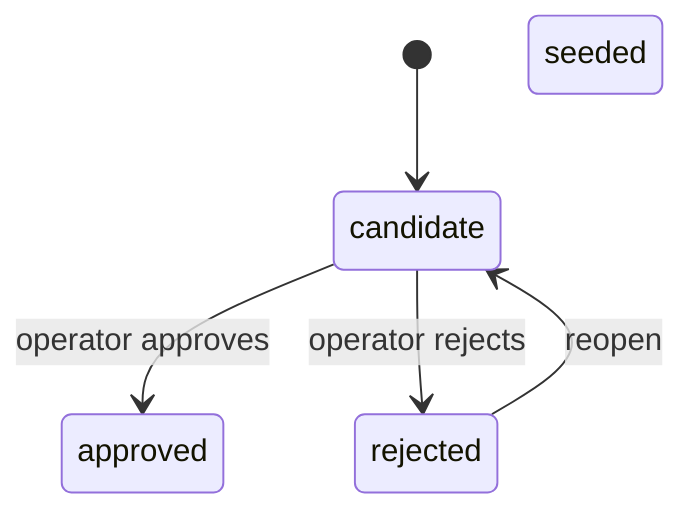

Every misconception and reasoning pattern the engine can recognize lives as a row in a catalog, and that row carries a trust status. This page covers how that status moves, and why moving it never requires touching the underlying belief data at all.

## Trust is a live read, not baked into the fold

Whether a recorded misconception counts toward the headline picture of a student depends on two independent things: the folded instance's own state (`active` versus `suspected`), and the catalog entry's current status (`seeded`/`approved` versus still a `candidate`). The catalog-status half of that check is deliberately evaluated **at read time, as a join**, rather than being baked into the fold itself.

The consequence is immediate and useful: when an operator approves a candidate entry that existing student evidence already points at, that evidence becomes trusted the moment the status flips — a plain status update, with no replay or rebuild step. Keeping the fold itself blind to catalog status is also what keeps replay deterministic: a fold's output depends only on the evidence log, never on an operator decision made after the fact.

## Reject and reopen: revisable, not terminal

Catalog entries can also be rejected, and a rejected entry can be reopened. The legal transitions form exactly three edges:

`approved` has exactly one inbound edge, from `candidate` — reopening a rejected entry always returns it to *unjudged*, never straight back to trusted, so re-approval has to pass through the same gate as any other promotion. A hand-authored (`seeded`) entry has no outbound transition modeled at all; retiring one is a separate concern.

Rejection was deliberately made **revisable rather than final**. The shape that looked cleanest at first was a one-way rejection, but that turned out to be dangerous: a mistaken rejection under a terminal status would be unrecoverable and silent, because a catalog slug is unique and the evidence pointing at it can never be corrected or moved once written. Because trust is checked live at read time with no baked-in state, undoing a rejection costs nothing more than one status flip — every historical observation anchored to that entry is picked back up on the very next read. Making rejection permanent would have thrown away reversibility the design had already paid for elsewhere.

One consequence of "reopen returns to unjudged, not to trusted" is easy to get backward: reopening a rejected entry does **not** make its evidence count again on its own. The belief-state read only trusts entries whose status is `seeded` or `approved`, so a reopened entry stays excluded exactly as it was while rejected — right up until an operator actually approves it. What is guaranteed is narrower but still real: the evidence trail anchored to that entry survives a reject-then-reopen detour completely untouched, and starts folding correctly the moment approval finally grants trust, with no rebuild needed.

## Slugs are unique per kind, not across the whole catalog

The catalog is really two tables — one for misconceptions, one for patterns — and each declares its own uniqueness on `slug`. So the same slug string can legitimately exist once as a misconception and once as a pattern, as two entirely independent entries with different ids, statuses, and histories. A lookup by slug alone therefore has to guess which table it means, which silently answers about whichever kind happens to have a matching row first — a correct answer to the wrong question. This is easy to get wrong by analogy, because node slugs behave differently: nodes live in one table with one uniqueness constraint, so a node slug alone identifies a node outright. Carrying that intuition over to the catalog produces code that reads correctly and asks the wrong thing.

## Guarding against re-proposing onto a rejected entry

A rejected catalog entry's slug must not be silently reused if someone proposes a new entry under the same name — that would rewrite the entry's content while leaving it rejected, and hand back a reference to what looks like a dead concept. This rule is deliberately expressed in two places at once: an explicit check in the module's core logic, and a matching `WHERE status <> 'rejected'` clause built into the database write itself.

The two copies do different jobs on purpose. The core check states **the rule** — it's where a reader looks to learn what's forbidden, and it's what produces the caller-facing error. The database clause closes a narrower **timing window**: without it, a rejection landing between the core's check and the actual write could still slip through. Deleting the core-side check and relying on the database clause alone was considered — it's the smaller change, and it would behave correctly — but it was rejected because it would leave the rule expressed nowhere a reader could find it except inside a piece of database logic, against the standing principle that the engine's rules should be readable without reading SQL.

That guard initially had a scoping bug of its own: the core-side check looked up the entry's status by scanning both catalog tables in a fixed order, rather than the specific table the entry's kind actually lives in, so the read and the write could in principle be asking about different rows. The fix routes both the status check and the insert through the same shared table-selection helper, so the two can no longer drift apart — they answer the same question through the same function, instead of only agreeing by coincidence.
