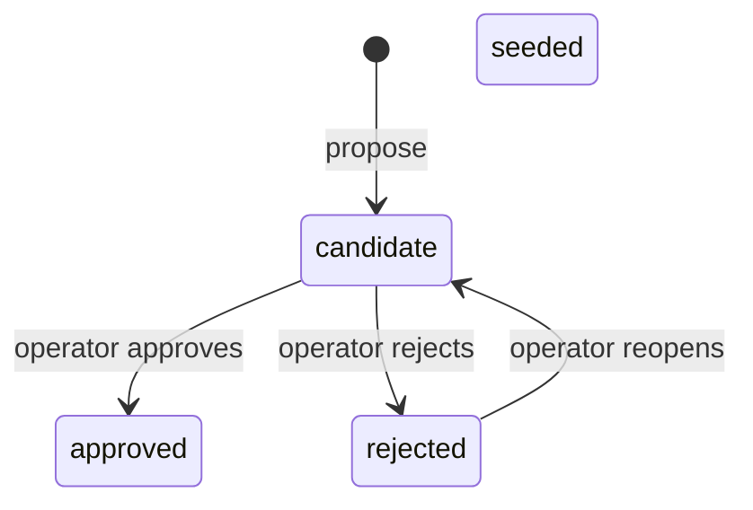

The engine maintains two catalog tables — `engine.misconception_catalog` and `engine.pattern_catalog`. Despite their pedagogical sound, these names are project-level engine vocabulary, not a domain leak — "misconception" and "pattern" are the project's own engine-wide terms, confirmed at schema review. A catalog entry is what `catalogRef` and `patternRef` in an evidence event point to. Getting catalog entries right matters: evidence rows anchor to them in an append-only table, so a renamed, deleted, or wrongly-trusted entry corrupts belief state permanently.

## Where the human approval gate sits

"AI drafts, human approves" is one rule but the engine can only enforce it in one of two places, depending on the artifact.

**For graph nodes and edges**, the gate is *before* the write. `engine.nodes` and `engine.edges` have no status column — `seedNode` and `seedEdge` are idempotent upserts that land as trusted the instant they are called. The operator reads the drafted list in the conversation, then calls `seed_node`. The concept lives in the transcript as a draft until the human says yes.

**For catalog entries**, the gate is *after* the write. Because the catalog tables carry a four-status lifecycle, an entry can be persisted as `candidate` and judged via `approve_candidate`, `reject_candidate`, and `reopen_candidate`.

Adding a status column to `engine.nodes` to make the two symmetric was rejected. A node is inert until evidence hangs on it, a wrong display name is corrected by re-seeding the same slug, and a wrong identity is repaired by `mergeNodes`. The gate already exists for free in the conversation flow.

:::caution
"Seeded as candidates" means something different for graphs vs. catalogs. For nodes: *drafted in the transcript, never persisted until approved*. For catalog entries: *persisted in a `candidate` state, awaiting approval*. Only the catalog has a candidate state to persist into.
:::

## The four-status lifecycle

Every catalog entry carries one of four statuses. The legal transitions are exactly three edges:

`seeded` has no outbound transition — a hand-authored entry cannot be retired through this graph. `approved` has exactly one inbound edge, from `candidate` — reopening a rejected entry always returns it to *unjudged*, never straight back to trusted. A single pure function in the domain layer holds this transition graph and is the only place it exists.

**Why is rejection revisable, not terminal?** A mis-rejection under a terminal status would be unrecoverable and silent: the slug is unique, the evidence log blocks `UPDATE`/`DELETE`, and re-proposal onto the slug is blocked. Every observation already anchored there would quietly stop counting. Because trust is evaluated at read time with no replay, undoing a rejection costs one column flip and restores every historical observation on the next read. Making rejection terminal would discard reversibility the design had already paid for.

## Trust is evaluated at read time

Whether a misconception instance counts toward the headline picture depends on two orthogonal conditions:
1. The folded instance state is `active` (not `suspected` or `resolved`).
2. The catalog entry's status is `seeded` or `approved`.

The catalog-status check is a **read-time join**, deliberately not baked into the fold. The consequence: when an operator approves a candidate entry that existing evidence already references, the upgrade to trusted is **instant** — a plain status flip, no replay. Keeping the fold independent of catalog status also preserves deterministic replay: a fold's output is a pure function of the evidence log alone.

## Reopening does not restore trust

Reopening a rejected entry returns it to `candidate`. The belief-state read folds only `seeded` or `approved` entries, so a reopened entry is still excluded — exactly as it was while rejected and exactly as it was before anyone judged it.

Evidence anchored to the entry starts counting only when an operator actually approves it. This is narrower than the natural reading of "reopen restores the entry," but it is what the transition graph and the fold's trusted-status pair actually guarantee. What is guaranteed and worth protecting: the evidence trail survives a reject-then-reopen detour completely untouched, and folds correctly the moment approval finally grants trust, with no rebuild needed.

## Slug uniqueness is per kind, not global

The catalog lives in two tables, one per kind. Each declares its own unique constraint on `slug`. The same slug string can therefore legitimately exist as both a misconception and a pattern — two independent entries with different ids, statuses, and histories.

A lookup by slug is only meaningful together with a kind. A helper that takes a slug alone must guess which table to query, and the guess produces an answer about whichever kind happens to have a matching row first — correct about the row found, but answering the wrong question. Node slugs behave differently (globally unique in one table), so the intuition from node slug lookups cannot be carried to catalog lookups.

## The re-propose guard

Re-proposing onto a rejected slug throws instead of silently upserting. Before this guard, re-proposal rewrote the entry's label while leaving it rejected, handing back a reference to a dead concept.

The guard is expressed in two places deliberately:

- **Module core**: an explicit check-and-throw. This is where the *rule* lives — readable without reading SQL.
- **Adapter SQL**: `ON CONFLICT ... WHERE status <> 'rejected'`. This closes a time-of-check-to-time-of-use window in which a concurrent rejection could slip through after the core's check but before the write.

The two copies are not redundant. The core check produces the caller-facing error; the SQL clause handles the race. Deleting the core-side check was considered (it is the smaller change, and behaviourally sufficient) and rejected — it would leave the rule stated only inside an adapter. See [Hexagonal Module Structure](./hexagonal-structure) for the principle behind this.

The guard initially had a scoping bug: the core-side check scanned both catalog tables in a fixed order rather than querying the specific table the entry's kind lives in. The fix routes both the status lookup and the insert through the same `tableFor(kind)` helper, so the read and the write can never ask about different rows.

## Pattern valence

`engine.pattern_catalog` carries a nullable `valence` column (`helpful` / `harmful`), added by a targeted single-table migration. `misconception_catalog` has no equivalent — a misconception is harmful by definition.

Valence is content, not trust. An idempotent catalog re-seed may update it; the never-downgrade rule covers only `status`. At the consumer boundary, valence is what separates a habit worth reinforcing from one worth interrupting. A client reading a pattern's status and strength without valence cannot tell whether an established pattern is good news or a problem.
