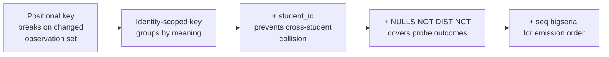

The engine treats every observation about a student as a permanent, append-only fact. Beliefs — fragility, misconceptions, reasoning patterns — are computed from those facts on demand, never stored directly. When the belief model turns out to be wrong, you rewrite the derivation code and replay the log; no real student data is lost.

Only the student-observation layer is event-sourced. Content, sessions, and identity use ordinary CRUD — the complexity is proportional to the real risk.

## The CQRS split

The engine's `domain/` layer is decomposed into four areas:

- `evidence` — validates and appends typed observations (the **write side**).
- `projections` — a replay engine plus one projector per belief layer (the **read/derive side**).
- `graph` — concept nodes, edges, traversal.
- `catalog` — the registered misconception and pattern registry.

The load-bearing rule is that **the write side and the derive side never call each other**. They meet only through the persisted evidence log. This separation is what makes "truncate the derived state, replay the log, get identical state" sound — if the write path called derivation logic, replay would diverge from live state.

## Three observation types and the altitude rule

The evidence `type` has exactly three values:

| Type | Payload carries | Maps to |
|---|---|---|
| `misconception_evidence` | `catalogRef`, `polarity: for\|against`, `confidence`, `excerpt` | Misconception projector |
| `probe_outcome` | `outcome: correct\|incorrect\|partial`, `confidence`, `excerpt` | Fragility projector |
| `pattern_evidence` | `patternRef`, `confidence`, `excerpt` | Pattern projector |

These types name **observations about thinking**. They must never name a pedagogy mechanic (no `socratic_hint`) or a domain detail — domain lives in `catalogRef`/`patternRef` values and the payload, not in the type name. The three types survived eight adversarial tutoring cases across Math (Socratic) and Language (Correct/Reinforce) with no fourth type needed.

**The altitude rule** draws the line between what the model writes and what the engine computes. The model records a *per-observation judgment* — a call about one moment: "I saw evidence of misconception X here, high confidence." The engine derives *cross-observation state* — the bookkeeping of activation, fragility, and propagation over many such judgments. Think of the model as a witness; the engine as the detective cross-referencing many witness statements — the witness never announces the verdict.

Each event must be a **self-contained fact**: it references stable catalog ids, not the belief state at write time. The model may read current belief state as context to decide what to observe, but the observation it writes must stand alone. A "conclusion" event whose meaning depends on write-time state breaks replay and must be rejected.

At the write boundary this rule is enforced by a **denylist**: any observation whose JSONB payload carries field names like `fragility`, `mastery`, `activation`, `beliefState`, or `misconceptionState` is rejected. A full per-type allowlist was considered and rejected — nothing yet consumes the payload's legitimate shape, so an allowlist would freeze a schema at the moment of least understanding.

:::caution
The denylist blocks named field names only. A belief-state field under an unlisted name still passes. Because the table is append-only, a contaminating row can never be corrected, only outweighed by later evidence. The denylist must be kept current.
:::

## Event schema: envelope, payload, checkpoint grouping

Every evidence event splits into two zones with opposite reversibility.

The **envelope** is a set of typed columns. Because the table is append-only, an envelope column is a one-way door — once chosen, it cannot be cleanly changed. Each column earns its place only if a fold keys or weights on it, or an audit trail joins on it. Current columns: `student_id`, `node_id`, `type`, `scaffold_stamp`, `checkpoint_id`, `session_id`, `brief_snapshot_id`, `ts`, `seq`, `segment`, `occurrence`, `ref`.

The **payload** is a JSONB column. Reversible, because future projection code can reinterpret an old payload on replay. **When unsure, put it in the payload.**

`checkpoint_id` stamps every event produced by one Analyst run — one student attempt. Without it, two different stories collapse into the same raw events:

- **Self-correction:** a `for` and a `correct` in the *same* checkpoint → wobbled-but-recovered → stays fragile.
- **Delayed recovery:** a `for` at one checkpoint, a `correct` at a *later* one → genuinely improved across attempts.

Neither `session_id` (too broad — many attempts per session) nor timestamp proximity (no clean boundary) can draw the box. `checkpoint_id` does it by construction.

## Propagation is read-time, not stored

A root misconception affecting all downstream concepts is **not stored on downstream nodes**. Belief projectors write only local, per-node facts. The "this downstream node is at risk because of an upstream misconception" view is computed at read time by walking prerequisite edges upward to find active upstream beliefs.

The rejected alternative — materializing propagation onto downstream nodes — would require fan-out writes every time a new edge or upstream misconception appeared, and replay would have to reproduce those fan-outs exactly. Keeping projectors per-node keeps each fold a clean deterministic function; graph traversal only discovers an existing belief, it never invents one.

## The write path: prevalidation then atomic insert

`appendCheckpointBatch()` does three things in core before touching the database:

1. **Resolve slugs** — node slugs to uuids; catalog/pattern refs to catalog-entry uuids.
2. **Validate envelopes** — check the altitude-rule denylist and the three-type enum.
3. **Assign occurrence keys** — compute `segment`/`occurrence`/`ref` for each observation.

`PgEvidenceRepository` then emits one multi-row `INSERT ... ON CONFLICT DO NOTHING`. Because this is a single SQL statement, any row-level failure (FK violation, constraint breach) aborts the whole batch — no partial checkpoint is left behind. A schema-level trigger rejects `UPDATE` and `DELETE`, so `engine.evidence_events` is append-only at the database layer, not only by caller convention.

The repository's input contract changed when orchestration moved fully into core. `PgEvidenceRepository.appendCheckpointBatch` now expects **pre-keyed `KeyedObservation[]` objects** — already slug-resolved, already validated, already assigned `segment`, `occurrence`, and `ref`. Code that calls the repository directly with the old raw `EvidenceObservationInput[]` shape will not type-check. The correct entry point from outside the engine is `EngineModuleApi.appendCheckpointBatch`, which still accepts the original slug-based inputs and handles the keying step internally before delegating down. See [Hexagonal Module Structure](./hexagonal-structure) for the reasoning behind this boundary.

## The uniqueness key: a chain of fixes

Evidence delivery is at-least-once. The uniqueness key is what makes a redelivered batch a no-op instead of a duplicate. Getting it right took several rounds.

**Positional keys break on a changed observation set.** An index shifts when any observation is inserted or removed — `ON CONFLICT DO NOTHING` then keeps the wrong occupant and discards the incoming row, silently, with success returned. The fix: key rows on what they mean, not where they land.

**The identity-scoped key.** The current key is `(student_id, checkpoint_id, segment, node_id, type, ref, occurrence)` with `NULLS NOT DISTINCT`. `occurrence` counts within each identity group `(node_id, type, ref)`, so inserting or removing one observation opens or closes its own group without shifting any other row's key.

**`student_id` is required.** Without it, two students using the same `checkpoint_id` string (e.g. `lesson-1-checkpoint-1`) can collide. The pre-ADR-026 key omitted `student_id` and suffered exactly this: one student's observation silently discarded with success returned.

**`NULLS NOT DISTINCT` is required.** `probe_outcome` carries no `ref`. Standard SQL treats `NULL = NULL` as unknown, so two probe outcomes on the same node would never collide under a plain `UNIQUE` constraint — every retried checkpoint would duplicate every probe observation permanently. `NULLS NOT DISTINCT` (Postgres 15+) treats two NULLs as equal for uniqueness, matching what a null reference actually means here.

**Identity and emission order are two separate jobs.** `occurrence` is the identity counter in the uniqueness key. `seq` is a `bigserial` assigned by Postgres and deliberately **not** in the key — a retried batch must reproduce the same key to collide; a DB-assigned sequence value never reproduces. The read path sorts by `seq` alone. Gaps in `seq` (from partial retries) are expected and harmless — `seq` is for ordering, not counting.

> A stable sort key and a meaningful sort key are different requirements. Any total order makes a fold deterministic — including a random one.

**One value, one derivation.** The `ref` value plays two roles: it is a key column, and it defines the identity group `occurrence` counts within. For a while it was computed independently in two files. A future drift between them would silently create duplicates or drop observations, permanently. The fix is one unexported function used by both places — exporting it would re-open the second derivation site.

## Catalog reference stability

Until recently, `evidence_events.ref` stored a catalog entry's **slug**. Renaming a slug silently orphaned every prior row that pointed at the old name — the fold's join found nothing, the row could not be corrected, and no test caught it (replay remained a pure function; one input just moved).

The fix: `ref` now stores the catalog entry's **uuid**, resolved at write time by `CatalogRepository.findIdsBySlugs(slugs, kind)`, scoped by kind (catalog slugs are unique per table, not globally). A batch is all-resolved or all-rejected — an unresolvable ref throws before any row is written. There is no FK column because a single column cannot reference both catalog tables; referential integrity comes entirely from write-time resolution.

:::note
One gap remains. The write boundary does not enforce that an observation type requiring a ref actually carries one. A `misconception_evidence` or `pattern_evidence` stored with `ref = NULL` folds to nothing forever, silently and permanently. The Analyst must always call `match_catalog` or `propose_catalog_candidate` to obtain a real ref before appending; the engine does not enforce this at write time.
:::

## Operator evidence audit

The operator can verify a belief by reading the evidence rows behind it. The engine provides one read that returns a student's evidence rows narrowed by the same filter value the belief read already used — no schema change, no new port. Raw payloads are never surfaced on the student side; a session has no business auditing its own scaffolding history.

`evidence_events.session_id` carries a **human-authored convention** naming a retrievable conversation. The engine neither generates nor validates it. The groundedness check's final hop — confirming the recorded observation matches a real exchange — is unenforceable from within the engine alone.

:::caution
`session_id` is entered by a human and lands in an append-only table. It cannot be revised once real evidence exists on that row. The Student app closes the gap by persisting transcripts and board artifacts as first-class artifacts. In the PoC, this hop is unverifiable.
:::
