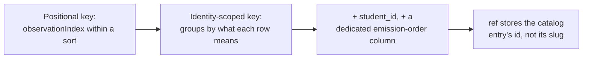

Every belief the engine holds about a student starts as one thing: a permanent, append-only record of an observation. Nothing about a student's misconceptions, fragility, or reasoning patterns is ever written directly — it is always computed, on demand, from the log of what was observed. This page covers how that log is shaped, and the sequence of real bugs that hardened it into something safe to build on.

## Why append-only, and what it buys

The engine treats its evidence and prediction records as the single source of truth, enforced as append-only by the database itself, not just by application code. Everything else — misconception instances, fragility state, reasoning patterns — is a **projection**: a value computed by replaying the log, never a value stored and then edited.

The payoff is specific: the belief model this engine implements is a validation instrument, and it is expected to be wrong in places as real student data comes in. Because raw observations are preserved forever, fixing a wrong belief model means rewriting the derivation code and replaying it over the same log — not losing the cohort's history. Truncating the derived state and rebuilding it from the log is a supported, tested operation.

The domain is split along this line into a **write side** and a **read side**, and the load-bearing rule is that they never call each other directly — they only meet through the log:

- `evidence` — validates and appends typed observations (the write side).
- `projections` — a replay engine plus one projector per belief layer (the read side).
- `graph` and `catalog` — the concept map and the misconception/pattern registry, both consulted by the read side.

This separation is what makes "truncate the projections, replay the log, get identical state" actually true. If the write path could call into derivation logic, replay could diverge from what was live at the time.

## What one evidence event contains

Every evidence event splits into two zones with opposite reversibility.

The **envelope** is a set of typed columns on the append-only table — `student`, `node` (optional), `type`, `scaffold_stamp`, `checkpoint_id`, `session`, `brief_snapshot`, `ts`, and an idempotency key. Because the table is append-only, an envelope column is effectively a one-way door: once chosen, it can't be cleanly changed, and old rows can never grow a new column.

The **payload** is a flexible JSON blob — reversible, because future projector code can reinterpret an old payload differently on replay. The rule for deciding which zone a field belongs in is deliberately simple: a field earns an envelope column only if a projector keys or weights on it, or an audit trail needs to join on it. Everything else goes in the payload — "when unsure, payload."

There are exactly three observation types, and they map one-to-one onto the three belief layers:

```json
// misconception_evidence
{ "catalogRef": "cross-multiply-error", "polarity": "for", "confidence": "high", "excerpt": "..." }

// probe_outcome
{ "outcome": "correct", "confidence": "high", "excerpt": "..." }

// pattern_evidence
{ "patternRef": "skips-verification", "confidence": "medium", "excerpt": "..." }
```

These names deliberately describe **observations about thinking**, never pedagogy mechanics or subject content — no `socratic_hint`, no `correction_issued`. Baking a teaching move or a subject into the vocabulary would freeze a mode into permanent, replay-sensitive data. Everything domain-specific lives in the `catalogRef` / `patternRef` values and the free-form payload, not in the type name itself.

### The altitude rule

The line between what the model writes and what the engine computes is drawn at "altitude": the model records a **per-observation judgment** — a call about one moment, like "I saw evidence of this misconception here, high confidence" — while the engine derives **cross-observation state**, the mechanical bookkeeping of activation, fragility, and propagation across many such judgments. Think of the model as a single witness reporting what it saw, and the engine as the detective who cross-references many witness statements over time — the witness never gets to also announce the verdict.

Every event has to stand alone as a fact that doesn't depend on the belief state at the moment it was written. The model may look at current belief state to decide what's worth reporting, but it must never write that state back out as an event — doing so would mean the meaning of a stored row depends on when it was written, which breaks the guarantee that replaying the same log always produces the same answer.

This rule is enforced concretely at the write boundary: an incoming observation is rejected if its payload contains any of a fixed list of belief-state field names (`fragility`, `mastery`, `activation`, `beliefState`, `misconceptionState`, `stability`). A full per-field allowlist was considered and rejected, because nothing downstream consumes the payload's legitimate shape yet — an allowlist would mean inventing and freezing a schema before anyone actually needs one. The denylist blocks the concrete risk (a projector's own vocabulary leaking back into its input) without over-committing.

:::caution
The denylist only catches the field names on the list. A belief-state field under an unlisted name still passes through untouched — and because the table is append-only, a contaminated row can never be corrected, only outweighed by later evidence. The list has to be kept current until a real payload consumer justifies replacing it with an allowlist.
:::

### Grouping one attempt: checkpoint_id

`checkpoint_id` stamps every event produced by one model run — one student attempt. It exists because a single attempt can produce more than one event (a self-correction, for example, produces both a "for" misconception signal and a "correct" probe outcome), and the belief-deriving code needs to group same-attempt events before interpreting them.

Without it, two very different stories collapse into the same raw events: a student who wobbles but recovers within one attempt (a weak signal that should stay fragile) looks identical to a student who fails one attempt and genuinely improves on a later one (a real recovery), unless the engine knows which events belong to the same attempt. Neither the broader session id (too coarse — many attempts) nor timestamp proximity (no clean boundary) can draw that box; `checkpoint_id` does it by construction.

## Hardening the uniqueness key: a chain of fixes

The evidence table needs a uniqueness key so that redelivering the same batch of observations (a routine case, since job delivery is at-least-once) does not duplicate them. Getting that key right took several rounds, each exposing a sharper failure mode than the last.



**Positional keys don't survive a changed observation set.** The first key relied on a row's position within a sorted batch. But a position shifts if the batch changes shape — inserting or removing one observation shifts every index after it. A re-run of the same job reporting a slightly different set of observations could collide a genuinely new observation against an old one already stored under that position, silently dropping the new one and duplicating the old one — while the call still reported success, because nothing compared what was written against what was sent. The fix was to key rows on what they actually mean — student, checkpoint, node, type, and reference — rather than on where they land in a list.

**An identity key still needs the right columns.** Even after keying on meaning rather than position, the key initially omitted `student_id`. Because `checkpoint_id` is a caller-supplied opaque string with no engine-side minting and no stated uniqueness requirement, two different students producing the same shape of observation under a naturally-formed checkpoint id (like `lesson-checkpoint-3`) could collide — one student's evidence silently discarded, the call still reporting success. This was fixed by making `student_id` the leading column of the uniqueness key.

**Nullable key columns need `NULLS NOT DISTINCT`.** Two of the key's columns — the node and the catalog reference — can legitimately be `NULL` (a plain probe outcome carries no catalog reference at all). Standard SQL treats `NULL = NULL` as unknown, not true, so a plain `UNIQUE` constraint would never catch a duplicate row where both copies are legitimately `NULL` — every retried probe outcome would duplicate forever. Postgres's `NULLS NOT DISTINCT` option, added in Postgres 15, fixes this by treating two `NULL`s as equal for uniqueness purposes, which correctly matches what a `NULL` reference means here (this event type has no reference) rather than what SQL normally assumes (the value is unknown).

**Identity and emission order are two different jobs, and need two different columns.** The key's per-identity counter was originally reused to also carry the true order in which observations were emitted within a batch — but a batch's own internal counter and the sequence in which rows were actually written are not the same thing, and merging them meant the ordering-sensitive read (see the projectors page for which folds care about order) ended up sorting on the wrong value. The current schema carries two separate columns: the identity counter that the uniqueness key compares, and a database-assigned, ever-increasing sequence number used only for read-time ordering and deliberately left out of the uniqueness key — because a retried batch must reproduce the same identity key to be recognized as a duplicate, and a database-assigned counter never reproduces the same value twice. Gaps in that sequence number (from partial retries) are expected and harmless, since it is used only for ordering, never for counting or identity.

**One value, one place it's computed.** The catalog-reference value plays two roles in this key — it's one of the compared columns, and it's part of what the per-identity counter groups by. For a while it was computed independently in two different files. The two computations happened to agree, but nothing enforced that they always would; if they ever drifted apart, two different observations could silently share a key (losing one) or one observation's key could silently change between a write and its retry (creating a duplicate) — both permanent, in an append-only table. The fix collapsed this into a single, deliberately unexported function that both places now call, so there is structurally only one way to compute it.

**A slug-based reference lets a rename orphan old evidence.** Until recently, an evidence event's catalog reference stored the *slug* of the catalog entry it pointed at, and the belief-deriving code matched on that slug. Renaming a catalog entry's slug — an ordinary operator action — would silently orphan every past observation that pointed at the old name: the match would find nothing, the row could never be corrected, and no test could catch it, because replay is still a pure function of its inputs; only one of those inputs quietly moved. This is now fixed: the reference column stores the catalog entry's permanent id instead, resolved once at write time. A batch is now all-resolved or entirely rejected — if any reference doesn't match a real catalog entry, nothing is written, and the caller must propose that entry before retrying. This also closes a second, related gap: previously nothing checked that a reference pointed at a real catalog entry at all, so evidence could anchor to nothing and fold to nothing forever, invisibly.

:::caution
One catalog-reference gap remains open. Nothing currently *requires* an observation type that needs a reference to actually carry one — an observation can still be stored with a missing reference and simply never match anything in the fold, silently and permanently, because the write-time resolution only checks a reference that is present, not whether one should have been.
:::

## Auditing beliefs back to their evidence

When an operator wants to verify that a recorded belief is backed by real interaction, the engine provides a middle step: one read that returns a student's evidence rows narrowed by the same filter value the belief read already used. Because the belief read and the evidence read share the same filter type, the value already in hand from finding the belief can narrow the trail directly, with no translation.

This costs no schema change. The evidence-query port already returns every row with its scaffold stamp, checkpoint id, session id, and payload. Filtering and outbound slug mapping happen in the orchestration layer, with no new port, table, or migration.

The audit is deliberately kept off the student surface. A session has no business reviewing its own scaffolding history, and raw payload values invite a model to reason about how it was previously coached.

The third step of the audit — reading what was actually said — has no mechanism. Transcripts live inside Claude sessions and never enter the engine, so `evidence_events.session_id` carries a **human-authored convention naming a retrievable conversation**, rather than a system-generated identifier. The engine neither generates nor validates it.

:::caution
This is a known shortfall. The load-bearing half of the groundedness check — confirming that recorded observations match real conversation — is unenforceable from within the engine. The `session_id` value is entered by a human and can never be revised once real evidence exists on that row, because the table is append-only. The application layer closes this gap by persisting transcripts as real artifacts, but the proof-of-concept cannot. Two further limits are accepted deliberately: no review verdicts are stored, so a spot-check's number is not reproducible from data alone; and the read cannot distinguish a belief backed by one weak observation from one backed by ten.
:::
