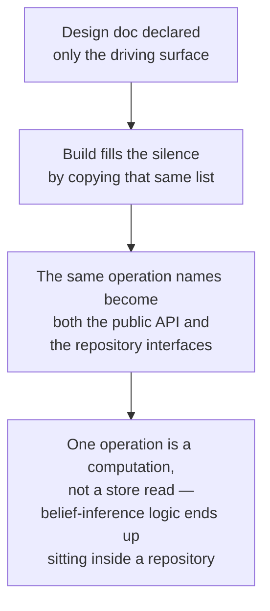

The engine follows a hexagonal module shape — a core surrounded by ports that separate it from its callers on one side and its infrastructure on the other. Most of that shape is standard project convention, but building this particular module surfaced a few lessons specific to its own history that are worth carrying forward.

## The missing driven-port list

A hexagonal module needs two separate lists of ports: the **driving** surface that callers invoke, and the **driven** surface the core needs from its own infrastructure. The engine's original design document declared only the first, explicitly labeled as "what callers are allowed to call," and never declared the second at all.

The build filled that silence in the only way available to it: it duplicated the driving list to also serve as the driven list, so the module's factory collapsed into a set of one-line forwards from public calls straight to repository methods of the same name. For most of those operations this is harmless, because "store this" or "fetch that" genuinely is a database operation either way. It breaks on the one operation that computes a student's belief state, because that is a computation over several sources, not a store read — naming it as a repository method made it one by definition, and everything followed from there with no further decision needed: the repository had to run the derivation logic itself, so it needed access to catalog entries and prerequisites too, and ended up holding roughly a hundred lines of belief-inference rules sitting beside plain SQL.

This is also worth remembering as a review lesson: every review checked the build against the design's *names*, and the names matched exactly across several consecutive pieces of work — but whether an operation belonged on the driving side or the driven side was never a property anyone checked. The defect only became visible by comparing every adapter side by side, a whole-module view that a change-by-change review never takes.

## Twin types the anti-duplication rule can't see

The engine's model-facing and repository-facing contracts hold several pairs of types that are field-for-field identical except for one field — the model-facing shape names a concept by slug, its repository-facing twin by id, following directly from the slug boundary described on the node-identity page.

The project rule against duplicating a shared shape is meant to catch exactly this kind of copy — but the automated check enforcing that rule works by looking at imports, not at structure. Two type definitions that are structurally identical but import nothing from each other pass the check cleanly, so it can never distinguish a genuinely necessary twin pair (which these are, since the slug-versus-id boundary means the two sides really are different shapes) from an accidental copy-paste.

This is worth recording rather than dismissing, because this module is the reference implementation other modules are expected to copy — a newcomer who finds several near-identical pairs of types in the exemplar module could reasonably read that as license to duplicate rather than share. The rule's positive half (put a genuinely shared shape in the domain layer, once) still has to be enforced by a human reviewer here; there's no automated check standing in for that judgment.

## One column, two vocabularies

The engine's edges — the links between concepts, like prerequisites — carry a `type` column that actually holds two different vocabularies sharing one field: **structural** relation types the engine's own code branches on (currently just "prerequisite"), and **domain** relation types the engine never interprets at all. Treating this as one vocabulary makes every proposed constraint on it look like it would leak domain knowledge into the schema, which the project's rules forbid — but the rule only actually governs the structural half.

The fix declares the small set of structural relation types the engine interprets as a constant inside the domain code, and validates every edge type only at the format level — a plain lowercase-with-hyphens pattern — accepting everything else as opaque data. There is deliberately no database-level constraint restricting the values, because a hard constraint would close the column against future domain relations the schema is supposed to stay open to. Traversal code filters on the declared constant rather than a bare string literal, so adding a new structural relation later is a small, contained change.

One gap is accepted and recorded rather than hidden: the format check catches a badly-cased or padded typo, but it cannot catch a *synonym* — a well-formed but different word, like a full word where the engine only recognizes the short form, stores cleanly as an ordinary domain edge and is simply never walked, with no error anywhere. Catching that would require enumerating the whole vocabulary, which is exactly what keeping the column open was meant to avoid. This is a decision, not an oversight; the sibling catalog-status column takes the opposite approach precisely because a small, closed set of statuses is genuinely known in advance, while edge types are not.

## Catalog table names are sanctioned vocabulary, not a domain leak

The project's rules forbid the engine's schema from naming a specific subject, language, or teaching method — variability is supposed to enter only through typed data, never through table or column names. On a quick, grep-level read, the engine's catalog tables — named for misconceptions and reasoning patterns — look like exactly that kind of violation, since both are pedagogical words.

The distinction that resolves this is between **schema** and **data**. No column in any engine table names a specific subject or method; the words "misconception" and "pattern" are the project's own engine-level vocabulary, not a leak from any one subject — the same two words are already used as project-wide terms elsewhere, and the observation-type vocabulary already treats catalog references as first-class identifiers. What the *rows* of those tables contain is a different matter entirely, and rows naming real concepts is exactly where subject-specific content is supposed to live. The same reasoning covers node slugs, whose values will genuinely name concepts like `equivalent-fractions` — the column exists as a stable lookup key for seeding, and its contents are data, not schema.

This is worth writing down because the table names will keep looking like a violation to any future reviewer scanning migrations for forbidden words — the automated check that partially enforces this rule watches for specific subject names, not for these two words, so this particular judgment call only lives in the human half of the review process.
