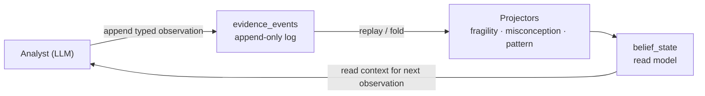

The engine is the reasoning core of Stemolly. It records every observation about a student as a permanent, append-only fact, then derives beliefs — fragility, misconceptions, reasoning patterns — as rebuildable projections over that log. This page is a map to the deeper pages in this section.

## The big picture

The engine's architecture rests on one principle: **evidence events are the source of truth; beliefs are derived, never stored directly.** When the belief model turns out to be wrong — which is expected at this stage — the projection code is rewritten and replayed over the unchanged log instead of losing real student data.

The **command side** (append evidence) and the **query side** (fold beliefs) never call each other — they meet only through the persisted log. This separation is what makes "truncate the projections and replay the log" produce identical state: if the write path could call the derive path, replay could diverge from what was live.

## Pages in this section

| Page | What it covers |
|---|---|
| [Event Sourcing & Evidence Schema](./event-sourcing-evidence) | Append-only foundation, CQRS split, envelope/payload schema, three observation types, altitude rule, idempotency key evolution, catalog-ref integrity |
| [Projectors & Promotion Gates](./projectors) | Replay pipeline, three belief-layer folds — fragility FSM, misconception FSM, pattern accumulator — promotion gates, root-cause overlay |
| [Node Identity & Alias Merge](./node-identity-alias-merge) | Three-identifier node model, slug mutability, alias resolution mechanics, merge correctness gaps, slug-shaped operator surface |
| [Catalog Lifecycle](./catalog-lifecycle) | Four-status lifecycle, candidate → approved/rejected flow, read-time trust, re-propose guard, pattern valence |
| [Study Anchors & Assignment Briefs](./study-anchor-briefs) | Engine-owned study anchor entity, concept-gaps tracking, brief answer contracts, ingestion workflow |
| [Hexagonal Module Structure](./hexagonal-structure) | Orchestration in `module.ts`, leaf-adapter invariant, near-identical twin types at the port boundary |
