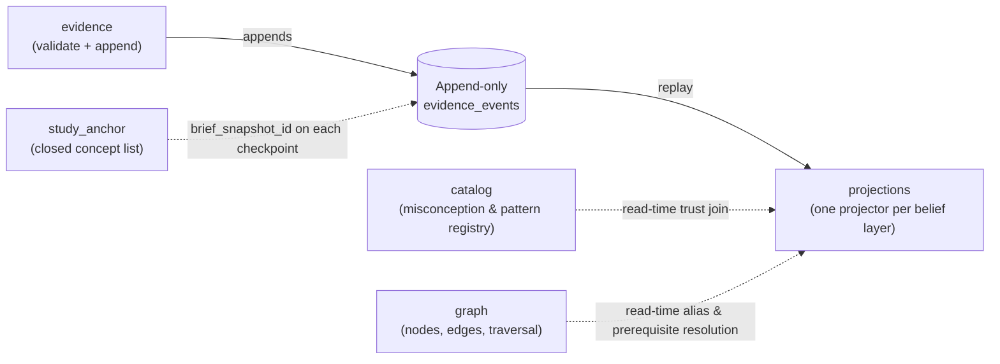

The engine's whole job is to turn raw, observed student behavior into a trustworthy picture of what a student believes — without ever losing the ability to change its mind about how it computes that picture. It does this with one big structural choice: record observations permanently, and treat everything the engine "knows" about a student as something computed fresh from those records, not something stored and edited directly.

That one choice shapes everything else here. This section walks through six parts of the story:

- **[Event Log and the Evidence Schema](/engine/engine-impl/event-sourcing-evidence/)** — why observations are append-only, what one evidence event actually contains, and the chain of integrity fixes that hardened it as real usage exposed gaps.
- **[The Three Belief Projectors](/engine/engine-impl/projectors/)** — how the engine derives fragility, misconceptions, and reasoning patterns from the same log, each behind its own kind of promotion gate.
- **[Node Identity and Alias-Merge](/engine/engine-impl/node-identity-alias-merge/)** — the three names one concept carries, what happens when two concepts turn out to be the same one, and the long-running effort to get that merge right everywhere.
- **[Catalog Entry Lifecycle](/engine/engine-impl/catalog-lifecycle/)** — how a misconception or reasoning-pattern entry moves between candidate, approved, and rejected, why that status can flip with no rebuild, and how concept-gap reports create a measurement of seeding quality.
- **[Study Anchor, Briefs, and the Evidence Link](/engine/engine-impl/study-anchor-briefs/)** — how the engine stores a session's closed concept list, how an assignment brief structures its answer key, and how both tie into the evidence log.
- **[Hexagonal Structure: Engine-Specific Lessons](/engine/engine-impl/hexagonal-structure/)** — a few sharp, engine-specific lessons about where domain vocabulary is allowed to live and where the module's port boundaries went wrong.

At the center of all six is one split: a **write side** that only ever appends typed observations, and a **read side** that derives everything else by replaying them. The two never call each other directly.

Because the write side knows nothing about how beliefs are computed, the derivation code can be rewritten and the whole log replayed to get a fresh, consistent belief state — which matters a lot for a system whose belief model is expected to be wrong early on and cheap to fix later. The study anchor and assignment briefs are authored inputs that scope what a session covers and what counts as a correct answer — they feed the log but are not themselves derived from it.
