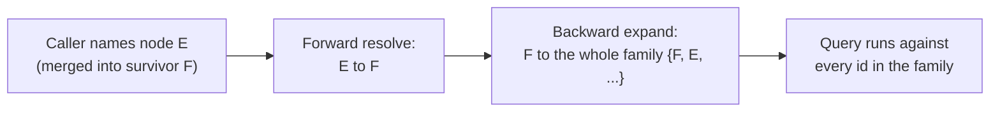
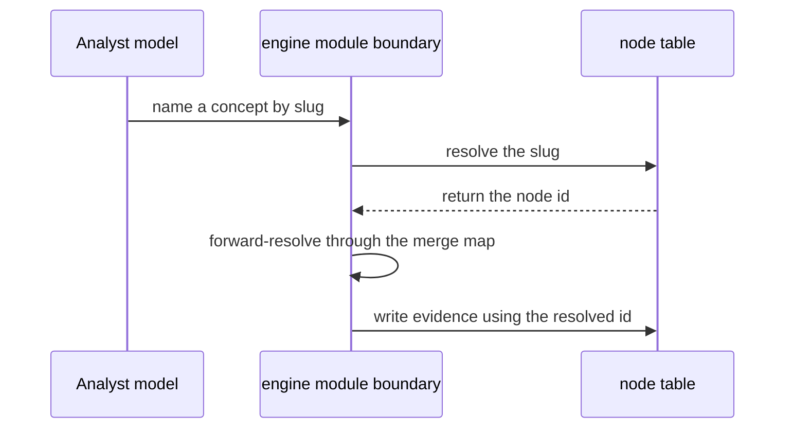

A concept in the engine is called a "node." Every node carries three different names, for three different readers, and none of them can be dropped or merged into another:

| Identifier | Stable? | Meaningful? | Who it's for |
|---|---|---|---|
| `id` (uuid) | Yes — never changes | No — carries no meaning | The database, and every foreign key |
| `slug` (e.g. `fraction-equivalence`) | Yes | Yes | Non-human readers that process language: prompts, seed files, logs |
| `display_name` (a per-locale text map) | No — may be reworded or translated any time | Yes | Humans, in their own language |

The uuid is stable but meaningless; the display name is meaningful but volatile; the slug is the only one that is both stable and meaningful, which is exactly what a language-processing, non-database caller like a model needs. Collapsing any two costs something concrete: making the slug the primary key would break the promise that an id never carries meaning, since renaming a concept would then have to rewrite every reference to it or else strand old evidence; dropping the slug forces model-facing code back onto a uuid nobody can read or verify; dropping the localized name leaves nothing legible to a human, or to a model working in a language other than English. This three-way split is also why author-written names (node names, catalog entry labels) are stored as a locale map directly in the row, rather than in a frontend translation file — the set of names grows after deploy, as an author approves new content, so a build-time translation file would always be stale.

## Slugs are mutable — only the uuid is durable

A slug looks stable in practice, but it is in the same class as `display_name`: a mutable display key. This matters everywhere something needs to remember *which node* — **the only durable reference to a node is its uuid**, and only `core/module.ts` may turn that uuid back into a current slug.

This was settled not by convention but by a concrete design question. A new artifact — the study anchor — needed to hold node references. The answer decided everything: because a slug can be renamed, an anchor storing bare slugs would be orphaned by any rename event. So the anchor stores ids, and can only be read through the engine.

The two drift cases behave differently and only one is safe:

- After a **merge**, a stored slug still works — the merged-away row keeps its slug, and `resolveSlugs` finds it and forwards to the survivor.
- After a **rename**, a stored slug resolves to nothing, and `appendCheckpointBatch` throws and discards the whole checkpoint's observations rather than silently attaching them to a wrong or missing node.

Declaring slugs *immutable* was the close alternative and lost on one point: a slug naming the *wrong concept* is not cosmetic, and the only fix would then be seed-a-new-node-and-merge — permanently recording the two as one concept when one was simply a mistake. The rename operation is deliberately not built; the constraint on stored references binds without it. The part the engine cannot enforce is a slug written into a file, a skill prompt, or a transcript — those are exactly the places where it is most likely to appear.

## Finding an existing slug: bounded lookup only

A second ingestion run — covering concepts the first run already seeded — creates a practical problem. The anchor must carry those existing slugs spelled exactly, or `appendCheckpointBatch` throws. But neither `resolveSlugs` nor `lookupSlugs` can supply them: both require the caller to already hold the reference. And `seedNode` is an idempotent upsert on `slug`, so a second spelling of the same concept silently creates a second node and splits that concept's evidence permanently, in a table whose trigger blocks `UPDATE` and `DELETE`.

The answer is `GraphRepository.matchNodes(terms, limit?)`, backed by `pg_trgm` (PostgreSQL's trigram similarity extension) over `slug` and the `display_name` JSON values. It returns `{ slug, displayName, score }` with hits alias-resolved in `core/module.ts`, and it is surfaced only as the `match_nodes` tool on the **operator** MCP tool-set — never on the student surface.

Three properties make it a genuine bound rather than a convention:

1. An empty `terms` argument throws — the tool cannot be called without naming what you seek.
2. The engine owns a maximum `limit` ceiling the caller cannot exceed.
3. A minimum similarity threshold in SQL means a term resembling nothing returns nothing.

A per-call row cap alone would not do the job: a caller could issue the same read repeatedly with different terms and accumulate the full graph a page at a time. What actually stops that is the relevance threshold — iterating junk terms buys no rows, so obtaining a reference requires already knowing roughly what you are looking for. That is exactly the property a preparer at a second ingestion run is supposed to have.

The boundary that ADR-030's original no-listing rule was protecting is still intact: anchor *membership* comes from the material, and the lookup answers only "what is this concept already called?" — never "what concepts belong here?"

## When two concepts turn out to be one

Sometimes two nodes turn out to name the same concept, and an operator merges one into the other. The engine records this merge by writing exactly one column — the retired node's `merged_into` field, pointing at the survivor — and changes nothing else. No edge, no catalog entry, and no evidence row is rewritten.

That decision followed from one hard fact: the evidence table is append-only by database trigger, so a merge can never rewrite the node id already stored on past observations. Since read-time resolution of the merge is *mandatory* for evidence no matter what, remapping edges and catalog rows at merge time would only have been a second mechanism bolted alongside the one still required — and it would also have destroyed the ability to reverse a bad merge, turning a reversible operator judgment into a one-way door. So the whole engine follows one discipline instead: keep the raw facts as written, and resolve who's-who only at the moment something is read. This is the same discipline the append-only evidence log already uses, extended to node identity.

Early on, this discipline existed only as an intention, not as an enforced rule — the schema fully supported "evidence follows the survivor," but nothing actually walked `merged_into` on any read or write path, so a merged concept's prerequisites, catalog matches, and evidence all silently stayed scattered across the old and new ids. Because there was no runtime symptom yet (the merge operation had no real caller), the gap went unnoticed until it was deliberately worked through and closed.

## Two operations, opposite directions

Resolving a merged identity is commonly thought of as one operation — look up a retired id's survivor — but the engine actually needs two, pointing opposite ways:

- **Forward** resolution (`resolveAlias`): many-to-one, turns any node id into its survivor. Applied to every id *leaving* the engine.
- **Backward** expansion (`expandAliases`): one-to-many and transitive, turns a survivor into its whole alias family. Applied to every id *entering* a query against a table that stores historical, pre-merge ids.

The backward step is the non-obvious one. After E merges into F, F's prerequisite links are still stored on rows written against E — F has no edges of its own — so resolving forward to F and stopping there finds nothing. The query has to expand back out to the whole family before it runs, and it has to do this at *every* hop of a multi-step traversal, not just the starting point, or the walk breaks the moment it crosses an aliased link.

Composing these two steps in the wrong order, or skipping one, produced a real, shipped bug: querying the merged-away alias directly runs backward expansion on `E` alone, which returns only `{E}` (nothing ever merges into an alias), silently missing everything that actually belongs to the survivor and its other aliases. The fix is to always resolve forward first, then expand backward from the result.

## The family of bugs this composition kept producing

Getting "resolve forward, then expand backward" right at every read site — not just the first one — took several separate fixes, because each site had to be caught on its own; correcting one did not automatically fix the others.

| Where | What went wrong | The fix |
|---|---|---|
| Prerequisite results | Raw, unresolved ids came back with a database-level `DISTINCT`, but that distinctness disappears once the caller resolves each id forward — two different raw ids can both resolve to the same survivor and show up as a duplicate | Deduplicate *after* forward-resolving, not before |
| Self-exclusion | An explicit "exclude the queried node from its own results" filter was dropped when resolution moved into the core module | Not a real regression: once forward-resolve happens before backward-expand, the seed set already contains every alias of the queried node, so it can never appear in its own results by construction |
| Batch reads | Looping over many nodes and calling the standalone lookup function per node re-fetches the whole merge map every time | A batch caller fetches the merge map once and passes it down to a shared internal helper, instead of going through the per-node public function |
| Belief-state filters | A model-supplied concept name (slug) was resolved to an id, but that id was then used raw — never forward-resolved — so a merged concept's belief state read back as "unprobed" under its old, pre-merge name | Forward-resolve and deduplicate immediately after resolving a slug to an id, before using it anywhere |
| Slug lookup | A merged-away node's slug is never deleted or reassigned, so looking it up still succeeds and returns a live-looking, but wrong, node id | Treat slug-to-id resolution as never the last step — always forward-resolve what it returns before comparing, keying, or handing it back out |

The batch-read regression is worth noting on its own: routing a batch through the convenient, standalone per-node function is the natural, readable thing to write, produces identical results, and passes every test — only the number of database round-trips changes, which is exactly the kind of thing no test or check catches by itself.

The belief-state bug is the sharpest example of how quietly this can fail. Two separate defects from the same missing forward-resolve step happened to cancel out in the one place they were checked — a set of "hint" concepts happened to still be right — which let two independent review passes mark the underlying behavior as correct when it wasn't, on the specific path a later change had introduced.

## The model-facing boundary: names by slug only

None of the engine's model-facing tools ever place a raw node uuid in a prompt or accept one as an argument — a model always names a concept by its slug, and the engine resolves that slug to an id at its own boundary, once per batch, before anything else runs.

This exists because a wrong slug and a wrong uuid fail very differently. A wrong slug matches no row and fails loudly, which an at-least-once retry already handles safely. A wrong uuid — for example, one digit transposed by the model — can succeed against the *wrong* concept, silently and permanently, since the evidence table blocks correction by trigger. That asymmetry is the whole argument for making slugs the only thing a model ever sees or writes.

This raised a bootstrapping question: how does a model ever learn the slug for a concept it has no prior evidence about? None of the four model-facing tools return a node id or slug for an unencountered concept — they all take a concept reference as an *input* the caller must already hold, and the one tool that *does* return a fresh node identity belongs to an operator role, never present in a student-facing process. Deriving a list of nameable concepts from the misconception/pattern registry covers only concepts that already have a catalog entry attached, which by itself is incomplete.

The chosen answer is to never derive that list from the engine at all. A **closed list of `{ slug, displayName }` pairs is authored up front**, alongside the same information a preparer already supplies when creating nodes, one list per prepared unit of study (an assignment in the current proof-of-concept; a lesson brief once a full authoring surface exists). The engine gains no way to enumerate its own graph in return — no "list all nodes" tool, nothing that scans by tag — the only two slug/id crossings stay resolving a caller's own references, never producing new ones. A whole-graph listing tool was considered and rejected twice, for the same underlying reason each time: it would put every node's slug into a model's context, which is exactly the unbounded exposure the closed-list approach exists to avoid.

:::caution
One gap in this closed list survives even after this fix. Two of the three observation types require a catalog reference and therefore only ever name a concept that already has a catalog entry — but the third type, a plain probe outcome, names a node directly and carries no catalog reference at all. A concept seeded with no catalogued misconception can never be handed to a session this way, so it can never receive a probe outcome. The failure is silent and looks exactly like ordinary missing data: that concept's fragility simply reads "unprobed" forever, indistinguishable from never having been tested at all, even though the student really was probed and the observation had nowhere to attach.
:::

## The operator surface gets the same discipline

The slug rule above had one carve-out: work done by a human operator in Console, a web page that already holds the uuid in its own state once a person clicks a node. The proof-of-concept has no Console. Instead, an operator drives the six node-creating and node-editing engine functions — `seedNode`, `seedEdge`, `seedCatalog`, and the three catalog-candidate transitions — through a Claude-based seed skill. Since there is no web page holding a uuid anywhere in this path, the reason for the carve-out does not apply, and the slug-only rule extends to cover this operator surface too, in both directions: arguments in, and results out.

Concretely, `seedEdge` takes `fromNodeSlug`/`toNodeSlug` instead of node ids, `seedCatalog` takes `homeNodeSlug`, and `seedCatalog` together with the three candidate-transition operations return a slug-shaped entry rather than one carrying a uuid. All of the resolving still happens in one place, the same module boundary used for the student-facing tools — no repository or adapter below that seam ever has to change, and no uuid moves past it.

Covering the *outputs*, not only the inputs, was a deliberate widening of an earlier, narrower plan. Looking only at where an operator could be made to *write* a wrong uuid catches two of the six operations and would have stopped there. But `seedNode` — the function that creates a node — was returning two raw uuids and no slug at all. An output is exactly how a uuid gets into an operator's hands in the first place, ready to be copied into a later call as if it were a legitimate reference; fixing only the input side would have left that copying path wide open.

**`mergeNodes` joined the slug-only surface.** What was written above was true when the slug-only operator rule was first settled: `mergeNodes` and `getPrerequisites` were both uuid-facing on the premise that no model reaches them — a merge is a human judgment call and `getPrerequisites` is an internal graph query. That premise broke for `mergeNodes` once `match_nodes` (the bounded concept lookup) was added to the operator MCP tool-set: the natural next step after finding a duplicate through `match_nodes` is to resolve it by merging, which a model-driven seed skill now does. Since the tool is reachable by a model, the wrong-uuid hazard applies, and `mergeNodes` now takes `survivorSlug`/`aliasSlug` resolved in `core/module.ts` the same way as the other six operations. Adapters and the merge-write logic are unchanged — only the driving contract and the module boundary became slug-aware.

`getPrerequisites` is the sole remaining carve-out: it is not on the MCP and no model reaches it. Catalog-entry ids are also left as-is for now.

:::caution
A merge is still irreversible. A wrong survivor/alias slug pair is an unrecoverable evidence-folding mistake — splitting a merge back apart is not a supported operation. The slug boundary changes the *failure mode* rather than removing the risk: a wrong slug almost always resolves to nothing and fails loudly before any write, while a wrong uuid could silently name the wrong node. But "fails loudly" still means a merge did not happen, which may itself be a problem if it happens mid-session.
:::

## Open gap: getPrerequisites and catalog resolution after a merge

The engine now has a real production entry point into `mergeNodes`: the `merge_nodes` MCP tool routes through `main.ts → mcp-server.ts → operator.ts → EngineModuleApi.mergeNodes`. This means the first operator-driven merge against accumulated data is one call away.

One gap that was previously dormant is now live. `getPrerequisites` does not resolve merged node ids — it walks the prerequisite graph using the raw id given to it, so if a node was merged away, its prerequisites are no longer reachable via the survivor's id. Similarly, `matchCatalog`'s `home_node_id` lookups do not resolve merged ids. The evidence half of this gap was closed when ADR-024 added read-time forward resolution to the evidence fold — all stored evidence is correctly unified onto the survivor on every projection. But the graph half (`getPrerequisites`) and the catalog half (`matchCatalog`) were explicitly left untouched when `mergeNodes` joined the MCP surface, because they required a genuine decision rather than a mechanical port-shape change.

The projection fix is cheap to defer: beliefs are rebuildable projections over the log, so adding resolution to the fold and rebuilding retroactively consolidates every historical event. The graph and catalog halves need a real decision, because edges and catalog home nodes are mutable state rather than projections — either remap them at merge time, or resolve at every read entry point.

## A schema gap: `edges.type` is unconstrained

`engine.edges.type` is plain `text` with no `CHECK` constraint. The engine's only graph traversal — a recursive CTE in `getPrerequisites` — filters on the single literal `type = 'prereq'`. An edge seeded as `'prerequisite'`, `'Prereq'`, or `'prereq '` is accepted by both the database and the TypeScript compiler, then silently never walked. The concept appears to have no prerequisites, with no error and no log entry, because the failure looks exactly like an absence.

The sibling catalog tables take the opposite approach — `status` carries a DB-level `CHECK` over its known values, so a typo there fails loudly. The asymmetry is not an oversight: leaving `edges.type` open is the correct posture for a column that is supposed to accept opaque domain edge kinds alongside the structural ones. Any constraint has to respect that.

This leaves a real but accepted gap: a mistyped edge kind always silently becomes a domain edge. Candidates for closing it — a TypeScript union on the seed input, validation at the MCP trust boundary, or a format-only regex at the call site — are worth settling before the MCP exposes edge seeding at full scale.
