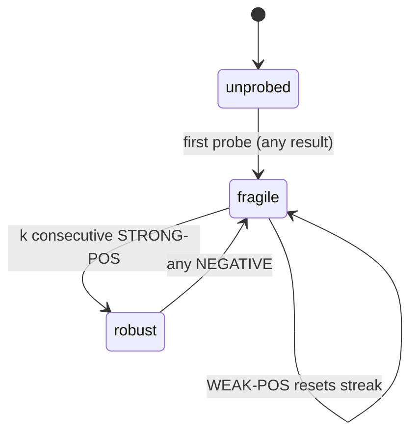
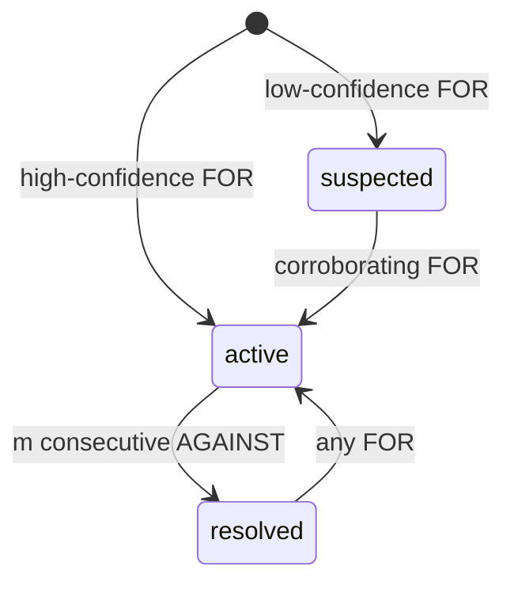
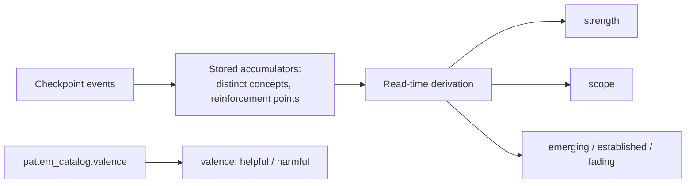

The engine derives three independent kinds of belief from the same evidence log. Each belief layer has its own projector — a fold function — its own state machine, and its own promotion gate. The gates are deliberately different because each layer makes a different kind of claim, and the strength of evidence required must match the strength of the claim.

Every fold is a **reversible projection**. Rewriting the fold logic and replaying the log produces a corrected belief state. Calibration knobs (`k`, `m`, thresholds) are left tunable precisely because the right values will only be known from real data.

## How belief replay works

`PgEvidenceQueryRepository.getEvidenceEvents()` reads one student's evidence rows, ordered by the database-assigned `seq` column. The replay runtime then:

1. Groups rows by `checkpoint_id`.
2. Orders checkpoints by each group's minimum `ts`, using `checkpoint_id` as the tiebreak.
3. Folds fragility, misconception, and pattern state across that ordered stream.
4. Joins trusted catalog entries and prerequisite closures as read-time overlays.
5. Remaps survivor node ids back to slugs for the public view.

Merge aliases are normalized before folding — pre-merge evidence and pre-merge catalog home nodes surface under the current survivor without rewriting stored rows.

## Rules every fold obeys

Two invariants cut across all three layers.

**Beliefs are sticky, except patterns.** A checkpoint that produces no evidence about a belief leaves it unchanged — absence of evidence is not evidence of anything. A wrong belief does not heal itself; a fragile grip does not become solid by itself. Both misconceptions and fragility persist until new evidence moves them. Reasoning patterns are the deliberate exception (see the pattern section below).

The Analyst reads stored belief state as context for deciding what to observe next. It must never re-emit that stored state as a new event. Re-emitting would double-count evidence and turn an observation into a conclusion. Only a genuine new observation from the current attempt is ever appended.

**Zero evidence must yield no instance.** Every value in every layer's vocabulary already means "something was observed." `suspected` means a misconception was seen once, weakly. `emerging` means a pattern has been reinforced at least once. There is no word for "nothing is known yet." Returning any state for a student with no evidence is a false positive. The fold returns `null` — no instance at all — when it has seen nothing for a given student. This was violated once in a way that stayed green through a full test suite: the misconception fold collapsed its internal "never observed" sentinel to `suspected` on the way out, so every brand-new student appeared weakly suspected of every documented misconception in the catalog, with noise scaling with the catalog size rather than anything the student had done.

## The promotion-gate principle

Each layer's promotion gate is shaped by what that layer actually asserts:

| Layer | Claim | Gate |
|---|---|---|
| Fragility | Holds up under repeated probing | **Repetition** — `k` consecutive strong-positive checkpoints |
| Misconception | The student holds a specific wrong belief | **Confidence** — one high-confidence observation suffices |
| Reasoning pattern | A cross-cutting habit across topics | **Breadth** — seen across `d` distinct concepts |

The three folds share the same checkpoint-netted machinery but deliberately differ in their promotion conditions. A layer must not over-claim without the specific kind of evidence its claim demands.

## Fragility: consistency over time

Fragility moves through three states — `unprobed`, `fragile`, `robust` — by a two-stage process.

**Stage 1 — Net the checkpoint.** The fold scans all events for a node within one checkpoint and produces one signal, regardless of event order inside the checkpoint:
- `STRONG-POS` — correct, unassisted, high confidence.
- `WEAK-POS` — correct but scaffolded, low confidence, or self-corrected.
- `NEGATIVE` — incorrect, or a standing misconception.

`scaffold_stamp` and `confidence` determine the bucket. This netting is **order-independent** — the same signal regardless of how events are sequenced within a checkpoint.

**Stage 2 — Drive the FSM.**

One correct answer never reaches `robust` — even a clean first probe goes only to `fragile`. `robust` is earned by `k` consecutive `STRONG-POS` with no intervening `NEGATIVE` (default `k = 2`, a calibration knob). A `WEAK-POS` resets the streak without regressing state. Regression is deliberately sensitive: one `NEGATIVE` drops a `robust` concept straight back to `fragile`, because a concept thought solid that then fails is exactly the hidden-risk signal this layer exists to catch.

## Misconception: a specific wrong belief

The misconception projector derives a per-`(student, node, catalogRef)` instance through a 3-state FSM with the opposite asymmetry from fragility.

**Activation is fast, gated by confidence.** One high-confidence `FOR` goes straight to `active`. A wrong belief can be established from one clear observation. A low-confidence `FOR` lands in `suspected` and needs corroboration.

**Resolution is slow and requires accumulation.** `active → resolved` needs `m` consecutive `AGAINST` with no intervening `FOR` (default `m = 2`). Re-activation on a later `FOR` is sensitive — mirrors fragility's regression.

**Why the asymmetry?** False positives harm groundedness precision (the headline metric), so activation is confidence-gated. Premature resolution abandons a live misconception, so resolution is conservative. The two error costs are not equal.

The instance is keyed on the catalog entry's **home node**, not the surfacing node, to avoid cross-node duplicates. It is headline-trusted only when **both** conditions hold: the fold says `active`, and the catalog entry's status is `seeded` or `approved`. These are two orthogonal trust gates, both evaluated at read time.

**The catalog-status gate is a read-time join.** It is deliberately not baked into the fold. When an operator approves a candidate entry that existing evidence already references, the upgrade to trusted is instant — a plain status flip, no replay. Keeping the fold independent of catalog status also preserves deterministic replay.

**Order sensitivity.** Unlike fragility, the misconception fold counts *consecutive* `AGAINST` events toward resolution — sequence is load-bearing. An `active` misconception meeting `[FOR, AGAINST, AGAINST]` in one checkpoint resolves; `[AGAINST, AGAINST, FOR]` does not. This is the fold to check first whenever the event pipeline's ordering changes.

## Reasoning patterns: a cross-cutting habit

The pattern projector is an accumulator keyed on `(student, patternRef)` — **cross-node**, unlike the per-node fragility and misconception folds. A pattern is a recency-weighted tendency: its status changes as time passes even with no new evidence, so the fold stores only minimal accumulators and derives most state at read time.

**Stored accumulators:**
- The set of distinct concept nodes the pattern has appeared on.
- Reinforcement points `(checkpoint, confidence)`.
- First/last-reinforced checkpoints.

**Derived at read time:**
- `strength` — recency-weighted over checkpoint distance.
- `scope` — count of distinct concepts.
- `status` — `emerging`, `established`, or `fading`.
- `valence` — from the matched trusted catalog entry (`helpful` / `harmful`).

Stage-1 netting reinforces a pattern at most once per checkpoint (net confidence = max, breadth = union of all referenced concepts). **Establishment** requires breadth: reinforced on ≥ `d` distinct checkpoints spanning ≥ `d` distinct concepts. This prevents a single rich multi-concept attempt from being mistaken for a cross-cutting habit. Strength and recency then govern only the `established ↔ fading` transition.

**Fading is measured in evidence-time, not wall-clock time.** "Now" is the log's latest checkpoint. A pattern fades as the student does other work without exhibiting it. A dormant account's patterns never fade — accepted for the PoC. Calendar-based fading is rejected: it would make the derived status non-reproducible on replay.

**Patterns are the deliberate exception to belief stickiness.** A misconception does not vanish on its own; a fragile grip does not self-heal. But a reasoning habit is only as strong as its recent practice, so patterns fade rather than persist. A wrong belief or a shallow grip is a latent fact that stays true until disconfirmed; a habit is genuinely different when it is not being practiced.

**Valence is fold-blind.** The fold accumulates patterns without caring whether they are helpful or harmful — that distinction is orthogonal catalog metadata. Consumers act on valence; the fold does not.

## Root-cause hints: an opt-in overlay

When a downstream concept is queried, the engine can emit hints explaining why it is at risk based on upstream misconceptions. This is an **opt-in overlay**, not stored state.

`buildRootCauses()` only iterates the explicitly queried nodes (`filters.nodeIds`). Calling `getBeliefState(studentId)` with no `nodeSlugs` filter returns an empty `rootCauses` array even if prerequisite misconceptions exist elsewhere in the graph. For each queried downstream node, the engine:

1. Computes the prerequisite closure (walking edges upward).
2. Compares closure node ids against catalog `homeNodeId`s, after merge resolution.
3. Emits hints only for instances currently `active` and whose catalog entry is in the trusted read set.

This keeps root-cause output a targeted explanation — "why is this node at risk?" — rather than a full-graph materialization pass. Callers that need root-cause hints must ask about specific nodes.
