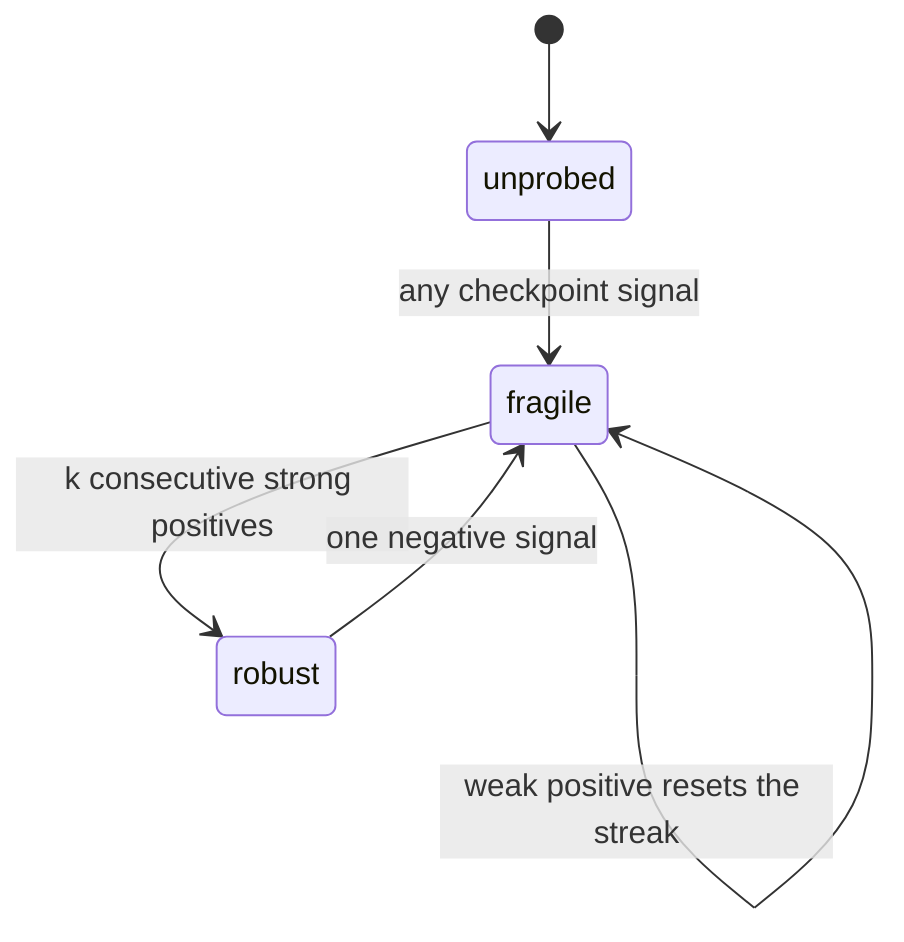
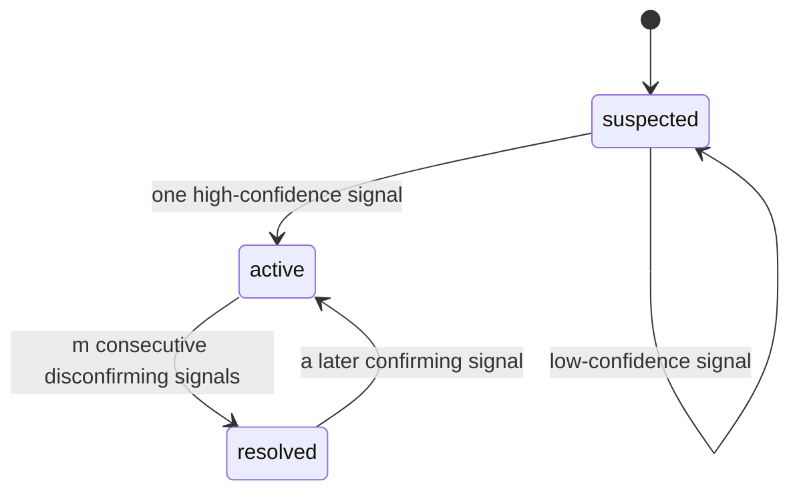
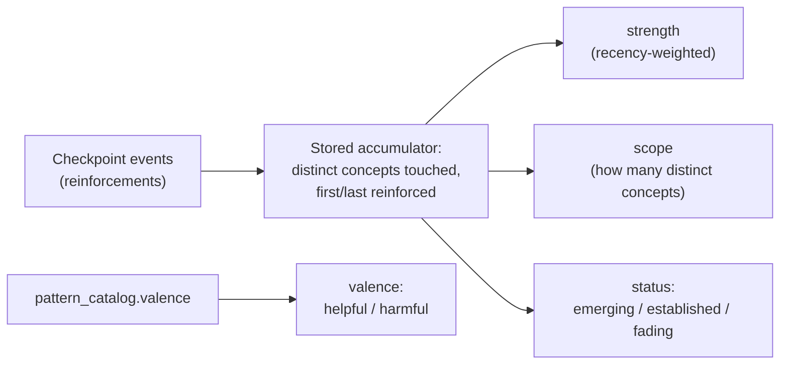

Three belief layers are computed from the same evidence log: **fragility** (does a concept hold up under pressure), **misconceptions** (does the student hold a specific wrong belief), and **reasoning patterns** (does the student show a cross-cutting habit). All three read the same checkpoint-grouped stream of observations, but each derives a different kind of claim — and the engine deliberately gives each one a different bar for making that claim.

## Same machinery, different honesty rules

Each layer's promotion gate is shaped by what that layer actually asserts, not by a shared default. Fragility claims **consistency over time**, so its strongest state is earned only by repetition. A misconception claims a **specific wrong belief**, which one clear observation can establish, so it can activate off a single high-confidence signal. A reasoning pattern claims a **cross-cutting habit**, so it needs **breadth** — seen across several different concepts, not repeated many times on one. None of the three folds is allowed to over-claim without the specific kind of evidence its claim demands — the same underlying rule as "an unprobed concept is never robust," applied three different ways.

| Layer | What it claims | What promotes it |
|---|---|---|
| Fragility | This concept holds up under repeated probing | Repetition — several consecutive strong, unassisted correct answers |
| Misconception | The student holds this specific wrong belief | One clear, high-confidence observation |
| Reasoning pattern | The student shows this habit across topics | Breadth — the pattern shows up on several distinct concepts |

## Fragility: earn robust slowly, lose it fast

Fragility moves through three states — `unprobed`, `fragile`, `robust` — by a two-stage process. First, each checkpoint's events for a node are netted into one signal: a strong positive (correct, unassisted, high-confidence), a weak positive (correct but scaffolded, low-confidence, or self-corrected), or a negative (incorrect, or a standing misconception). Second, that signal drives the state machine.

One correct answer is never enough to reach `robust` — even a clean first attempt only earns `fragile`. `robust` requires `k` consecutive strong-positive checkpoints with no negative in between (the default is 2, and it's a calibration knob left open for real data). A weak positive resets the streak. Regression is deliberately sensitive: a single negative drops a `robust` concept straight back to `fragile`, because a concept that was thought solid and then fails is exactly the hidden-risk signal this layer exists to catch. This scaffold- and confidence-aware netting is what makes fragility mean "holds up under probing" rather than just "got it right eventually."

## Misconceptions: activate fast, resolve slow

The misconception layer is the inverse asymmetry. Each `(student, concept, misconception)` combination moves through `suspected`, `active`, `resolved`.

Activation is fast and confidence-gated: one clear, high-confidence observation is enough to call a misconception `active`, because holding a specific wrong belief can genuinely be true from a single clear moment. A low-confidence signal only reaches `suspected` and needs corroboration. Resolution, by contrast, is slow and requires accumulation — moving from `active` to `resolved` needs several consecutive disconfirming observations (the default is 2) with nothing confirming in between, and a later confirming observation re-activates it just as sensitively as fragility regresses.

The asymmetry follows directly from what a wrong call costs in each direction: a false positive here damages the headline accuracy metric, so activation is guarded; declaring a live misconception resolved too early abandons a real, unaddressed problem, so resolution is conservative. An instance is only treated as trustworthy for reporting when it is `active` **and** the catalog entry it points at has been approved (rather than still being a candidate) — two independent checks that both have to pass.

## Reasoning patterns: the one belief layer that fades

Reasoning patterns behave differently from the other two on purpose. A pattern is keyed cross-node, on `(student, pattern)` rather than per-concept, and instead of storing a state directly, the engine stores only small accumulators — which distinct concepts the pattern has shown up on, and when — and derives everything else fresh each time it's read.

A pattern is promoted to `established` by a single **breadth gate** — reinforced across enough distinct checkpoints spanning enough distinct concepts — which is what stops both a single narrow habit and one unusually rich multi-concept attempt from being mistaken for a genuine cross-cutting tendency. Strength and recency then only govern the ongoing `established ↔ fading` swing.

Fading is measured in **evidence-time**, not calendar time: "now" is defined as the log's latest checkpoint, and a pattern fades in units of checkpoint distance as the student does other work without showing it. This keeps the same evidence log always producing the same answer on replay — a wall-clock-based fade would make the derived status silently change even with no new evidence. One accepted consequence: a dormant account's patterns never fade, which the engine treats as fine for a single actively-used student.

Whether a pattern is worth reinforcing or worth interrupting — its **valence**, helpful or harmful — is read from the matched trusted catalog entry rather than computed by the fold at all. It lives as a real column on the pattern side of the catalog only; a misconception is harmful by definition, so it needs no equivalent column. Valence is content, not trust, so an idempotent catalog re-seed is allowed to update it even though the catalog's approval status is never allowed to be downgraded that way. This matters at the point a client actually shows a pattern to someone: strength and status alone can't tell a coach whether an established pattern is good news or a problem.

## Rules every fold obeys

A few invariants cut across all three layers, and they exist to stop a fold from claiming more than the evidence actually supports.

**Beliefs are sticky, except patterns.** A checkpoint that produces no new evidence about a belief leaves it exactly as it was — absence of evidence is never treated as evidence of anything. This holds for misconceptions and fragility: a wrong belief doesn't heal itself, and a fragile grip doesn't spontaneously become solid, so both persist until new evidence moves them. Reasoning patterns are the deliberate exception, because a habit's current strength genuinely reflects recent behavior — so instead of holding stored state until moved, the pattern layer fades when not reinforced. This is also why the model that produces observations is only ever allowed to read stored belief state as context for deciding what to report — never to re-emit that stored state as a new event, which would double-count evidence and quietly turn an observation into a conclusion.

**No evidence must never look like a positive belief.** Every value in every belief vocabulary already means "something was observed" — there's no word in any of the three vocabularies for "nothing is known yet." This was violated in a way that stayed green through an entire test suite: the misconception fold correctly tracked an internal "never observed" marker but then collapsed it into the weakest real state on its way out, so every brand-new student appeared weakly suspected of every documented misconception in the whole catalog, with the noise scaling with the size of the catalog rather than anything the student had actually done. The fix makes "no instance at all" a first-class, distinguishable answer that the read side can skip entirely.

**Only the misconception fold cares about order within a checkpoint.** Fragility nets a checkpoint by scanning for the first negative signal, or otherwise flagging strong/weak positives — order-independent either way. The pattern fold nets by taking a maximum confidence and a set union — also order-independent. The misconception fold is the exception: it counts *consecutive* disconfirming observations toward resolution, resetting on any confirming one in between, so sequence is load-bearing. Concretely, one checkpoint carrying `[confirm, disconfirm, disconfirm]` resolves the misconception, while the same three events in the order `[disconfirm, disconfirm, confirm]` leave it active — the difference between telling a tutor the student is over it and telling the tutor to keep intervening. This is exactly why any bug in how events are ordered inside a checkpoint shows up first, and most sharply, in the misconception fold.

**Propagation is computed at read time, never stored.** When an upstream concept has an active misconception, every concept that depends on it is "at risk" — but this fact is never written onto the downstream concept's own stored belief. It's computed on read, by walking prerequisite links upward to find an active upstream belief. Storing it on every downstream node instead was rejected because one new prerequisite link, or one new upstream misconception, would have to fan out and rewrite many rows — and replay would then have to reproduce that exact fan-out. Keeping each fold a clean function of one concept's own evidence keeps every belief in one place; graph traversal only discovers an existing belief, it never invents one.
