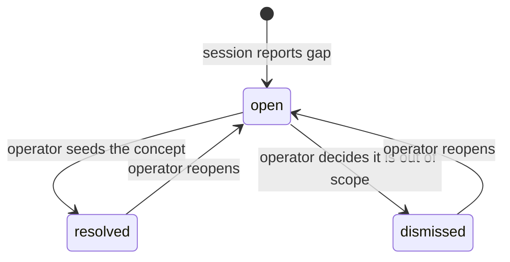

A tutoring session must know which concepts are "in scope" and what a correct answer looks like. Both are authored artifacts rather than computed data — but both feed the evidence log in precise ways, so they live under engine management rather than in free-standing files.

## The study anchor (ADR-037)

A **study anchor** is an engine-owned entity that holds the set of concept nodes for one piece of study material. It lives in two tables:
- `engine.study_anchors` — the anchor's readable natural key and a label.
- `engine.study_anchor_nodes` — member rows as **uuid foreign keys** to `engine.nodes`.

Because slugs are mutable, the anchor stores uuids, not names. Reading the anchor forward-resolves each stored uuid through the merge map and then to its **current** slug, so a member whose node was merged away is served under the survivor's name.

An anchor-file approach was the obvious alternative and was rejected on two grounds: a mutable slug means a file of names would drift after any rename, and only `core/module.ts` may resolve ids to slugs so the file could not be read anywhere else.

### Write operations

Two write operations exist, neither named `seed*` — the verb `seed*` in this engine means an incremental additive upsert, the opposite of what an anchor write does.

- **Create:** creates an anchor and throws if the id already exists. The anchor row and its members are written in a single atomic CTE, so a partial failure rolls both back.
- **Set members:** a full-replace write that replaces the entire member set. This is where a session's unseeded-concept report ends — after the operator seeds the missing nodes, the anchor is updated.

Member revision is not an edge case. It is the normal path for maintaining an anchor over multiple ingestion runs.

### Read behavior

`getStudyAnchor(id, lang)` falls back from the requested locale to English, then to the raw slug, rather than throwing on a missing translation. A caller never gets an error just because one node has not been translated yet.

`getStudyAnchor` throws when the given anchor id does not exist, instead of collapsing that case into the same empty-members response returned for a legitimately empty anchor. Treating a missing anchor the same as an empty one hides caller errors.

### No listing operation

There is no anchor-listing operation on any surface. An anchor is read by an id the caller was given. Listing all anchors would let a handful of calls reassemble the graph.

### How the anchor id reaches evidence

`append_evidence` accepts an explicit optional `briefSnapshotId` parameter — not an injected config value. Unlike student id or display language (which are stable for the lifetime of a single MCP process), which anchor is "in force" varies per session and per checkpoint — the property that makes config injection inappropriate here.

`brief_snapshot_id` is a nullable column. A checkpoint with no active anchor stores `null`. The column existed in the schema with all plumbing wired end-to-end, but was storing `null` for every checkpoint until the value was explicitly threaded through the call path — the structural readiness didn't mean the value was being populated.

## Concept-gaps tracking (ADR-038)

When a session meets a concept nobody seeded, it must record that omission — otherwise the signal that the seeding was incomplete is lost the moment the session ends.

**The channel that existed could not serve this need.** `propose_catalog_candidate` requires a home node slug that resolves. A concept with no node cannot even be the home of a proposal. The one existing session-to-operator channel was structurally closed to exactly this case.

ADR-038 adds `engine.concept_gaps`: one row per report, carrying a foreign key to the anchor that was short, the concept as free text, and a status the operator transitions. There is no deduplication key on `(anchorId, sessionId, term)` — two reports of the same concept in the same session remain as separate rows. `module.ts` applies a default view: calling `listConceptGaps()` without an explicit `statuses` argument returns only `open` gaps; the repository's raw read exposes all statuses when a caller explicitly names them.

`resolved` and `dismissed` must remain distinct — a real seeding miss and a concept deliberately kept out of scope are different measurements.

**The rate of these reports is the only measurement of how good the seeding was.** That is the stated reason node creation was kept off the session path. Without a destination, the signal the design paid for is lost.

Two limits are inherent and accepted:
- Nothing can check that a session *actually reports* a gap, so the count is a lower bound.
- Because the concept is free text, the table counts reports, not concepts.

### Concurrency safety

Concept-gap status transitions use a compare-and-swap guard: `UPDATE ... WHERE id = $1 AND status = $3`. Without the guard, two concurrent transitions on the same gap could silently overwrite each other. When the guard reports a conflict (no row matched), the operation throws rather than returning a fabricated success view.

`listConceptGaps` treats an explicit `statuses: []` filter as match-nothing, distinct from an omitted filter. An explicitly empty array asking for no results should not return all gaps.

## Assignment brief answer contracts

A **brief** is the set of facts an Analyst needs about an assignment at session time. It records what the correct answers are and how they relate to one another — not how to teach.

### Accepted vs. unfinished answers

A brief's answer field distinguishes two kinds of "technically right":

- **`accepted` forms** — mathematically equivalent to the canonical answer (e.g. `2/4` for `1/2`). An accepted match records no evidence.
- **`unfinished` forms** — correct but missing a required step (e.g. one root where the problem has two). An unfinished match records, at most, a pattern observation (a residual-step habit), never a misconception.

Collapsing this into one judgment risks writing "doesn't understand the concept" into an append-only evidence log for a student who was simply one step short. The distinction generalizes: in Physics, wrong units is a misconception; wrong significant figures is "unfinished" — same surface shape, opposite evidence weight.

### CAS-checkability per answer

Not every answer can be checked by a computer algebra system — `AD ⊥ BC` cannot; `x = ±√2` can. Ingestion declares an `answerKind` per answer (value / expression / set / inequality are CAS-eligible; geometric-relation / description / proof are not).

At session time the Analyst reads `kind` as data, not as an instruction to invoke a tool. An expression-shaped answer tells it a check is possible; a words-shaped answer tells it none is. The brief states what the answer is; each pedagogy's own logic decides what to do with that shape.

### Problem dependencies

A brief problem can declare `dependsOn`: the earlier problems whose results it consumes. This prevents double-counting: if problem 3's error is inherited from a wrong problem 2, there is no new misconception at problem 3.

It also drives the review session's sequence — the Guide can ask "do you think your answer to problem 3 was right?" rather than walking problems in page order. A self-correction under that nudge is stronger evidence than being corrected directly.

### Known risk: wrong answer key

Even after double-solve-with-CAS verification and operator review, a brief's answer key can still be wrong. Today there is no channel for a session to report this back. A student who answered correctly gets recorded as wrong in an append-only evidence log, and the mismatch is lost when the session ends.

This is a known backlog item. The natural fix would mirror the concept-gap channel (a session-filed row with a revisable operator verdict). It is deferred because the ingestion workflow makes it rare and the risk is treated as residual.

## Operator evidence audit

The operator can verify a belief by reading the evidence rows behind it. The engine provides one read that returns a student's evidence rows narrowed by the same filter type the belief read already uses — no new schema, no new port. Filtering and slug mapping happen in the orchestration layer, using the value already in hand from finding the belief.

The audit is kept off the student surface. A session has no business reviewing its own scaffolding history, and raw payloads would invite a model to reason about how it was previously coached.

## The ingestion workflow

Drafting an assignment brief's per-problem concept attribution cannot happen in one pass. The operator first works every problem and drafts the brief with concepts named as free text — which concepts are needed is only known after every problem has been worked. Then the operator reconciles those free-text terms against the graph (via `match_nodes`), seeds any genuinely new nodes through the before-the-write approval gate, and finally rewrites the brief's concept references as confirmed, current slugs.

The same authoring pass is split into two ingestion steps by the seeding gate sitting between them: draft-with-free-text, then seed, then attach-confirmed-slugs. This is a consequence of the graph's approval-before-write discipline, not an independent choice.
