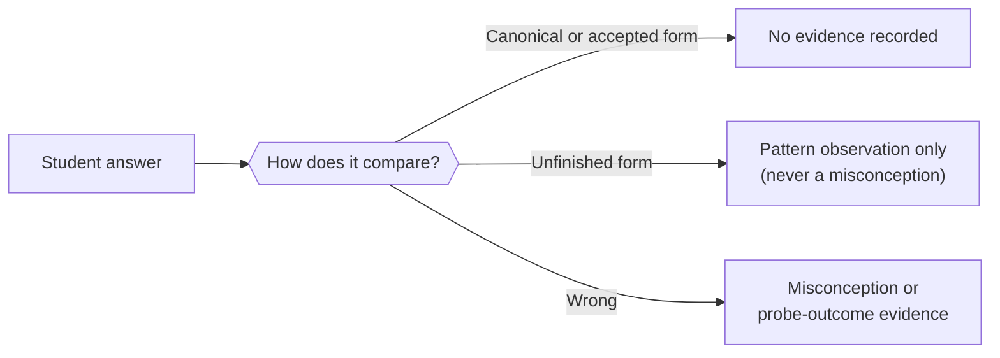

Two concerns meet here: the engine needs to tell a session model which concepts are in scope for a given unit of study, and a session model needs to know what a correct answer looks like for a given problem. Both are authored artifacts — not computed from the evidence log — but both feed the evidence log in precise ways, so they live under engine management rather than in free-standing files.

## What a study anchor is

A study anchor is the list of `{ slug, displayName }` pairs that represents the concepts a prepared unit of study covers. It is how a session model learns which concept slugs exist for the material at hand, without any enumeration of the concept graph.

The engine stores an anchor in two tables:

- `engine.study_anchors` — one row per anchor, with a readable natural key and a label.
- `engine.study_anchor_nodes` — membership as **uuid foreign keys** to `engine.nodes`.

Because a slug is a mutable display key, the anchor cannot store bare names — doing so would orphan memberships any time a concept is renamed. Because only `core/module.ts` may turn node ids into current slugs, the anchor holding ids cannot live outside the engine. An operator-owned file — the obvious alternative — fails on both counts.

Reading an anchor forward-resolves each stored uuid through the merge map, then maps each live id to its current slug. A member whose concept was later merged into another is served under the survivor's name, with no manual update needed.

### Create vs. replace members

The anchor's write surface is two explicitly distinct operations, not a single idempotent upsert:

- **Create** — writes the anchor row and its initial member rows as a single atomic statement, and throws if an anchor with that id already exists. Because both writes happen in one CTE, any member-insert failure (a duplicate node id or a foreign-key violation) rolls back the anchor row too.
- **Replace members** — a full-state write that replaces the current member set entirely.

The write is not named `seed*`, because every `seed*` operation in this engine is an additive, idempotent upsert into an open, growing collection. An anchor is a closed list written whole — borrowing the same verb would silently mislead any caller who has learned that `seedNode` is always additive.

Before writing, resolved member ids are deduplicated — so a caller passing the same concept slug twice (possibly under an alias slug and the survivor's slug) still produces one member row, not a duplicate-key error.

### How `getStudyAnchor` handles edge cases

Two behaviors are worth knowing before calling it:

- **A nonexistent anchor id causes a throw**, not an empty member list. The repository signals "no anchor at that id" differently from "anchor exists but has zero members," because collapsing both into the same empty response hides caller errors.
- **A missing translation never causes a throw.** When resolving each member's `displayName`, the engine falls back from the requested locale to English, then to the raw slug, rather than failing the whole read because one node lacks a translation in the requested language. A partially-translated anchor reads cleanly; only the untranslated member falls back, not the call.

## How the anchor id reaches the evidence log

When a session runs under a specific study anchor, the id of that anchor is recorded on each checkpoint's evidence rows in the `brief_snapshot_id` column. This creates a durable link from any future evidence-audit read back to the exact anchor that was in force when the observations were made.

The anchor id reaches `append_evidence` as an **explicit caller-supplied parameter** — the Analyst supplies it on each call. It does not follow the same config-injection pattern used for things like student id and display language (which are stable for the lifetime of a single MCP process and can be baked in at startup). Which anchor is "in force" can vary per session or checkpoint, so config injection does not apply here.

`brief_snapshot_id` is a nullable column. A checkpoint appended with no anchor in force stores `null`, unchanged from before this wiring was added. The column existed in the schema from earlier work — all the plumbing was in place — but every checkpoint was storing `null` because the value was never actually threaded through the call path until it was explicitly wired in.

## What a brief's answer key contains

An assignment brief is the authored document that records, for each problem, what the correct answer is and how the reviewing session should interpret student responses.

The answer structure does more than just state the expected value. It distinguishes two categories of correct-but-not-canonical answers:

- **Accepted forms** — mathematically equivalent to the canonical answer. For example, `2/4` and `1/2` are the same number; a student writing the unsimplified form is simply not wrong. Matching an accepted form records no evidence at all — it is the same answer.
- **Unfinished forms** — technically correct but missing a required step. For example, giving only one root for a quadratic equation with two roots, or leaving a fraction unsimplified when the problem asked for a simplified form. An unfinished match records at most a pattern observation (a habit of stopping short), never a misconception.

This split prevents a specific evidence quality problem: collapsing it into one judgment would risk writing "doesn't understand the concept" into an append-only log for a student who was simply one step short of done. The same shape appears across subjects — in Physics, wrong units is a genuine misconception while wrong significant figures is the same "unfinished" class as an unsimplified fraction, even though the surface error looks the same.

### Whether CAS-checking applies is a fact, not a runtime instruction

Not every answer can be checked by a computer algebra system (CAS) — `AD ⊥ BC` (a geometric relation) cannot be parsed as an expression, while `x = ±√2` can. The brief records an `answerKind` per answer at ingestion time, declaring whether it is CAS-eligible (`value`, `expression`, `set`, `inequality`) or not (`geometric-relation`, `description`, `proof`). The Analyst reads this at session time as a fact about what kind of answer this is, not as an instruction to invoke any particular tool.

The ingestion process uses the declared kind as the basis for cross-checking its own work: a declared-eligible answer is parsed and verified against the CAS; a declared-ineligible answer is verified by operator reading alone, flagged as having no independent check (which is where careful manual review should be focused first). Any disagreement between the declaration and what the CAS can parse is flagged for the operator to adjudicate.

### Problem dependencies

A brief problem can declare `dependsOn`: the earlier problems whose results it consumes. This serves two purposes. First, it prevents a false-positive misconception: if problem 3's error is entirely inherited from a wrong answer to problem 2, recording a fresh misconception against problem 3 double-counts the same underlying belief. Second, it shapes the review session's pedagogy — the reviewing Guide can ask "do you think your answer to problem 3 was right?" rather than walking problems in page order, which creates an opportunity for the student to self-diagnose the dependency chain. That self-correction is stronger evidence than being told directly.

### The answer key can still be wrong

Even after double-solve-with-CAS verification and operator review of each worked solution, a brief's answer key can still contain an error. If this happens during a live session, there is currently no channel for the session to report it back — a student who answered correctly gets recorded as incorrect in the append-only evidence log, and the mismatch is lost when the session ends.

This is a known gap. It is deliberately deferred rather than solved now, because the ingestion verification workflow exists precisely to make it rare, and the risk is treated as residual rather than primary. Solving it would require genuine engine work — a table, a driven port, and MCP tools — in the same shape as the concept-gap channel described in the catalog lifecycle page, but for answer-key errors rather than missing concept nodes. For now, the assumption is that thorough operator review at ingestion time catches most errors before a live session ever sees them.

## Two load-bearing properties of the anchor

These two constraints on the study anchor are easy to weaken and important to preserve:

**Anchor membership comes from the study material, not from a graph query.** The anchor is authored by a human reading the material and deciding which concepts are relevant. The `match_nodes` lookup that helps a preparer find an existing slug answers "what is this concept already called?" — it never answers "what concepts belong in this unit?" If those two questions collapsed into one, the anchor would silently start reflecting the shape of the graph rather than the shape of the material.

**There is no anchor-listing operation on any surface.** An anchor is read by an id the caller was given; nothing returns all anchors or searches them. Listing anchors would let a small number of calls reassemble an inventory of the concept graph that the engine deliberately keeps invisible.
