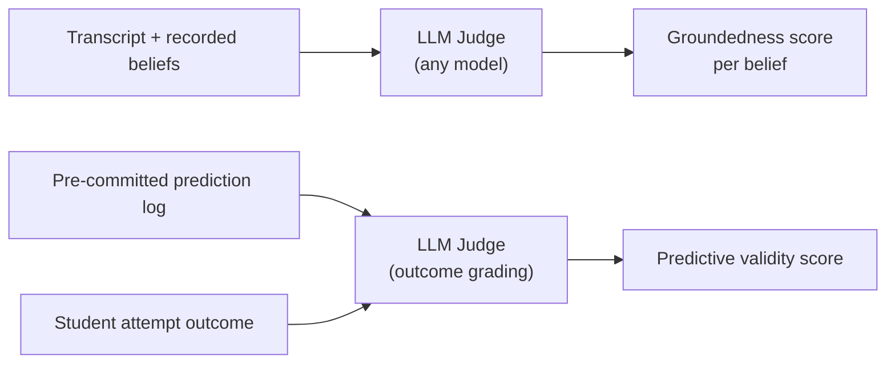
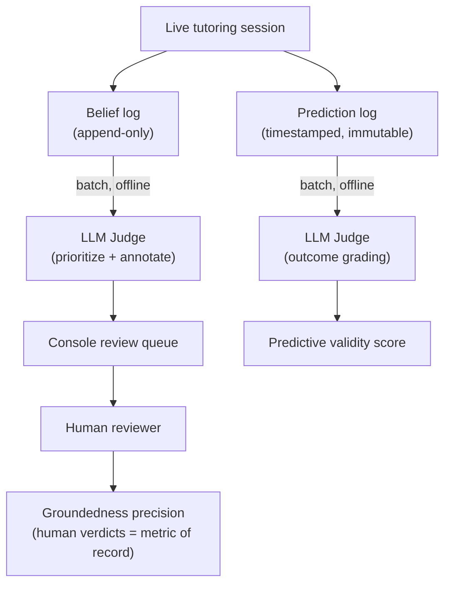

The mental-model engine makes a strong claim: it records *how a student actually thinks*, not just what topics they have covered. Proving that claim is harder than it might look. This page explains the two-level problem, the two metrics chosen to tackle it, how those metrics can fail, and the discipline required to keep them trustworthy.

---

## Two Levels of Correctness

Validation splits cleanly into two questions.

**Level 0 — does the plumbing work?** Does the engine save its belief model during a session, reload it in the next session, and actually pass it to the AI as context? This is a binary yes/no check. It is necessary, but it proves almost nothing: even a simple topic-completion tracker could pass Level 0.

**Level 1 — is the model true?** Does what the engine records actually match how the student thinks? This is where all convincing evidence lives. Any serious validation effort must rest on Level 1 signals, using Level 0 only as a pre-condition gate.

```
Level 0 (plumbing)   ──── gate ────▶  Level 1 (model is true)
     ✔ save / reload                   ✔ groundedness precision
     ✔ context supplied                ✔ predictive validity
```

---

## The Two Level-1 Metrics

Two signals were chosen to prove the engine at Level 1.

### Groundedness Precision

Sample the misconceptions the engine recorded. Read the actual conversation transcript for each one. Measure: **what fraction are genuinely correct?**

This metric is cheap — it works with roughly 10 students — and it is foundational. If groundedness precision is low, nothing else the engine does matters. It is the first thing to measure.

### Predictive Validity

Before the student attempts a novel problem, the engine emits a prediction: will this student succeed, and if not, where and why? After the attempt, compare the prediction to what actually happened.

This is the strongest falsifiable test available. It directly matches the core claim: that the engine's belief graph predicts *where a student will break*, not just where they have been.

A third signal — finding a student who looks "done" on a completion metric but whom the engine correctly flags with a hidden misconception — is the **demo case**. It cannot be manufactured; you find it in real data. But when it appears, it is the most persuasive single piece of evidence, because a completion tracker cannot see it.

---

## Failure Modes: Gaming and Leakage

Both metrics have a structural weakness. Neither is safe to report without extra discipline.

### Gaming Groundedness Precision

Groundedness precision can be maximized by an engine that records almost nothing. Every rare, cautious belief is easy to get right, so precision climbs — even though the engine is largely useless.

**The fix:** always report precision alongside a coverage measure — for example, beliefs recorded per session, or the fraction of sessions that surface at least one belief. Precision and coverage together are honest. Precision alone rewards an over-cautious engine.

```
High precision + low coverage  ──▶  caution bias, not quality
High precision + healthy coverage ──▶  genuine accuracy
```

### Leakage in Predictive Validity

Leakage means producing the prediction *after* the outcome is already visible. This makes the metric meaningless — the engine is just labeling history, not predicting the future.

**The fix:** every prediction must be written to an **immutable, timestamped log** before the student attempts the novel problem. The outcome-grading step happens strictly afterward, in a separate step. This also implies the belief graph's data model needs a dedicated prediction log, not just the current-state belief store.

---

## Operationalizing Predictive Validity: Novel-Problem Checkpoints

A metric needs a concrete trigger. For predictive validity, that trigger is a **novel-problem checkpoint** — a point in the Socratic dialogue where the engine stops, commits its prediction, and only then lets the student attempt the problem.

Two kinds of checkpoints exist:

| Kind | Description | Role |
|---|---|---|
| **Authored seed transfer problems** | Identical problems used across all students | **Anchor set** — makes scores comparable student-to-student |
| **AI-chosen novel moments** | Any genuinely new problem the tutor poses | Adds volume and coverage across the whole graph |

Using both was a deliberate choice. Restricting checkpoints to authored seeds only would have kept the metric clean and comparable but gated coverage behind authoring effort. AI-chosen checkpoints broaden the signal considerably — the cost is a reliable "about to pose something genuinely novel" detector.

**Prediction granularity — one prediction, one attempt.** A prediction is bound to exactly one novel-problem attempt and its single outcome. This preserves the clean 1:1 before/after relationship the metric depends on. To prevent inflation, only the **first attempt** at each distinct problem is counted per student. Repeated attempts at the same seed do not add to the denominator.

Each prediction carries a `basis` — either the fragility state of a belief-graph node, or a reasoning pattern. A reasoning-pattern prediction is a standing claim: it earns one scored instance per matching checkpoint, so a broad cross-concept belief still generates many concrete, falsifiable tests.

---

## Automating the Metrics: LLM-as-Judge

Scoring both metrics by hand at scale is impractical. The solution is an **LLM-as-judge**: a language model that reads the transcript and grades the engine's output automatically.

Consistent with Stemolly's LLM-agnostic design (see [engine implementation](./engine-impl.md)), the judge can be any suitable model chosen by cost and difficulty — there is no fixed vendor. For predictive validity, the LLM's job is limited to grading the outcome (did the student truly understand, or did they just guess?). The core of the metric — the before/after comparison against a pre-committed prediction — is objective and does not require a judgment call.



---

## The Discipline: Calibration, Pinning, and Offline Batch

Automating with an LLM judge introduces its own risks. Three disciplines keep the metrics trustworthy.

### Calibration Against a Human Gold Set

An LLM judge can be wrong. Worse, if the same kind of model produced both the beliefs and the scores, they may share the same blind spots and reinforce each other's errors.

The fix is a **human-labeled gold set**: roughly 30–50 beliefs labeled by a human reviewer. Measure how often the LLM judge agrees with those human labels. This converts "trust the AI's score" into a measured agreement rate. Without calibration, the trust problem is not solved — it is only moved.

### Pinning Model, Prompt, and Temperature

LLMs are non-deterministic. The same prompt sent to a different model version — or even a different temperature — can produce different scores. A number produced today may not be comparable to one produced next month.

To keep metrics comparable over time:
- Pin the judge's **model version** and **prompt version**.
- Use a **low temperature**.
- Record which versions produced each metric run.

When the judge model is upgraded, expect the baseline to shift. Re-calibrate against the human gold set before comparing old and new numbers.

### Running Offline, Not Inline

The judge runs as **offline batch jobs**, never in the live tutoring path. It samples recorded misconceptions into a review queue, pre-screens them with the LLM to prioritize and annotate, and scores predictive-validity checkpoints against the pre-committed prediction log.

At MVP scale, **human verdicts are the metric of record**. Groundedness precision counts only human-reviewed results, because the claim under test is precisely the one an LLM judge would share blind spots with. The judge's value is throughput (surfacing the most interesting cases first) and a **regression harness**: re-judge a fixed evidence sample after any prompt change and diff the scores to catch regressions before they reach production.

Inline judging — validating the engine's output at write time — was considered and rejected. It would add the cost and latency of a strong model to every checkpoint, and it would couple the metric to the production flow in a way that makes both harder to change independently.



---

## Summary

The engine's validation rests on two Level-1 metrics — groundedness precision and predictive validity — each with a specific failure mode that requires active countermeasures. Groundedness precision needs a coverage companion to resist gaming. Predictive validity needs an immutable prediction log to resist leakage. The LLM-as-judge automates the scoring but must be calibrated, pinned, and kept offline to stay trustworthy. At MVP scale, human verdicts remain the ground truth; the judge is an accelerator and a regression guard, not the arbiter.
