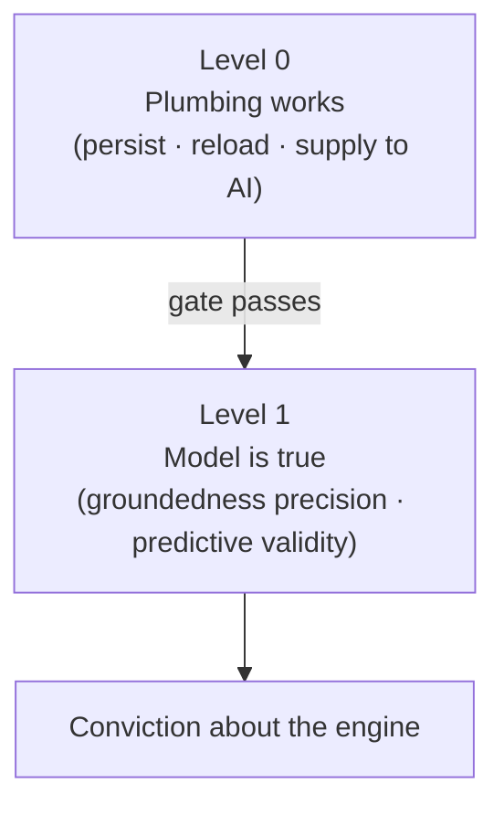
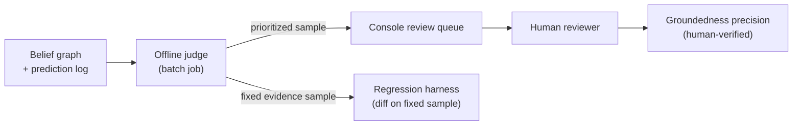

The engine makes a strong claim: that it records *how a student actually thinks*, not just what topics she visited. Proving that claim requires more than checking whether the software runs. Validation splits into two levels, and conviction must rest on the harder one.

## Two Levels of Validation

**Level 0 — "plumbing works"** checks the basics: does the belief model persist at the end of a session, reload in the next, and actually reach the AI as context? This is a binary yes/no test. It is necessary, but it proves nothing about the core bet — a simple topic-completion tracker would also pass it.

**Level 1 — "the model is true"** checks whether what the engine recorded matches how the student actually thinks. All convincing evidence lives here. Level 0 is only a gate; it never becomes the argument.

## The Level 1 Signals

Three signals are used to prove Level 1 validity.

### Groundedness Precision

Take a sample of the misconceptions the engine recorded. Read the actual conversation transcripts. Count what fraction of those recorded beliefs are genuinely correct. This is **groundedness precision** — of all the beliefs the engine committed, how many were real?

It is cheap to measure (roughly 10 students is enough to start) and acts as the foundation. If precision is poor, the rest of the validation program does not matter.

:::caution[The gaming trap]
An engine that almost never records anything will have near-perfect precision — every cautious, rare belief it does record is easy to get right. Precision must always be reported alongside a **coverage** figure: beliefs recorded per session, or the fraction of sessions that surface at least one belief. Precision and coverage together are honest; precision alone rewards an over-cautious engine.
:::

### Predictive Validity

Before the student attempts a novel problem, the engine emits a prediction: *will she succeed, and if not, where and why?* After the attempt, the prediction is compared to what actually happened.

This is the strongest falsifiable test the engine can face. It matches the core claim — that recorded reasoning patterns predict where a student breaks down — and it is a claim a simple completion tracker cannot make.

The trigger for a prediction is a **novel-problem checkpoint**: any moment in the Socratic dialogue where the tutor is about to pose a genuinely new problem. Two kinds exist:

| Checkpoint type | What it is | Role |
|---|---|---|
| **Authored seed transfer problems** | Hand-crafted problems that are identical across all students | Anchor set — enables cross-student comparison |
| **AI-chosen novel moments** | Problems the tutor generates contextually during a session | Adds volume and reach beyond the anchor set |

Each prediction covers exactly one student × one novel problem × one outcome, no looser. This keeps the before/after comparison clean and maximizes paired data points when the cohort is small. To stay honest — the same discipline as precision-and-coverage — only the *first* attempt at each distinct problem is scored; repeated attempts cannot inflate the denominator.

Each prediction carries a `basis` field naming what drove it: the fragility state of a belief-graph node, or a reasoning pattern spanning multiple concepts. A reasoning-pattern basis produces *one scored instance per matching checkpoint*, so a broad cross-concept claim still earns many concrete falsifiable tests rather than one vague one.

:::caution[Anti-leakage rule]
Every prediction must be written to an **immutable, timestamped prediction log** *before* the student sees the problem. Outcome grading happens strictly afterward, in a separate step. A prediction produced after the outcome is visible makes the metric meaningless.
:::

### The Baseline-Beating Demo

A third signal is not a metric but a pitch: find a student who looks "done" on a completion metric yet whom the engine flags with a hidden misconception that later causes a real downstream failure. A completion tracker cannot see this. A single such case is the most direct demonstration of why the engine exists.

The plan is to prove the engine with groundedness precision and predictive validity, then harvest this case as the demo. Two other candidates — recall (missing real misconceptions) and resolution durability — were deferred because they require ground truth or longitudinal data not available early.

## LLM-as-Judge: Automation with Guardrails

Scoring groundedness precision and predictive validity by hand for every student would be slow. Both metrics can be automated by using an LLM to read transcripts and grade outputs — the **LLM-as-judge** pattern.

Stemolly is LLM-agnostic, so the judge can be any model chosen for cost and difficulty; no specific vendor is required. For predictive validity the LLM's role is deliberately narrow: it grades the *outcome* (did the student truly understand or only guess?), because the core before/after comparison is objective rather than a judgment call.

### Offline, Not Inline

The judge runs as **offline batch jobs**, never in the live tutoring path. It samples recorded beliefs into a review queue, pre-screens them with a lower-cost LLM to prioritize high-interest cases, and scores predictive-validity checkpoints against pre-committed predictions.

Running the judge at session time was rejected: it would add the cost and latency of a strong model to every checkpoint and couple the validation metric to the production flow.

### Human Verdicts Are the Metric of Record

At MVP scale, **only human verdicts count** toward groundedness precision. The reasoning is deliberate: the claim under test — "does this belief match what the student actually thinks?" — is exactly the kind of question an LLM judge might share blind spots with the model that produced the beliefs. Letting the judge grade its own kind of output moves the trust problem rather than solving it.

The judge's value lies elsewhere:

- **Prioritization** — it surfaces the most interesting cases so human reviewers spend time efficiently.
- **Regression detection** — re-run the judge on a fixed evidence sample after any prompt change and diff the scores. A drop signals a regression before it reaches human review.

### Calibration: Does the Judge Agree with Humans?

Before trusting the judge's prioritization, measure its agreement rate against a small **human-labeled gold set** of roughly 30–50 beliefs. This converts "trust the AI's score" into a measured agreement rate. Without this step, the trust problem is only moved, not solved.

### Pinning: Keeping Metrics Comparable Over Time

LLM judges are non-deterministic and behave differently across model and prompt versions. A score produced today may not be comparable to one produced next month if the model or prompt changed.

To keep metrics comparable over time:

- Pin the judge's **model version** and **prompt version**.
- Use a **low temperature** to reduce random variation.
- Record which versions produced each metric alongside the score itself.
- When the judge model is upgraded, expect the metric baseline to shift — re-calibrate against the human gold set before comparing new numbers to old ones.
