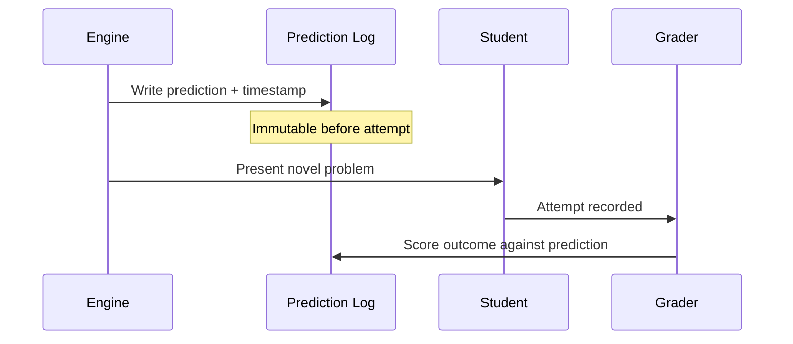
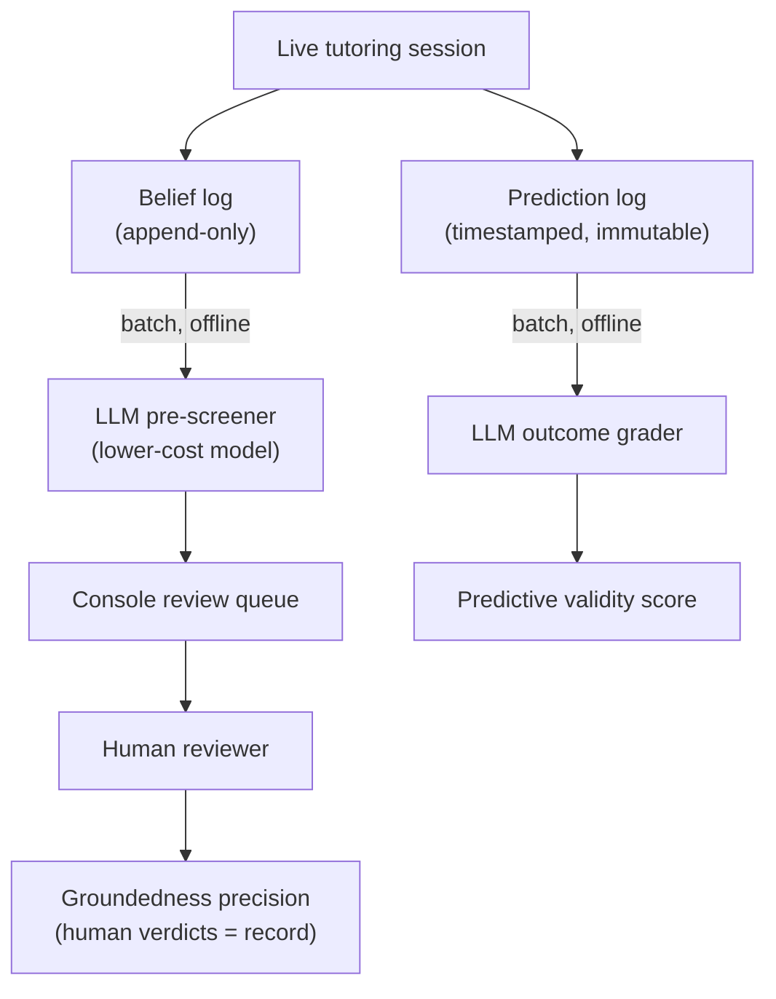

The mental-model engine makes a strong claim: it tracks *how* a student thinks, not just *what* they have completed. Validating that claim requires more than checking that the software runs. This page explains the two-level validation strategy, the two metrics that carry the real proof, and the tooling built around them.

## Two levels: plumbing vs. truth

Validation separates into two distinct questions.

**Level 0 — does the plumbing work?** This checks that the belief model is saved at the end of a session, reloaded in the next session, and actually supplied to the AI as context. It is a simple yes/no gate. It is necessary, but it proves almost nothing — a basic topic-completion tracker could pass the same test.

**Level 1 — is the model true?** This checks that what the engine records matches how the student actually thinks. All convincing evidence lives here. Level 0 is a gate; Level 1 is where conviction is earned.

```
Level 0: Did beliefs persist and reach the AI?  ─── gate (binary)
              │ passes
              ▼
Level 1: Do recorded beliefs match real thinking? ─── proof (measured)
```

## The two core metrics

Two Level-1 signals were chosen to prove the engine is real.

### Groundedness precision

Sample the misconceptions the engine has recorded for a group of students, read the actual conversation transcripts, and measure the fraction that are genuinely correct. About 10 students is enough to get a meaningful first number. This is the cheapest metric to collect and the most fundamental — if it is bad, nothing else matters.

**The coverage trap.** Precision alone can be gamed: an engine that records almost nothing will have a near-perfect precision score, because every rare, cautious belief is easy to get right. To prevent this, precision must always be reported together with a coverage measure — such as average beliefs recorded per session, or the fraction of sessions that surface at least one belief. Precision and coverage together are honest; precision alone rewards an over-cautious engine.

### Predictive validity

Before a student attempts a novel problem, the engine predicts whether and where the student will fail. That prediction is then compared to what actually happens. This is the strongest falsifiable test of the engine's core claim: that captured reasoning patterns predict where a student will break.

**How a prediction fires.** The trigger is a *novel-problem checkpoint* — a moment in the Socratic dialogue when the tutor is about to pose a genuinely new problem. At that moment, the engine writes its prediction (will the student succeed, and if not, where and why) to an immutable, timestamped log *before* the student sees the problem. Outcome grading happens strictly afterwards. Writing the prediction beforehand is mandatory: if a prediction is produced after the outcome is already visible, the metric is meaningless.

:::caution[Leakage invalidates the metric]
Every prediction must be written to an **immutable, timestamped prediction log** before the student attempts the problem. Outcome grading happens strictly afterward, in a separate step. The belief graph's data model therefore needs a dedicated prediction log — not just current-state beliefs.
:::

**Anchor set vs. broad coverage.** *Authored seed transfer problems* are a special subset of checkpoints that are identical across students. These form the **anchor set** — the checkpoints where results are directly comparable from one student to another. AI-chosen novel moments add volume and broader coverage across the belief graph, but they vary per student, so they supplement rather than replace the anchor set.

**Prediction granularity.** Each prediction is one event bound to exactly one novel-problem attempt and its single outcome. A prediction spanning a whole session would cover zero to many outcomes and could never be cleanly graded. One prediction, one attempt, one grade keeps the before/after binding clean and maximizes paired data points when the cohort is small. To keep the metric honest (the same discipline as precision-vs-coverage), only the first attempt at each distinct problem is scored — repeated attempts at the same seed cannot inflate the denominator.

**What a prediction draws on.** Each prediction event names its basis: either the fragility state of a belief-graph node, or a reasoning pattern. A reasoning-pattern prediction is a standing claim that gets scored once per matching checkpoint, so a broad cross-concept claim still earns many concrete falsifiable tests.



### Baseline-beating demo

There is a third signal — not a metric but a demo. Find a student who looks "done" on a completion tracker, yet whom the engine flags with a hidden misconception that causes a real downstream failure. This single case is the pitch — a completion tracker cannot see it. The plan is to prove the engine with groundedness precision and predictive validity, then harvest this case as the demo.

## LLM-as-judge automation

Scoring these metrics by hand for every student would be too slow. Both metrics can be automated using an LLM as a judge that reads transcripts and grades the engine's output. Stemolly is LLM-agnostic, so the judge can be any suitable model chosen by cost and difficulty of the task — no specific vendor is required.

For predictive validity, the LLM's role is limited: it grades whether the student truly understood or just guessed. The core of the metric is the objective before/after comparison; the LLM only handles the outcome-grading step where a judgment call is genuinely needed.

### Calibration against a human gold set

An LLM judge can be wrong, and it may share blind spots with the model that produced the beliefs in the first place. To keep the metric trustworthy, a small set of beliefs (roughly 30–50) labeled by a human must be maintained, and the LLM-judge's agreement with those human labels must be measured. This converts "trust the AI's score" into a measured agreement rate. Without calibration, the trust problem is only moved, not solved.

### Pinning for reproducibility

LLM judges are non-deterministic and behave differently across model and prompt versions. A validation number produced today may not be comparable to one produced later if the judge has changed. To keep metrics comparable over time:

- Pin the judge's **model version** and **prompt version**.
- Use a **low temperature**.
- Record which versions produced each metric run.

When the judge model is later changed, expect the baseline number to shift and re-calibrate against the human gold set before drawing conclusions.

## Offline harness: how the judge actually runs

The judge does **not** run inside the live tutoring path. It runs as an offline batch job. Running inline would add the cost and latency of a strong model to every checkpoint and would couple the metric to production flow — both were reasons to reject that approach.

The offline harness does three things:

1. **Samples** recorded misconceptions into the Console review queue.
2. **Pre-screens** them with an LLM — a different, lower-cost model than the Expert that produced the belief — to prioritize and annotate items for human review.
3. **Scores** predictive-validity checkpoints against the pre-committed predictions in the log.

:::note
The pre-screener is intentionally a **different** model and tier than the Expert that generated the beliefs. Using the same model to judge its own output would amplify shared blind spots rather than catch them.
:::

**At MVP scale, the metric of record is human.** Groundedness precision counts only human verdicts. The reason is precise: the claim under test is exactly the kind of claim an LLM judge would share blind spots with. The judge's value is throughput (it prioritizes which items a human reviews) and a regression harness — re-judge a fixed evidence sample after a prompt change and diff the results to catch regressions early.


