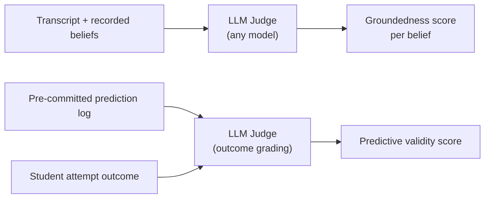
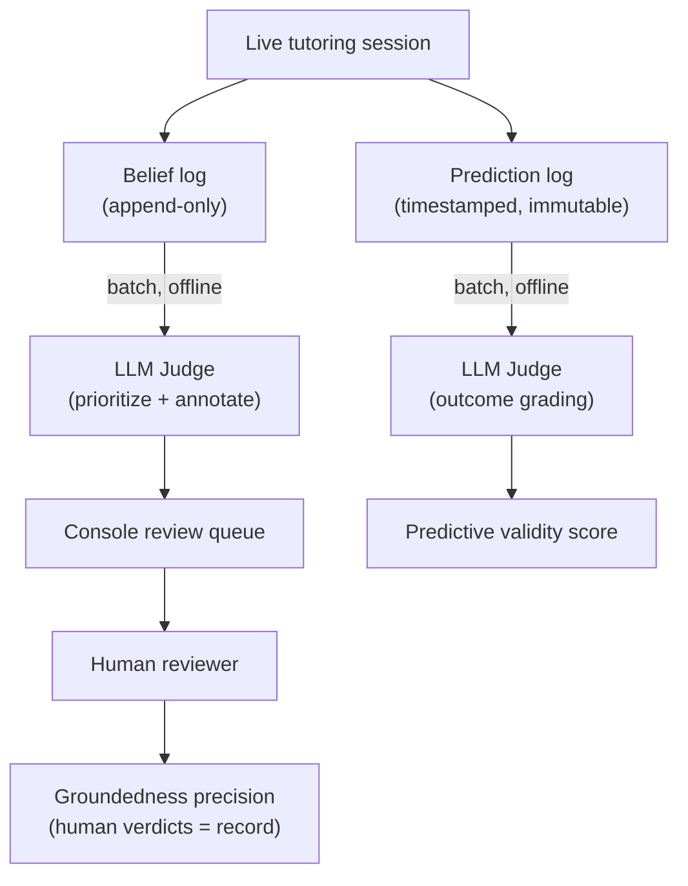

The engine's value rests on a specific claim: it records *how* a student thinks, not just *what* they have completed. Proving that claim requires more than showing the plumbing works. Validation therefore splits into two levels, and almost all convincing evidence lives at the higher one.

## Two Levels: Plumbing vs. Truth

**Level 0 — Plumbing works.** Does the belief model get saved during a session, reloaded the next session, and actually passed to the AI as context? This is a binary yes/no check. It is necessary, but it proves nothing about the core bet — even a simple topic-completion tracker could pass it.

**Level 1 — The model is true.** Do the beliefs the engine records actually match how the student thinks? This is where all convincing evidence lives. Level 0 is only a gate; conviction about the engine must rest on Level 1 signals.

```
Level 0  ──►  plumbing gate  ──►  passes?
                                      │  yes
                                      ▼
Level 1  ──►  groundedness precision + predictive validity
```

## The Two Level-1 Signals

### Groundedness Precision

*Of the misconceptions the engine recorded, what fraction are genuinely correct?*

Sample a set of recorded beliefs, read the actual conversation transcript, and count how many beliefs are truly supported by what the student said. This is cheap — it works with roughly 10 students — and it is the foundation. If precision is poor, the other metrics are not worth pursuing.

**Watch out for the precision trap.** An engine that records almost nothing can score very high on precision, because each rare, cautious belief is easy to get right. Precision must always be reported alongside a coverage or volume measure — for example, beliefs recorded per session, or the fraction of sessions that surface at least one belief. Precision and coverage together are honest; precision alone rewards an over-cautious engine.

### Predictive Validity

*Before a student attempts a novel problem, the engine predicts whether and where they will fail. How often is that prediction right?*

This is the strongest falsifiable test of the engine. It matches the central claim: reasoning patterns predict where a student breaks. A student who looks "done" on a completion metric but whom the engine flags with a hidden misconception — and who then fails exactly there — is also the **demo case** that a completion tracker cannot replicate.

## Operationalizing Predictive Validity

### Checkpoints and the Anchor Set

A prediction fires at a **novel-problem checkpoint**: a moment in the Socratic dialogue where the tutor is about to pose a genuinely new problem. The engine locks a prediction *before* the student sees the problem, then grades the outcome afterward.

Two kinds of checkpoints exist:

| Kind | What it is | Role |
|---|---|---|
| **Authored seed transfer problems** | Fixed problems identical across all students | Anchor set — makes the metric comparable student-to-student |
| **AI-chosen checkpoints** | Novel moments the tutor generates on the fly | Add volume and reach across the full belief graph |

Using only authored seeds would have kept the metric clean and comparable, but would have gated coverage behind authoring effort. AI-chosen checkpoints add broad coverage; the cost is needing a reliable "about to pose something genuinely novel" detector.

### Prediction Granularity

Each prediction is bound to exactly one novel-problem attempt and its single outcome — one prediction event, one grade. This 1:1 binding matters: a prediction that spans an entire session could match zero to many outcomes and cannot be graded cleanly.

Every prediction event records what it is based on — either the fragility state of a specific belief-graph node, or a reasoning pattern. A reasoning-pattern prediction is a *standing claim* that gets one scored instance per matching checkpoint, so a broad cross-concept claim still earns many concrete, falsifiable tests.

To keep the metric honest (the same discipline as precision-vs-coverage): score one prediction per student per distinct problem, **first attempt only**. Repeated attempts at the same seed cannot inflate the denominator.

### The Anti-Leakage Rule

If a prediction is produced *after* the outcome is visible, the metric is meaningless.

:::caution[Leakage invalidates the metric]
Every prediction must be written to an **immutable, timestamped prediction log** before the student attempts the problem. Outcome grading happens strictly afterward, in a separate step. This means the belief graph's data model needs a dedicated prediction log — not just current-state beliefs.
:::

## LLM-as-Judge Automation

Both metrics can be scored automatically using an LLM as a judge that reads the transcript and grades the engine's output. For predictive validity, the LLM's role is limited to grading outcomes (did the student truly understand, or just guess?) — the core of the metric is an objective before/after comparison, not a judgment call. Consistent with Stemolly being LLM-agnostic, the judge can be any LLM chosen by cost and difficulty, not a fixed vendor.



### Calibration Against a Human Gold Set

An LLM judge can be wrong. Worse, if the same kind of model produced the beliefs and also scores them, they may share blind spots and reinforce each other's errors. The fix is a **human-labeled gold set** of roughly 30–50 beliefs. Measure how often the LLM judge agrees with those human labels. This converts "trust the AI's score" into a measured agreement rate. Without calibration, the trust problem is only moved, not solved.

### Pinning for Reproducibility

LLM judges are non-deterministic. A score produced today may not be comparable to one produced next month if the model or prompt changed. To keep metrics comparable over time:

- Pin the judge's **model version** and **prompt version**.
- Use a **low temperature**.
- Record which versions produced each metric run.

When the judge model is upgraded, expect the baseline to shift and re-calibrate against the human gold set before comparing old and new numbers.

### Offline Execution — Human Verdicts are the Metric of Record

:::caution[No inline judging]
The judge does **not** run in the live tutoring path. Adding a strong-model call to every checkpoint would increase latency and cost, and would couple the metric to production flow. All judging runs offline.
:::

The judge module runs as offline batch jobs:

1. **Sampling** — picks recorded misconceptions and sends them to the Console review queue.
2. **Pre-screening** — a different LLM tier than the Expert that produced the belief annotates and prioritizes which items need human review first.
3. **Scoring** — grades predictive-validity checkpoints against pre-committed predictions.

At MVP scale, **the metric of record is human**. Groundedness precision counts only human verdicts, because the claim under test is exactly the one an LLM judge would share blind spots with. The judge's value is throughput (surfacing the most interesting cases first) and a **regression harness**: re-judge a fixed evidence sample after any prompt change and diff the results to catch regressions early.


