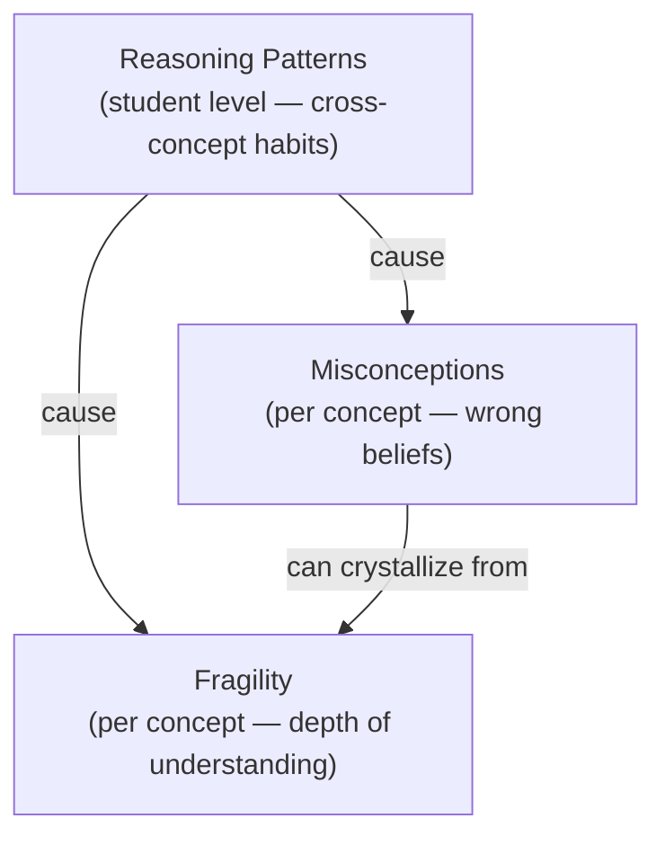
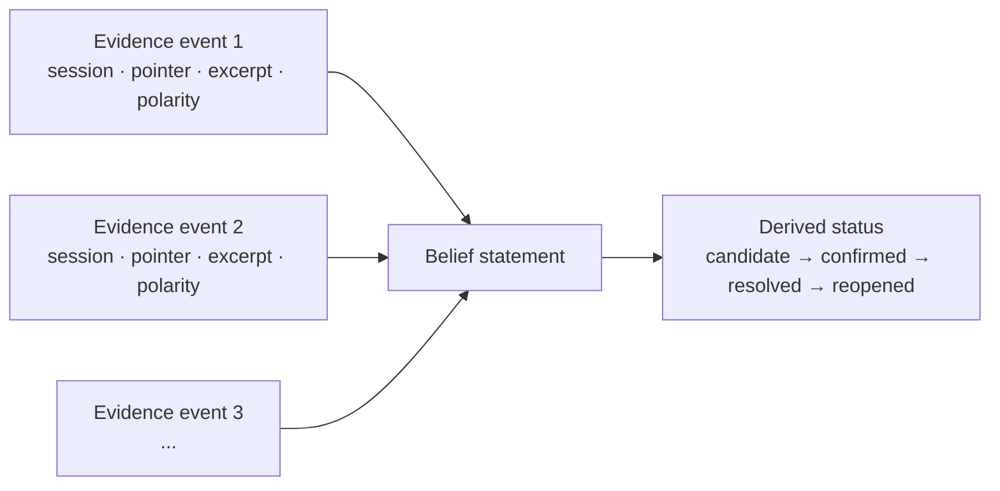
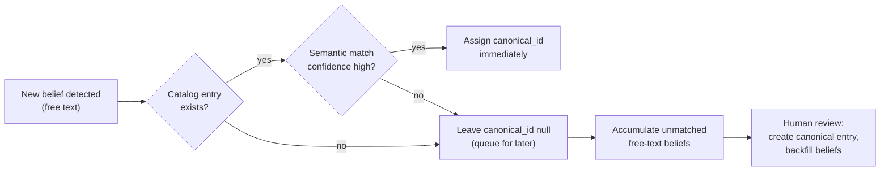
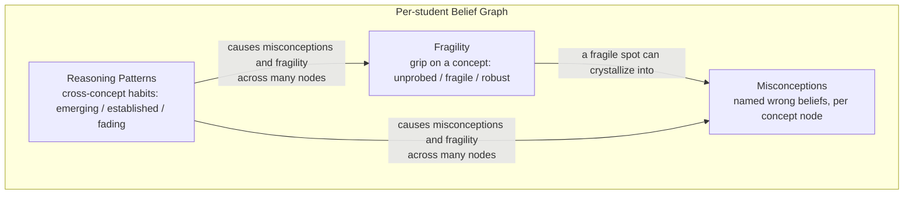
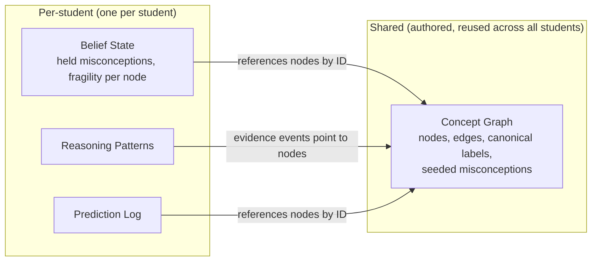

Every tutoring system tracks whether a student answers questions correctly. Stemolly tracks something deeper: *what the student actually believes*, how firm that belief is, and the habits of thinking that cause mistakes across many topics at once. This page explains the data model that makes that possible — three distinct layers, one unified graph per student, all built from evidence that persists across sessions.

## Three Layers of Understanding

The mental model is not a score. It is a graph with three overlapping layers, each answering a different question about how the student thinks.

| Layer | What it captures | Where it lives |
|---|---|---|
| **Misconceptions** | Specific named wrong beliefs | Per concept node, per student |
| **Fragility** | How deep correct answers actually are | Per concept node, per student |
| **Reasoning patterns** | Cross-topic habits that cause mistakes | Student level, spans all concepts |

These layers are not independent. A fragility probe — asking *why does this work?* in an unfamiliar context — often surfaces a named misconception. And both fragility and misconceptions frequently trace back to a reasoning pattern: a student who never checks their work will have fragile knowledge in many areas at once.

### Misconceptions

A misconception is a specific wrong belief, recorded as a statement tied to the session where it was first observed — for example, *"believes (a+b)² = a² + b²"*. It is only marked resolved when the student demonstrates correct unprompted reasoning in a **novel** context. Answering a familiar question correctly is not enough; the resolution must show the student can transfer the concept.

### Fragility

Fragility measures whether correct answers reflect real understanding or surface pattern-matching. A student can score well by recognising familiar question shapes without ever understanding *why* a method works. Fragility has three derived states:

- **Unprobed** — correct on familiar work, but never stress-tested. Understanding is unknown.
- **Fragile** — stress-tested and it broke. The student fails on transfer or cannot explain their reasoning.
- **Robust** — stress-tested and it held. Transfers to new contexts and explains *why* unprompted.

The load-bearing rule: **unprobed must never be treated as robust.** A student who has only seen easy, familiar problems looks identical to a true understander until probed. The engine must actively create probe moments; absence of evidence is not evidence of mastery.

Fragility is derived from evidence events, just like misconceptions. A fragile spot may later crystallize into a named misconception when enough evidence accumulates.

### Reasoning Patterns

A reasoning pattern sits deeper in the diagnosis hierarchy than any misconception. It describes *how* a student approaches problems — habits like "reverts to guess-and-check when stuck" or "gives up when the surface form changes" — not *what topic* they are on. Because the same habit surfaces across algebra, reading, and other subjects, patterns are stored at the student level, not on any concept node.

This matters for prediction. Fragility predicts a break on one specific concept. A reasoning pattern predicts breaks *by type of situation*, regardless of topic — so the engine can warn about likely trouble on a topic the student has not yet started.

:::note
A pattern is never "resolved" the way a misconception is. It is a **tendency**: it gets stronger or weaker over time and moves through *emerging → established → fading* states. A single observation is never enough; a pattern reaches *established* only after multiple observations across different concepts — the same honesty rule as "unprobed is not robust."
:::

Each pattern also carries a **valence** — productive or unproductive. Good habits (spontaneously checking an answer, asking *why* before applying a rule) are patterns worth capturing and reinforcing, not only weaknesses to fix.

---

## Event-Sourced Beliefs

Every belief in the graph — whether a misconception or a fragility state — is stored as a **statement plus an append-only list of evidence events**. The current status and confidence are *computed* from those events, never written directly. This is intentional.

Each evidence event carries:
- **Session ID** and a stable transcript pointer
- A short **frozen excerpt** (for human audit)
- A **polarity** — does this event *support* or *contradict* the belief?

This shape gives the system four properties at once:

1. **Auditable** — reviewers can read the exact excerpt that triggered a belief update.
2. **Resolvable** — a contradicting event flips the derived status to *resolved*.
3. **Reopenable** — a later supporting event un-resolves it. Nothing is ever deleted.
4. **Grounded** — every belief is backed by specific interaction evidence, never an AI guess.

Reasoning patterns use the same event-sourced pattern, but their evidence accumulates across many sessions and many concept nodes, which is how the engine derives the pattern's scope.

---

## Misconception Identity: Hybrid Catalog

When the engine detects a misconception it faces a naming problem: free-text descriptions vary across students, so the same wrong belief might be recorded in dozens of different wordings. You cannot aggregate "how many students hold this misconception" without a shared identity.

Stemolly uses a **hybrid approach**:

1. **Record first** — the belief is always written as free text immediately, so nothing is missed.
2. **Match if possible** — if a canonical catalog entry already exists for this concept, the engine attempts a semantic match and assigns a `canonical_id`. On high confidence it links immediately; otherwise it leaves `canonical_id` null.
3. **Promote later** — unmatched free-text beliefs accumulate. When enough of them describe the same misconception, a human reviews and creates a canonical entry, backfilling all matched beliefs.

The catalog **starts empty**. Early beliefs are pure free text. Canonical entries grow from real student data, not from upfront authoring. This avoids the failure mode of a fixed catalog that is blind to novel misconceptions the authors did not anticipate.

:::caution
Auto-match only runs against already human-approved catalog entries. Creating a new entry from an unconfident match could corrupt downstream aggregation counts. That is why *promotion* (creating a new canonical entry) requires human approval in the MVP.
:::

Reasoning patterns use the same hybrid model but **lean much harder toward the catalog**. The set of possible reasoning patterns is small and stable — unlike the endless variety of misconceptions — so patterns are almost always matched to a pre-made catalog entry, with free text only for rare novel habits.

---

## One Graph Per Student, Across All Domains

Each student has **one unified belief graph** covering every domain — Math, Language, and others — not a separate graph per subject. This is required by the cross-cutting nature of reasoning patterns: a shallow habit that surfaces in both algebra and reading is one pattern on one model.

Two distinct things share the name "graph":

| | Description | Shared or per-student? |
|---|---|---|
| **Concept graph** | Authored nodes, prerequisite edges, canonical labels, seeded misconceptions | Shared across all students |
| **Per-student belief state** | Which misconceptions this student holds, fragility per node, evidence events | Per-student; references concept nodes by ID |

The concept graph is the terrain. Each student's belief state is their position on that terrain.

### Language-Neutral Concept Nodes

A concept's identity is a **language-neutral ID**, not a name in any language. The canonical label is English (the lingua franca for concept naming), and display names are stored as a localized map on the node row itself. This ensures that the mathematical concept "factoring a quadratic" is the same node whether taught in Vietnamese K11 or English SAT — one node, one place where all evidence from all curricula accumulates.

Splitting concepts by language would silo a student's understanding and destroy the cross-curriculum transfer signal the belief graph exists to capture. Mathematical misconceptions like *(a+b)² = a²+b²* are symbolic and inherently language-neutral.

### Domains and Curriculum Overlays

Domains (Math, Language…) are near-disjoint subgraphs with almost no cross-domain prerequisite edges. They are partitioned within the single store by a domain tag on each node. Curricula (K11, SAT-Math, IELTS) are **overlays** — they map curriculum-specific concepts onto shared nodes, many-to-one where granularity differs, with matches curated by a human via AI proposal.

Cross-cutting layers — reasoning patterns and the prediction log — are stored on the student, not in the graph, because they have no single node to live on.

---

## What Students See (and Don't)

In the MVP the belief graph has **no student-facing screen**. It runs in the background as the engine that feeds context to the Socratic AI. Students experience value through the quality of the lessons themselves — the feeling of understanding, completing problems, gaining insight — not by inspecting their own graph.

The graph is visible only in the **Console's Observe area**, where the Stemolly team monitors it to confirm the engine is working correctly. Showing students their own belief graph is deferred; it is a UX and rendering concern, not a technical prerequisite for the core product.

---

## Why Beliefs Must Persist

The mental model must be loaded at the start of every session and carried forward. Resetting it per session would destroy the product's core value: the ability to track how a student's thinking *evolves* over time and to revisit unresolved misconceptions weeks later. A student who resolved a misconception in one session but then regresses — a later supporting event reactivates it — is information the system must never throw away.

Stemolly's core claim is that it can see *how a student thinks*, not just what answers they produce. That claim lives entirely in the **belief graph** — a persistent, per-student model built up over many sessions. The graph has three layers: **misconceptions** (specific wrong beliefs), **fragility** (how shallow correct answers actually are), and **reasoning patterns** (deep habits that cut across subjects). Together they let the Socratic AI ask the right question at the right moment, and they let the team observe exactly how a student's thinking evolves. Without persistence across sessions, none of this is possible — resetting the model each session would destroy the product's core value.

## Layer 1 — Misconceptions

A **misconception** is a specific, named wrong belief held by one student about one concept. Example: *believes (a+b)² = a²+b²*. It is linked to the session where it was first observed. Resolving a misconception requires more than a correct answer — the student must demonstrate correct unprompted reasoning in a *novel* context, because a student can produce the right answer by memorization without understanding.

### How beliefs are stored — event sourcing

Each misconception is stored as a statement plus an **append-only list of evidence events**. The current status is *derived* from those events; it is never written directly. Each event records:

- the session it came from
- a stable pointer into the transcript
- a short frozen excerpt (for audit)
- a polarity — does this event *support* or *contradict* the belief?

This design means beliefs are always auditable, always evidence-backed, and always reopenable. If a student resolves a misconception but later shows the wrong belief again, a new supporting event un-resolves it automatically. Nothing is deleted. The lifecycle runs: **candidate → confirmed → resolved → reopened**.

### Misconception identity — a hybrid model

Identifying "the same misconception" across different students is harder than it sounds. Two students can hold the exact same wrong belief but describe it in completely different words. There are two extreme options — pure free text (flexible but impossible to aggregate) and a fixed pre-built catalog (easy to count but blind to new misconceptions). Stemolly uses a **hybrid**:

1. The engine always writes the wrong belief as **free text** first. Nothing is ever lost.
2. Each belief also carries a nullable `canonical_id` that links it to a **shared catalog** entry when one exists.
3. The MVP starts with an **empty catalog**. Canonical entries are created later, from patterns seen in real student data.

The catalog grows through two distinct steps:

- **Auto-match** — when a new belief is recorded and a matching catalog entry already exists, the engine attempts a semantic match. On high confidence it assigns `canonical_id` immediately; otherwise it leaves it null.
- **Promote** — unmatched free-text beliefs accumulate. Once several beliefs cluster around the same wrong idea, a human on the team reviews and approves creating a new catalog entry, then back-fills existing beliefs with its id.

Auto-match runs from day one because matching against a human-approved entry is safe. Promotion is manual in MVP — the team is already reading transcripts, volume is small, and a bad merge would corrupt every downstream count. Later, an LLM can propose clusters, but a human in the Console always approves. The Console needs an **"unmatched misconceptions" review queue** for this workflow.

## Layer 2 — Fragility

**Fragility** answers a different question from misconceptions: not *is the belief wrong?* but *is the correct belief deep or shallow?*

A student who always answers correctly might still be pattern-matching — applying a memorized surface rule without understanding why it works. Fragility is separate from the mastery score precisely because a high-score student can still be fragile.

Fragility is a **property of one student's grip on one concept node**. It has three derived states:

| State | Meaning |
|---|---|
| **Unprobed** | Correct on familiar work, but never stress-tested — understanding is unknown |
| **Fragile** | Stress-tested and it broke — fails on transfer tasks or cannot explain why |
| **Robust** | Stress-tested and it held — transfers to new contexts and explains why unprompted |

The load-bearing rule: **unprobed must never be treated as robust.** A pattern-matcher and a true understander look identical until one of them is probed. Absence of probe evidence means *unprobed*, not *robust*. The AI must provoke fragility actively — by applying concepts in unexpected contexts, or by asking "why does this work?" — before the engine can call anything robust.

Fragility and misconceptions feed each other. A fragile spot that is probed and breaks can crystallize into a named misconception. So the two layers are not independent.

## Layer 3 — Reasoning Patterns

A **reasoning pattern** sits *below* misconceptions and fragility in the diagnosis hierarchy. A single pattern — for example, *reverts to guess-and-check when stuck* or *gives up when the surface form changes* — causes wrong beliefs and shallow understanding across many concept nodes at once. Fixing one pattern can therefore help across many topics simultaneously, which is why this layer exists separately.

Reasoning patterns are **domain-general**: the same habit looks identical whether the student is doing algebra or reading comprehension. They belong to the student as a whole, not to any one concept.

### Tendency, not a switch

Unlike a misconception (which resolves like a switch turning off), a reasoning pattern is a *habit* — something the student does more or less often over time. It is therefore modeled as a **tendency**:

- a recency-weighted **strength** (how consistently the student exhibits the behavior)
- a derived **status**: *emerging*, *established*, or *fading* — never *resolved*, only weaker

A single observed instance is not a pattern. A pattern only reaches *established* after multiple observations across different concepts. This honesty rule is the cousin of fragility's "unprobed is not robust" — one data point proves nothing.

Each pattern also carries a **valence**: *productive* or *unproductive*. Good habits (spontaneously checking an answer, asking why before applying a rule) are patterns worth capturing and reinforcing, not just weaknesses to fix.

### Identity — catalog-leaning hybrid

Because the set of possible reasoning patterns is small and stable — unlike the endless variety of content-specific misconceptions — identity for patterns leans heavily on a **pre-made canonical catalog**. Free text is used only occasionally, to catch a rare novel pattern. This contrasts with the misconception case, where free text is the primary form and catalog matching is secondary.

### Predictions across subjects

Fragility predicts a break on *one specific concept*. A reasoning pattern predicts a break by *type of situation*, regardless of topic. For example, a student with an *established* pattern of giving up when the surface form changes will likely struggle on any unfamiliar-looking problem — even in a subject they have not yet started. This cross-subject prediction is one of the strongest demos of the belief graph's value over a simple completion tracker.

Although a pattern is stored at the student level, each evidence event records which concept it came from. This means the pattern's scope — global versus localized to one subject area — emerges from the accumulated evidence rather than being declared up front.

## How the Graph Is Stored

### One graph per student, across all subjects

Each student has a single unified belief graph covering every domain — Mathematics, Language, and so on — not a separate graph per subject. This is required because reasoning patterns are domain-general and already live at the student level. A shallow habit that surfaces in both algebra and reading is one pattern on one model. A per-subject graph would silo that signal.

### Shared concept structure vs. per-student belief state

Two things are both called "graph" but they are distinct:

- The **concept graph** is shared authored structure: nodes with prerequisite edges, canonical labels, and seeded misconceptions. It is lean and reusable across every student.
- The **per-student belief state** (which misconceptions *this* student holds, fragility per node) references concept nodes by ID. It is not stored on the graph node itself.
- Everything cross-cutting — reasoning patterns and the prediction log — is stored on the student, not in the graph. A reasoning pattern has no single node to live on; storing it in the graph would force duplication across every concept it touches.

Within the one store, domains are partitioned by a `domain/subject` tag on each node. Curricula (K11, SAT-Math, IELTS) are **overlays** — they map curriculum concepts onto shared nodes, many-to-one where granularity differs, matched by a human via AI proposal.

### Language-neutral concept identity

A concept node's identity is a **language-neutral ID**, not a name in any language. The canonical label is English; display names are localized for the Console. This keeps one node per concept regardless of the language it is taught in. The mathematical concept "factoring a quadratic" is the same node whether taught in a Vietnamese K11 class or an English SAT course. Storing separate nodes per language for the same concept would silo the student's understanding and destroy the cross-curriculum transfer signal the belief graph exists to capture.

## In MVP — Backend Only

In the MVP, the belief graph runs entirely in the background. There is no screen shown to students. Students experience the engine through the quality of the Socratic conversation itself — the feeling of being well-understood, of solving the right problems at the right time — not by looking at their own graph.

The graph is visible only in the **Console's Observe area**. In MVP-1, the primary audience is the Stemolly team, who use it to confirm the engine is working correctly. Showing the graph to students is deferred and treated as a later UX concern, not a technical constraint.

For details on how the engine updates the graph during a session, see [Engine Implementation](./engine-impl/). For how the graph's accuracy is checked, see [Engine Validation](./engine-validation.md).
