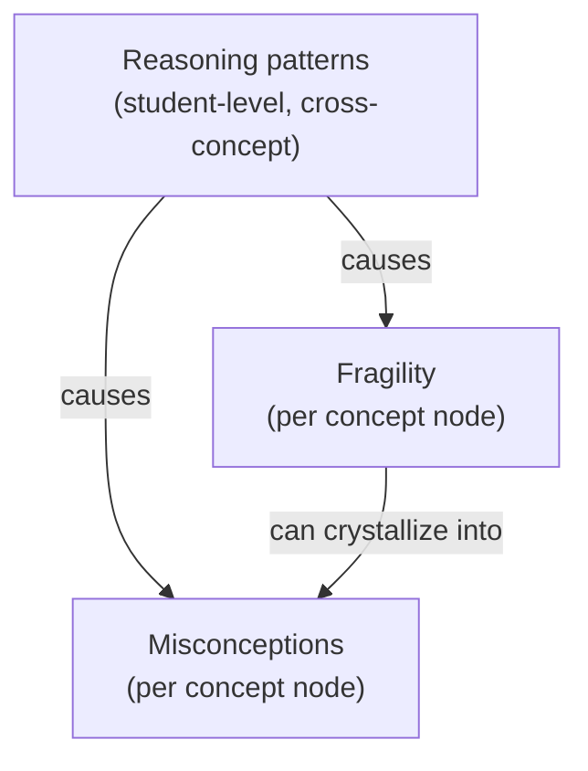
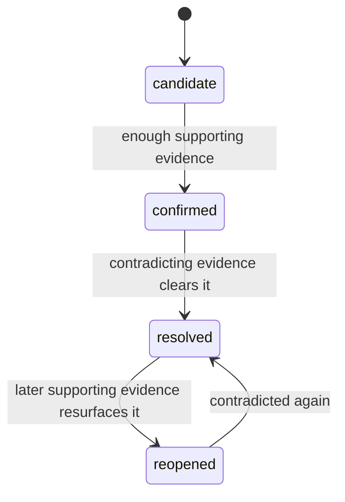
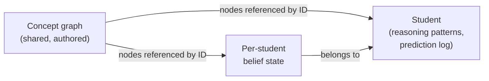

Stemolly's Socratic AI does not just track what a student has completed. It builds a living **mental model** — a structured picture of how that student thinks — and carries it across every session. This page explains how that model is designed, why each piece is shaped the way it is, and what the data looks like in practice.

## Three layers, not one score

A student's mental model is made of three distinct layers. Together they answer the question a completion score cannot: *does this student understand, or are they just pattern-matching?*

**Misconceptions** are named wrong beliefs — for example, "believes (a+b)² = a²+b²". Each one is linked to the session where it was first observed. A misconception is only considered resolved when the student demonstrates correct, unprompted reasoning in a *novel* context — not just in the same type of problem where it was spotted.

**Fragility** is a property of the student's grip on one concept. A student can score correctly by recognizing a familiar pattern without understanding why it works. Fragility exposes that gap. It has three derived states:

| State | Meaning |
|---|---|
| `unprobed` | Correct on familiar work but never stress-tested — understanding is unknown |
| `fragile` | Stress-tested and it broke — fails on transfer or cannot explain why |
| `robust` | Stress-tested and it held — transfers and explains unprompted |

The load-bearing rule: **`unprobed` must never be treated as `robust`.** A pattern-matcher looks identical to a true understander until the engine actually probes. Absence of probe evidence means unknown, not safe.

**Reasoning patterns** sit one level deeper than misconceptions. They describe how a student approaches problems — for example, "always reverts to guess-and-check" or "gives up when the surface form looks unfamiliar" — not what topic they are on. Because a pattern is a habit, not a single wrong answer, it crosses every topic. Fixing one pattern can unblock a student across many concepts at once.

:::tip[Why reasoning patterns matter for prediction]
Fragility predicts trouble on one specific concept. A reasoning pattern predicts trouble by *type of situation*, regardless of topic — letting the engine anticipate difficulty on concepts the student has not yet started.
:::

## Beliefs are event-sourced

Every belief — whether a misconception, a fragility state, or a reasoning pattern — is stored as a **statement plus an append-only list of evidence events**. The current status and confidence are *derived* from those events; they are never written directly.

Each evidence event carries:
- the session ID and a stable pointer into the conversation transcript
- a short frozen excerpt (for human audit)
- a polarity: **supports** or **contradicts** the belief
- a timestamp

This shape solves several problems at once. Because nothing is deleted, a resolved misconception can be *reopened* if later evidence shows the student backslid. The transcript pointers allow the team to audit whether the AI's detections are actually grounded in what the student said. And the status of any belief follows a clear lifecycle:

Fragility follows the same evidence pattern: `unprobed → fragile → robust` transitions are also derived from events, not written directly.

## How misconception identity works

When the engine detects a misconception it faces a naming problem: two students might describe the same wrong belief in different words. Storing only free text makes aggregation impossible (wordings differ); building a complete taxonomy up front is blind to novel misconceptions that the authors never anticipated.

The solution is a **hybrid identity model**: the engine always records the belief as **free text** first (so nothing is ever missed), and then optionally links it to a **canonical catalog entry** via a `canonical_id` field. The MVP starts with an empty catalog — `canonical_id` is null for all early beliefs. Canonical entries are created later from real student data.

The catalog grows through two distinct moments:

1. **Match** — when a new belief is recorded and a matching catalog entry already exists, the engine attempts a semantic match. On high confidence it assigns `canonical_id` immediately; otherwise it leaves it null.
2. **Promote** — unmatched free-text beliefs accumulate. When several of them describe the same misconception, a human creates a canonical entry and the existing beliefs are backfilled. For MVP this promotion is manual; later an LLM clustering job can *propose* groups, but a human in the Console always approves before any merge.

The reason promotion is human-gated: a bad automatic merge corrupts every downstream count that uses the canonical entry as a key.

## Reasoning patterns have a different identity

Reasoning patterns use the same hybrid approach but lean much harder toward a **pre-made catalog**. The reason: the set of possible reasoning patterns is small and stable — habits like "guesses instead of reasoning" or "never self-checks" are recognized across all subjects with the same words. Free text is reserved only for a rare novel pattern the catalog does not cover.

A pattern is also modeled differently from a misconception. It is a **tendency** — a habit the student does more or less often — not a switch that flips off. So its shape is:

- a recency-weighted **strength** (how often and consistently it appears)
- a derived **status**: `emerging → established → fading` — never "resolved", only weaker

A single observation is not a pattern. It only reaches `established` after multiple observations across *different* concepts — an honesty rule that mirrors fragility's "unprobed is not robust."

Each pattern also carries a **valence**: `productive` or `unproductive`. Good habits — spontaneously checking an answer, asking *why* before applying a rule — are patterns worth capturing and reinforcing, not only weaknesses to fix.

## One unified graph per student

Every student has a **single belief graph** that spans all domains (Math, Language, etc.), not a separate graph per subject. This is required because reasoning patterns and the prediction log are already cross-cutting: a shallow habit that surfaces in both algebra and reading is one pattern on one model. A separate-graph-per-subject design could never see that signal.

Two things share the label "graph":

- The **concept graph** is shared and authored: nodes, prerequisite edges, canonical labels, and seeded misconceptions. It is content-anchored — no cross-cutting state lives here.
- The **per-student belief state** (which misconceptions this student holds, fragility per node, evidence) is separate per-student data that *references* concept nodes by ID. It is not stored on the shared graph node itself.
- **Cross-cutting layers** — reasoning patterns and the prediction log — are stored on the student, because they span many nodes and would have to be duplicated across every node they touch if placed in the graph.

Domains (Math, Language) are near-disjoint sub-graphs within the one store, partitioned by a domain/subject tag on each node. Curricula (K11, SAT-Math, IELTS) are overlays that map onto shared nodes, so the same concept node is reused across curricula rather than duplicated.

## Language-neutral concept identity

Concept nodes use **language-neutral IDs**. The canonical label is English (a shared lingua franca for concept naming), and localized display names are stored in a jsonb locale map on the node row itself. This keeps one node per concept regardless of what language it is taught in — the concept "factoring a quadratic" is the same node in a Vietnamese K11 course and an English SAT course.

Storing separate per-language nodes for the same concept would silo a student's understanding and destroy the cross-curriculum transfer signal the graph exists to capture. Math misconceptions like (a+b)²=a²+b² are symbolic, so they are language-neutral and shared across all locales.

## What students see (in MVP)

The belief graph is a **backend engine** in the MVP. Students do not see their own graph. They experience the value through the lessons — the feeling of understanding, solving problems, and completing assignments. The graph surfaces only in the Console's Observe area, where the Stemolly team uses it to confirm the engine is working correctly. Showing the graph to students is deferred; it is a later UX concern, not a technical blocker.

:::note[Persistence is the core value]
The mental model — misconceptions, fragility, reasoning patterns — is stored and carried across separate learning sessions. Resetting it per session would destroy the product's value: the ability to track how a student's thinking evolves over time and to revisit unresolved misconceptions.
:::
