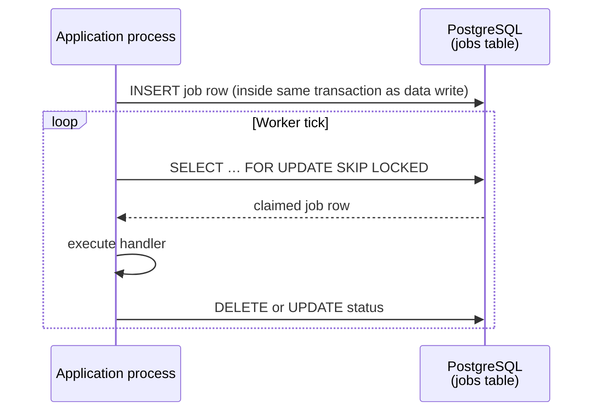

Stemolly's infrastructure layer is deliberately minimal. A single PostgreSQL instance holds every kind of data — the concept graph, evidence events, projections, and job queues. An in-process worker loop driven by that same database handles async work. A thin migration runner (`node-pg-migrate`) keeps the schema in sync. And a strict environment-variable convention wires secrets and settings together at startup.

This page explains what each piece does and — just as importantly — why the alternatives were rejected.

---

## PostgreSQL as the Only Datastore

Every persistent object lives in one PostgreSQL instance: the concept graph, append-only evidence and prediction logs, belief projections, job queues, catalogs, and metering data. There is no secondary store.

**Why not a graph database?** The concept graph (nodes, edges, taxonomy) is traversed with [recursive CTEs](https://www.postgresql.org/docs/current/queries-with.html) — PostgreSQL's built-in mechanism for walking hierarchies. The traversals here are shallow (prerequisite closure, taxonomy children). The hard part of the system — student state — is shaped like an event log with projections, not like a deep graph. Adding Neo4j would mean two databases to back up, two consistency boundaries to reason about, and a pivot cost if requirements shift. Recursive CTEs inside PostgreSQL cover the graph need at zero extra ops burden.

**Why not a dedicated event store?** Append-only Postgres tables with trigger-enforced immutability deliver the same semantics as a specialized event store. One database means one backup story for the irreplaceable evidence log, and transactional integrity between an event append and its projection update is free.

**JSONB for churn-prone payloads.** Fields that change shape often — event bodies, LLM call payloads, report bodies, i18n display names — live in JSONB columns rather than rigid relational columns. This avoids a migration every time a payload grows a new field.

```
┌─────────────────────────────────────────────────────┐
│                  PostgreSQL instance                │
│                                                     │
│  engine.*      concept graph (nodes, edges, …)      │
│                append-only evidence & predictions   │
│                belief projections                   │
│                                                     │
│  metering.*    LLM call log, guardrail events       │
│                                                     │
│  <module>.*    jobs, catalogs, ordinary relations   │
└─────────────────────────────────────────────────────┘
```

Graph-traversal logic is encapsulated inside the engine's graph repository. If a future scale milestone demands a dedicated graph store, only that repository changes.

---

## Async Jobs: Postgres-Backed, No Broker

Asynchronous work — Expert checkpoints, judge batches, ingestion pipelines, invite emails — runs on an **in-process worker loop** that claims rows from a Postgres jobs table using `SELECT … FOR UPDATE SKIP LOCKED`. No Redis. No message broker.



**Why no broker?** The current queue depth is dozens of jobs per day — nowhere near the threshold where a message broker pays for itself. The jobs table is literally the seam a broker would later replace; adding one now means new infrastructure, new ops runbooks, and a new failure mode.

**Durability for free.** Because the job row is inserted inside the same database transaction as the data it describes, there is no window where the data is committed but the job is lost. This is an outbox pattern with no extra code.

**At-least-once delivery.** The worker can crash between claiming a job and deleting its row. The job will be re-claimed on the next tick. Every evidence-writing handler must therefore be **idempotent**: a deterministic idempotency key plus a `UNIQUE` constraint makes a replayed job a no-op, never a double-append.

**Ceiling and scale-out path.** Single-process throughput is accepted at cohort scale. When the ceiling is hit, the extraction path is documented: promote the in-process loop to a separate worker process that shares only the jobs table. The seam already exists.

---

## Schema Migrations with node-pg-migrate

### Why node-pg-migrate

The project uses `node-pg-migrate` rather than Prisma migrations or Knex. The reason is legibility. Stemolly's schema needs raw SQL triggers (append-only enforcement), recursive CTEs, and non-standard constraints. Heavy ORM migration DSLs fight you when you need those things; `node-pg-migrate` runs the exact SQL you write with no translation layer.

### One Timeline, One File per Module

All migration files live under `server/migrations/` in one shared chronological timeline (numbered by timestamp). Each file, however, touches exactly **one module's schema**. A file starts with `CREATE SCHEMA IF NOT EXISTS <module>;` and then only creates objects inside that module's schema. A file that creates tables in a different schema is a review smell.

```
server/migrations/
  1720000000000_engine-nodes-edges.ts   ← touches engine.* only
  1720000001000_metering-llm-calls.ts   ← touches metering.* only
  1720000002000_jobs-table.ts           ← touches jobs.* only
```

### makeAppendOnly()

Tables that must never be updated or deleted (evidence events, predictions, LLM call logs, guardrail events, transcript turns) call a shared helper in the same migration that creates them:

```ts
makeAppendOnly(pgm, 'engine', 'evidence_events');
```

This installs a `BEFORE UPDATE OR DELETE` trigger on the table. The trigger is created in the same migration file as the table itself — there is no separate "add trigger" step that could be forgotten.

### Engine Schema Governance

Not all schemas are equal. A migration file that touches `engine.*` must be **explicitly called out** in its pull-request description against the **G-4 schema-review checklist**: no domain concepts leaking in, no pedagogy-specific columns, no vendor names, node identity intact. Migrations for other schemas (`metering`, `jobs`, etc.) get ordinary review.

The reason for this asymmetry: the engine is designed to be domain-agnostic. A single carelessly added column that encodes a pedagogy assumption can quietly break that guarantee. The extra review gate exists to catch that before it lands.

---

## Migration Pitfalls

### Do Not Register tsx in a Long-Lived Process

Migration files are written in TypeScript. The CLI path supplies `--tsx` to handle this. The in-process `runner()` API (used by the test harness) calls `tsx/esm`'s `register()` instead.

The problem: `register()` installs ESM/CJS module-loader hooks **process-wide and never removes them**. In a short-lived test worker this is harmless — nothing meaningful loads after the migration finishes. In a long-lived process it is fatal.

This was reproduced concretely during Playwright global setup. Calling `startPostgres()` (which ran migrations in-process) succeeded, but the very next step — building the Fastify server — threw:

```
TypeError: Expected a string, an ArrayBuffer, or a TypedArray to be returned
  for the "source" from the "load" hook but got undefined
```

The leftover tsx `load` hook intercepted a plain CommonJS `require()` inside Fastify and could not satisfy it.

**The rule:** run migrations in a **spawned child process** (the `node-pg-migrate` CLI with `--tsx`) from inside any long-lived process such as Playwright's global setup. Confine tsx's registration to that short-lived child. The `startPostgresForE2e()` helper in `server/test/e2e-postgres-boot.ts` does this.

### CLI and In-Process Runner Are Configured Independently

The CLI script and the in-process `runner()` API share no configuration. Two settings must be applied to **both** independently:

| Setting | Why it matters |
|---|---|
| `ignorePattern` (e.g. `tsconfig\.json\|.*\.test\.ts`) | node-pg-migrate treats every non-dotfile in the migrations directory as a migration. Without this, a `tsconfig.json` in that folder breaks the run. |
| TypeScript loader (`--tsx` for CLI, `register()` for runner) | Migration files import an uncompiled `.ts` helper. Without a loader, the import fails. |

A misconfiguration in one path passes silently in the other. Missing `ignorePattern` in the in-process runner can pass local CLI runs yet fail CI — or the reverse. Set both in both places.

### Prefer Omitting down() — Let Auto-Reverse Handle It

When no `down` function is exported, node-pg-migrate reverses the migration automatically by undoing each operation in reverse order. Exporting an explicit `down()` bypasses this inference entirely — the hand-written version runs verbatim.

This caused a real failure. A hand-written `down()` for the `metering.llm_calls` migration dropped the table but left the standalone trigger function behind (created by `makeAppendOnly` via `pgm.createFunction`). A trigger dies with its table; a standalone function is an independent schema object and survives. A subsequent down → up cycle then failed with "function already exists".

The fix: delete the explicit `down()`. Auto-reverse drops the trigger, the function, the table, the extension, and the schema — in reverse order, correctly. Also fold any `pgm.alterColumn` calls (which have no auto-reverse) into the original `createTable`, because a single un-reversible step forces you to write an explicit `down()` for the whole migration.

> **Tip:** Migrations that create non-trivial objects (functions, triggers, extensions) should prefer auto-reverse and ship with a down → up regression test.

---

## Configuration: STEMOLLY_ Env Vars

### Naming Convention

Every environment variable follows the pattern `STEMOLLY_<AREA>_<NAME>` — for example:

- `STEMOLLY_LLM_TIER_FAST_MODEL`
- `STEMOLLY_INVITE_TTL_HOURS`
- `STEMOLLY_DB_URL`

All variables are read in exactly one place: a `config.ts` aggregator module. Application code never calls `process.env` directly. Each module validates its slice of config against its own [Zod](https://zod.dev) schema inside that aggregator.

`.env` files are for local development only. Secrets are never committed to the repository.

This convention was introduced to close a gap: the architecture phase named config and secrets as a seam ("env-injected; secrets out of repo") but left the concrete rules for later. These rules are what "later" produced.

### Security-Relevant Values: Bounded + Defaulted

When a security-relevant value — such as the invite-token TTL — becomes configurable, the pattern is:

1. **Bounded, defaulted env var.** `STEMOLLY_INVITE_TTL_HOURS`, integer, positive, `max(168)`, `default(168)`. Boot fails on zero, negative, non-numeric, or anything beyond the ceiling.
2. **Production-only presence check.** When `NODE_ENV=production`, the variable must be explicitly set. This is the one environment where stating the policy matters.

**Why not require the variable with no default?** Every other config field carries a default. A lone required variable forces dev, test, CI, and Compose to each set it — and in practice the same value is copy-pasted into all four, producing the *appearance* of a deliberate choice at each site while actually being one unreviewed constant spread thin. The protection you actually want is against a *wrong* value, which the validated range delivers directly.

Two supporting rules:
- **Put the unit in the name**, in the unit legible at the deploy site (hours rather than milliseconds — so the value is not a wall of zeros).
- **Pass the value into the domain function as a parameter**. Do not read config inside the pure domain layer; "make it configurable" must not quietly sink an environment read one layer too deep.

---

## Docker Compose Topology

Two Compose files exist in the repository. They serve different purposes and must stay separate.

| File | Purpose | How to run |
|---|---|---|
| `docker-compose.yml` | The **deployable**. Brings up `web`, `server`, and `postgres` with `restart: unless-stopped`. Only the web port is published to the host. | `docker compose up` |
| `compose.dev.yml` | **Dev convenience only**. Starts Postgres so you can run `pnpm --filter server dev` locally. | `docker compose -f compose.dev.yml up -d` |

**Why not name the dev file `docker-compose.override.yml`?** Compose auto-merges any file with that exact name into every `docker compose up`. A clean-checkout `docker compose up` would silently pick up the dev config, defeating the whole point of the split.

The two files use distinct Docker volume names (`stemolly-postgres-data` vs `stemolly-dev-postgres-data`) so running both from the same directory does not collide.

### Pool Teardown Is Your Responsibility

`compose(config)` — the composition root — constructs the `pg.Pool` that backs the persistence and metering modules. **Nothing downstream owns the pool.** `buildServer()` receives the already-built context and never takes responsibility for it. Fastify's `app.close()` shuts down the HTTP layer but knows nothing about a pool it did not create.

Any code that calls `compose()` — an integration test, Playwright global setup/teardown, a future harness — **must end the pool explicitly**:

```ts
await app.close();
await ctx.modules.persistence.pool.end();  // NOT implied by app.close()
await db.stop();
```

Omit the middle line and the pool's connections dangle past the container's own `stop()`, either holding the process open or producing connection errors against a database that no longer exists.

The ownership is invisible at the call site — `app.close()` looks like a complete shutdown and is not. State this clearly in any harness that calls `compose()`.
