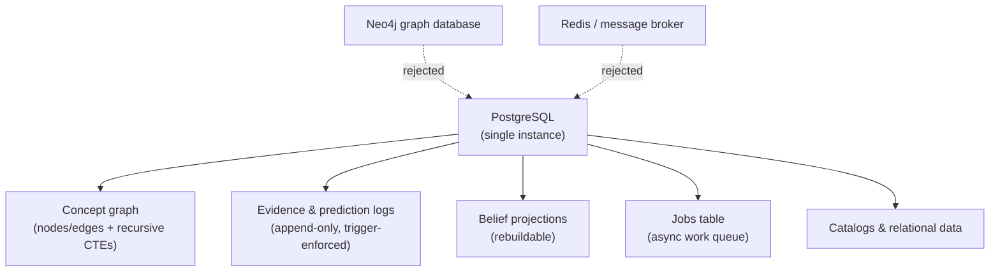
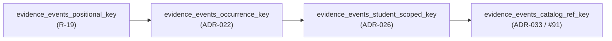
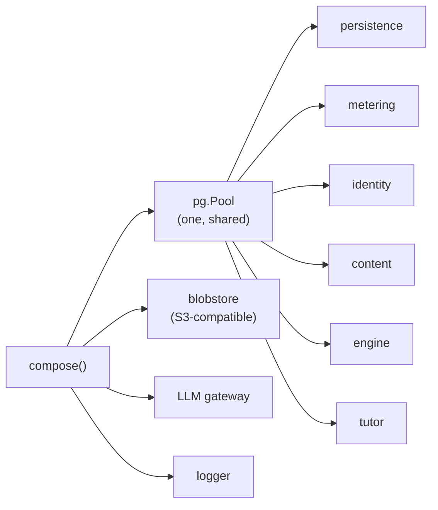
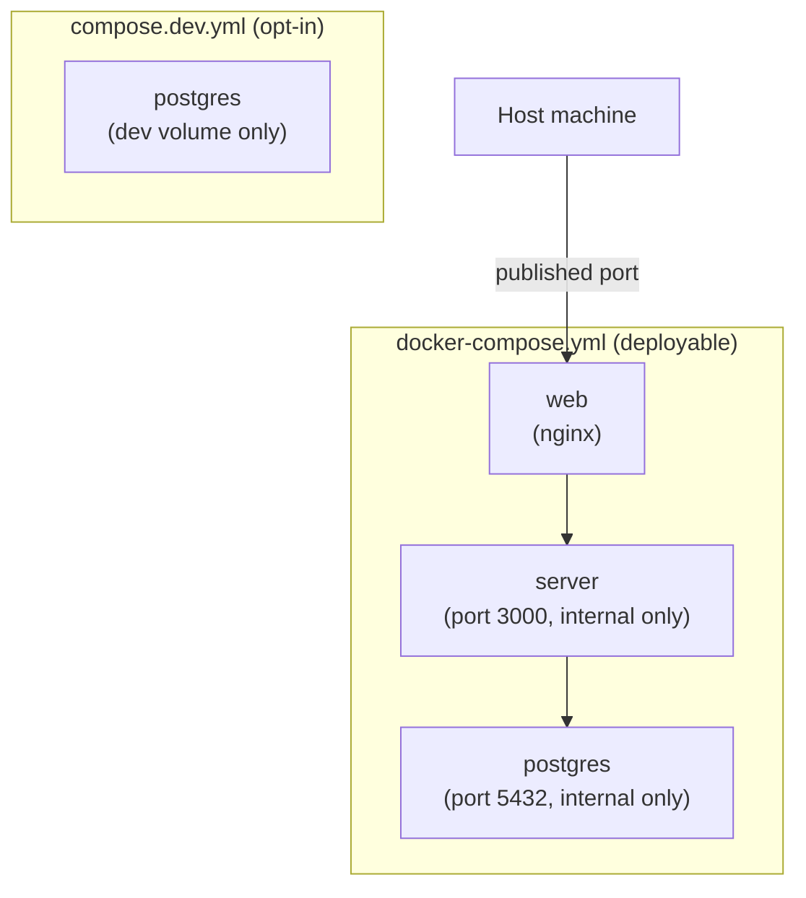
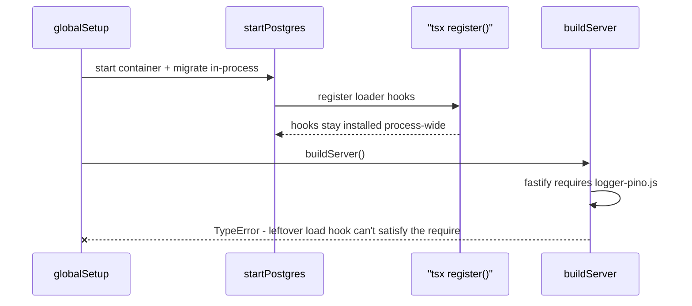

Stemolly's backend is built around one central choice: PostgreSQL is the only datastore. There is no Redis, no message broker, no graph database, no dedicated event store. Everything — the concept graph, append-only evidence logs, async job queue, session data, catalogs — lives in one Postgres instance. The server is a Fastify application whose modules are assembled by a single `compose()` call at boot, with config read through a single aggregator and validated by Zod before a shared connection pool is passed to each module. This page covers all of it: why the one-store choice was made, how async work runs inside the same database, migration conventions and hazards, how the server is assembled, config rules, and local dev tooling.

## One Postgres instance holds (almost) everything

There is no separate graph database and no dedicated event store. PostgreSQL holds the concept graph (as nodes/edges tables, traversed with recursive CTEs), the append-only evidence and prediction logs, the belief projections built from them, catalogs, and ordinary relational data — with JSONB used for payloads that change shape often, like event bodies, report bodies, and translated display names.



A dedicated graph database (Neo4j) was considered and rejected: the graph traversals this app needs are shallow — things like "what are this concept's prerequisites" or "what are its taxonomy children" — and the genuinely hard part of the system is student state, which is shaped like events and projections, not like a graph. A second store would only add operational burden and make it harder to change course later. A dedicated event store was rejected for a simpler reason: plain Postgres append-only tables, backed by triggers that block updates and deletes, already give the event semantics needed, with zero extra infrastructure.

Keeping everything in one store also means one backup story for the evidence log — which cannot be recreated if lost — and transactional integrity between appending an event and updating the projection that depends on it. Graph traversal itself is not scattered through the codebase; it's encapsulated in the engine's own graph repository, so if a graph-shaped need ever did justify a dedicated store, the swap would stay local to that one place.

## Async work runs inside the same database, not a separate queue

Background jobs — Expert checkpoints, judge batches, ingestion, invite emails — run on an in-process worker loop backed by a plain Postgres jobs table. A worker claims a row with, in essence:

```sql
SELECT ... FROM <jobs table>
FOR UPDATE SKIP LOCKED;
```

`FOR UPDATE SKIP LOCKED` is what makes this safe with multiple workers: it locks the row a worker claims and lets every other worker simply skip past rows that are already locked, instead of blocking on them. Think of the jobs table as a shared to-do list — each worker grabs the next unclaimed item and locks it, so nobody else can pick up the same task while it's in progress. Jobs get retries with attempt caps, and a job that exhausts its retries is surfaced as a reliability metric rather than silently dropped.

A message broker — Redis/BullMQ, RabbitMQ, SQS — was considered and rejected. At a queue depth of dozens of jobs per day, it would be infrastructure the project doesn't need yet; the jobs table is deliberately the seam a real broker would replace later, if volume ever demands it. Using the same database the jobs act on also has a bonus: because enqueueing a job and committing the data change that triggered it happen in the same transaction, the jobs table works as an outbox for free — no separate mechanism needed to avoid "the data changed but the job was never queued."

Delivery is at-least-once, not exactly-once, so any handler that writes evidence must be idempotent: a deterministic idempotency key plus a unique constraint makes a replayed checkpoint a safe no-op instead of a duplicate append. The single-process throughput ceiling this implies is accepted at the project's current (cohort) scale, with pulling the worker into its own process documented as the future scale-out path if it's ever needed.

## Migrations: node-pg-migrate, one file per schema

Schema migrations run through `node-pg-migrate`, a thin, programmatic migration runner — not Prisma or Knex. This makes concrete an already-decided principle: heavy ORMs are rejected here in favor of a thin, hand-written SQL layer, because the append-only triggers and recursive CTEs this project relies on need to stay legible, and a schema DSL would just be something to fight when a migration needs a raw trigger or an unusual constraint.

On top of that tool choice sits a file-layout convention. All migrations live in one shared, chronological timeline under `server/migrations/`, but each individual file touches exactly one module's own schema — starting with `CREATE SCHEMA IF NOT EXISTS <module>;` and then that module's tables. A migration file that creates tables outside its named module's schema is a review smell. For the handful of append-only tables (`evidence_events`, `predictions`, `llm_calls`, `guardrail_events`, `transcript_turns`), the same migration that creates the table also calls a shared `makeAppendOnly(pgm, schema, table)` helper, which installs the `BEFORE UPDATE OR DELETE` trigger that gives the append-only fitness function (G-5a) something concrete to check.

:::note
Migrations that touch the `engine.*` schema carry extra weight: they must be called out explicitly in the PR description against the G-4 schema-review checklist (no domain, pedagogy, or vendor leakage; node identity intact). Migrations for `metering` or any other schema get ordinary review — the engine alone carries the stakes of the "protect the engine's domain-agnostic core" principle, so it alone gets the stricter bar.
:::

### Two entry points, two configs

`node-pg-migrate` is driven two different ways in this project: the `migrate:up` CLI script (local dev and deploy) and the in-process `runner()` API (used by the testcontainers integration harness). These two entry points **share no configuration** — anything that matters has to be set on both, separately. Two settings matter in practice: an `ignorePattern` (`tsconfig\.json|.*\.test\.ts`), because the migration scanner otherwise treats every non-dotfile in the migrations directory — including its own `tsconfig.json` — as a migration and fails; and a TypeScript loader, since a migration imports an uncompiled `.ts` helper (`--tsx` for the CLI, a one-time `tsx/esm` `register()` call for the in-process runner). Forgetting a setting on one path only breaks that path — which is exactly how a misconfiguration can pass locally against the CLI and only fail once CI runs the in-process runner (or the reverse).

### A hand-written `down()` can orphan objects

When a migration exports no `down()`, `node-pg-migrate` auto-generates one by reversing each `up` operation in order. Exporting an explicit `down()` bypasses that inference completely — the hand-written version runs verbatim, however incomplete it is.

:::caution
This bit the project once already. A hand-written `down()` that only dropped a table left behind the standalone trigger function that `makeAppendOnly` had created — a trigger dies with its table, but a function is an independent schema object that doesn't. The next down-then-up cycle then failed with "function already exists." The fix was to delete the explicit `down()` and let auto-reverse handle it (which correctly drops trigger, function, table, extension, and schema in reverse order). The general guidance: migrations that create non-trivial objects — functions, triggers, extensions — should prefer auto-reverse and ship with a down-then-up regression test rather than a hand-rolled `down()`.
:::

The same class of problem resurfaced later at larger scale. A down/up-cycle integration test failure turned out to involve five migration files, not one: four missing `down()` exports for migrations that used raw `pgm.sql(...)` calls, plus one unrelated extension double-drop. The fix in all five cases was writing real `down()` functions — not narrowing the test to skip known-irreversible migrations. Narrowing the test would have converted a currently-true invariant ("every migration in this directory round-trips") into a permanently growing exception list, and would have left the project with no way to actually roll back engine schema in production.

### Postgres extensions: one owner, no redeclarations

A Postgres extension — such as `pgcrypto` — is installed once per database. `CREATE EXTENSION IF NOT EXISTS` is safe going up: it's a no-op if the extension already exists. Going down, however, `node-pg-migrate`'s auto-generated reversal for `createExtension` always issues a plain `DROP EXTENSION` with no `IF EXISTS` guard.

If two migrations both declare the same extension and you run a full directory down-migration, the later migration's auto-reverse drops the extension first. When the chain reaches the earlier migration that originally "owned" the extension, its own auto-generated `DROP` fails because the extension is already gone.

The rule: each extension should appear in exactly one migration file. If you must reference an extension in a migration that didn't create it, do not redeclare it with `createExtension`. If a migration already has a redundant `createExtension`, write an explicit `down()` that simply omits the extension drop — let the migration that actually owns the extension handle its own teardown.

### Naming the `evidence_events` uniqueness constraint

One specific constraint has its own naming convention worth knowing, because it looks odd at first glance. The `UNIQUE NULLS NOT DISTINCT` constraint on `engine.evidence_events` has been dropped and recreated under a new name every time a migration changed which columns it covers or what one of those columns means:



Each name describes only what *that* migration changed — never the full seven-column identity the constraint actually enforces. This is deliberate: it lets someone reading `\d evidence_events` infer which migration produced the constraint currently in place. It's also a workaround — `node-pg-migrate` v8.0.4 has no rename-preserving option that's compatible with `UNIQUE NULLS NOT DISTINCT`, so every rename is a raw-SQL drop-and-add rather than an `ALTER ... RENAME CONSTRAINT`. This is safe because nothing in the codebase reads the constraint by name; the `ON CONFLICT` insert path in the evidence repository infers its target from the column list, not the constraint's name. A future rename should follow this same fingerprint pattern rather than reverting to a single "descriptive" name for the whole key — the project has consistently chosen the fingerprint over the full description.

### ADR clauses must be verified at review, not assumed to carry through implementation

Accepted ADR clauses do not automatically enforce themselves during implementation — review is currently the only check that catches drift. A concrete example: when `match_nodes` was first built, the developer added a GIN trigram index on `engine.nodes` (`pg_trgm`). ADR-035 clause 3 had already explicitly rejected this index — at PoC scale the extension alone backs a full-table similarity scan, and adding a speculative GIN index brings overhead for no measured benefit. The index was caught as a review blocker and reverted. When you implement against an ADR, read its clauses for what was explicitly rejected, not just for what was accepted.

## Configuration: one STEMOLLY_ convention, one aggregator

Environment variables follow one naming pattern, `STEMOLLY_<AREA>_<NAME>` (for example `STEMOLLY_LLM_TIER_FAST_MODEL`), and are read in exactly one place — a `config.ts` aggregator — validated per-module against zod schemas, rather than read ad hoc via `process.env` scattered through the codebase. `.env` files are dev-only, and secrets are never committed to the repo. This closed a gap the architecture phase had deliberately left open: config and secrets were named as a seam early on, but no concrete rule was minted until this convention.

`loadConfig()` is the only function that reads `process.env`. It validates in two stages: first a Zod schema coerces and defaults all scalar env vars; then a second pass performs artifact-aware checks that env parsing alone cannot express — for example, loading the model-selection file and requiring `STEMOLLY_GOOGLE_API_KEY` only when the selected model set actually names the `google` provider. `STEMOLLY_STUDENT_ID` is always required. Invite TTL, email adapter, blobstore adapter, and content-admin token may default in development but become required when `NODE_ENV=production`. Even though the parsed config type leaves `database.url` optional, real server startup still requires it — `createPersistenceModule()` throws if the URL is absent.

That still leaves one question per value: should it be required, or defaulted? For anything security-relevant, the answer settled on is **bounded and defaulted, plus a production-only presence check** — not a required variable with no default. The worked example is the invite-token TTL, previously a hardcoded constant deep in the pure domain layer:

```
STEMOLLY_INVITE_TTL_HOURS=168   # integer, 1-168, defaults to 168; presence checked only when NODE_ENV=production
```

A plain required variable was considered and rejected. Every other field in the config schema has a default, so one lone required field is inconsistent — and in practice it just gets the same value copy-pasted into dev, test, CI, and compose, which looks like a deliberate choice at each site while actually being one unreviewed value spread across four places. What actually needs protecting against is a *wrong* value, and a validated range does that directly: boot fails on zero, on negative, on non-numeric input, and on anything past the ceiling. The production-only presence check then supplies the forcing function exactly where stating the policy explicitly matters, and nowhere else.

Two smaller details worth keeping in mind for any similar case: the unit belongs in the variable name, and it should be the unit legible at the deploy site — hours, not milliseconds, so the value isn't a wall of zeros. And the value must be passed into the domain function as a parameter rather than read from config inside the domain layer itself, so "make it configurable" never quietly sinks an environment read into code that's supposed to stay pure.

## How the server is assembled

The server entry point `index.ts` loads config with `loadConfig()`, calls `compose(config)` to build the module graph, and then calls `buildServer(ctx)` to wire everything into Fastify. `compose()` creates modules in dependency order — structured logger first, then persistence (which creates the one shared `pg.Pool`), then blobstore, metering, an OpenTelemetry tracer, the LLM provider and gateway, identity, content, engine, and tutor. Each module receives already-built collaborators directly; there is no IoC container.



| Module | Key files | What it owns |
|---|---|---|
| **server-core** | `config.ts`, `composition.ts`, `app.ts`, `index.ts` | Boot config, module wiring, Fastify setup, process startup |
| **server-api** | `api/` | HTTP `/api` surface, error envelope, route namespacing |
| **server-tutor** | `tutor/` | Session lifecycle, board and transcript logs, checkpoint dispatch |
| **server-engine** | `engine/` | Graph/catalog/evidence persistence, read-time belief assembly |
| **server-content** | `content/`, `metering/`, `blobstore/`, `logger/`, `persistence/`, `errors/` | Content delivery, observability, storage, pool, typed errors |

**server-api** route files are thin edge adapters. They validate or normalize requests, resolve server-owned values like `studentId`, and delegate to `tutor`, `content`, or `engine` APIs. The module owns namespace protection and the typed error-envelope producer; it never contains business logic.

**server-tutor** never constructs its own adapters — `content`, `engine`, `llm`, repositories, and the logger are all injected at composition time. Its session API executes turns synchronously. The v1 kind registry covers `statement` and `choice` only.

**server-engine** separates command and query paths through the evidence log. Slug↔id resolution, merge-map handling, and status-transition rules stay in `core/`; the Postgres repositories are constructor-injected SQL adapters. The module is the codebase's durable seam for student-knowledge state, with beliefs rebuilt from evidence rather than stored as mutable projections.

**server-content** groups small infrastructure modules. Only `content` is exported to routes and tutor as behavior; `metering`, `blobstore`, `logger`, `persistence`, and `errors` are shared infrastructure consumed by the rest of the server.

### Blobstore (S3-compatible)

`createBlobstoreModule()` returns `{ client, bucket }`. The current adapter is `minio`, implemented with the AWS SDK's `S3Client` configured with a custom endpoint, `forcePathStyle: true`, and a fixed region of `us-east-1`. The factory fails synchronously on an unknown adapter name or if any of `endpoint`, `bucket`, `accessKeyId`, or `secretAccessKey` is missing. The shared logger can optionally be passed into the SDK middleware stack.

### Content delivery and assignment ingest

`ContentModuleApi` separates its read surface by caller. Browser-safe reads (brief, crop proxy, assignment list) are exposed as API routes. In-process-only reads (answer key, delivered board) are consumed directly by `tutor` — no route exposes them. Assignments reach the server through a bearer-authenticated admin route (`/api/admin/assignments`). The operator plugin's `pushAssignment()` reads a local `brief.json`, resolves and base64-encodes each cited crop, and POSTs one atomic payload. The route validates the body, decodes crops into `Buffer` objects, and calls `content.putAssignment()`.

## Running the stack locally

The tracked Docker Compose config is split into two files with different jobs. `docker-compose.yml` is the deployable: `docker compose up` on a clean checkout brings up the whole stack — web, server, and Postgres, all `restart: unless-stopped` — with no manual setup, and it publishes only the web host port. The server (3000) and Postgres (5432) are reachable only over the compose network, never published to the host. `compose.dev.yml` is a separate, opt-in file that stands up Postgres alone, for running the server locally with `pnpm --filter server dev`; it's used explicitly via `docker compose -f compose.dev.yml up -d`.



The dev file deliberately isn't named `docker-compose.override.yml` — Compose auto-merges anything with that exact filename into every `docker compose up`, which would silently pull dev config into the deployable's clean-checkout bring-up and defeat the whole point of the split. The two files also use distinct volume names (`stemolly-postgres-data` vs `stemolly-dev-postgres-data`) so running both from the same directory doesn't collide on one Docker volume.

### Running production migrations — the migrator service

The deployable `docker-compose.yml` publishes **no port** for Postgres — not even on loopback. This is a tested, binding invariant enforced by an integration test. Running migrations against the production database cannot be done via a port or SSH tunnel to a loopback-bound port.

The mechanism is a dedicated `migrator` compose service on the internal compose network, which reaches `postgres:5432` the same way `server` and the MCP services do. It carries `profiles: ["migrate"]` so it never starts on a plain `docker compose up`. To run migrations:

```bash
docker compose run --rm migrator
```

The `migrator` service uses a separate image that includes `node-pg-migrate` and `tsx` as dev dependencies, unlike the stripped-down runtime `server` image — that runtime image has no migration tooling or migration files. Without the migrator service, there was no working way to run migrations against the deployable at all.

:::caution
Running a Postgres client (like Adminer) in its own container and pointing it at `localhost` will fail even when Postgres is running fine — inside that client's own container, `localhost` means the container itself, not the host, so you get a connection-refused error that looks exactly like the database isn't up. Fix it by running the client with `--network host` (Linux), or by addressing the host as `host.docker.internal` instead of `localhost`. Separately, a stray leading space in a copy-pasted host value produces a DNS lookup error that's easy to mistake for a real connectivity problem rather than a malformed string.
:::

:::tip
Adminer only shows one Postgres schema at a time, defaulting to `public`. If the tables you expect aren't there — and all you see is an unrelated bookkeeping table like a migration tool's own tracking table — you're very likely just looking at the wrong schema, not facing a connectivity problem. Switch schemas with Adminer's schema-selector dropdown, or add `&ns=<schema>` to its login URL. In engine-poc, for example, the application tables (`nodes`, `edges`, and so on) live in the `engine` schema; `public` holds only `pgmigrations`.
:::

## Two hazards in long-lived processes

Two problems below share a root cause: something written for a short-lived process turns out to break a long-lived one.

**`tsx`'s `register()` leaves a process-wide trap.** `register()` (from `tsx/esm/api`) installs ESM/CJS module-loader hooks for the whole process, and it never removes them. The test harness calls it so that `node-pg-migrate`'s in-process `runner()` can load `.ts` migration files — harmless in a one-shot Vitest worker, where nothing meaningful loads after the test finishes, but fatal in a process that keeps loading modules afterward.



That's exactly what happened when a Playwright `globalSetup` called `startPostgres()`: the container booted and migrated fine, but the very next step, `buildServer()`'s `fastify()` call, threw a `TypeError` from inside Fastify's plain CJS `require` of its logger module — the leftover `tsx` load hook was intercepting a require it couldn't satisfy. Removing the `startPostgres()` call and pointing config at a plain database URL made `buildServer()` succeed, confirming it was `tsx`'s residue, not Playwright or Fastify.

The resolution: run the migration step in a spawned **child process** — `node-pg-migrate`'s own CLI with `--tsx`, mirroring the `migrate:up` script — instead of in-process, so `tsx`'s registration is confined to that short-lived child. The Postgres container itself still starts in the caller's process, so its lifetime stays tied to the long-lived process that owns it.

:::caution
The general rule: a process-global loader hook is a side effect on the *whole process*, not just on the call that installed it. Any helper that registers one is only safe to use where nothing meaningful loads afterward.
:::

**A `listen()` failure can leave the pool alive.** `index.ts` calls `compose()` before `app.listen()`, so the pool is already open when the bind attempt is made. If `listen()` rejects — for example, because the port is already in use — the catch block only logs the failure and sets `process.exitCode = 1`. It does not close the Fastify instance or end the pool. The process holds open database connections until something else terminates it. This is the same ownership gap as the teardown hazard below, just in a different shutdown path.

**`compose()` builds a connection pool that nobody closes for you.** `compose(config)` constructs the `pg.Pool` backing the persistence and metering modules, but nothing downstream takes ownership of it. `buildServer(ctx)` receives an already-built app context and never touches the pool; Fastify's `app.close()` shuts down the HTTP server and its plugins, but knows nothing about a pool it didn't create.

:::caution
Any code that calls `compose()` directly — an integration test, a Playwright `globalSetup`/`globalTeardown` pair, any future test harness — must end the pool explicitly:

```ts
await app.close();
await ctx.modules.persistence.pool.end();   // not implied by app.close()
await db.stop();
```

Skip that middle line and the pool's connections dangle past the database container's own shutdown, either holding the process open or throwing connection errors against a database that no longer exists. This is a direct consequence of how the app is wired together: whoever constructs a resource owns its lifetime, and `compose()`'s caller is what constructed the pool — `app.close()` just looks like a complete shutdown without being one.
:::
