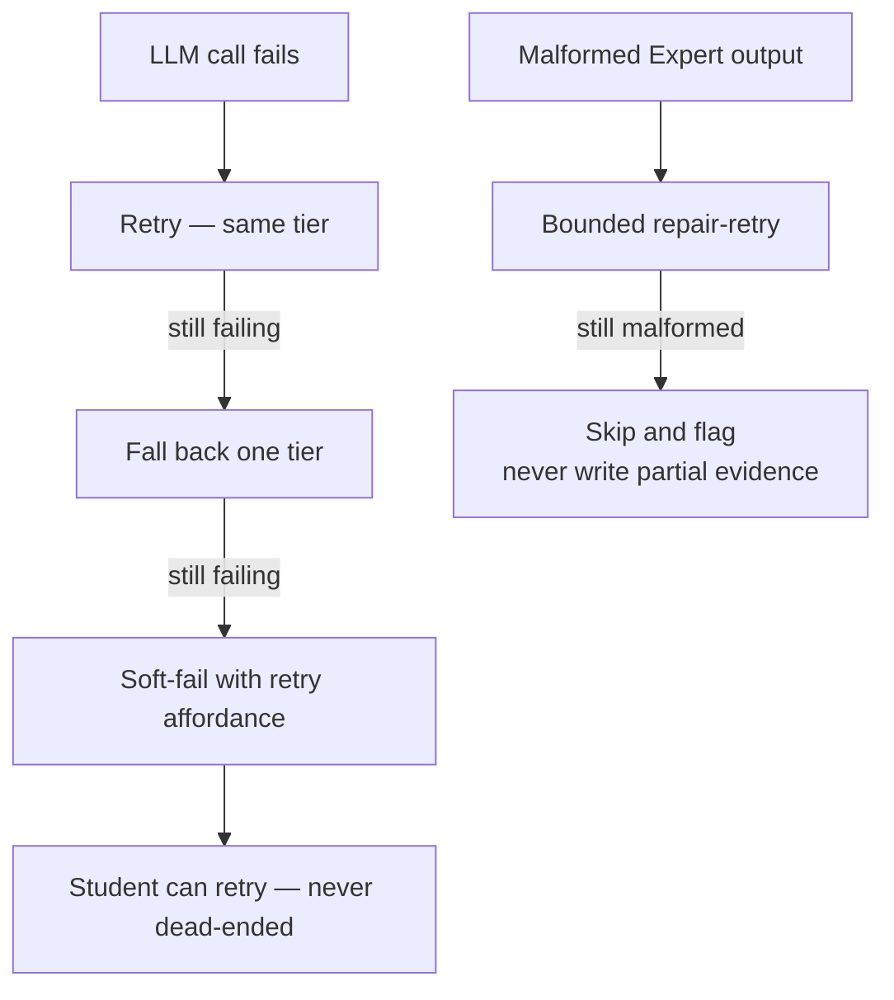
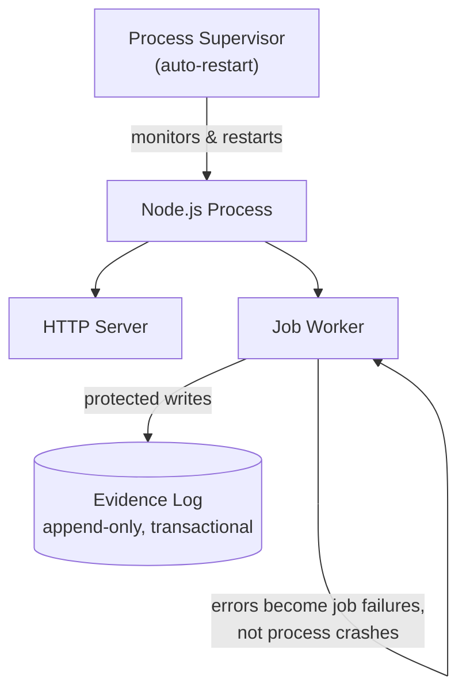

Every request in Stemolly carries a trace ID from entry to exit. Every log line is schema-validated. Every error surfaces in one predictable shape. Every job failure is caught before it can kill the server. And every LLM call is metered — even the ones that time out. These five systems are designed together: the same `RequestContext` that threads a trace ID through function calls also feeds the error envelope, the logger, and the metering observer.

## Structured Logging

All log output flows through one shared module: `server/src/logger/index.ts`, built on [Pino](https://getpino.io/) via Fastify's built-in logger integration. **`console.*` is banned everywhere else** — enforced by an ESLint `no-console` rule — so there is exactly one path from code to a log line.

Every log line must carry these fields:

| Field | Required | Notes |
|---|---|---|
| `timestamp` | ✅ | ISO string |
| `level` | ✅ | String label (`"info"`, `"warn"`, …) |
| `module` | ✅ | Which subsystem emitted the line |
| `event` | ✅ | What happened |
| `traceId` | ✅ | From the request's `RequestContext` |
| `sessionId` | optional | |
| `jobId` | optional | |
| `durationMs` | optional | |
| `errorCode` | optional | |
| `statusCode` | optional | Merged in by the error handler |
| `reqId` | optional | Auto-bound by Fastify; cannot be opted out per call |

**Forbidden fields:** `message`, `transcript`, `prompt`, `content`, and any key that could carry transcript or student PII. A schema unit test rejects these by name — a blocklist, not an allowlist, so call sites do not need to remember it.

### The pino configuration trap

Pino's defaults do not satisfy the schema above. Out of the box, Pino emits `level` as a **number** (e.g. `30`), the timestamp as an **epoch integer** under a `time` key, and auto-injects `pid` and `hostname`. A `.strict()` Zod schema expecting `level` as a string, a `timestamp` key, and no extra fields rejects every line the default logger produces.

`createLogger()` must configure three options explicitly — removing any one breaks schema conformance for every log line:

```ts
pino({
  base: null,                                                     // drops pid and hostname
  timestamp: () => `,"timestamp":"${new Date().toISOString()}"`, // ISO string, right key
  formatters: { level: (label) => ({ level: label }) },          // string, not number
})
```

This mismatch went undetected because the original tests fed hand-built objects to the schema, never the real logger's output. It was caught by an independent review pass.

### Testing the real logger requires a subprocess

Pino writes directly to a file descriptor via `sonic-boom`, which bypasses `process.stdout.write` entirely. Monkey-patching stdout captures nothing.

The permanent regression guard in `server/src/logger/schema.test.ts` handles this by spawning a child process — running a small script through `tsx` — and parsing its stdout. Deliberately removing `base: null` makes the guard fail with `Unrecognized keys: "pid", "hostname"`.

:::caution
Any test that builds its own in-memory pino instance to avoid this is validating the schema against a differently-configured logger. The two can drift apart silently — that is exactly how the original mismatch survived.
:::

## TraceId and RequestContext

A `traceId` identifies every request through its entire lifecycle — across sync code, async steps, and job boundaries. Rather than using Node's `AsyncLocalStorage` to make the ID implicitly available anywhere, Stemolly threads it explicitly through call arguments.

Each request creates a `RequestContext` object:

```ts
interface RequestContext {
  traceId: string;
  logger: Logger;
}
```

This is passed as a parameter through every function that needs it, across the sync-turn → async-checkpoint boundary. The same `traceId` surfaces in every log line emitted by that request and in the error envelope if the request fails — tying log lines to error responses so you can look one up from the other.

**Why not `AsyncLocalStorage`?** ALS has a known footgun: it silently loses context across certain async boundaries, producing log lines without a `traceId` in ways that are hard to debug. Explicit passing makes propagation visible in the call graph — a missing `traceId` is a visible type error, not a runtime mystery. The cost is one extra parameter in call chains.

## Error Envelope and LLM Failure Tiers

### One envelope everywhere

All error responses from the API conform to one shape, defined in the shared contracts package:

```json
{
  "error": {
    "code": "SESSION_NOT_FOUND",
    "message": "Human-readable fallback",
    "traceId": "abc-123",
    "details": {}
  }
}
```

- **HTTP status** carries the broad category (4xx vs 5xx). **`code`** carries the specific, machine-readable reason.
- **User-facing text** is never sent as server prose — the frontend localizes from `code`, keeping the language boundary clean.
- **Domain modules throw typed errors** and never touch HTTP. A **single** Fastify `setErrorHandler` is the only place error bodies are built — including for Fastify's own validation failures (`FST_ERR_VALIDATION`), which are mapped to `ValidationError` so they follow the same envelope.

### LLM failure tiers

LLM and provider failures are treated as expected conditions. The gateway classifies each failure and scrubs PII before it surfaces anywhere. When an LLM call fails, the system works through a defined escalation:



Cross-provider fallback is **on by default for the Interface** (the conversational turn) and **off by default for the Expert** (the evidence-writing step, where correctness matters more than availability).

## Fire-and-Forget Metering

### How it works

The `llm` module does not write metering rows itself. A composed observer listens for `'llm.response'` events emitted during each model call, then:

1. Sums `usage.inputTokens + usage.outputTokens` for total tokens.
2. Computes cost from the tier rate.
3. Measures `latencyMs` from the per-attempt start time.
4. Calls `metering.recordLlmCall(...)` — **un-awaited**.

If the LLM call timed out and a late response still arrives, the observer records it with `outcome: 'discarded'` so the token cost is visible even for abandoned calls.

`recordLlmCall` shapes the call into a row in `metering.llm_calls`:

| Column | Source |
|---|---|
| `prompt_v` | `promptId + promptVersion` collapsed into one string |
| `role` | Mapped from `agentRole` |
| `model` | From the response, or `null` if absent |
| `outcome` | `completed` or `discarded` |
| `tokens`, `cost`, `latencyMs` | Computed by the observer |
| `id`, `created_at` | DB defaults |

### Catch or crash

Metering writes are deliberately un-awaited — a slow or failing billing write must never block a student's turn. But an un-awaited rejection still surfaces at the **process level** as an unhandled rejection.

This was not theoretical: when the real provider and metering wiring was composed against a unit-test environment with no live database, the metering write rejected asynchronously and **crashed the entire `test:unit` script** — every assertion passing, the process dead.

The fix requires both halves:

```ts
metering.recordLlmCall(...).catch((err) => {
  // Half 1: .catch() — a rejecting void is a process-level crash
  // Half 2: log it — silence means billing data disappears with no signal
  logger?.warn({ module: 'llm', event: 'metering.record_failed', purpose, agentRole });
});
```

:::caution
"Fire and forget" must never mean "fire and never find out." Catch at the source, and log what you swallow.
:::


## In-Process Worker Fault-Tolerance

The job worker runs inside the **same Node.js process** as the HTTP server. A badly-failing job can, in the worst case, take down the HTTP server too. Rather than splitting the worker out into its own process, the strategy makes this blast radius explicit and bounded.

The governing philosophy:

1. **Protect the irreplaceable** — the evidence log is append-only, idempotent, transactional, and backed up. Partial evidence is never written.
2. **Degrade the recoverable** — the fast path serves a stale-but-valid report or a soft-fail with a retry affordance. A student is never dead-ended.
3. **Fail as a caught error, never a crash** — every job handler is wrapped so errors become job failures, not uncaught exceptions.



**Safety rails in place:**

- Every job handler catches its own errors; failures are recorded as job failures, not leaked to the event loop.
- Jobs and LLM calls are time-bounded to prevent event-loop blocking.
- Process-level `uncaughtException` and `unhandledRejection` handlers log and exit cleanly.
- The process runs under a supervisor with auto-restart; jobs are durable, so a crash resumes in-flight work.

Data safety across a crash is strong. Availability has a single-process ceiling that is accepted at cohort scale. Extracting the worker to its own process is the documented next step when scale demands it.

:::caution
The in-process design means a badly-failing job can affect HTTP availability. The supervisor's restart policy and the idempotent evidence log bound the damage — not process isolation.
:::
