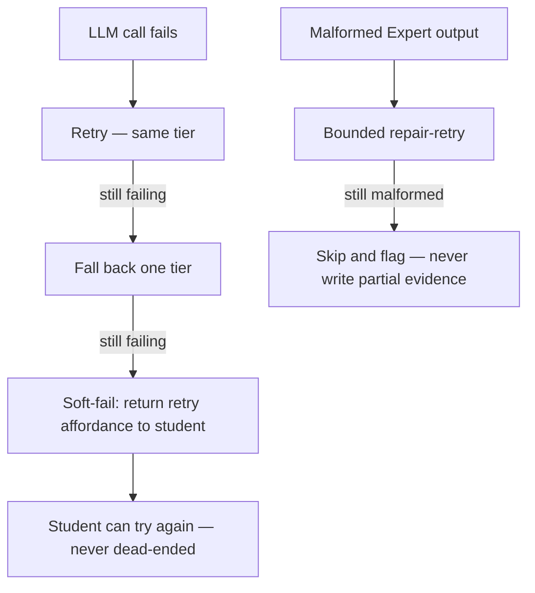

Stemolly's approach to observability and resilience rests on two pillars that reinforce each other. The first is **structured, schema-enforced logging** that makes every request traceable — from its first HTTP byte to the last LLM token — using a fixed field set carried by an explicit context object. The second is a layered **fault-tolerance strategy** that distinguishes between what must never be lost (the evidence log) and what can safely degrade, and enforces that distinction in code rather than convention.

---

## Structured Logging: The Field Contract

Every log line in the system flows through one shared logger — `server/src/logger/index.ts`, backed by [Pino](https://getpino.io/) and integrated with Fastify's built-in logger support. This single entry point enforces a fixed field set.

**Required on every line:**

| Field | Purpose |
|---|---|
| `timestamp` | ISO-8601 string — when it happened |
| `level` | String label (`"info"`, `"warn"`, `"error"`) |
| `module` | Which module emitted this line |
| `event` | A stable, machine-readable event name |
| `traceId` | Ties all lines from one request together |

**Optional fields:** `sessionId`, `jobId`, `durationMs`, `errorCode`, `statusCode`, `reqId`.
`statusCode` is merged in by the error handler. `reqId` is auto-bound by Fastify onto every `request.log` line — app code cannot opt out of it per call.

**Forbidden fields:** anything that carries PII or content — `message`, `transcript`, `prompt`, `content`, and similar content-shaped keys. The schema actively rejects known content keys rather than relying on call sites to remember an allowlist.

The field set is enforced by a [Zod](https://zod.dev/) `.strict()` schema (`LogFieldsSchema`) with a unit test that validates against it. A companion ESLint rule (`no-console`) bans `console.*` everywhere outside the `logger/` module. The rule is the lint half of this discipline; the schema test is the runtime half.

---

## Getting `createLogger()` Right

Pino's defaults do **not** satisfy `LogFieldsSchema`. Out of the box, Pino:

- emits `level` as a **number** (`30` for info, not `"info"`)
- writes the timestamp as an **epoch integer** under a key called `time` (not `timestamp`)
- injects `pid` and `hostname` automatically — two keys `.strict()` will reject as unlisted

Left at defaults, `createLogger()` could not produce a single log line that passed the schema. This gap existed silently for a while because the schema tests fed it hand-built objects and a separately-configured in-memory logger — never the real logger's actual output. It was caught by an independent review pass, not by the test suite.

`createLogger()` therefore must set **three specific options**. Removing any one of them breaks schema conformance for every log line in the system:

```ts
pino({
  base: null,                           // drops pid and hostname
  timestamp: () => `,"timestamp":"${new Date().toISOString()}"`,  // ISO string under the right key
  formatters: {
    level: (label) => ({ level: label }) // string label, not numeric level
  },
  // ...
})
```

These options are **load-bearing**, not stylistic. A permanent regression guard in `server/src/logger/schema.test.ts` verifies them — see the next section for how that guard works.

---

## Testing the Real Logger: Why You Need a Subprocess

Pino writes log lines to a file descriptor through a library called [sonic-boom](https://github.com/mcollina/sonic-boom), which bypasses `process.stdout.write` entirely. Monkey-patching or spying on `process.stdout` captures nothing. `createLogger()` also exposes no injectable destination stream.

This means any test that needs to assert on **the real logger's actual output** cannot take the cheap in-process route. The test must:

1. Write a small script that calls `createLogger()` and emits one line.
2. Spawn it as a child process (e.g. `execFileSync` running `tsx`).
3. Parse its stdout and validate against `LogFieldsSchema`.

This is exactly how the regression guard added after the schema/logger mismatch works. Deliberately removing `base: null` from `createLogger()` causes the guard to fail with `Unrecognized keys: "pid", "hostname"` — the gap is now closed and defended.

The deeper lesson: an in-process test that builds its own pino instance pointed at a memory stream is validating a *different* logger, not the production one. The two can drift apart silently. Testing the real thing requires a different mechanism.

---

## Propagating traceId: The RequestContext

A request's `traceId` (and its per-request logger, which already has `traceId` bound in) travels as one object:

```ts
interface RequestContext {
  traceId: string;
  logger: Logger;
}
```

This `RequestContext` is threaded **explicitly** through function arguments — from the HTTP handler, across the sync-turn, and into every async checkpoint. It is **not** stored in Node's `AsyncLocalStorage` (ALS).

The choice was deliberate. Explicit threading keeps the propagation path visible in code; any function that needs `traceId` must declare it as a parameter. ALS hides this flow, and has a known failure mode: context can silently drop across certain async boundaries (some callback-based APIs, `EventEmitter` listeners, and similar patterns that predate the ALS contract). The cost is one extra parameter threaded through call chains; the benefit is that a missing `traceId` is a compile-time type error, not a runtime mystery.

The error envelope (described below) populates its own `traceId` field from this same propagated context.

---

## One Error Envelope

All error responses from the server share a single shape defined in the contracts package:

```json
{
  "error": {
    "code": "SESSION_NOT_FOUND",
    "message": "Human-readable fallback",
    "traceId": "abc-123",
    "details": { }
  }
}
```

A few rules govern this:

- **HTTP status** carries the broad category (4xx vs 5xx). The `code` field carries the specific, stable, machine-readable reason.
- **User-facing text** is never sent as server prose. The frontend localizes from `code`. This keeps the server and UI in sync across the two supported languages.
- **Domain modules throw typed errors** and never touch HTTP directly. A **single** Fastify `setErrorHandler` is the only place that converts errors into HTTP responses. Fastify's own validation errors (`FST_ERR_VALIDATION`) also flow through this one handler, mapped to `ValidationError` — there is no second place where error bodies are produced.

### LLM and Provider Failures

LLM and provider failures are treated as first-class expected conditions, not surprising crashes. The gateway classifies each failure and scrubs PII before propagating. When an LLM call fails, the system works through a defined escalation:



Cross-provider fallback is **on by default for the Interface** (the conversational turn) and **off by default for the Expert** (the scoring and evidence-writing step, where consistency matters more than availability).

---

## Fault Tolerance: Protect, Degrade, Never Dead-End

The job worker that runs async jobs (scoring, evidence writing) lives **in the same Node process** as the HTTP server. This is a deliberate architecture choice at cohort scale — a separately managed worker process would add operational complexity before the team is ready for it. But a badly-failing job can in the worst case take down the shared process. The fault-tolerance strategy makes that blast radius explicit and bounded rather than pretending it doesn't exist.

The governing philosophy has three parts:

1. **Protect the irreplaceable.** The evidence log is append-only, idempotent, transactional, and backed up. Nothing in the fast path should ever write partial evidence or corrupt a complete record.

2. **Degrade the recoverable.** The fast path — what the student sees — can safely return a stale-but-valid report or a soft-fail with a retry affordance. The student is never shown a dead end.

3. **Fail as a caught error, never a crash.** Every job handler is wrapped so that a handler throwing an exception becomes a job failure, not a process kill.

**Safety rails in place:**

- Every job handler is wrapped in a try/catch; unhandled errors are recorded as job failures, not propagated to the event loop.
- LLM calls and individual jobs are time-bounded; hung work is cancelled, not left blocking.
- Process-level `uncaughtException` and `unhandledRejection` handlers log the event and exit cleanly so the supervisor can restart.
- The process runs under a supervisor with an auto-restart policy; because jobs are durable (stored in the database), a crash resumes in-flight work on restart.

Data safety across a crash is strong. Availability has a single-process ceiling that is accepted at cohort scale; extracting the worker to its own process is the documented next step when the team outgrows it.

---

## Fire-and-Forget Metering: The `.catch()` Rule

The LLM module emits a `'llm.response'` event when a model call completes. A composed observer listens for this event, sums the token counts, computes cost from the tier rate, and calls `metering.recordLlmCall(...)` — **un-awaited**, deliberately. A slow or failing billing write must never block or break a student's turn.

The problem: a bare `void` on a rejecting promise still surfaces at the **process level** as an unhandled rejection. This was not theoretical. When the real provider and metering wiring was composed and run against a unit-test environment with no live database, the metering write rejected asynchronously and **crashed the entire `test:unit` script** — every assertion passing, the run itself dead.

The fix has two parts:

```ts
// 1. Always .catch() at the source — a rejecting void is a process-level crash
metering.recordLlmCall(...).catch((err) => {
  // 2. Always log what you swallowed — silence means billing data disappears with no signal
  logger?.warn({ module: 'llm', event: 'metering.record_failed', purpose, agentRole }, err.message);
});
```

The general rule: **fire-and-forget is a legitimate resilience choice for telemetry, but it must never mean fire-and-never-find-out.** Catch at the source. Log what you swallowed.

> **Note:** The metering rows produced by this write are also the operational-observability signal for token usage and cost. A swallowed failure with no log entry means billing data disappears silently — which is exactly why the warn log is the second, equally required, half of this fix.
