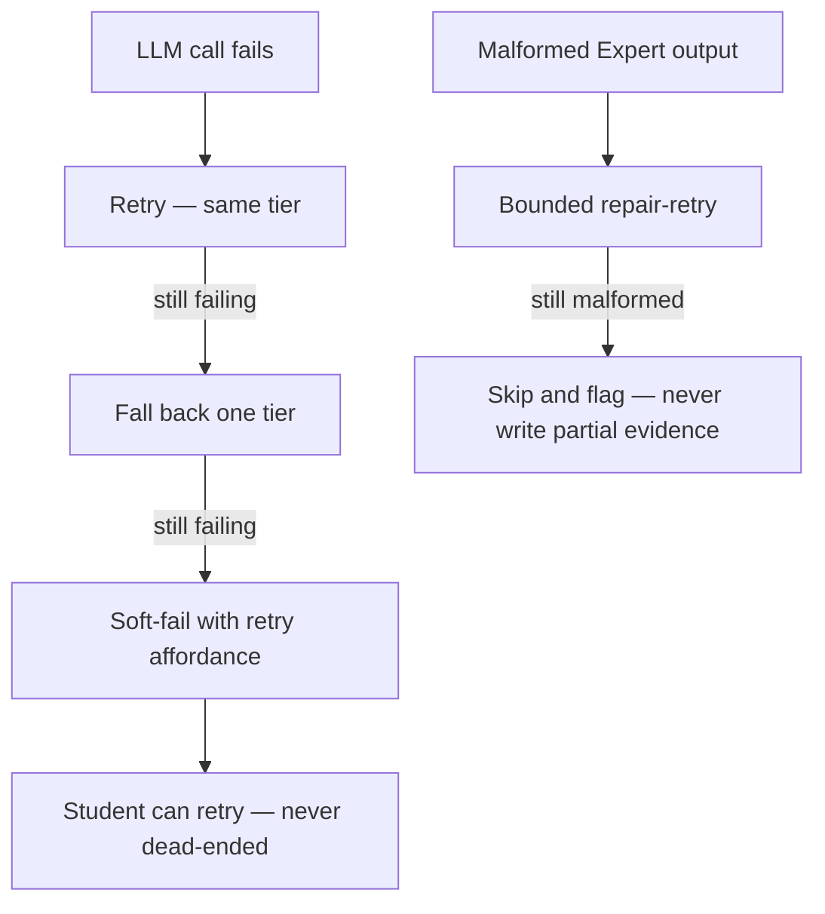
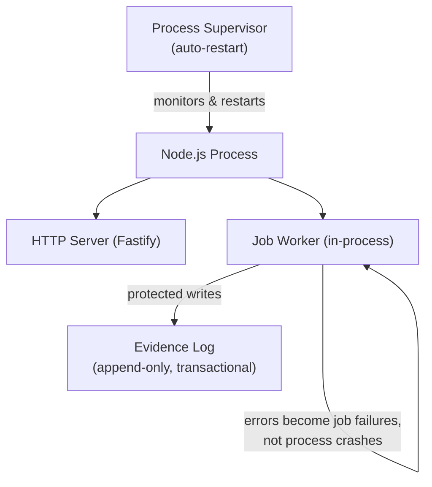

Stemolly's observability and resilience strategy is built on a few consistent principles: every log line, every error response, and every failure path follows a known, enforced contract. This page explains how those contracts work and why they were designed the way they are.

## Structured Logging

Every log line in the backend goes through a single shared logger module at `server/src/logger/index.ts`, built on [Pino](https://getpino.io/) via Fastify's built-in logger integration. All log lines must carry five required fields:

| Field | Purpose |
|---|---|
| `timestamp` | ISO-8601 string |
| `level` | String label (`"info"`, `"warn"`, `"error"`) |
| `module` | Which module emitted this line |
| `event` | A stable, machine-readable event name |
| `traceId` | Ties all lines from one request together |

Six additional fields are optional: `sessionId`, `jobId`, `durationMs`, `errorCode`, `statusCode`, and `reqId`. `statusCode` is merged in by the error handler. `reqId` is auto-bound by Fastify onto every `request.log` line — app code cannot opt out of it per call.

**Privacy is enforced at the schema level.** Fields shaped like content — `message`, `transcript`, `prompt`, `content` — are rejected by a unit test that checks known content-shaped keys. Transcript text, student names, and email addresses must never appear in logs; this is checked automatically, not left to each developer to remember.

`console.*` is banned everywhere outside `logger/**` by an ESLint `no-console` rule. This is the lint half of the discipline; the schema test is the runtime half.

### Why Pino needs explicit configuration

Pino's defaults do not match the schema. Out of the box, Pino emits `level` as a **number** (`30` for info, not `"info"`), timestamps as an **epoch integer** under a key called `time` (not `timestamp`), and injects `pid` and `hostname` — two keys the `.strict()` schema rejects as unlisted.

Left at defaults, `createLogger()` could not produce a single log line that passed the schema. The mismatch was invisible because the schema tests fed hand-built objects and an in-memory test logger, never the real logger's actual output. It was caught by an independent review pass, not by the test suite.

`createLogger()` must therefore set **three specific options**. Removing any one of them breaks schema conformance for every log line in the system:

```ts
pino({
  base: null,                                                    // drops pid and hostname
  timestamp: () => `,"timestamp":"${new Date().toISOString()}"`, // ISO string, right key
  formatters: { level: (label) => ({ level: label }) }          // string, not number
})
```

A permanent regression guard in `server/src/logger/schema.test.ts` verifies these. Deliberately removing `base: null` causes it to fail with `Unrecognized keys: "pid", "hostname"`.

:::note[Why a subprocess?]
Pino writes directly to a file descriptor via [sonic-boom](https://github.com/mcollina/sonic-boom), bypassing `process.stdout.write`. Monkey-patching stdout captures nothing. Any test that must assert on the **real** logger's output must spawn a child process (`execFileSync` running `tsx`), run `createLogger()`, and parse its stdout. An in-process test that builds its own pino instance validates a *different* logger — which is exactly what let the schema and the real logger drift apart silently.
:::

## Request Context and TraceId Propagation

A `traceId` identifies every request through its entire lifecycle — across sync code, async steps, and job boundaries. Rather than using Node's `AsyncLocalStorage` to make the `traceId` implicitly available anywhere, Stemolly threads it explicitly.

Each request creates a `RequestContext` object:

```ts
interface RequestContext {
  traceId: string;
  logger: Logger;
}
```

This object is passed as a parameter through every function that needs it. The `traceId` is also the value that appears in error response envelopes, tying log lines to error responses for the same request.

**Why not `AsyncLocalStorage`?** Explicit passing keeps propagation visible — you can always see where context flows. `AsyncLocalStorage` has a known footgun: it silently loses context across certain async boundaries, producing log lines without a `traceId` in ways that are hard to debug. The cost is one extra parameter; the benefit is that a missing `traceId` is a visible type error, not a runtime mystery.

## Error Responses

All error responses across the API use one envelope shape, defined in the shared contracts package:

```json
{
  "error": {
    "code": "SESSION_NOT_FOUND",
    "message": "Human-readable fallback",
    "traceId": "abc-123",
    "details": {}
  }
}
```

- **HTTP status** carries the broad category (4xx vs 5xx). `code` carries the specific, stable, machine-readable reason.
- **User-facing text** is never sent as server prose. The frontend localizes from `code`, keeping the language boundary clean.
- **Domain modules throw typed errors** and never touch HTTP. A **single** Fastify `setErrorHandler` is the only place that converts errors into HTTP responses. Fastify's own validation failures (`FST_ERR_VALIDATION`) also flow through this one handler, mapped to `ValidationError` — there is no second code path for validation errors.

### LLM and Provider Failure Handling

LLM and provider failures are treated as first-class expected conditions, not exceptional crashes. The gateway classifies each failure and scrubs PII before it surfaces. When an LLM call fails, the system works through a defined escalation:



Cross-provider fallback is **on by default for the Interface** (the conversational turn) and **off by default for the Expert** (the evidence-writing step, where correctness matters more than availability).

## Fire-and-Forget Metering

The LLM module emits a `'llm.response'` event when a model call completes. A composed observer listens for this event, sums token counts, computes cost from the tier rate, and calls `metering.recordLlmCall(...)` **un-awaited** — deliberately fire-and-forget so a slow or failing billing write never blocks a student's turn.

A bare `void` on a rejecting promise still surfaces at the **process level** as an unhandled rejection. This was not theoretical: when the real provider and metering wiring was composed against a unit-test environment with no live database, the metering write rejected asynchronously and **crashed the entire `test:unit` script** — every assertion passing, the process dead.

The rule this established — **fire-and-forget must never mean fire-and-never-find-out** — requires two steps at the call site:

```ts
// Step 1: always .catch() — a rejecting void is a process-level crash
metering.recordLlmCall(...).catch((err) => {
  // Step 2: always log what you swallow — silence means billing data disappears with no signal
  logger?.warn({ module: 'llm', event: 'metering.record_failed', purpose, agentRole });
});
```

Swallowing without logging means billing data disappears silently. The warn log is the second, equally required, half of the fix.

## In-Process Worker Fault Tolerance

The job worker runs async jobs (scoring, evidence writing) inside the **same Node.js process** as the HTTP server. A badly-failing job can, in the worst case, take down both. Rather than extracting the worker into a separate process, the strategy makes the blast radius **explicit and bounded**.

The governing philosophy:

1. **Protect the irreplaceable** — the evidence log is append-only, idempotent, transactional, and backed up. Partial evidence is never written.
2. **Degrade the recoverable** — the fast path serves a stale-but-valid report or a soft-fail with a retry affordance. A student is never dead-ended.
3. **Fail as a caught error, never a crash** — every job handler is wrapped so errors become job failures, not uncaught exceptions.



**Safety rails in place:**

- Every job handler catches its own errors; failures are recorded as job failures, not leaked to the event loop.
- Jobs and LLM calls are time-bounded to prevent event-loop blocking.
- Process-level `uncaughtException` and `unhandledRejection` handlers log and exit cleanly.
- The process runs under a supervisor with auto-restart; jobs are durable, so a crash resumes in-flight work.

Data safety across a crash is strong. Availability has a single-process ceiling that is accepted at cohort scale; extracting the worker to its own process is the documented next step when the team outgrows it.
