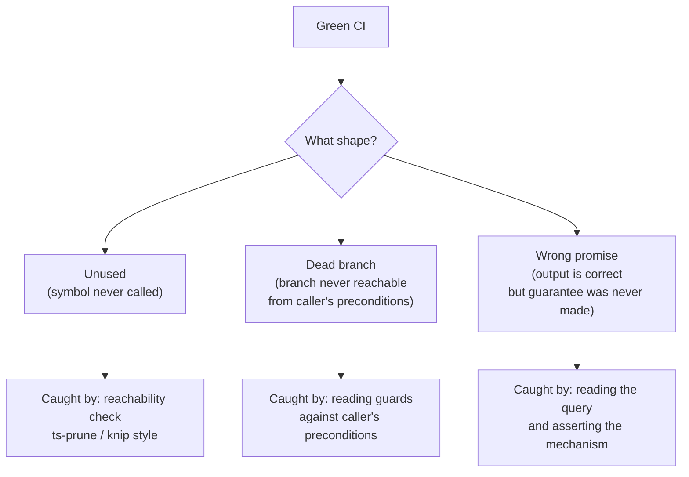

# Testing & Fitness Functions

Stemolly's test strategy rests on two ideas that work together. First, every architectural rule has a runnable check — a *fitness function* — that ships in the same pull request as the code it governs. Second, a green CI run is a necessary condition for merging, but not a sufficient one. Several classes of defect are structurally invisible to automated tests; they only surface when a human reads the running system's call paths rather than its test output. This page explains both the automation and the review discipline — what each covers and, just as importantly, what each cannot see.

---

## Fitness functions ship alongside their code

A fitness function is a test that enforces an architectural rule. In Stemolly the rule is: the check lands in **the same task** that builds the code it governs, not in a separate "testing phase" and not written upfront before its subject exists.

This isn't just process preference. A check is meaningless before its subject exists, and a check written later is likely forgotten. In early development, each governance rail shipped with its subject: the LLM vendor-confinement check came with the `llm` module; the append-only trigger check came with the Postgres setup; the error-envelope check came with the contracts package. The only fitness function that landed first was the dependency-boundary check — because it governs *project structure*, and the structure task *was* that subject.

Some fitness functions are intentionally "half-built" when their full subject isn't ready yet. A check on the job handler's fail-safe behaviour waits for the job runner to exist. Half-checked is fine; half-documented is not.

### Scoping blindspots: a rail only sees what it can reach

A fitness function checks a *concrete mechanism* for a rule that states an *intent*. When the mechanism is narrower than the intent, violations that never touch the mechanism pass green — and the team trusts coverage it doesn't have.

Two measured instances, both found by human review rather than CI:

- **Config discipline (G-18).** The rule says: read configuration in one place and inject everywhere else. The fitness function flags `process.env` outside `config.ts` and `composition.ts`. It enforces the first half. A policy value written as a hardcoded constant — say, a TTL in the pure domain layer — contains no `process.env` call, so the rail cannot see it.
- **Hexagonal boundary (`domain-no-adapters-import`).** The dependency-cruiser rule's `from` clause matches only files under a module's `domain/` folder. A module-root application file importing its own adapters is outside that clause and passes.

The generalizable check: when you pair a rule with a fitness function, name what the function **cannot see** and record that gap alongside the rule. A narrow check can cost more attention than it buys — it makes a reviewer less likely to look for violations the check cannot catch.

---

## Mock LLM only in CI

No automated test may call a real LLM provider. This is enforced by a concrete CI check, not just a convention nobody verifies.

A test co-located with the `llm` module's suite resolves the configured provider adapter under `NODE_ENV=test` and asserts the result is never `anthropic`, `openai`, or `google` — only `mock` or `ollama`. The CI environment sets `STEMOLLY_LLM_PROVIDER=mock` explicitly; it is never a silent default. That way, which provider is active is always visible in the environment. A misconfigured env var that would otherwise silently defeat the mock-only rule fails CI instead of passing quietly.

---

## Testcontainers isolation patterns

Integration tests use a testcontainers Postgres instance. Migrations run once against it, and each test wraps its work in `BEGIN`/`ROLLBACK` so the database is clean for the next test. Three specific situations need extra care.

### SAVEPOINT: wrapping expected failures

Postgres aborts the entire surrounding transaction when any statement raises an error — including a trigger `RAISE` or a unique-constraint violation. If a test deliberately provokes such an error and then runs a follow-up query (for example, to assert the row is unchanged), that follow-up query fails with "current transaction is aborted" rather than testing anything useful.

The fix is a shared `expectRejected(client, fn)` helper. It wraps the failing statement in a `SAVEPOINT`/`ROLLBACK TO SAVEPOINT` pair so Postgres can recover within the outer transaction.

There is one important constraint: the `SAVEPOINT`, the failing statement, and the `ROLLBACK TO SAVEPOINT` must all run on **the same physical connection**. A Postgres `Pool` hands out a possibly-different pooled connection for each `.query()` call. Issuing the SAVEPOINT pair through a `Pool` can land the two statements on different connections and fail with "ROLLBACK TO SAVEPOINT can only be used in transaction blocks".

Every statement in a per-test transaction — the opening `BEGIN`, the `expectRejected` call, the assertion queries, and the final `ROLLBACK` — must run on one `PoolClient` checked out via `pool.connect()`. This is a connection-scheduling bug: a sequential test can reuse a single connection by luck and pass, making it invisible to a green test run. The `Pool`-vs-`PoolClient` type distinction and code review are the only reliable catches.

```
// correct
const client = await pool.connect();
await client.query('BEGIN');
await expectRejected(client, () => client.query('INSERT INTO …'));
// assert row count here using client
await client.query('ROLLBACK');
client.release();

// wrong — pool may dispatch on different connections
await pool.query('BEGIN');
await expectRejected(pool, …);   // <-- type error: Pool, not PoolClient
```

### Metering rows: scope by the database clock

The `metering.llm_calls` table is append-only. Its trigger rejects both `UPDATE` and `DELETE`, so the usual cleanup strategies don't work:

- **Per-test `BEGIN`/`ROLLBACK` doesn't help** — the metering write is fire-and-forget on its own pooled connection, so rolling back the test's transaction doesn't touch the row.
- **Manual `DELETE` in `afterEach` throws** — the append-only trigger fires.

The pattern used in practice: capture `SELECT NOW()` immediately before each request, then count only rows with `created_at >= since`. Tests in the file run sequentially against one shared container, so no other write can land inside a given test's window. No cleanup is needed.

Because the write is fire-and-forget, the row may not have arrived by the time the HTTP response returns. Read the count with a short poll rather than a single query. If CI shows flakiness, widen the poll deadline — do not switch to a transaction or DELETE strategy.

### E2E teardown: record handles the moment you create them

A Playwright `globalSetup` that acquires resources in sequence — a Postgres container, an `AppContext`, a listening server — must publish **each handle to the teardown singleton the moment it is created**, not batch all assignments at the end.

If setup throws partway through (a bad config, a failed `buildServer()`, a port already bound), anything acquired but not yet recorded is invisible to teardown and leaks a live container.

This pattern is load-bearing because of a specific Playwright behaviour: **`globalTeardown` runs even when `globalSetup` throws**. The task loop registers each task's teardown before invoking its setup, so a throwing setup cannot skip teardown. Testcontainers' Ryuk reaper is a backstop for leaked containers, but it is delayed and nondeterministic — it is not a substitute for an explicit `stop()` path.

> **Watch out on Playwright upgrades:** If you switch from a separate `globalTeardown` file to the function-return pattern, re-verify that teardown still runs on a failed setup. The immediate-assignment pattern becomes silently decorative if that ordering changes.

---

## The "green but wrong" family

Three shapes of defect that a passing test suite cannot see. They share one root cause: automated tests validate an artifact against a contract, not against the rest of the running system.



### Green but unused

A unit test proves an artifact works. It cannot prove anything calls it. When an artifact and its tests are written together, they agree perfectly with each other and can drift — in agreement — away from the system they were meant to serve. The suite stays green the whole way.

Two Sprint 1 defects shipped in exactly this shape:

- A resolver (`resolveTier()`) was implemented, tested, and had no production caller at all. Tier and purpose never selected a model. It was later wired into the production call path and is no longer an issue — the general pattern remains.
- A log-validation schema (`LogFieldsSchema`) was tested against hand-built objects. It could not have validated a single line the real logger emitted, because the real logger's output format didn't match the fixture objects.

Why every automated gate misses it: unit tests prove correctness, not reachability; dependency-cruiser checks that existing edges are legal, not that required edges exist; typecheck is satisfied by an exported symbol nobody imports; a diff review sees a module plus its passing tests and reads it as complete.

A cheap CI check helps: fail on an exported symbol whose only importers are `*.test.ts` files. This catches the unreachable-module case. It does **not** catch the wrong-fixture case, where the artifact is imported and used — just never shown the real producer's output. Both early defects were found only by a human running the real code.

### Green but dead at branch level

Tracing an acceptance criterion to a production call path catches a symbol nothing calls. It does not catch a symbol that *is* called but whose internal branches no caller can actually reach.

The worked instance: the `identity` module's redeem path calls an atomic claim first, then on failure calls a domain helper to classify why it failed. By the time that helper runs, the failure reason is already known — the record was fetched by its token hash, so a token-mismatch branch is impossible. Of the helper's four branches, one guard re-tests what the caller already established, and the `return record.role` path is unreachable. The function's unit test exercises the happy path, passes green, and the happy path is the one the running system never reaches.

The cheap check: when a traced path ends in a function that returns a value, read that function's guards against the caller's preconditions. If every path guarantees a throw, or a guard re-tests something already established upstream, the declared contract and the actual role differ. A helper used only for its exceptions should say so — no return type, no parameters it doesn't need.

### Green but ordering guarantee missing

A test asserts on an output. That makes it structurally blind to a defect whose current output is correct but whose correctness is *unpromised*.

A SQL query without `ORDER BY` is the canonical case. On a small table, the database returns rows in insertion order almost every time. Every determinism test passes honestly. The guarantee those tests appear to be checking doesn't exist. It fails later, at scale, on a parallel scan or a changed query plan — in production.

This is different from the unused-artifact family. The artifact is called, on the real production path, and returns the right answer — for the wrong reason. No additional output assertions can close it, because the bug is the absence of a constraint rather than the presence of a wrong value.

Two consequences:

1. Defects of this shape are found by reading code and asking what the system *promises*, not by running it. This one survived multiple review passes and was caught by a human reading the query itself.
2. The right regression test asserts the *mechanism*, not the behaviour: capture the SQL sent and assert the `ORDER BY` clause is present. This is deliberately brittle — it breaks on any rewrite, including a correct one. That cost is accepted as the price of pinning a promise with no observable symptom.

---

## Test isolation: guards and bare harnesses

### Blast radius from plugin-scope guards

A guard hooked at plugin scope applies to every request in that namespace — including requests from tests. When you add a namespace-level auth or validation guard, every existing test that drives a route inside that namespace through the real application stops receiving the route's response and starts receiving the guard's denial.

The assertions fail, but for the wrong reason. The route is untouched and correct. The tests report a regression in the route.

The fix is to separate concerns rather than update expectations:

- Test the route by mounting **only that route** on a bare Fastify instance with no guard in the chain.
- Test the guard separately, asserting the denial in its own dedicated test.

A test that merely changes its expected status to the denial code silently loses all original coverage of the route's own logic.

The blast radius is easy to underestimate because affected tests span tiers. A guard change can simultaneously break a unit test, an integration test, and an E2E spec that all hit the same path. Local check commands often run only one tier, so the problem is invisible locally and only surfaces in CI on merge.

### Hand-built test apps must replicate the composition root

When a route is remounted on a bare Fastify instance to bypass a namespace guard, the test gets framework defaults instead of the settings the production app applied at `fastify()` construction. The route appears to be the same, but it runs differently.

Two settings proved critical when this was done in practice:

- **`traceId` decoration.** The shared error handler reads `request.traceId`. Without the `onRequest` hook that writes it, error responses break.
- **`ajv: { customOptions: { coerceTypes: false } }`.** Without this, Fastify's default AJV compiler coerces a numeric `123` into the string `"123"` before schema validation. A test asserting that a malformed body returns 400 instead observes 200 — the test passes for the wrong reason once its expectation is relaxed, and stops guarding anything.

The general shape: isolation harnesses inherit only what they explicitly restate. Any behavior configured at the composition root is invisible in the route's own file. When building a bare harness, read the composition root and replicate its construction options deliberately.

---

## ESLint flat-config overlap gotcha

In ESLint's flat config format, two config objects that both set the **same rule id** and whose `files` globs overlap do not merge — the later block completely replaces the earlier block's value for that rule id.

This caused a silent regression when a new fitness function reused `no-restricted-syntax` for a rule that applied to `**/index.ts` files. That glob overlapped the pre-existing config-discipline block targeting `server/src/**/*.ts`. Adding the new rule silently disabled the `process.env` restriction for every `index.ts` inside `server/src/`.

The regression was not caught by the first reviewer, typecheck, lint itself (both rules were individually valid), or any automated gate. It was found by a second, adversarial reading of the diff.

**The fix:** when two restrictions must apply to the same file set under the same rule id, combine them as multiple selector objects inside one array in a single config block. Never split them into separate blocks that both claim the same rule id over overlapping files.

---

## Review process gaps

### The coupling-and-placement blind spot

The automated code reviewer's placement rubric explicitly excludes coupling judgements, "encapsulate what varies", and any restructuring that rests on predicting how the system will change. These are intentionally handed to the designer's critique mode. But the designer's critique scores seven named criteria — requirement coverage, soundness, interface clarity, alternatives, simplicity, testability, consistency — and none of them covers coupling, placement, or structural completeness.

The loop contains an explicit handoff from one agent to the other, and the receiving rubric has no criterion for what was handed over. Both agents behaved correctly under their contracts. The finding fell through the gap between them.

Two aggravating factors: "interface clarity" scores whether an interface is concrete enough to implement, not whether it is *complete* — a design that specifies one of two port surfaces and is silent on the other passes. And when the design gate runs without a human reading it, a design's silence about a missing surface propagates into every downstream issue that measures conformance against it.

This gap needs a human reviewer until the receiving rubric grows a criterion for structural completeness.

### Sprint numbers are not durable identifiers

Sprint numbers identify a position in a schedule, not a fact about the system. Inserting a sprint shifts every later number silently.

This has already happened in Stemolly: a sprint inserted into the roadmap pushed everything after it down by one, changing what every previously written "Sprint N" referred to — without touching any of the documents that said it. A pointer file and at least one note came to attribute work to the wrong sprint, and scoping a sprint off them would have roughly doubled it.

**The rule:** sprint numbers belong only in the master plan and the sprint files, which are renumbered together as a unit. ADRs, rules, governance notes, and wiki pages must reference **capabilities and gates** — "until Console Author exists", "once several plugin types exist", "when real minors arrive". These survive any renumber because they name facts about the system, not positions in a plan. A decision record should never carry a sprint number even in passing, because the record outlives the schedule that produced it.

---

## Quick reference

| Pattern | The trap | The fix |
|---|---|---|
| Per-test rollback with expected failures | Statement error aborts the outer transaction | Wrap in `expectRejected(client, fn)` using a SAVEPOINT pair on a single `PoolClient` |
| Metering row assertion | Row is append-only, fire-and-forget | Scope by `SELECT NOW()` before request; poll for arrival |
| E2E global setup teardown | Leak on mid-setup throw | Record each resource handle the moment it is created |
| Plugin-scope guard | Breaks all route tests in the namespace | Mount route alone on a bare instance; test guard separately |
| Bare test app | Silently drops composition root settings | Replicate `fastify()` options, especially `coerceTypes: false` |
| ESLint flat-config | Later block replaces, not merges, the earlier one | Combine selectors into a single config block |
| Sprint numbers in docs | Silently wrong after any renumber | Reference capabilities and gates, not sprint positions |
