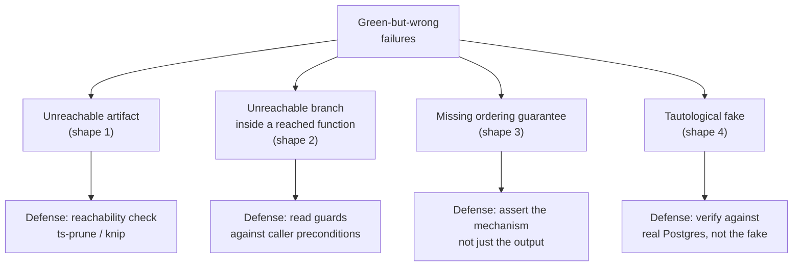
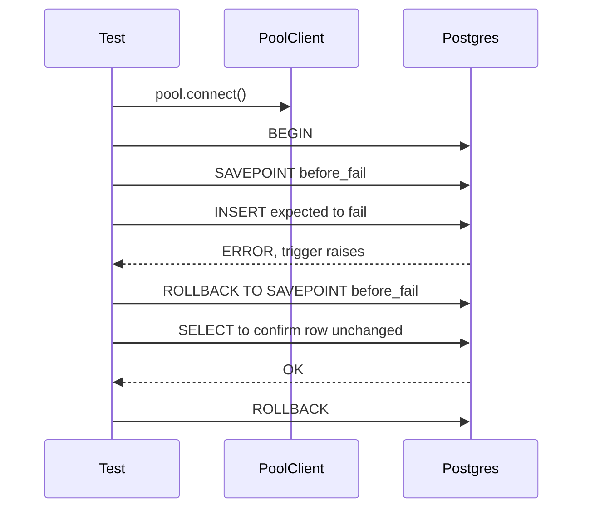
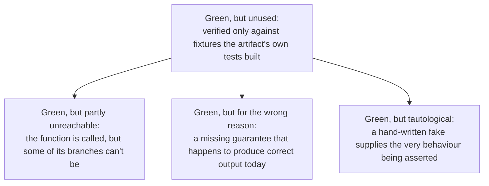
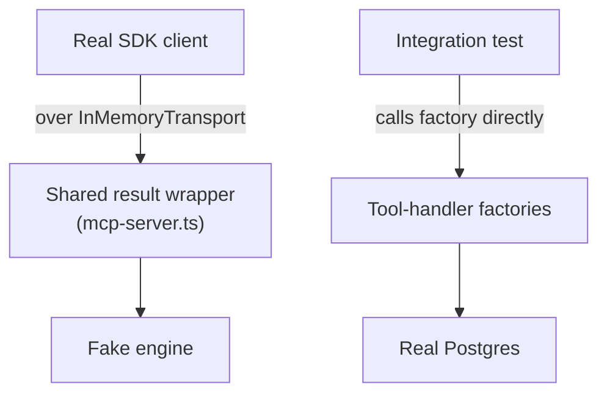

Stemolly's testing strategy rests on one idea: a rule that is not automatically enforced is a suggestion. Every architectural constraint has a corresponding test — called a **fitness function** — that fails CI when the constraint is broken. Equally important is knowing *what a green suite cannot see*. This page covers both: how governance checks are built and co-shipped with the code they govern, and the recurring shapes of failure that pass every gate while the system is wrong.

## Fitness functions co-ship with their code

A fitness function is a test whose subject is an architectural property rather than a feature. In Stemolly, each fitness function is written in the same task as the code it governs — not in a prior "governance sprint." A check that precedes its subject has nothing to enforce; a check that trails its subject leaves a window where violations are invisible.

The exception that proves the rule is G-1 (dependency boundaries), which did land first — because G-1 governs structure, and the scaffold task *is* that structure. Every other rail shipped with its subject: error-envelope shape with the contracts package, the append-only trigger with the Postgres module, logging discipline with the logger, vendor confinement with the LLM module.

Some fitness functions are deliberately "half" when their full subject is not yet built. G-16's job-handler half and the replay-determinism half of G-5a both wait for the job runner and engine — because a check for something that does not exist cannot be meaningful.

### The mock-LLM guard

One fitness function deserves special mention because the failure it prevents is silent and hard to diagnose: a test that accidentally calls a real LLM vendor.

The rule is that no automated test may call a real LLM. The fitness function that enforces it resolves the configured provider adapter under `NODE_ENV=test` and asserts the result is never `anthropic`, `openai`, or `google` — only `mock` or `ollama`. `STEMOLLY_LLM_PROVIDER=mock` is set explicitly in CI, never inferred from a default, so the active provider is always visible in the environment.

Without this check, a misconfigured environment variable would silently defeat the mock-only rule and tests would pass while spending real money against a live API.

## The "green-but-wrong" failure family

The most important testing concept in this codebase is understanding what a green suite structurally *cannot see*. Four distinct failure shapes have each allowed a defect to ship through a fully green suite plus a passing acceptance-criterion trace. They are closely related — each is a case where the test's success is real and the system's behaviour is wrong — but they require different defenses.



### Shape 1 — The unreachable artifact

A unit test verifies that an artifact does what its contract says. It cannot notice that nothing in production calls the artifact at all. Two Sprint 1 defects shipped in this shape:

- `resolveTier()` was implemented, tested, and green. It had no production caller, so tier/purpose never actually selected a model. (Since fixed — the function is now the sole `(tier, purpose) → model+rate` authority on the production call path.)
- `LogFieldsSchema` could not have validated a single real log line, because its tests only ever fed it hand-built objects — never the output the real `pino` logger emits.

Neither was caught by unit tests (which proved the artifact works), dependency-cruiser (which checks that existing edges are legal, not that required edges exist), typecheck, lint, or a diff review (which sees a module plus passing tests and reads it as complete).

The cheap defense: a CI reachability check (`ts-prune` / `knip`-style) that fails on any exported symbol whose only importers are `*.test.ts` files. This catches the unreachable-module case. It does **not** catch the wrong-fixture case — where the artifact is genuinely imported but never shown real input.

### Shape 2 — The unreachable branch

Tracing an acceptance criterion to a production call path confirms the function is called. It says nothing about whether a particular branch inside that function can ever be reached by a caller.

The worked example: `identity`'s redeem path calls an atomic claim first, then on failure calls a domain helper to classify *why* it failed. By the time that helper runs, the record is necessarily already-redeemed or expired. Of the helper's four branches, the token-mismatch check is impossible (the row was fetched *by* that hash), and its `return record.role` is unreachable. The function says it returns a role; in the running system it always throws. Its happy path is exercised only by its own unit test — green, and unreachable, inside a function whose acceptance-criterion trace had already been validated.

The cheap check: when a traced path ends in a function that returns a value, read its guards against the caller's preconditions. If every path in guarantees a throw, the declared contract and the actual role differ.

### Shape 3 — The missing ordering guarantee

A test asserts on output. It is therefore blind to a defect whose current output is correct but whose correctness is not *guaranteed* by the implementation.

A SQL query without `ORDER BY` is the canonical case. On a small table the database almost always returns rows in insertion order, so determinism tests pass honestly — while the guarantee those tests appear to be checking does not exist. The failure arrives later, at scale, on a parallel scan or a changed query plan: in production, once.

This shape was found by reading the query, not by running it. It survived two independent review passes and an acceptance-criterion trace. No amount of additional output assertions closes it, because the bug is the absence of a constraint rather than the presence of a wrong value.

The counter-intuitive defense: assert on the *mechanism*, not the behaviour. Capture the SQL actually sent and assert the `ORDER BY` clause is present. This test is deliberately brittle — it breaks on any rewrite of the query, including a correct one — and that brittleness is accepted as the price of pinning a promise that has no observable symptom.

### Shape 4 — The tautological fake

When a unit test replaces a dependency with a hand-written fake, and the behaviour under test is *the dependency's own correctness*, the test becomes a tautology. The fake supplies the very behaviour being asserted.

The catalog case: a fix required that a slug lookup be scoped by kind. The unit test's fake repository answered per kind — correctly, by hand. So "a rejected misconception does not block a same-slug pattern" held whether or not the production lookup was scoped at all. The fake, not the code, was what made the assertion pass.

Such a test is not worthless. Its real claim is much narrower than its name suggests: it proves the caller *passes the argument through*, and nothing more. The tell is that the fake and the production adapter would have to disagree for the test to go red.

The behavioural claim must be verified where the real implementation lives — against real Postgres, through the module's entry point, with the pre-fix code producing a genuine red. That verification is also the only way to confirm the test is not vacuous.

:::caution
Do not teach the fake to emulate the bug. A fake that models the defect pins the shape of one historical failure rather than the rule, and goes stale the moment the bug is gone.
:::

## MCP transport coverage decay

The MCP adapter's shared result wrapper in `mcp/src/mcp-server.ts` is shared by every registered tool — which makes it a single point of failure. Neither of the adapter's two original test suites exercised it under real conditions:

- `mcp-server.test.ts` drives a real SDK `Client` over `InMemoryTransport`, but against a fake engine, and originally called only one tool.
- `mcp-demo-path.integration.test.ts` reaches real Postgres but calls the tool-handler factories directly, bypassing the wrapper entirely.

Issue #73 added wire-level coverage and retargeted the demo-path integration test to call through the production `createMcpServer` wrapper. But the structural problem remains: coverage has only ever been added one tool at a time, by whoever happened to be looking. Of ten declared tools across the two roles, three have been driven through a real transport against real Postgres.

The per-tool remedy makes the problem look solved — the wrapper is on *a* test's path — while the property that actually matters (every declared tool's return shape marshalled at least once over the wire) remains unmeasured. Each new tool arrives uncovered by default, so the gap widens with ordinary feature work.

The proper fix is a fitness function over the declared tool surface, not another hand-added case.

:::note
A successful `isError: false` response from an MCP `tools/call` only proves the handler did not throw. It says nothing about whether the write reached the underlying store. Independent verification requires querying Postgres directly and checking for the expected row.
:::

## Testcontainers integration test patterns

### Per-test transaction isolation and SAVEPOINT

The standard isolation pattern wraps each test in `BEGIN` (in `beforeEach`) / `ROLLBACK` (in `afterEach`) against a per-file testcontainers Postgres. Migrations run once, tests stay fast. But there is a trap.

Postgres aborts the *entire* surrounding transaction when any statement inside it errors — a trigger `RAISE`, a unique-constraint violation — so a test that intentionally provokes such an error and then runs a follow-up query will find that query fails with "current transaction is aborted," not the assertion it expected.

The fix is a shared `expectRejected(client, fn)` helper that wraps the expected failure in `SAVEPOINT` / `ROLLBACK TO SAVEPOINT`:

```typescript
// Usage — call within a per-test transaction
await expectRejected(client, () =>
  client.query("INSERT INTO ...")  // expected to violate a constraint
);
// Assertions here still run — the SAVEPOINT absorbed the error
```

Two important details:
- The helper takes a `PoolClient`, **not** a `Pool`. A `Pool` can hand out a different physical connection per query, so `SAVEPOINT` and `ROLLBACK TO SAVEPOINT` can land on different connections and fail with "ROLLBACK TO SAVEPOINT can only be used in transaction blocks."
- Every transactional statement — the `BEGIN`, the SAVEPOINT pair, assertion queries, and the final `ROLLBACK` — must run on one client checked out via `pool.connect()`.

This class of bug is connection-scheduling dependent. A sequential test may pass by luck if it happens to reuse one connection. The only reliable guard is the `Pool`-vs-`PoolClient` type distinction and code review.

### Metering rows: scope by clock, poll for arrival

Asserting "exactly one `metering.llm_calls` row was written" cannot use the standard `BEGIN`/`ROLLBACK` pattern for two independent reasons:

1. The metering write is **fire-and-forget** on its own pooled connection — it lands outside the per-test transaction, so rolling back does not remove it, and the row may not have arrived when the HTTP response returns.
2. The **append-only trigger** rejects `DELETE` exactly as it rejects `UPDATE`, so the obvious `afterEach` cleanup throws.

The solution used in practice: capture `SELECT NOW()` immediately before each request, then count only rows with `created_at >= since`. Because tests run sequentially against one `beforeAll` container, no other write can land inside a given test's window. No cleanup is needed — older rows fall outside the window.

Because the write is fire-and-forget, poll to a short deadline rather than reading once. If this proves flaky under CI load, widen the poll deadline — do not switch to a transaction or DELETE strategy, since neither is available.

### docker-compose environment wiring

A testcontainers test that starts a service's image standalone (e.g. `GenericContainer` + `.withEnvironment(...)`) supplies environment variables directly to that container instance. It does **not** validate whether the service's `docker-compose.yml` entry actually names those variables in its own `environment:` or `env_file:` block.

`${VAR}` interpolation in `docker-compose.yml` substitutes text *inside the file* — it does not inject anything into a container's process environment on its own. A service with no `environment:` block receives nothing at runtime, regardless of how green the standalone integration test is.

This allowed a real bug to ship: the `edge` (Caddy) service had no `environment:` block, so on a real deploy Caddy never received its hostname and bearer-token variables. The integration test injected those variables directly on a standalone container, so it stayed green regardless. It was caught only by a reviewer reading the compose file.

The defense is a dedicated regression test that parses the real `docker-compose.yml` and asserts every variable a downstream config (the Caddyfile) references is actually named in the service's own `environment` or `env_file` block.

### Playwright global setup and teardown

A Playwright `globalSetup` that acquires resources in sequence (a testcontainers Postgres, an `AppContext`, a listening server) must publish each handle to the shared teardown singleton **at the moment it is created** — not batched at the end. If setup throws partway, anything acquired but not yet recorded is invisible to teardown and leaks.

This pattern works because `globalTeardown` *does* run when `globalSetup` throws. Verified against `playwright@1.61.1`: the task loop registers each task's teardown before invoking that task's setup, and the teardown file is ordered ahead of the setup file so it runs after a failed setup.

If that ordering changes (a Playwright upgrade, switching from a separate teardown file to a function returned from `globalSetup`), the immediate-assignment pattern silently becomes decorative and mid-setup failures start leaking containers. Testcontainers' Ryuk reaper is a real backstop, but it is nondeterministic and delayed — it is not a substitute for an explicit `stop()` path.

## CI and build gotchas

### Every job needs its own build step

In a monorepo, each GitHub Actions job starts from a clean checkout. A build step in one job does not carry over to another job in the same workflow.

If a test job does a runtime cross-package import (e.g. importing `@engine-poc/server` which resolves via `dist/engine/index.js`) and the job has no `pnpm build` step, the test will fail with a module-resolution error on CI — even though it passes locally, where `dist/` exists from prior work.

Every CI job that runs code depending on a cross-package runtime import needs its own build step.

### Fastify test harnesses must replicate composition root options

A test that builds its own bare Fastify instance to mount a route in isolation gets framework defaults, not the production options. Two settings proved load-bearing:

- The `traceId` decoration and its `onRequest` hook must be re-added, because the shared error handler reads `request.traceId` and error responses break without it.
- `ajv: { customOptions: { coerceTypes: false } }` must be re-applied. Without it, Fastify's default compiler coerces a numeric `123` into the string `"123"` before schema validation runs — so a test asserting a malformed body returns 400 instead observes 200. The test passes for the wrong reason once its expectation is relaxed, and stops guarding anything.

When building an isolation harness, read the composition root and deliberately replicate its construction options. Confirm that any assertion about malformed input still fails when the production code is broken.

### Namespace-scope guards break existing route tests

A guard hooked at plugin scope applies to every request reaching that namespace, including requests from tests. Any existing test that builds the real application and injects against a route inside the namespace stops receiving that route's response and starts receiving the guard's denial. The test suite reports a route regression while the route is untouched.

The fix is to separate concerns: test the route's own logic by mounting only that route on a bare Fastify instance with no guard in the chain; test the guard separately. A test that merely changes its expected status to the denial code silently loses all coverage of the original route behavior.

The blast radius is easy to underestimate. The same collision can exist across a unit test, an integration test, and an end-to-end spec — often in separate files run by separate commands, so local checks are green while CI would have failed on merge.

### ESLint flat-config rule replacement

In ESLint's flat config format, when two config objects both set the same rule id and both match the same file, the later object's value **completely replaces** the earlier one. Selector arrays are not concatenated.

The exception: if the later block's value normalizes to severity-only (e.g. `['error']` with no options), ESLint merges the earlier block's options back in instead of clearing them.

This silently disabled a `process.env` restriction for every `index.ts` file: a new rule reused `no-restricted-syntax` with overlapping `files`, replacing the existing block rather than extending it. Neither rule was individually malformed, so lint itself did not catch it — it required an adversarial second reading of the diff.

**Fix:** when two restrictions must apply to the same file set under the same rule id, combine them as multiple selector objects inside one array in a single config block, never as separate blocks that both claim the same rule id over overlapping files.

## Review and governance blind spots

Several recurring failure patterns sit outside every automated gate — not because the gates are poorly designed, but because the defect lives upstream of what any gate can check.

### A fitness function scoped to a mechanism misses violations that bypass it

A rule states an intent; its fitness function checks a mechanism. When the mechanism is narrower than the intent, any violation that never touches the mechanism passes green.

Two measured instances, both found by human review:

- **G-18 (config discipline)** flags `process.env` outside `config.ts` and `composition.ts`. A policy value written as a hardcoded constant — an invite-token TTL living directly in the pure domain layer — contains no `process.env` to flag and is invisible to the rail.
- **`domain-no-adapters-import`** (hexagonal rule). Its `from` clause is `^server/src/<module>/domain/`, so it only sees files under `domain/`. A module-root application file importing its own adapters is outside the clause and passes.

When pairing a rule with a rail, name what the rail **cannot** see and record that gap alongside the rule. A narrow check makes reviewers *less* likely to look for violations of other shapes, so it can cost more attention than it buys.

### An ADR's "future work" section is not a tracked commitment

ADR-023 named a specific import to remove and described the enforcement rule that should guard it. Twelve days after the ADR was accepted, the import was still there, found only by a human reading the tree during an unrelated review.

The reason: the enforcement rule was listed in ADR-023's own "blind spots" section as something a rule "can" do, and was never written. Nothing fails when a future-work item goes unfulfilled. The ADR reads as enforced while it is not.

The asymmetry between repos made this worse: the engine PoC repo had the companion rule; the app repo did not. The same invariant was enforced in one place and unenforced in another, with nothing to reveal the difference.

### Acceptance criterion wording is the ground truth every gate reads from

Every automated gate — tests, review passes, criterion-to-code traces — takes the acceptance criteria as the definition of correct. An underspecified criterion produces a clean run: the code satisfies what was written, the tests pin what was written, and the trace confirms the written thing is reachable. Nothing is positioned to ask whether the criterion itself specified the right thing.

The measured instance: a criterion read "throws when the slug resolves to a rejected entry" and never settled whether a slug is scoped per kind. The implementation chose one reading, the tests encoded that reading, both review passes verified placement and reachability. The scope mismatch sat outside every question being asked.

At review, treating the criterion as a suspect artefact — asking what the next caller needs from the interface and whether the wording gives them a safe way to get it — is the one question no execution gate re-asks.

### Coupling and placement findings have no gate owner

The automated code reviewer's placement rubric explicitly excludes coupling judgements, "encapsulate what varies," and any restructuring that rests on predicting how the system will change. The designer's critique rubric scores requirement coverage, soundness, interface clarity, alternatives, simplicity, testability, and consistency — none of which is about coupling or structural completeness.

The loop contains an explicit hand-off from one reviewer to another, and the receiving rubric has no criterion for what was handed over. Both agents behaved correctly under their own contracts; the finding fell through the gap between them.

### ADR misreading: summaries drop ranking clauses

A note summarizing an ADR compresses by dropping subordinate clauses — and the clause that *ranks* an objection ("this is the one that matters") reads as removable detail.

This led to a proposal being filed as a sprint-ready issue that had to be withdrawn once the ADR's rejected options were read directly. The note recorded two objections of similar weight; the ADR stated the second as the thing the decision rests on.

A second misreading of the same ADR in the same session came from a different mechanism: applying an invariant only where the hazard appeared worst, rather than to every clause the invariant names. The ADR stated that a node UUID is never placed in a prompt, a model-callable argument, *or* a model-visible result. A review proposed fixing only the arguments, reasoning that results are less dangerous. The invariant draws no such distinction — and the mechanism runs the opposite direction: results are where the UUID enters the model's context.

**Working rule:** a note is a pointer for retrieval, never a substitute for the record. Before proposing anything an ADR lists under Rejected options, open the ADR and read that section directly. When a proposal touches an accepted ADR, read the invariant sentence itself and honour every clause. If a clause seems not worth honouring, that is a supersession argument, not a detail to quietly drop.

:::note
Sprint numbers are not durable identifiers. An inserted sprint shifts every later number silently, changing what every previously written "Sprint N" refers to without touching the documents that say it. ADRs, rules, and notes must reference capabilities and gates — "until Console Author exists," "when real minors arrive" — not sprint numbers. A decision record that carries a sprint number will point to the wrong sprint after any renumber.
:::

Tests here do two jobs. Ordinary tests check that code does what it should. **Fitness functions** are a second kind of test — code that checks the *architecture* itself still holds, like "no module imports a real LLM vendor" or "no adapter code lives inside a domain folder." Most of this page is not general testing advice; it is a catalog of specific ways a fully green suite still let a real defect through, each one found by a human reading code, not by CI. That pattern repeats enough to be the actual shape of this topic: green is necessary, but it has never once been sufficient here.

## Fitness functions ship with the code they check

A fitness function is written in the same task that builds the thing it governs, never as a separate "governance phase" done upfront. The reasoning is simple: a check is meaningless before its subject exists. When the project's foundational sprint was planned, only the very first task — the folder scaffold — got its fitness function first, because that task's whole job *was* the structure the check verifies. Every other rule shipped alongside its subject instead: the error-envelope check landed with the contracts package, the append-only-database check landed with Postgres, the logging-discipline check landed with the logger, and so on.

Some checks are deliberately shipped "half-built," covering only the part of a rule whose subject already exists, with the other half explicitly left to land later once its subject is built too. This is normal, not a gap — as long as the missing half is tracked and not silently forgotten (see [Where reviewers have blind spots](#where-reviewers-have-blind-spots) for what happens when it is).

## No automated test ever calls a real LLM

:::caution
CI must never resolve a real LLM provider. This is enforced by a test, not just a convention.
:::

A test living alongside the LLM module's own suite resolves whichever provider is configured under `NODE_ENV=test` and asserts it is never `anthropic`, `openai`, or `google` — only `mock` or `ollama` are allowed. CI sets `STEMOLLY_LLM_PROVIDER=mock` explicitly, never as a silent default, so which provider is active is always visible in the environment instead of inferred. The point of making this a test, rather than a written rule someone is trusted to follow, is that a misconfigured environment variable now fails the build instead of quietly spending real API calls in CI.

## Testcontainers patterns, and the CI mechanics around them

Most integration tests run against a real Postgres started by [testcontainers](https://testcontainers.com/), not a mock database. That buys realism, but real Postgres comes with real transaction rules, and several of them have bitten this project in non-obvious ways.

### A test that expects a failure needs its own SAVEPOINT

The normal isolation pattern wraps each test in `BEGIN` before the test and `ROLLBACK` after, so migrations only run once and tests stay fast. The problem: Postgres aborts the *entire* surrounding transaction the moment any statement fails — a trigger rejection, a unique-constraint violation — so if a test deliberately provokes that failure and then runs a follow-up query (to check the row is unchanged, say), that follow-up query itself fails with "current transaction is aborted."

The fix is a shared `expectRejected(client, fn)` helper that wraps the expected failure in its own `SAVEPOINT` / `ROLLBACK TO SAVEPOINT` pair, so the outer test transaction survives it. One extra rule applies here: a `SAVEPOINT` is scoped to a single physical database connection, and a connection pool can hand out a *different* pooled connection per query. So `expectRejected` must take one checked-out `PoolClient`, never the `Pool` itself — otherwise the `SAVEPOINT` and its `ROLLBACK TO SAVEPOINT` can land on different connections and fail outright. This class of bug is timing-dependent: a test can get lucky, land on the same connection by chance, and pass — so it's caught by the type distinction between `Pool` and `PoolClient`, and by code review, not reliably by a green run.



### A metering row can't be rolled back or deleted, so it's scoped by the clock

Metering writes are fire-and-forget: the code that records an LLM call does not wait for it, and the write lands on whatever pooled connection is free — not the per-test transaction the test is holding. So rolling back the test's transaction doesn't remove it. Worse, the metering table is append-only, so even the fallback of a `DELETE` in cleanup is rejected by the database.

The working pattern captures `SELECT NOW()` right before each request and later counts only rows created after that timestamp. Because tests in that file run sequentially, no other write can land in a given test's time window. The count also has to be *polled*, not read once, since the row can land slightly after the HTTP response returns.

### `globalTeardown` still runs even when `globalSetup` throws

The end-to-end harness boots several resources in `globalSetup` — a testcontainers Postgres, a pooled connection, a listening server. If setup throws partway through (a bad config, a port already in use), anything acquired but not yet recorded as a handle is invisible to teardown and leaks. The fix is to publish each handle to the shared teardown object the moment it's created, not batched at the end of setup.

This works because of a Playwright behavior worth stating plainly, since nothing in the harness code says it: Playwright genuinely does run `globalTeardown` even when `globalSetup` throws, and it does so *after* the failed setup — verified directly against Playwright's own source. Testcontainers' own reaper (Ryuk) is a real backstop that eventually cleans up orphaned containers, but it's slow and nondeterministic, so it's not a substitute for the explicit teardown path.

### `docker-compose.yml` env vars are not automatic

A docker-compose service only receives an environment variable at runtime if that service's own `environment:` or `env_file:` key names it — `${VAR}` interpolation only substitutes text *inside* the compose file, it does not inject anything into a container's process. A testcontainers test that starts a service's image standalone and hands it env vars directly bypasses the compose file's own wiring entirely, so the compose file's real correctness is never actually exercised, however green the suite looks.

This shipped a real bug: a VPS deploy's edge (Caddy) service had no `environment:` block at all, so on a real deploy Caddy would never get its hostname or bearer-token variables — but the service's own integration test supplied those same variables directly to a standalone container, so it stayed green regardless. A reviewer reading the compose file directly caught it, not any test. The fix was a dedicated regression test that parses the real compose file and asserts every variable a downstream config references is actually declared in that service's own `environment`/`env_file`.

### A CI job with a cross-package import needs its own build step

Each job in a CI workflow starts from a clean checkout, regardless of what a sibling job in the same workflow already did. One integration test imports another package by its bare module name, which resolves through that package's compiled output — a gitignored `dist/` folder that only exists locally once someone has built it. Running that test right after `pnpm install`, with no build step, works by accident on a developer's machine (a stale local `dist/` is still lying around) and fails on a genuinely clean CI checkout with a module-resolution error that looks nothing like a real test failure. Every job that runs code depending on a cross-package runtime import needs its own build step — a sibling job's build does not carry over.

## Test harnesses that quietly diverge from production

Two Fastify-specific traps share the same root cause: a test that isolates a route from the full application can accidentally isolate it from the settings that route depends on to behave correctly.

**A hand-built test app inherits framework defaults, not production settings.** Settings configured once where the real application is built — request-body coercion rules, request-scoped decorations the shared error handler relies on — are properties of *that instance*, not of the routes mounted on it. A test that spins up its own bare Fastify instance to test one route in isolation gets framework defaults instead. The dangerous version of this: without re-applying the production setting that disables automatic type coercion, a malformed request body like the number `123` gets silently coerced to the string `"123"` before validation runs — so a test asserting "a bad body returns 400" instead observes 200, and passes for the wrong reason. It doesn't fail loudly; it just stops guarding anything. The rule that follows: when building an isolated test harness, read the real application's construction code and deliberately copy the settings it applies, and confirm any "this should fail validation" assertion still fails when the real code is broken.

**A guard added at plugin scope silently breaks every existing test on that path.** If a fail-closed guard is hooked at the namespace level, every request into that namespace goes through it — including test requests that build the real app and inject against a route inside it. Those tests start receiving the guard's denial instead of the route's real response, and report a regression in a route that is actually untouched and correct. The fix is not to update the tests' expectations to the denial — that silently deletes their original coverage — but to test the route and the guard separately: the route alone, on a bare instance with no guard in the chain, and the guard's own behavior in its own dedicated test. This kind of collision is easy to under-count because affected tests are spread across unit, integration, and end-to-end tiers, and a local check command that only runs some of those tiers can stay green while CI would fail on the rest.

## Four ways a green suite lies to you

A unit test only proves an artifact honors *its own contract*. It cannot notice that nothing in the running system ever calls that artifact, or that the real caller feeds it something different from what the test built by hand. Four distinct shapes of this have shipped in this codebase, each one invisible to a fully green suite and caught only by a human reading the real code:



**Green but unused.** A resolver was implemented, tested, and green — with no production code calling it at all, so it never actually selected anything in the running system. Separately, a schema validated only objects its own tests built by hand, and could not have validated a single real line the production logger ever emitted. Neither gap was visible to unit tests (they only prove the artifact works, not that anything uses it), a dependency check (it only checks edges that exist, not edges that should exist and don't), or a diff review (a module plus its own passing tests reads as complete). The defense is to ask whether an acceptance criterion traces to a real production call path, not merely whether it's test-backed — and a cheap automated check can catch the "nothing imports this" half of that (an exported symbol whose only importers are test files), though it can't catch the wrong-fixture half.

**Green but partly unreachable.** Even a function that *is* reached by a validated production path can still have branches nothing in production can ever hit. One redemption path called an atomic claim first and only fell back to a classification helper on failure — by which point one of that helper's four branches had already become logically impossible, along with its declared return value. The function's signature promised a return value; in the running system it always throws. The cheap check: when a traced call path ends in a function that returns something, read that function's guards against what its caller has already guaranteed. If every path in leads to a throw, the declared contract and the real behavior have quietly diverged.

**Green but for the wrong reason.** A test that only asserts on output is structurally blind to a promise that was never actually made. A SQL query with no `ORDER BY` is the clean example: on a small table, Postgres happens to return rows in insertion order almost every time, so every "is the order correct" test passes honestly — right up until a bigger table, a parallel scan, or a changed query plan breaks it in production, once. This kind of defect is found by reading code and asking what the system *promises*, not by running it. The test for it deliberately inverts the usual advice and asserts on the mechanism (the actual SQL sent must contain an ordering clause) rather than the behavior — which is brittle on purpose, since that's the only way to pin a guarantee that has no visible symptom until it breaks.

**Green but tautological.** When a unit test replaces a real dependency with a hand-written fake, and the thing under test is really *that dependency's own correctness*, the test becomes circular. In one case, a fix required that a lookup be scoped correctly by category — but the test's fake repository already answered per-category correctly, by hand, so the test passed whether or not the real production lookup was scoped at all. Such a test isn't worthless; it proves the caller passes the right argument through, and nothing more. It cannot fail for the reason it looks like it's testing, because the fake and the real implementation would have to actively disagree for it to go red. The real behavioral claim can only be verified against the real implementation — real Postgres, the module's own entry point — with the pre-fix code confirmed to produce a genuine failure first. And the wrong repair is teaching the fake to reproduce the bug: that pins the shape of one historical failure instead of the actual rule, and goes stale the moment the bug is fixed.

## MCP: coverage that decays by default

The MCP adapter's shared result wrapper sits underneath every registered tool, which makes it a single point of failure — and for a while, it sat on no test's real path at all. One test suite drove a real client over a real wire transport, but against a fake engine. The other suite reached real Postgres, but by calling the tool-handler functions directly, skipping the wrapper entirely. So the one piece every tool depends on was never exercised by both a real transport *and* a real database at once, and a defect there stayed invisible to a fully green suite and to a criterion-by-criterion trace, because that trace only confirms a call path exists — it says nothing about a malformed reply coming back out.



The deeper problem is structural, not a one-off gap: coverage of that wrapper has only ever been added one tool at a time, by whoever happened to be looking when a defect surfaced. Nothing gates the count, so each newly registered tool arrives uncovered by default — the gap doesn't just persist, it widens with ordinary feature work. After each individual fix the wrapper looks "covered" again, because it's genuinely on *some* test's path, while the property that actually matters — every declared tool driven at least once over a real transport against a real database — stays unmeasured. Closing this properly means a fitness function over the *declared tool surface*, counted in tools, not lines: a wrapper handling ten tools in one code path reads as 100% line-covered after a single test while nine other return shapes stay unproven.

One more layer of the same caution applies even once a tool has been driven over a real transport: a successful `tools/call` response with `isError: false` only proves the handler didn't throw. It says nothing about whether the write it claims to have made actually reached the database. Independent proof means querying the store directly and checking for the row — the store itself is the only real witness, for any adapter that sits in front of persistent state.

## Where reviewers have blind spots

Automated gates and human review passes each check something specific — and each one can be fully satisfied while a real defect walks straight through the gap between what it checks and what the rule actually meant.

**A check scoped to one mechanism misses anything that avoids that mechanism.** A rule can state a broad intent while its enforcing check only looks for one narrow shape of violation. One config-discipline rule flags stray environment-variable reads outside two designated files — but says nothing about a policy value hardcoded directly into a layer that should never contain policy at all, because that hardcoded value contains no environment-variable read to flag. Another dependency rule only examines files under a `domain/` folder, so a violation sitting in a module's own top-level file, outside that folder, passes cleanly. The general lesson: when pairing a rule with an automated check, name what that check *cannot* see and write that gap down next to the rule — a check that fires on one shape of violation can make a reviewer less likely to look for the others.

**A wrong acceptance criterion is invisible to every gate downstream of it.** Every gate after a task is written — tests, review passes, a trace from criterion to code — treats the written criterion as ground truth. That's what makes them gates. It also means a criterion that's ambiguous or simply wrong produces a perfectly clean run: the code satisfies what was written, the tests pin what was written, the trace confirms it's reachable, and nothing in that sequence is positioned to ask whether the criterion specified the *right* thing. One criterion never settled whether a lookup should be scoped by category; the implementation picked a reading, the tests encoded that same reading, and both review passes correctly verified the questions their own rubric asks — while the actual scope mismatch sat entirely outside those questions. The practical upshot: a clean gate record measures how hard a task was, not how likely it is to be wrong, and a criterion is worth re-reading as a suspect at review time, not trusted as settled.

**Sprint numbers are not safe to put in ADRs or governance records.** A sprint number identifies a position in a schedule, not a fact about the system. When a sprint is inserted into the roadmap, every later sprint's number shifts silently, and any document that said "Sprint N" now points to different work without a word of the document changing. The rule: ADRs and governance notes must reference capabilities and gates — "until Console Author exists," "once several plugin types exist" — not sprint numbers. The sprint files and master plan are renumbered together as a unit; everything else must be invariant to that renumber.

**An ADR's own "future work" note is not a tracked commitment.** An accepted decision named a specific file's improper import and ordered it removed. Twelve days later, the import was still there — found only by a human reading the code tree during an unrelated review. The decision had described the boundary it was protecting as a list of individual files, which turned enforcement into a per-file obligation, and the check for one of those files was named in the decision's own text as something a future rule "can" do — and was simply never written. One sibling codebase had the equivalent check; this one didn't, and nothing made that asymmetry visible. Nothing fails when an ADR's stated future work goes unfulfilled, so the record reads as enforced while it is not.

**A review finding can fall through a real gap between two agents' contracts.** An automated design reviewer explicitly excludes judgments about coupling and structural placement, on the grounds that those belong to the human designer at design time — and the designer's own critique checklist, covering seven separate criteria, has no line item for coupling or placement either. Both reviewers behaved correctly under their own rules; the finding simply fell into the space between them, and it had already recurred once before without being fixed. The exclusion is only sound while someone actually catches what it hands off — which is a standing risk, not a closed one.

**An ESLint config rule can silently disable a coverage check it never meant to touch.** In ESLint's flat-config format, when two separate config blocks both set the same rule for overlapping files, the later-registered block's setting for that rule *replaces* the earlier one rather than merging with it. Adding a new rule that reused an existing rule id, over a file pattern that happened to overlap an existing config-discipline block, silently switched off that block's protection for every file the new rule's pattern touched — and no automated check caught it, because both rule blocks were individually well-formed. It took a second, deliberately adversarial review pass to notice. The fix: when two restrictions must apply to the same files under the same rule id, combine them into one config block with multiple selectors, never as separate blocks that both claim the same rule over the same files.

**Reading an ADR's own words matters more than trusting a summary of it — twice, in the same review.** A retrieval note paraphrasing a rejected design option dropped the one clause that actually made the rejection decisive, leaving the note's summary reading as two roughly equal costs where the source ADR names one of them as the reason the whole decision rests on it. A reviewer who read only the note proposed the rejected design again, and had to withdraw it once the ADR itself was read directly.

:::caution
A note is a pointer for retrieval, never a substitute for the record. Before proposing anything an ADR lists as a rejected option, open the ADR and read that section directly.
:::

The same review session repeated the mistake in a second form immediately after fixing the first. The ADR's invariant named a uuid as forbidden in a prompt, an argument, *and* a model-visible result. A follow-up proposal fixed only the argument case, reasoning that an argument lets a model *write* a uuid while a result only lets it *read* one — a real difference in risk, but not a distinction the ADR itself draws, and the result is in fact where a uuid actually enters a model's context in the first place. Neither misreading was carelessness; both were the same kind of compression — reconstructing a rule from the part that felt most important and quietly dropping the rest. The working rule that follows from both: when a proposal touches an accepted ADR, read its invariant sentence and honor every clause in it as written. If a clause genuinely doesn't seem worth keeping, that's an argument to bring to a new decision that supersedes the old one — not a detail to quietly skip.
