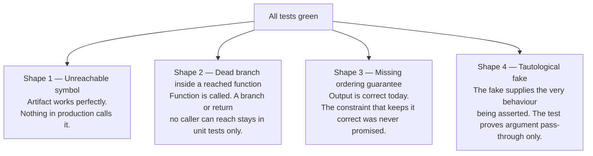
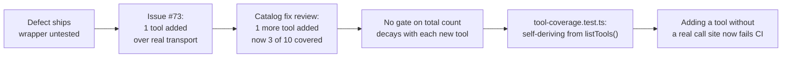

The project's testing approach rests on one principle: a governance rule without an automated check is a wish, not a constraint. Every **fitness function** — a test that enforces an architectural property rather than a business behaviour — ships in the same task that builds the code it governs, so no rule exists on paper longer than it takes for its subject to exist. This page explains how that principle works in practice, what can go wrong despite it, and how to avoid the infrastructure and process traps that have already been learned.

## Fitness Functions Ship With Their Subject

A fitness function that predates its subject has nothing to check. One that postdates it leaves a gap. The rule is therefore structural: the check lands in the same sprint task as the code it enforces.

In Sprint 1 this produced a concrete ordering. The dependency-boundary check (G-1) could land first, in the scaffold task, because the scaffold *is* the structure it governs. Every other check waited for its subject: the error-envelope check shipped with the contracts package, the append-only trigger check shipped with the Postgres package, the logging check with the logger, vendor confinement with the LLM module, and the fail-safe handler check with the echo turn. Some checks are deliberately half-finished — the job-handler half of the fail-safe-handler check (G-16) and the replay-determinism half of the append-only check (G-5a) both wait for the job runner and engine to exist.

## The No-Real-LLM Rule in CI

No automated test may call a real LLM provider (Anthropic, OpenAI, Google). This is not a convention — it is enforced by a fitness-function test in the `llm` suite.

The test loads the boot-validated **model-selection artifact** under `NODE_ENV=test` and iterates every entry, asserting that none names a real cloud provider. The committed `server/config/model-selection.json` sets every entry to `provider: 'mock'` explicitly — never a silent default — so the active providers are always visible in the checked-in file.

The mock model is not purely generic. Special model IDs such as `mock-analyst-v1`, `mock-analyst-with-gaps-v1`, and `mock-hang-v1` drive canned analyst replies or timeout scenarios, while ordinary IDs echo the last user message. This gives tests realistic, deterministic behaviour without touching any real provider.

If a misconfigured artifact entry would otherwise silently defeat the mock-only rule, this check fails CI instead of passing quietly.

## Four Ways a Suite Can Be Green and Wrong

The most important insight in this codebase's testing history is that a fully green suite is weaker evidence than it appears. Four distinct failure shapes have been found here, all of which let a real defect ship while every automated gate returned green.

### Shape 1 — The artifact nothing calls

A unit test verifies an artifact against its own contract. It cannot notice that nothing in the system calls the artifact. When an artifact and its tests are written together, they agree with each other perfectly, and both can drift — in agreement — away from the system.

Two Sprint 1 defects shipped in exactly this form. `resolveTier()` was implemented, tested, and green, with no production caller — tier and purpose never actually selected a model. (Since fixed — the function is now wired as the sole `(tier, purpose) → model+rate` authority on the production call path.) `LogFieldsSchema` could not have validated a single real log line because its tests only ever fed it hand-built objects, not anything the real pino logger emitted. Both were found by a human running the real code, not by any gate.

The cheap mechanical defence is a CI reachability check (`ts-prune`/`knip`-style): fail on an exported symbol whose only importers are `*.test.ts` files. This catches the unreachable-module case, but not the wrong-fixture case, where the artifact really is imported and just never shown the real producer's output.

### Shape 2 — Dead branches inside a reached function

Tracing an acceptance criterion to a production call path confirms a symbol is called. It does not reveal that a branch *inside* that function is unreachable given what its callers can provide.

The worked example: `identity`'s redeem path calls an atomic claim first, and only on failure calls a domain helper to classify why the claim failed. By the time that helper runs, the record is necessarily already-redeemed or expired — so its token-mismatch branch is impossible (the row was fetched *by* that hash) and its `return record.role` is unreachable. The helper always throws in the running system; its happy path lived only in its own unit test.

The cheap check: when a traced path ends in a function that returns a value, read its guards against the caller's preconditions. If every real path through it guarantees a throw, the declared contract and the actual role differ.

### Shape 3 — The missing ordering guarantee

A test asserts on an output. That makes it blind to a defect whose current output is correct and whose future output is merely *unpromised*. A SQL query with no `ORDER BY` is the canonical case: on a small table the database returns rows in insertion order essentially every time, so every determinism test passes honestly — while the guarantee those tests appear to be checking does not exist. It fails at scale, on a parallel scan or a changed query plan.

This is not caught by adding more output assertions, because the bug is the *absence* of a constraint, not the presence of a wrong value. The natural test inverts the usual advice: assert on the *mechanism* — capture the SQL actually sent and assert the `ORDER BY` clause is present. This test is deliberately brittle (it breaks on any rewrite, including a correct one) and is accepted as the price of pinning a promise that has no observable symptom.

### Shape 4 — The tautological fake

When a unit test replaces a dependency with a hand-written fake, and the behaviour under test *is the dependency's own correctness*, the test becomes a tautology.

The catalog case: the fix under test was that a slug lookup must be scoped by kind. The unit test's fake repository answered per kind — correctly, by hand. So the assertion held whether or not the production lookup was scoped at all. The fake, not the code, was what made the assertion pass.

Such a test is not worthless, but its real claim is narrow: it can prove the caller *passes the argument through*, and nothing more. The behavioural claim has to be verified where the real implementation lives — against real Postgres through the module's own entry point, with the pre-fix code producing a genuine red.

:::caution
Do not teach the fake to emulate the bug. A fake that models the defect pins the shape of one historical failure rather than the rule, and goes stale the moment the bug is gone.
:::

## Testcontainers: Integration Test Infrastructure

The integration test harness uses a per-file testcontainers Postgres container, with `BEGIN` in `beforeEach` and `ROLLBACK` in `afterEach` to isolate each test. Several traps live in this pattern.

### SAVEPOINT around expected failures

Postgres aborts the *entire surrounding transaction* on any statement error — a trigger `RAISE` or a unique-constraint violation. A test that intentionally provokes such an error and then queries within the same test will find the follow-up query failing with "current transaction is aborted", not with a real assertion failure.

The fix is a shared `expectRejected(client, fn)` test helper that wraps the expected failure in a `SAVEPOINT` / `ROLLBACK TO SAVEPOINT` pair. Two requirements:

- The helper takes a `PoolClient`, **not** a `Pool`. A `Pool` can hand out a different physical connection per query, so `SAVEPOINT` and `ROLLBACK TO SAVEPOINT` can land on different connections and fail with "ROLLBACK TO SAVEPOINT can only be used in transaction blocks".
- Every transactional statement in the test — `BEGIN`, the `expectRejected` pair, assertion queries, the final `ROLLBACK` — must run on the same client obtained via `pool.connect()`.

This class of bug is connection-scheduling dependent: a sequential test can reuse a single connection and pass by luck, so it is caught reliably only by the `Pool`-vs-`PoolClient` type distinction and code review, not by a green run.

### Metering rows can't be rolled back or deleted

The standard `BEGIN`/`ROLLBACK` isolation does not work for `metering.llm_calls` rows, for two independent reasons:

1. **The metering write is fire-and-forget on its own pooled connection.** The row lands outside the per-test transaction. Rolling back the test transaction does not remove the row, and the row may not have landed yet when the HTTP response returns.
2. **The append-only trigger rejects `DELETE` exactly as it rejects `UPDATE`.** The obvious `afterEach` cleanup throws.

The resolution is to **scope the row count by the database's own clock**: capture `SELECT NOW()` immediately before each request, then count only rows with `created_at >= since`. Because the write is fire-and-forget, the count must be **polled** to a short deadline rather than read once. If this proves flaky under CI load, widen the poll deadline — do not switch to a held-transaction or DELETE strategy, since neither is available.

### Env-var drift in docker-compose wiring

A testcontainers test that starts a service image standalone (via `GenericContainer` + `.withEnvironment(...)`) supplies env vars directly to that container instance — it does not validate whether the service's `docker-compose.yml` entry actually names those variables in its own `environment:` or `env_file:` block. `${VAR}` interpolation in `docker-compose.yml` substitutes text *inside the file*; it does not inject anything into a container's process environment.

This let a real bug ship: the `edge` (Caddy) service's `docker-compose.yml` had no `environment:` block at all, so on a real deploy Caddy would never receive its four required vars — but the standalone testcontainers test injected those vars directly and stayed green throughout. Caught only by a reviewer reading the compose file.

The fix: add a `docker-compose.yml`-specific regression test that parses the real file and asserts every variable a downstream config references is actually named in the service's own `environment:` or `env_file:` key.

A related instance: `mcp/Dockerfile.integration.test.ts` built and booted the real `mcp` container but crash-looped on `Error: DISPLAY_LANG must be set, got: unset` because its `.withEnvironment({...})` block was written before `DISPLAY_LANG` became a required config value. The fix was adding `DISPLAY_LANG: 'en'`, matching the convention already used in `config.test.ts`.

:::tip
When an env block exists in a testcontainers test, compare it against the service's `resolveConfig()` validation. Any required variable the test omits will crash the container silently.
:::

### Playwright global teardown ordering

A Playwright `globalSetup` that acquires resources in sequence must **publish each handle to the teardown singleton at the moment it is created**, never batch the assignments at the end. If setup throws partway through, anything already acquired but not yet recorded is invisible to teardown and leaks.

This pattern works because of a Playwright behaviour worth stating explicitly: **`globalTeardown` does run when `globalSetup` throws.** Verified against `playwright@1.61.1`: the task loop registers each task's teardown before invoking the setup, and teardowns run LIFO. If this ordering ever changed — a Playwright upgrade, or switching to the `globalSetup`-returning-a-teardown-function pattern — the immediate-assignment pattern would silently become decorative. Re-check it before refactoring the e2e harness.

Testcontainers' Ryuk reaper is a real backstop (it will eventually reclaim orphaned containers), but it is nondeterministic and delayed by design — not a substitute for an explicit `stop()` path.

### isError:false is not proof of persistence

An `isError: false` result from an MCP `tools/call` only proves the handler did not throw. It says nothing about whether a claimed write actually reached the underlying store. To confirm persistence, query the store directly — for example, `docker exec <postgres-container> psql -U <user> -d <db> -c "SELECT ... WHERE slug = '<value>';"` — and check for the expected row. For any adapter in front of a persistent store, the adapter's own response is not evidence of persistence; the store itself is the independent witness.

## MCP Transport Coverage: Decay and Recovery

The MCP adapter's shared result wrapper in `mcp-server.ts` handles every registered tool's response in one place, making it a single point of failure. For a long period, neither of the adapter's two test suites exercised it under real conditions:

- `mcp-server.test.ts` drove a real SDK `Client` over `InMemoryTransport` — crossing the wire — but against a fake engine, and originally called only one tool (`get_belief_state`).
- `mcp-demo-path.integration.test.ts` reached real Postgres but called tool-handler factories directly, bypassing the shared wrapper entirely.

Every tool depended on that wrapper; it sat on no test's path.

The structural problem was that coverage was bought one tool at a time, by whoever happened to be looking. Line coverage of a wrapper that handles N tools in one expression reads as fully covered after a single test, while leaving the behaviour for every other return shape unproven. Each new tool arrived uncovered by default, so the gap widened with ordinary feature work.

The durable fix, now in place: **`tool-coverage.test.ts`** builds a real `McpServer`, asks a live connected client for `listTools()`, treats the result as the source of truth for each role's registered surface, then scans the raw source of both test files for literal `client.callTool({ name: '...' })` call sites and fails if any registered tool name is missing. Adding a tool to `resolveToolSet()` without adding a real client call now produces a deterministic failing test. Coverage is self-deriving from the live tool registration rather than a hand-maintained tally.

## CI Infrastructure Traps

### Every job needs its own build step

In a monorepo, each GitHub Actions job starts from a clean checkout regardless of what a sibling job in the same workflow already built. The `integration` job originally ran `pnpm test:integration` right after `pnpm install` with no `pnpm build` step.

`mcp`'s integration test imports `composition-root.ts`, which does a real runtime import of `@engine-poc/server`. That package's `package.json` has no `exports` map, so the specifier resolves via `main: dist/engine/index.js` — a gitignored build output. On a clean CI checkout this fails with a module-resolution error, not a test failure. It first passed local verification because the developer's machine had a stale `dist/` from prior work.

Every CI job that runs code depending on a cross-package runtime import needs its own `pnpm build` step.

### Scope the devloop integration command to all packages

When `mcp` became a first-class workspace member, the devloop `integration-test` command was still `pnpm --filter server test:integration` — scoped to the `server` package only. The `mcp` integration tests — including the tests that were literally the acceptance criterion's automated proof — never ran through the standard check gate.

This let a real regression ship: task 1 of the migration renamed the `mcp` package but left `mcp/Dockerfile` referencing the old filter name, breaking the Docker build — caught only by manual execution, not the gate.

The fix: widen `app`'s root `test:integration` script to `vitest run --config vitest.integration.config.ts && pnpm -r test:integration` and point `devloop-profile.md` at that root command.

### ESLint flat-config: multiple selectors, one config block

In ESLint's flat config, when two config objects both set the same rule ID (e.g. `no-restricted-syntax`) and both match a given file, the **later object completely replaces the earlier one** — selector arrays are not merged. (Exception: if the later block's value normalizes to severity-only with no options, config-array merges the earlier options back in.)

This bit the G-17 barrel-only-`index.ts` rule: it reused `no-restricted-syntax`, and its `files: ['**/index.ts']` overlaps the pre-existing config-discipline block's `files: ['server/src/**/*.ts']`. Adding G-17 silently disabled the `process.env` restriction for every `index.ts` file in `server/src/**`.

The regression was caught by an adversarial second review pass, not by lint (both rules were individually well-formed) or any fitness function.

**Fix:** when two restrictions must apply to the same file set under the same rule ID, combine them as multiple selector objects inside one array in a single config block, never as separate blocks claiming the same rule ID over overlapping file sets.

## Fastify Test Harness Traps

### Guard blast radius

A `preHandler` hook added at plugin scope applies to every request reaching that namespace, including requests from existing tests. Any test that builds the real application and injects against a route inside the namespace stops receiving the route's own response and starts receiving the guard's denial — the assertions fail, but for a reason unrelated to the behaviour the test was written to protect.

The correct fix is to separate the two concerns:

- The **route's own logic** is tested by mounting only that route on a bare Fastify instance with no guard in the chain, injecting at its bare path.
- The **guard's behaviour** gets its own dedicated test asserting the denial.

A test that merely changes its expectation to the denial status silently loses all of its original coverage of the route.

The blast radius is easy to underestimate: the same collision can exist in a unit test, an integration test, and an e2e spec all exercising the same path. Only the unit test may be noticed during planning; the other copies require an explicit search for every test driving the affected path, not just those the current check command runs.

### Composition root options in a bare test instance

Settings applied once at the composition root's `fastify()` call are properties of *that instance*, not of the application's routes. A test that constructs its own bare Fastify instance to mount a route in isolation gets framework defaults.

Two settings proved load-bearing when a route was remounted this way:

- The `traceId` decoration and its `onRequest` hook must be re-added; the shared error handler reads `request.traceId` and error responses break without it.
- `ajv: { customOptions: { coerceTypes: false } }` must be re-applied. Without it, Fastify's default compiler coerces a numeric `123` into the string `"123"` before `schema.body` runs — a test asserting that a malformed body returns 400 instead observes 200 and passes for the wrong reason.

When building an isolation harness, read the composition root and replicate its construction options deliberately. Any behaviour a route depends on that was configured at the composition site is invisible in the route's own file and will be dropped by anyone who reads only that file.

## Governance and Review Blind Spots

### Fitness functions scoped to a mechanism, not an intent

A rule states an intent; its fitness function checks a concrete mechanism. When the mechanism is narrower than the intent, any violation that never touches the mechanism passes green.

Two measured instances, both found by human review:

- **G-18 (config discipline):** The rule requires that configuration be read in one place and *injected everywhere else*. G-18 is a lint rule flagging `process.env` outside `config.ts` and `composition.ts`. It enforces the first half only: a policy value written as a hardcoded constant — an invite-token TTL living in the pure domain layer — contains no `process.env` to flag and is invisible to the rail.
- **`domain-no-adapters-import` (inward-only hexagonal rule):** Its dependency-cruiser `from` clause is `^server/src/(<module>)/domain/`, so it sees only files under `domain/`. A module-root application file importing its own adapters is outside the clause and passes.

When pairing a rule with a check, name what the check **cannot** see and record that gap alongside the rule. A narrow check that fires on one shape of violation makes a reviewer less likely to look for the others.

### Unwritten enforcement

ADR-023 accepted in 2026-07-25 named `metering/module.ts`'s import of its own adapter and ordered it removed. Twelve days later the import was still there, found only by a human reading the tree during an unrelated review.

The reason: ADR-023 described the module core as an enumeration of filenames, making enforcement a per-file obligation. The companion rule for `module.ts` was named in the ADR's own "Enforcement" section as something a rule "can" do, and was never written. The `app` repo left it unenforced while the `engine-poc` repo had it, with nothing to reveal the asymmetry.

An ADR's "future work" section is not a tracked commitment. Nothing fails when it goes unfulfilled, so the ADR reads as enforced while it is not.

### A defect in an acceptance criterion is invisible to every gate downstream

Every gate after a work item is written — tests, both review passes, the criterion-to-code trace — treats the acceptance criteria as the definition of correct. An underspecified criterion produces a clean run: the code satisfies what was written, the tests pin what was written, the trace confirms the written thing is reachable.

The measured instance: a criterion read "throws when the slug resolves to a rejected entry" and never settled whether a slug is scoped per kind. The implementation chose one reading, the tests encoded that reading, and both review passes verified the correct things — call-path placement and reachability. The scope mismatch between the guard's read and its own write was found only by reading the shipped code against the schema with no reference to the plan.

A clean gate record measures how hard the work was, not how likely it is to be wrong. Re-reading the acceptance criterion as a suspect artefact at review — asking what the next caller needs and whether the wording leaves them a safe way to get it — is the one question no execution gate re-asks.

### Reading ADRs, not summaries

A note summarizing an ADR compresses by dropping subordinate clauses. A clause that *ranks* an objection ("this is the one the decision rests on") reads as removable detail — and dropping it changes the summary without changing its apparent completeness.

This produced a real withdrawn proposal: a review read a note for ADR-027, judged that a slug-only variant escaped the uuid-in-context objection, and proposed a new tool. When the ADR's own **Rejected options** section was read directly, the proposal was withdrawn — the ranking clause the note had dropped was the one the entire decision depended on. The proposal had already been filed as a sprint-ready issue before the correction.

A related misreading happened in the same session: ADR-027 states that a node uuid is never placed in a prompt, a model-callable argument, *or a model-visible result*. A review proposed fixing only the arguments, reasoning that arguments make the model *write* a uuid while results merely let it *read* one. The invariant draws no such distinction, and fixing arguments alone leaves the uuid sitting in model context to be pasted into later calls.

**Working rule:** before proposing anything an ADR lists under **Rejected options**, open the ADR and read that section directly. When a proposal touches an accepted ADR, read the invariant sentence itself and honour every clause in it. If a clause seems not worth honouring, that is a supersession argument for `/devloop:architect`, not a detail to quietly drop.

### Sprint numbers belong only in the master plan

A sprint number identifies a position in a schedule, not a fact about the system. Inserting a sprint shifts every later number silently. This has already happened: a sprint inserted into the roadmap pushed everything after it down by one, and the pointer file `next.md` and at least one note came to attribute work to the wrong sprint.

Sprint numbers belong only in the master plan and the sprint files, which are renumbered together as a unit. ADRs, governance rules, and notes must instead reference **capabilities and gates** — "until Console Author exists", "when real minors arrive", "once several plugin types exist" — which survive any renumber because they name facts about the system rather than positions in a plan.
