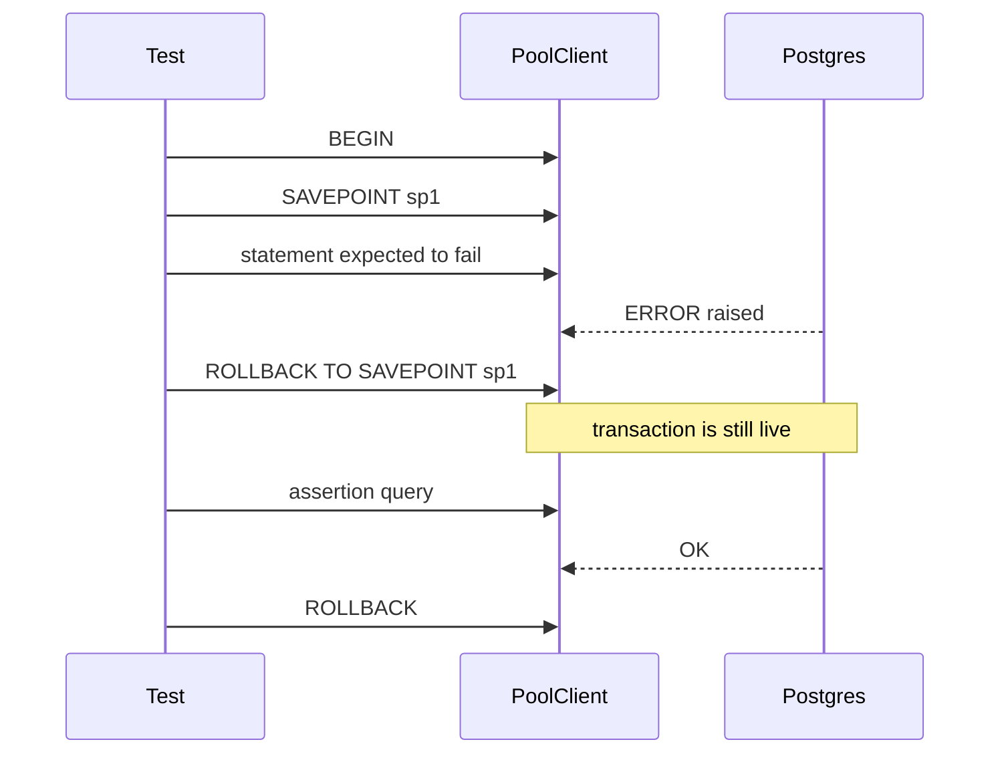
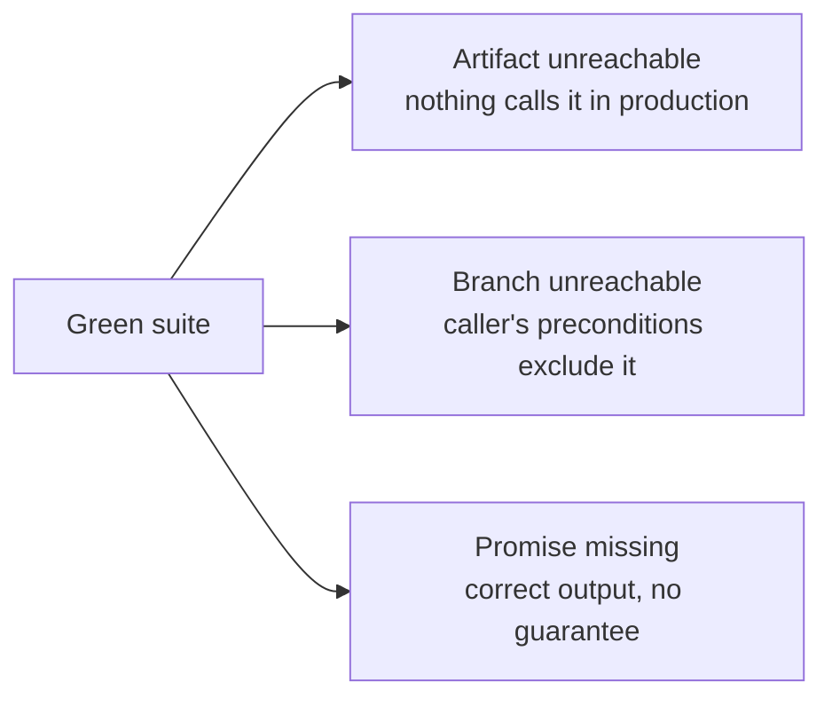

The testing strategy here works on two fronts. Fitness functions — automated checks for architectural rules — run in CI alongside ordinary tests and ship with the code they govern. Integration tests use real databases via testcontainers, with patterns designed to keep each test isolated and fast. Both layers have traps. This page covers how the infrastructure is set up, what can silently go wrong, and three failure modes where a completely green suite still misses a real defect.

## Fitness Functions: Enforced at Build Time

A **fitness function** is a test for an architectural rule rather than a feature. For example: "no module may call a real LLM vendor under `NODE_ENV=test`". The rule lives in the governance doc; the fitness function is the code that fails the build if the rule is broken.

### They ship with the code they govern

The key principle: a fitness function lands in the same task as the code it enforces. Writing it later risks it never being written. Writing it earlier is impossible — you cannot check a rule about code that does not exist yet. In Sprint 1 this shaped the work order directly: the dependency-boundary check arrived with the scaffold task (because the boundary *was* the scaffold), and every other rail arrived with its subject — the error-envelope check with the contracts package, the append-only trigger check with Postgres, the vendor-confinement check with the LLM module.

Some fitness functions are intentionally "half" when their subject is only partly built. The process-failure handler check covered the HTTP half first and will cover the job-handler half when the job runner exists. That is correct — half a check is better than none, and the gap is explicit.

### The mock-LLM enforcement

CI sets `STEMOLLY_LLM_PROVIDER=mock` explicitly — never relies on a default. A fitness function test then resolves the configured provider adapter under `NODE_ENV=test` and asserts it is not `anthropic`, `openai`, or `google`. The check is deliberate: if a misconfigured environment variable would otherwise silently enable a real vendor in CI, this test fails the build instead.

```bash
# .env.test (or CI environment)
STEMOLLY_LLM_PROVIDER=mock   # explicit, not a default
```

### What a fitness function cannot see

A fitness function checks a *mechanism*, not the intent it was written to enforce. When the mechanism is narrower than the rule, violations that never touch that mechanism pass green.

Two measured examples, both caught by human review rather than by CI:

- **G-18 (config discipline).** The rule says: read configuration in one place and inject it everywhere else. The lint check flags `process.env` outside `config.ts` and `composition.ts`. It catches direct env reads. It cannot see a policy value written as a hardcoded constant in the domain layer — there is no `process.env` to flag.

- **`domain-no-adapters-import`** (hexagonal boundary). The dependency-cruiser clause matches only files under `domain/`. A module-root file importing its own adapters is outside the `from` pattern and passes.

The check when pairing a rule with a rail: **name what the rail cannot see, and record that gap alongside the rule.** A narrow check can make reviewers less likely to look for the shapes it misses, so it costs attention rather than buying it.

---

## Integration Test Infrastructure

Each test file gets its own testcontainers Postgres. Migrations run once in `beforeAll`; each test runs inside `BEGIN` (beforeEach) / `ROLLBACK` (afterEach). The database resets cheaply after each test without re-running migrations.

### The SAVEPOINT pattern for expected failures

Postgres aborts the entire surrounding transaction when any statement raises an error — a trigger `RAISE`, a unique-constraint violation, anything. A test that intentionally provokes an error and then runs a follow-up assertion (for example, checking the row is unchanged) will have that assertion fail with *"current transaction is aborted"* rather than with the actual assertion result.

The fix is a shared helper, `expectRejected(client, fn)`, that wraps the expected failure in `SAVEPOINT` / `ROLLBACK TO SAVEPOINT`:



Two things about the helper's signature matter:

1. **It takes a `PoolClient`, not a `Pool`.** A Postgres transaction is scoped to one physical connection. A `Pool` can hand out a different connection per `.query()` call, so `SAVEPOINT` and `ROLLBACK TO SAVEPOINT` can land on different connections and fail. Every transactional statement in a test — `BEGIN`, the SAVEPOINT pair, assertions, and the final `ROLLBACK` — must run on a single checked-out client.

2. **A sequential test can silently pass by luck.** When tests share one connection, the pool never dispatches to a second one, so the bug is invisible. The `Pool` vs `PoolClient` type distinction and code review catch it; a green test run does not.

### Metering tests: no transactions, no cleanup

The metering write is fire-and-forget on its own pooled connection. It lands *outside* any per-test transaction. Rolling back the test transaction does not remove the row. The obvious fallback — `DELETE FROM metering.llm_calls WHERE ...` in `afterEach` — is blocked too, because the append-only trigger rejects `DELETE` the same way it rejects `UPDATE`.

The solution: scope by the database's own clock.

```ts
// capture a timestamp before the request
const { rows } = await client.query("SELECT NOW() AS since");
const since = rows[0].since;

// after the request, count only rows in this test's window
await poll(() =>
  client.query(
    "SELECT COUNT(*) FROM metering.llm_calls WHERE created_at >= $1",
    [since]
  )
);
```

Because tests run sequentially against one container, no other write lands inside the window, so no cleanup is ever needed. Because the write is fire-and-forget, poll to a short deadline rather than reading once — the row may arrive after the HTTP response returns. Do not switch to a held-transaction or DELETE strategy; neither is available here.

### Playwright e2e harness: record handles immediately

The Playwright `globalSetup` boots a testcontainers Postgres, constructs `AppContext`, and starts the server. It must record each resource handle to the shared teardown singleton **at the moment it is created**, not at the end of setup. If setup throws midway, anything not yet recorded is invisible to teardown and leaks.

:::note
Playwright's `globalTeardown` does run even when `globalSetup` throws. The runner registers each task's teardown before invoking its setup, so a failing setup cannot skip its own teardown. This was verified against `playwright@1.61.1`. If a future upgrade changes this ordering — or if the harness switches to a `globalSetup`-returning-teardown-function — the immediate-assignment pattern silently becomes decorative.
:::

Testcontainers' Ryuk reaper will eventually reclaim leaked containers, but it is nondeterministic. It bounds a leak to "eventually reaped", not "no leak" — it is not a substitute for an explicit `stop()` path.

---

## Isolation Traps

Three patterns where test isolation quietly breaks, and the tests either fail for the wrong reason or pass for the wrong reason.

### The composition root trap

A test that constructs its own bare Fastify instance to mount a route in isolation gets framework defaults, not production settings. The route runs in a different environment than it has in production — while looking, from the test's perspective, identical.

Two settings proved critical when a route was remounted this way:

- The `traceId` decoration and its `onRequest` hook must be re-added, because the error handler reads `request.traceId`. Without it, error responses break.
- `ajv: { customOptions: { coerceTypes: false } }` must be re-applied. Without it, Fastify coerces a numeric `123` to the string `"123"` before schema validation runs. A test asserting that a malformed body returns 400 instead observes 200 — the test **passes for the wrong reason** and stops guarding anything.

Isolation harnesses inherit only what they explicitly restate. When building one, read the composition root and replicate its construction options deliberately. Any assertion about malformed input should be confirmed to still fail when the production code is actually broken.

### Plugin-scope guard blast radius

A guard hooked at plugin scope applies to every request reaching that namespace, including requests issued by tests. Every existing test that builds the real application and injects a request into a route inside that namespace stops receiving the route's own response and starts receiving the guard's denial. The test suite reports a regression in the route while the route is untouched and correct.

The fix is to separate concerns: test the route on a bare Fastify instance with no guard, and give the guard its own dedicated test. A test that merely changes its expected status code to the denial code silently loses all of its original coverage of the route.

:::caution
The blast radius is easy to underestimate. In practice the same collision existed in a unit test, an integration test, and an e2e spec exercising the same path. Only the unit test was found during planning — the integration files were excluded from the local check command, and the e2e harness is a separate run. Local checks were green; CI would have failed on merge.

When a guard is added to a namespace, search for every test that drives any route in that namespace — not just the ones the current check command reaches.
:::

### ESLint flat-config rule replacement

In ESLint's flat config format, when two config objects both set the same rule id and both match a file, the later config's value **replaces** the earlier one — selector arrays are not merged.

This broke the G-17 barrel-only rule: it reused `no-restricted-syntax`, and its `files: ['**/index.ts']` overlapped the existing config-discipline block's `files: ['server/src/**/*.ts']`. Adding G-17 silently disabled the `process.env` restriction for every `index.ts` in `server/src/**`. Both rules were individually well-formed; ESLint reported no error. The regression was caught only by an adversarial re-read of the diff.

The fix: when two restrictions must apply to the same file set under the same rule id, combine them as multiple selector objects inside one array in a single config block — never as separate blocks.

---

## Three Failure Modes a Green Suite Cannot See

A green suite means the tested behavior is correct — not that the system is correct. There are three structurally different ways these can diverge.



### 1. The artifact is green but nothing calls it

A unit test verifies an artifact against its own contract. It is structurally unable to notice that nothing in the production system calls the artifact, or that the real producer feeds it different inputs than the test fixture does. The tests and the artifact agree with each other and can drift, together, away from the system they serve — while the suite stays green.

Two Sprint 1 cases shipped in this shape:

- A model-selection resolver (`resolveTier()`) was implemented, tested, and had no production caller. Tier and purpose never actually selected a model. (This has since been wired into the production call path.)
- A log-schema validator (`LogFieldsSchema`) could not have validated a single real log line. Its tests fed it only hand-built objects; the real pino logger emitted a different shape.

Each automated gate misses this in its own way: unit tests prove the artifact works, not that it is used; dependency-cruiser checks that existing edges are legal, not that required edges exist; typechecking is satisfied with an exported symbol nobody imports; a diff review sees a module plus passing tests and reads it as complete.

A cheap CI check — fail on exported symbols whose only importers are `*.test.ts` — catches the unreachable-module case. It does not catch the wrong-fixture case, where the artifact is imported and used but never shown the real producer's output. Both original cases were found by a human running the real code in an outer-loop review.

**The MCP adapter coverage gap is a concrete variant of this pattern.** The shared result wrapper in `mcp/src/mcp-server.ts` sits on every registered tool's return path. One test suite drove a real SDK transport but against a fake engine; the other reached real Postgres but called the tool-handler factories directly, bypassing the wrapper. At the point the defect was found, 8 tools were registered and 1 had ever been called over a real transport. Line coverage read as "fully covered" because the wrapper handled all N tools in one expression.

The lesson that survives the fix: **count coverage over the declared tool surface** — how many registered tools are ever invoked over a real transport — not over lines.

### 2. The function is called but its branches are unreachable

Tracing an acceptance criterion to a production call path confirms that a symbol is called. It does not confirm that the caller's preconditions allow all of the function's branches to execute.

The concrete case: a domain helper classifies why a token redemption failed. By the time it is called, the record is necessarily already-redeemed or expired — the record was fetched by matching that exact hash, so the token-mismatch branch is impossible. The `return record.role` is unreachable. In the running system, the helper always throws. Its happy path is exercised only by its own unit test — green, unreachable, inside a function whose acceptance-criterion trace had already been validated and ticked.

The cheap check: when a traced path ends in a function that returns a value, read its guards against the caller's preconditions. If every path guarantees a throw, or if a guard re-tests something the caller already established, the declared contract and the actual runtime behavior differ. A helper used only for its exceptions should say so — no return type, no parameters it does not need.

### 3. The output is correct but the promise was never made

A test asserts on an output. This makes it structurally blind to a defect whose current output happens to be correct and whose future output is merely *unpromised*. A SQL query with no `ORDER BY` returns rows in insertion order on a small table, essentially every time. Every determinism test passes honestly. The guarantee those tests appear to be checking does not exist. It fails later — at scale, on a parallel scan or a changed query plan — in production.

This is different from the previous two patterns. The artifact is called, on the real production path, and returns the right answer. No additional output assertion can close the gap, because the bug is the *absence of a constraint* rather than the presence of a wrong value.

Two consequences for how this engine gets verified. First, defects of this shape are found by reading code and asking what the system *promises*, not by running it. Second, the natural regression test inverts the usual advice: **assert on the mechanism**, not the behavior. Capture the SQL actually sent and assert the ordering clause is present. This is deliberately brittle — it breaks on any rewrite, including a correct one — and is accepted as the price of pinning a promise that has no observable symptom.

---

## Review Fills the Remaining Gap

The automated code reviewer explicitly excludes coupling judgements, encapsulation concerns, and structural placement — these belong to the designer. The designer's critique rubric scores requirement coverage, interface clarity, soundness, alternatives, and simplicity — but has no criterion for coupling or structural completeness.

So the loop contains an explicit hand-off, and the receiving rubric has no criterion for what was handed over. Both agents behave correctly under their own contracts; the finding is simply unowned. The exclusion clause is only sound while the named receiver actually checks. This is a prerequisite for leaving that clause in place.

:::tip
The three green-but-wrong patterns and the review gap all point to the same defensive habit: at verification time, ask **"can this acceptance criterion be traced to a production call path?"** rather than **"is it test-backed?"**. A green tick against an acceptance criterion is a strictly weaker claim than "the running system does this." The stronger claim requires tracing the path, reading the preconditions, and asking what the code promises — not just running the suite.
:::
