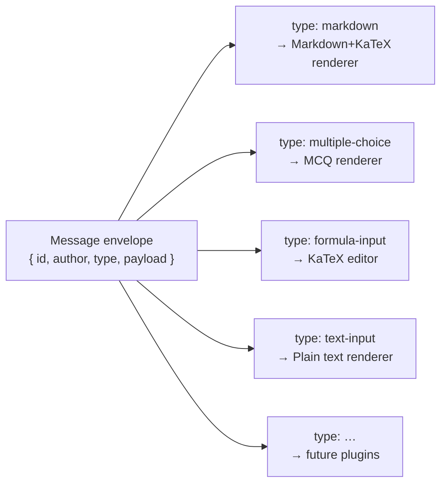
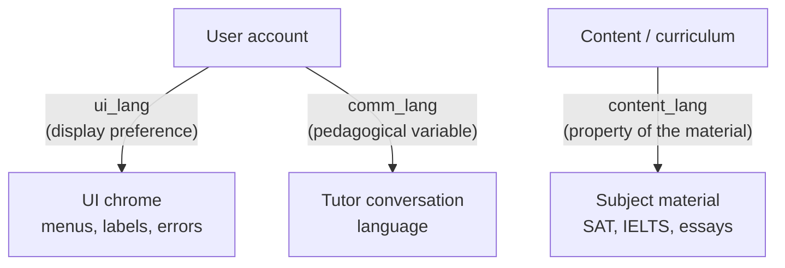

Every exchange in a Stemolly session — tutor prose, a quiz, a student's submitted formula, a multiple-choice question — travels through a single, open plugin mechanism. Nothing is hard-coded to a fixed set of message types, and the tutor and student sit on equal footing in that system. This page explains how the plugin system is designed, what the rendering pipeline looks like today, and how language settings work across three separate axes.

## Everything in the conversation is a plugin

The core idea: every message has a `type` field, and the frontend renders the message by dispatching to the matching plugin renderer. There is no privileged message type and no privileged author.

This is the **message envelope** — the fixed outer shape shared by every message:

```ts
{
  id:            string,   // unique message id
  author:        string,   // "tutor" | "student" | ...
  type:          string,   // open string — not a closed union
  payload:       unknown,  // validated by the plugin's own schema
  schemaVersion: number
}
```

Each plugin owns the schema for its own `payload`. The `type` field is deliberately an **open string**, not a closed TypeScript union. A closed union might feel natural when only one type exists, but it would force every future plugin to edit the shared contracts package. An open string keeps the set open: adding a new interaction type (a drag-drop exercise, a game) means adding a new type identifier and renderer, with zero changes to the tutor engine or any existing plugin.



:::caution
Do not add `type` to a closed TypeScript union in the shared contracts package. That silently closes the open-plugin mechanism and makes the contracts package a mandatory edit site for every plugin ever added.
:::

## Why the envelope is settled before the plugin interface

The full plugin interface — manifest format, config/result schemas, capability descriptions, backend registry — is deliberately deferred. The reasoning is about reversibility.

The envelope is the shape of every message in the transcript. While no transcript is persisted, the envelope is just a wire format between two consumers inside one monorepo; it costs a single commit to reshape. The plugin interface has the opposite property: one plugin type cannot reveal what varies across all types. Designing the interface now, against a single exemplar, would lock in the wrong abstraction. The right time to design it is once several real plugin types (markdown, formula input, multiple-choice) are in hand to inform it.

## The Markdown + KaTeX render pipeline

The primary render plugin today supports three things:

| Capability | Detail |
|---|---|
| Markdown | Standard CommonMark prose |
| LaTeX math | Rendered via **KaTeX** — inline `$...$` and display `$$...$$` |
| HTML decoration | A strict allowlist only: `span`, `mark`, `sup`, `sub`, safe attributes — no `script`, event handlers, or iframes |

Plain Markdown without formula rendering is not enough for a Socratic Math lesson — a KaTeX plugin replaced a plain-text-only approach precisely for that reason.

**Both authors go through the same sanitizer.** The tutor LLM is semi-trusted; student content is untrusted. A DOMPurify-style sanitizer strips `<script>` tags, event handlers, and iframes before any content reaches the DOM. The sanitizer is enforced by TDD tests and a fitness function (G-15) that guards the plugin extension boundary.

The MVP starter set of plugin types:

- `markdown` — tutor prose and explanations
- `text-input` — base student input
- `formula-input` — student submits LaTeX via a symbol-palette editor; KaTeX renders the preview
- `multiple-choice` — interaction plugin for quizzes

Passage and essay-review plugins are planned for a later slice.

## Three independent language axes

Stemolly separates language into three independent settings. Conflating any two of them causes real problems.



### Content language — a property of the material

The content language is set on the curriculum, not on the student. A Vietnamese student studying for SAT/IELTS works with English-language material, full stop. That material stays in English regardless of how the student or the tutor is configured.

### Communication language — a pedagogical variable

The communication language (`comm_lang`) is the language the tutor speaks to the student. It is independent of the content language. Think of a Vietnamese teacher explaining an English text in Vietnamese — the coaching is in Vietnamese, but the student's produced artifact (the essay, the formula) and its corrections remain in English.

`comm_lang` is the variable that MVP-1 exists to test: does coaching in the student's native language improve outcomes over English-only coaching? Letting a student change it casually would alter the treatment mid-experiment and confound the results.

### UI chrome language — a display preference

`ui_lang` controls the language of the interface chrome: menus, buttons, labels, error messages. It is user-controlled:

1. Detected from the browser by default.
2. English as the fallback.
3. A manual switcher for when detection guesses wrong.
4. The choice is persisted to user preferences and followed thereafter.

:::caution
A UI language switcher must **never** write to `comm_lang`. The two fields look similar but serve entirely different purposes and have different audiences — Console and Admin users have a `ui_lang` but no `comm_lang` at all, because they are never tutored.
:::

The separation matters because if a single "language" field covered both, a student toggling the display language mid-session would silently change their tutoring language too — breaking the validation experiment the Language slice is built around.
