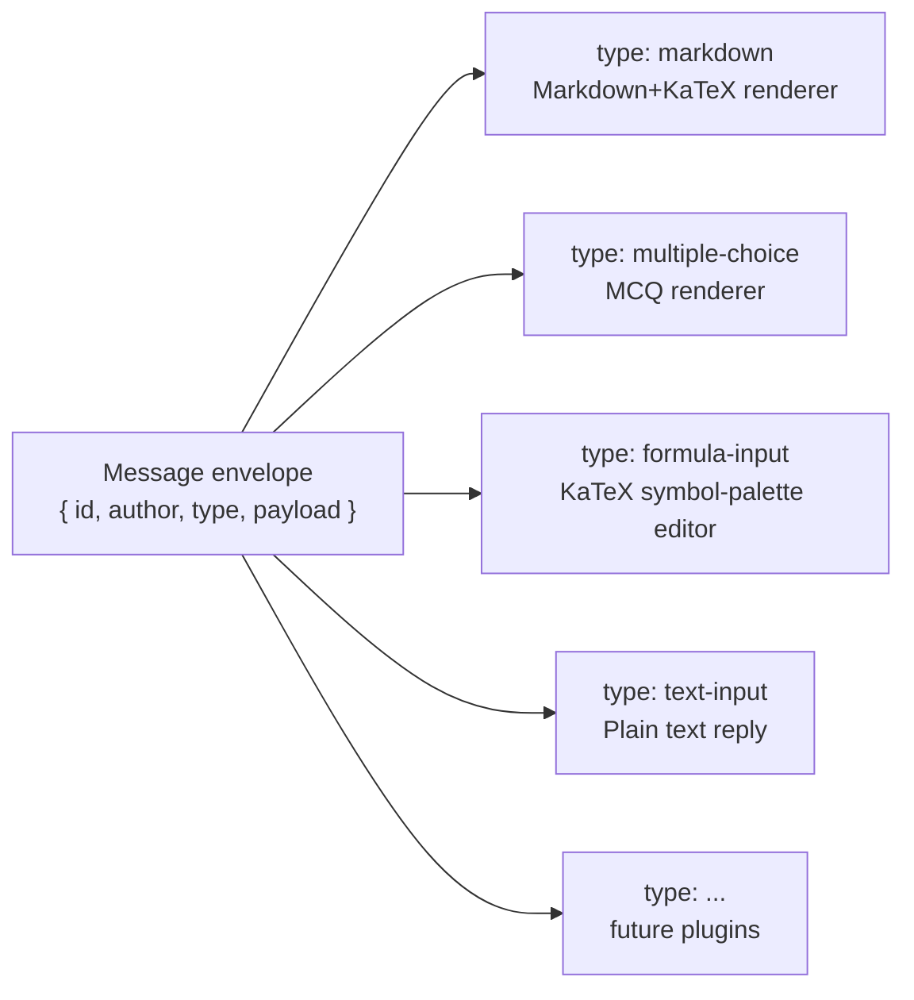
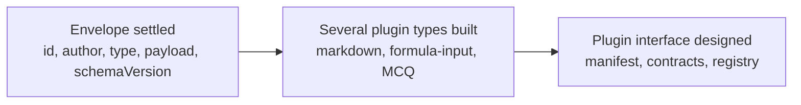
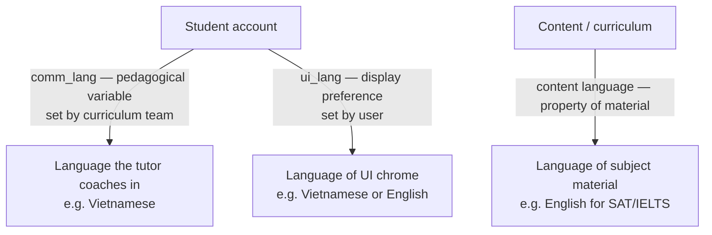

Every message in a Stemolly conversation — the tutor's Socratic question, a formula, a quiz card, a student's typed reply — flows through a single, uniform plugin mechanism. At the same time, the language the tutor speaks, the language of the subject material, and the language of the page chrome are three **separate settings** that must never be merged into one. This page explains both stories: the plugin architecture and the three language axes.

## Every message is a typed plugin

The conversation layer has no fixed set of message types. Instead, every message is a **typed plugin instance**: the frontend reads the `type` field and dispatches the payload to the matching renderer. This applies equally to tutor output (Markdown prose, quiz cards) and student input (plain text, a submitted LaTeX formula). There is no privileged message type and no privileged author.

The practical benefit is additive growth. Adding a new interaction — a drag-drop exercise, a vocabulary game — means writing a new type and renderer. The tutor engine and core conversation logic change nothing.



:::note
Gradeable content — anything that can be marked correct or incorrect — is grounded in the authored brief or the Expert agent, not improvised by the light Interface agent. The plugin mechanism is open; the source of correct answers is not.
:::

## The message envelope is settled first

The plugin mechanism has two separable parts that are built in a deliberate order:

1. **The message envelope** — the wire format every message shares.
2. **The plugin interface** — manifest format, config/result contracts, capability description, backend registry, versioning.

The envelope is settled first because it is cheap to change right now. No transcripts are persisted yet, so the envelope is only a wire format between two consumers inside one monorepo — reshaping it costs a single commit. The plugin interface has the opposite property: one plugin type cannot reveal what varies across types, so designing it against a single exemplar would fix the wrong abstraction. It waits until several real types (markdown, formula input, multiple-choice) are in hand to inform its shape.



The settled envelope looks like this:

```ts
{
  id:            string,
  author:        string,   // "tutor" | "student"
  type:          string,   // open string — never a closed union
  payload:       unknown,  // each plugin validates its own payload
  schemaVersion: number
}
```

### Why `type` must stay an open string

The natural TypeScript instinct is a closed union — `"markdown" | "mcq" | "text-input"`. That works today and then silently becomes a mandatory edit site in the shared contracts package for every plugin ever added. `type` is deliberately an open `string`. The contracts package stays untouched when new plugins arrive.

:::caution
Never replace the open `type: string` with a closed union in the contracts package. It defeats the open plugin mechanism and forces a central change for every new interaction type.
:::

## The Markdown + KaTeX render pipeline

The tutor's primary renderer is the **markdown plugin**: Markdown prose with LaTeX rendered via **KaTeX**, plus a strictly limited HTML-decoration allowlist. A Socratic maths lesson is unusable without formula rendering, so this replaced a plain-text prototype as the default tutor renderer.

| Capability | Detail |
|---|---|
| Markdown | Standard prose, headings, lists, code blocks |
| LaTeX math | KaTeX — inline `$…$` and display `$$…$$` |
| HTML decoration | Allowlist only: `span`, `mark`, `sup`, `sub`, safe attributes |
| HTML blocked | `script`, event handlers, `iframe` — always stripped |

The allowlist is enforced by a DOMPurify-style sanitizer, and it runs against **both authors** — tutor output is semi-trusted (from an LLM), student input is untrusted (from the public internet). TDD tests pin the sanitizer's behavior; a fitness function (G-15) guards it at the plugin extension boundary so it cannot be quietly disabled.

The **MVP starter set** of plugins is:

| Plugin | Author | Purpose |
|---|---|---|
| `markdown` | Tutor | Prose, formulas, code blocks |
| `text-input` | Student | Base text reply |
| `formula-input` | Student | Symbol palette → KaTeX output |
| `multiple-choice` | Both | Quiz and interaction |

Passage and essay-review plugins are deferred to the Language feature slice.

## Three independent language axes

Stemolly separates language into three settings. Mixing any two creates either a broken user experience or a corrupted research signal.



**Content language** is a property of the content itself, not the student. An SAT lesson is in English; it stays in English regardless of the student's other settings.

**Communication language (`comm_lang`)** is how the tutor explains that content. A Vietnamese student can receive coaching in Vietnamese while all their written production stays in English — like a Vietnamese teacher explaining an English text in Vietnamese. `comm_lang` is a curriculum decision, set during enrollment, not a display preference.

**UI chrome language (`ui_lang`)** is the language of buttons, navigation labels, and error messages. It is user-controlled: detected from the browser by default, English as the fallback, with a manual switcher, and the choice persisted to the user's profile.

| Setting | Controlled by | Default | Governs |
|---|---|---|---|
| `comm_lang` | Curriculum / enrollment | Defined per course | Language the tutor coaches in |
| Content language | Content author | Defined per lesson | Language of subject material |
| `ui_lang` | User (browser-detected) | English | Language of interface chrome |

### Why a UI language switcher must never touch `comm_lang`

`comm_lang` is the primary variable that MVP-1 exists to validate — the Language slice tests whether Vietnamese coaching over English content improves student outcomes. If a student flips a display toggle and that accidentally changes their tutoring language, their experimental treatment changes mid-session and the validation data is confounded.

There is also a population difference: Console and Admin users have a `ui_lang` but no `comm_lang` at all, because they are never tutored.

:::caution
`ui_lang` and `comm_lang` must be stored as **separate fields** and updated by separate code paths. The natural instinct is a single shared "language" field — that is the wrong model here.
:::

## Student UI strings today

All visible copy in the Student app flows through a single hook: **`useStrings()`**. Components read their labels through its returned accessors rather than importing string tables directly. The current tables cover API error messages, assignment-status labels, board labels, chat status labels, and button text — all currently in Vietnamese.

This design means a future locale switch requires a change in one file, not a search-and-replace across every component. The hook is the intentional seam for that migration.

**Known gap:** the shared UI package is mostly locale-neutral because callers supply labels, hints, errors, and accessibility text before passing them into shared components like `ChatBubble`, `Input`, and `Button`. But `ThemeSwitch` is the exception — it hard-codes the theme labels `Sunlit desk` and `Study mint` in English internally. Supporting multi-locale UI chrome will require either caller-supplied theme labels or a package-level i18n seam in `ThemeSwitch`. Until that is resolved, the shared UI package is *mostly* but not completely locale-neutral.
