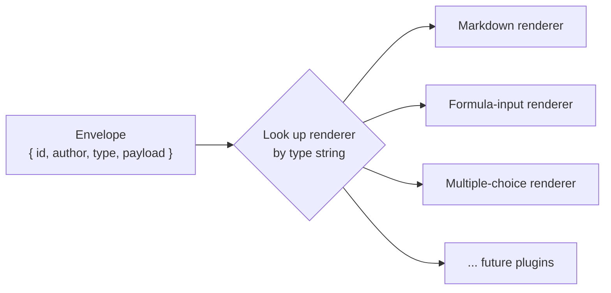
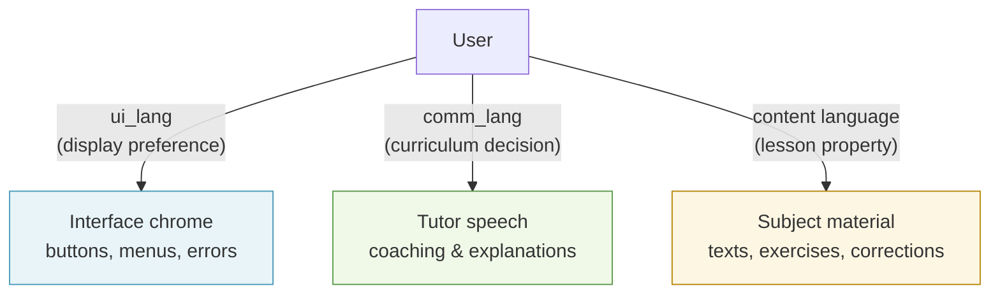
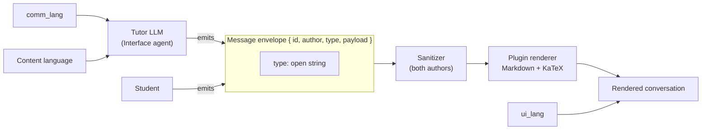

Every exchange between the student and the tutor passes through three interlocking systems: a plugin mechanism that keeps message types open-ended, a render pipeline that safely formats Markdown and maths, and a language model that lets the tutor coach in the student's own language while the subject content stays in the target language. This page explains how those three systems work and — crucially — why they were built the way they were.

---

## Every message is a typed plugin instance

The conversation has no fixed list of message types. Whether it is the tutor's Markdown prose, a multiple-choice quiz, a reading passage, or the student's own submitted answer — including a LaTeX formula typed with a symbol palette — every message is a **typed plugin instance** that the frontend renders by looking up the right renderer for its `type` field.

This means:
- There is no privileged message type and no privileged author.
- Adding a new interaction (a drag-and-drop exercise, a vocabulary game) is purely additive: write a new type and a new renderer. Nothing in the tutor engine or the core contracts needs to change.
- Gradeable content — quizzes, exercises with a right answer — is always grounded from the authored lesson brief or the Expert agent, never improvised by the lighter Interface agent. The plugin mechanism does not change this; it just delivers the content.

The full plugin interface — how a plugin declares its manifest, describes its capability to the AI agents, and registers its renderer — is deliberately not designed yet. It will be shaped once several real plugin types are in hand, so the abstraction reflects what genuinely varies across types rather than what one exemplar suggests.

---

## The message envelope: settled first, and why that order matters

Before the plugin interface is designed, one thing *is* locked: the **message envelope**.

```
{
  id:            string,   // unique message id
  author:        string,   // "tutor" | "student" | ...
  type:          string,   // open string — not a closed union
  payload:       unknown,  // validated by the plugin's own schema
  schemaVersion: number
}
```

Every message crossing the wire uses this shape. Each plugin validates its own `payload`; the envelope itself is validated at the boundary between systems.

### Why settle the envelope before the plugin interface?

The two pieces have opposite reversibility properties.

The **envelope** is just a wire format between two consumers inside one monorepo — the engine that produces messages and the frontend that renders them. As long as no transcript is persisted to a database, reshaping the envelope costs a single commit. It is a low-risk decision to make early.

The **plugin interface** (manifests, config/result contracts, agent-facing capability descriptions, backend registry) has the opposite property: one plugin type cannot reveal what varies across types. Designing the interface against a single exemplar would freeze the wrong abstraction. It needs several real plugin types — at least Markdown, formula input, and multiple-choice — to inform it correctly.

### The open-string `type` field

The most load-bearing detail in the envelope is that `type` is an **open string**, not a TypeScript closed union like `"markdown" | "text-input"`.

A closed union is the natural reflex when only one type exists. But it would turn the shared contracts package into a mandatory edit site for every plugin ever added — exactly the coupling the open plugin mechanism exists to prevent. An open string keeps the set open. Any plugin can introduce a new type without touching the shared package.



---

## The render pipeline: Markdown + KaTeX + a sanitized allowlist

The default tutor renderer supports three layers of formatting:

| Layer | What it does |
|---|---|
| **Markdown** | Headings, lists, bold, inline code, fenced blocks |
| **KaTeX** | LaTeX maths, rendered in the browser — a Socratic maths lesson is unusable without it |
| **HTML decoration allowlist** | A narrow set of tags (`span`, `mark`, `sup`, `sub`) with safe attributes only |

Raw HTML is not rendered freely. Every message — from the semi-trusted tutor LLM and from the untrusted student — passes through a DOMPurify-style sanitizer that strips `<script>` tags, event handlers (`onerror`, `onclick`, etc.), and iframes. The allowlist and sanitizer apply equally to both authors; there is no "trusted" fast path.

This is the concrete render plugin that the earlier, plain-text exemplar plugin was always intended to be replaced by. Plain text was a reference example to show the pattern; Markdown+KaTeX is the real first plugin.

### The MVP starter set

When the full plugin mechanism is built — which happens once enough plugin types exist to inform the interface design, not on a fixed schedule — these are the initial members:

- **Markdown** — tutor prose and explanations
- **Text-input** — the student's basic free-text replies
- **Formula-input** — student answers as LaTeX, via a KaTeX-backed symbol palette
- **Multiple-choice** — structured quiz interactions

Passage and essay-review plugins are planned for the Language subject slice and are deferred until then.

The sanitizer's behaviour is locked by TDD tests and guarded by a fitness function (`G-15`) that runs alongside the plugin extension tests, so a future plugin cannot accidentally open an XSS hole.

---

## Two languages in one conversation

A student can converse with the tutor in their own language while the subject content remains entirely in the target language. Think of a Vietnamese teacher explaining an English grammar exercise in Vietnamese — the student's production and the corrected text stay in English, but the coaching happens in Vietnamese.

Stemolly models this as two independent settings:

| Setting | What it controls | Who sets it |
|---|---|---|
| **`comm_lang`** | The language the tutor speaks in | Curriculum / session design |
| **Content language** | The language of the subject material | The authored lesson brief |

These are independent. A Vietnamese student studying for IELTS has `comm_lang = vi` and content language = `en`. The tutor coaches in Vietnamese; every essay draft and correction is in English.

### The third axis: UI chrome language (`ui_lang`)

There is a third language in the system — the language of the interface itself: button labels, menus, error messages. This is `ui_lang`, and it is a **separate user preference** from `comm_lang`.

The two are easy to conflate, but they must be kept apart for two reasons:

1. **`comm_lang` is a pedagogical variable under test.** MVP-1 validates whether coaching in the student's native language improves outcomes. If a UI language switcher wrote to `comm_lang`, a student flipping a display toggle would silently change their tutoring language mid-session — corrupting the experiment data.

2. **Different populations need `ui_lang` but not `comm_lang`.** Console and Admin users need their interface in a chosen language, but they are never tutored. They have a `ui_lang` and no `comm_lang` at all.



`ui_lang` is user-controlled: the browser's language is detected automatically, English is the fallback, and a manual switcher lets the user correct wrong detections. The choice is persisted to their preferences and applied thereafter. `comm_lang` is not a user toggle — it is a decision made when the curriculum is authored.

---

## How the pieces connect

The three systems described above are not independent layers. They are designed to work together:



The plugin type drives which renderer runs. The sanitizer runs before any renderer, regardless of source. Language settings travel alongside the session but are invisible in the envelope itself — they shape what the tutor *says*, not the shape of the message it says it in.
