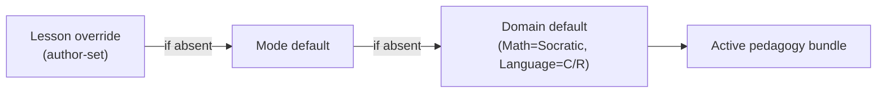
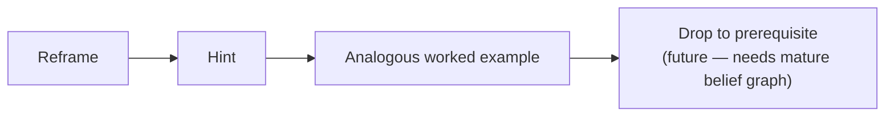
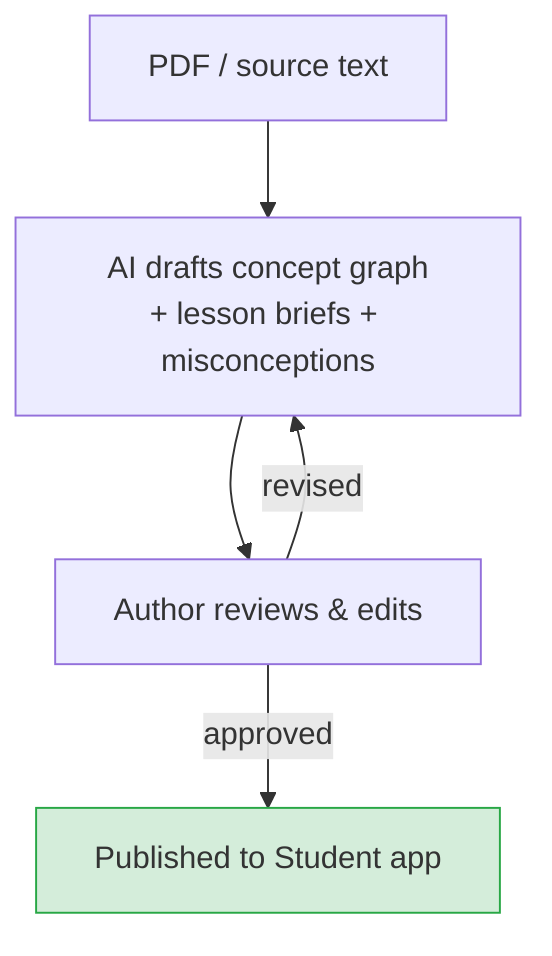

Stemolly separates **teaching intent** from **live delivery**. A human author writes a teaching brief — goals, steps, trusted materials — and the AI tutor agent conducts the live conversation from that brief. Which pedagogy the agent applies depends on the subject domain and can be overridden at the lesson level. This makes the system flexible without changing any core engine code.

## Two Pedagogies, One Pluggable System

Stemolly ships with two teaching approaches.

- **Socratic** — used for Math, Physics, and Chemistry. The tutor asks questions that lead the student to construct the idea themselves. It never states the answer directly.
- **Correct / Reinforce** — used for Language. The tutor diagnoses errors, corrects them explicitly, and reinforces the correct pattern.

These are not hardcoded. Each pedagogy is a **declarative bundle** — a package of prompt instructions, guardrails (for example, the Socratic rule to never reveal the target insight), a checkpoint policy, and a scaffolding ladder. A small resolver picks the right bundle at the start of each session using a three-level cascade:

If the lesson author has specified a pedagogy, that wins. Otherwise the mode default applies, then the domain default. In the current MVP only the domain defaults are populated, but the mechanism works at lesson grain — an author can override the pedagogy for any single lesson without touching anything else.

**Why declarative bundles, not code hooks?** Strategy-as-code was rejected because code callbacks are harder to read and compare, and — more importantly — Socratic assumptions would quietly leak into core engine paths. A declarative bundle is inspectable. Adding a new pedagogy means writing a new bundle and adding a registry entry; zero lines in the engine, tutor core, or API change.

## Three Study Modes

Every session runs in one of three modes. The active pedagogy bundle applies in all three.

| Mode | What happens |
|---|---|
| **Lesson** | The student works through structured content. The tutor guides alongside, applying the domain pedagogy to surface and address misconceptions in real time. |
| **Assessment / Diagnostic** | The tutor poses problems to map the student's understanding. The goal is not a grade — it is a picture of the student's mental model. |
| **Assignment Help** | The student uploads an assignment. The tutor coaches them through it using the domain pedagogy — never giving direct answers in Socratic subjects. |

All three modes feed evidence back into the student's persistent mental model.

## What a Lesson Actually Is

A lesson in Stemolly is not a fixed piece of content shown to the student. It is an **authored teaching brief** handed to the tutor agent, which then conducts a live conversation from it.

The author owns:
- A **goal** — the concept or skill the session should leave the student owning.
- An **ordered set of steps** — for example: pose the opening problem, guide the student to understand it, help them construct the theory, extend, practice, assign.
- A **per-step intention** — what the tutor should be doing at each stage.
- **Vetted materials** — readings, examples, and probe seeds the tutor must draw from, not invent.

The tutor agent owns the live conversation. It reads the brief, picks up the active pedagogy, and improvises — asking Socratic questions for Math/Physics/Chemistry, or working a diagnose/correct/reinforce/re-check loop for Language — while staying inside the author's steps and intent. The vetted materials act as a grounding anchor: the tutor cannot fabricate content, which is critical for an education product where a wrong formula or fact causes real harm.

The same brief can produce a different conversation for every student. Structure is repeatable; dialogue is not. The full lesson-brief schema is still being specified; this is the settled design direction.

## Probing: How the Socratic Tutor Surfaces Fragility

*This section applies to the Socratic pedagogy — Math, Physics, and Chemistry.*

### Probes Are Not a Separate Mode

In Socratic teaching, questions **are** the teaching. A "probe" is simply a type of Socratic question — the tutor does not switch into a special testing mode. It continuously mixes two kinds of questions:

- **Constructive questions** — scaffold the student toward an idea. *"What does the distributive property tell us about (a+b)²?"*
- **Testing (elenctic) questions** — stress an idea the student seems to hold. *"Why does that work?", "What if we changed this sign?", a transfer problem in a new surface form.*

Fragility is read from how the student handles the testing questions. Every student turn in the dialogue is an evidence event: misconceptions surface, resolve, and prove fragile — all inside ordinary questioning, without any separate quiz mode.

### The Probing Policy: Interleave, Lean to Test, Enforce a Floor

The tutor does not probe every concept exhaustively (that would hurt the experience), nor does it probe on a fixed schedule (too blunt). Instead it:

1. **Continuously interleaves** constructive and testing questions throughout the lesson.
2. **Leans toward testing** when answers arrive quickly or sound mechanical — a pattern-matching signal.
3. **Enforces a hard floor**: a concept can never be marked *robust* until at least one genuine test — a transfer problem or a "why" question — has been passed unaided.

The floor is the key safeguard. "Looks done" never means "confirmed solid" unless a real stress-test has been passed.

### What Generates the Probes?

The most effective probe is tailored to what the student just said. For example: *"You wrote 4m² + 25 — how does that compare to what we found for (a+b)²?"* Only the tutor, live in the dialogue, can write that. So probes are primarily **AI-generated and contextual**.

Authors may also provide a small number of *seed transfer problems* per concept node. These seeds give measurement consistency: when two students both answer the same seed problem, their results are directly comparable. Seed problems live inside the lesson brief's vetted materials. Generation leads; authored seeds support measurement.

## The Scaffolding Ladder: Help Without Spoiling the Lesson

### The Socratic Threshold

The no-direct-answer rule has a precise boundary: **the tutor never reveals the target insight a lesson exists to make the student construct.** It may supply incidental facts — a formula recall, an arithmetic step — that are not the thing being taught. The line is drawn at the lesson's core insight.

### Graduated Rungs When a Student Is Stuck

When a student cannot progress, the tutor climbs a **graduated scaffolding ladder** rather than repeating the same question:

Help is **student-pulled** in the current version. The student triggers it — by typing "I'm stuck" or pressing a hint control — and the system chooses which rung to offer. The tutor does not force help on every silence; a minimal safety net offers (but never imposes) help on a prolonged stall. This preserves productive struggle by default and avoids a brittle frustration detector.

### Why Scaffolded Success Does Not Count as Robust

Every scaffold step is stamped on the evidence event. A success achieved with a hint is not evidence the student can do it unaided — this mirrors the probing floor exactly: just as "unprobed" cannot mean "robust", "scaffolded" cannot mean "robust". Both rules protect the integrity of fragility measurement.

Scaffolding is also suppressed entirely during locked predictive-validity checkpoints so assistance cannot leak into a graded outcome.

## Curriculum: Authored First, AI Supplements On-Demand

The primary curriculum is **structured content created by authors** — a collection of lesson briefs. During a live session the AI can generate supplementary material on demand — a fresh example, an extra practice problem — to reinforce a specific concept. This is a targeted supplement to the structured lesson, not a replacement for it. The structure keeps the learning path coherent; the AI fills gaps dynamically.

### AI-Assisted Authoring in the Console

In the Console's Author area, the AI assists curriculum creation at authoring time (not session time). Given a source PDF textbook or pasted text, it:

- Drafts the **concept graph** — a prerequisite DAG for Math, or an error/skill taxonomy for Language.
- Proposes how curriculum items match existing canonical concept nodes.
- Drafts **lesson briefs** — goal, ordered steps, per-step intent, vetted materials, and a pedagogy defaulting from the domain.
- Seeds misconceptions per concept node.

Every step is **human-in-the-loop**. The author reviews, edits, and approves each draft. Nothing reaches the Student app without explicit author approval.

:::note[AI drafts, humans publish]
The AI is a drafting assistant at authoring time — it speeds up the work but never auto-publishes. Every lesson brief that reaches a student has been reviewed and approved by a human author.
:::

This authoring-time assistance is distinct from the in-session supplement generation. The full lesson-brief schema is deferred to a build sprint.
