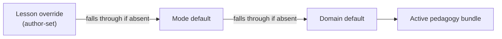
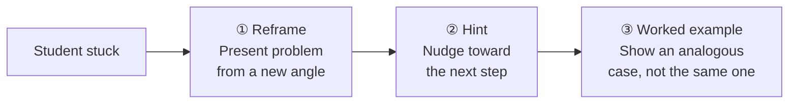
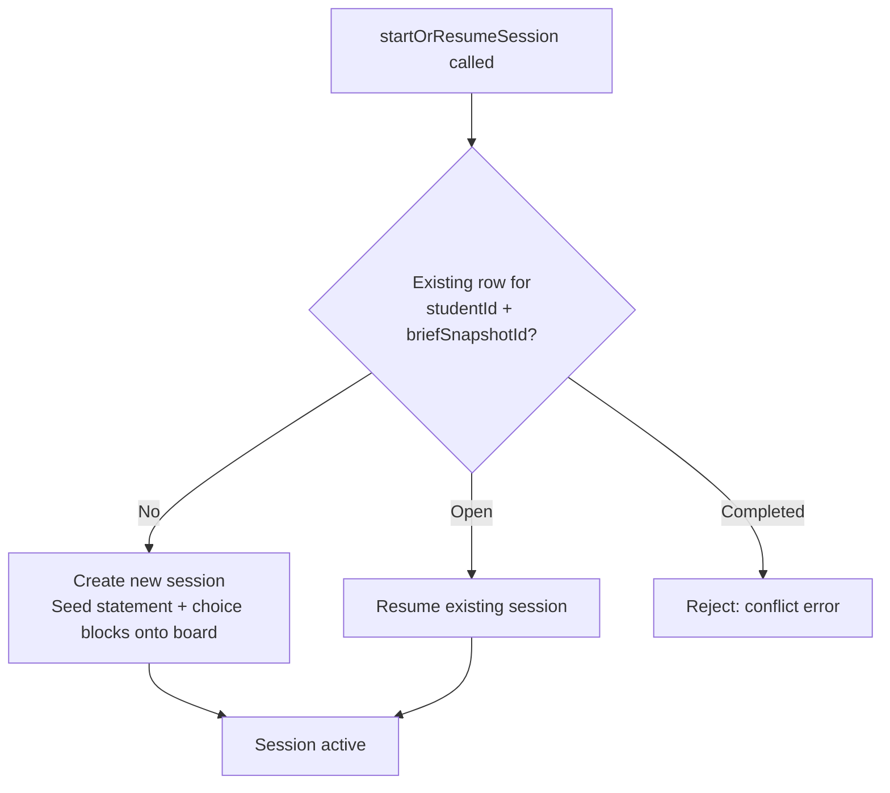

Stemolly's teaching layer is built around one organizing idea: **pedagogy is a pluggable strategy, not a hard-coded behavior**. The engine knows nothing about Socratic questioning or diagnose-correct-reinforce cycles — those live in interchangeable declarative bundles, selected fresh for every session. Everything else — how briefs are authored, how the tutor probes understanding, how students get help when stuck, and how sessions open and close — flows from that foundation.

## Pedagogy as a Declarative Bundle

A pedagogy strategy is a self-contained, named bundle. It declares:

- **Prompt fragments** — the language the tutor agent uses when it speaks
- **Guardrails** — rules the agent must obey (for example, the Socratic rule: *never reveal the target insight*)
- **A checkpoint policy** — when to pause and record what the student knows
- **A scaffolding ladder** — the steps available when a student is stuck

The tutor module interprets the bundle. It never sees the strategy's name — only the bundle's contents. Adding a new pedagogy means writing a new bundle and a registry entry, with zero changes to the engine, tutor core, or API.

:::note
Strategy-as-code (callback hooks into the turn loop) was rejected as the default. Hooks would let Socratic assumptions quietly leak into core paths, and they are harder to inspect and compare across strategies. A hook escape-hatch may be added later if a pedagogy genuinely cannot be expressed declaratively.
:::

### How the Session Resolves Its Bundle

Each session resolves its bundle through a three-level cascade:

In MVP-1, only the domain defaults are populated:

| Domain | Default pedagogy |
|---|---|
| Math, Physics, Chemistry | Socratic |
| Language | Correct / Reinforce |

The per-lesson and per-mode slots exist in the resolver but are mostly unused today. When a new study mode is added later, it becomes a brief with a different pedagogy plus entry UX — no core logic changes.

## Three Study Modes

Stemolly offers three modes. Each runs whichever bundle the resolver selects for the domain and lesson.

| Mode | What happens |
|---|---|
| **Lesson** | Student works through structured content; the tutor applies the active pedagogy to surface and address misconceptions in real time |
| **Assessment / Diagnostic** | Tutor poses problems to map the student's mental model — the goal is understanding, not a grade |
| **Assignment Help** | Student uploads an assignment; the tutor coaches them through it using the active pedagogy, without giving direct answers in Socratic domains |

All three modes feed data into the student's persistent mental model.

## Lesson Briefs: Intent Without Fixed Content

The **curriculum is not slides or fixed text**. It is a collection of *lesson briefs* — documents of intent handed to the tutor agent.

Each brief contains:

- A **goal** — what the student should be able to do after the lesson
- An ordered list of **steps**, each with a per-step intention (for example: begin with a problem → guide comprehension → construct the theory → extend → practice → assignment)
- **Trusted materials** — vetted content the agent must draw from, not invent

The agent owns the live conversation. It interprets the brief through the active pedagogy — improvising Socratic questions for Math, or working diagnose/correct/reinforce/re-check for Language — while staying inside the author's steps and intent. Trusted materials are the grounding layer: they prevent the agent from inventing incorrect content, which is critical for an education product.

During a session the agent can also generate **on-demand supplements** — extra explanations or examples aimed at a specific gap. This is not a replacement for the structured curriculum; it fills gaps that the brief's materials do not already cover.

:::tip
The lesson-brief schema is still being finalized. The design direction is clear but not yet fully specified.
:::

## AI-Assisted Authoring in the Console

Authors create lesson briefs in the Console's **Author area**, with the AI doing the first draft:

1. The author ingests source material — a PDF textbook or pasted text.
2. The AI drafts the **concept graph** (a prerequisite DAG for Math, an error/skill taxonomy for Language), proposes matches to existing canonical nodes, and drafts lesson briefs including goal, ordered steps, per-step intent, trusted materials, and a pedagogy defaulting from the domain.
3. The AI seeds **misconceptions per node** — common wrong beliefs the tutor should watch for.
4. The author reviews, edits, and approves every step.
5. Nothing reaches the Student app without author approval — the AI drafts, it never auto-publishes.

## Assignment Briefs

In the proof-of-concept pipeline, an **assignment brief** grounds the AI agent that analyzes student work. It follows one strict rule: it supplies only facts the agent cannot derive from the raw assignment material — never a diagnostic procedure.

**What belongs in a brief:**
- The problem's *crux* — the one insight the problem tests
- Which concepts it exercises and which solution methods are in-syllabus
- Where a bare correct answer is still uninformative without explanation

**What does not belong:**
- Per-step state lists or failure-mode menus (for example, "if the student does X, mark it as Y") — that is a pre-written verdict, not a fact
- Predictions about students — what a distractor was designed to catch is a fact about the problem; what students commonly get wrong is a prediction about people

The reason: a brief that tells the agent *how* to judge an answer only makes sense under one pedagogy. Stemolly supports more than one — so diagnosis belongs to the pedagogy bundle, and the brief provides only raw facts for the agent to reason from.

## Socratic Probing

Within the Socratic bundle (Math, Physics, Chemistry), **probing is not a separate test mode** — it is part of ordinary teaching. A Socratic lesson mixes two kinds of questions:

- **Constructive questions** — scaffold the student toward an idea
- **Testing / elenctic questions** — stress the idea: "Why does this work?", "What if we changed this?", a counterexample, or a new surface form

Because every turn in the dialogue is an evidence event, the conversation itself is the evidence stream. Misconceptions surface, resolve, and prove fragile entirely inside ordinary questioning — no separate quiz is needed.

### The Probing Policy

The tutor agent interleaves both question types continuously. A hard floor applies:

:::caution
A concept can never be marked **robust** until at least one genuine test — a transfer problem or a "why" question — has been passed without scaffolding.
:::

The agent leans toward testing questions when a student's answers come too fast or sound mechanical, which signals pattern-matching rather than understanding. Fixed-schedule probing was rejected because it probes every concept regardless of need; the floor approach ensures no concept can *look* done without being *stress-tested*.

Most probes are **AI-generated in the moment**: the most useful probe is a follow-up tailored to what the student just said (for example, *"you wrote 4m² + 25 — how does that compare to what we found for (a+b)²?"*). Authors may optionally add seed transfer problems inside a concept's materials so that predictive-validity tests are comparable across students, but these seeds are the minority. Generation leads; authored seeds support measurement consistency.

## Graduated Scaffolding

The Socratic rule is precise: the tutor **never reveals the target insight** a lesson exists to make the student construct. It may supply incidental sub-steps — a formula recall, an arithmetic fact — that are not the thing being taught.

When a student is stuck, the tutor climbs a graduated ladder rather than repeating the same question:

Drop-to-prerequisite is deferred to a later release because reliably identifying a missing prerequisite — and interrupting lesson flow to address it — requires a mature belief graph.

Help is **student-pulled** in MVP: the student signals they are stuck ("I'm stuck" or a hint control), and the system chooses the rung. A minimal safety net *offers* help on prolonged silence but never imposes it, preserving productive struggle by default.

Every scaffold is stamped on the evidence event. A scaffolded success is not evidence of robust understanding — it mirrors the probing floor: just as a concept needs at least one unaided test, a scaffolded pass does not count as one.

:::caution
Scaffolding is suppressed entirely during a locked predictive-validity checkpoint so that assistance cannot influence a graded outcome.
:::

## Session Lifecycle and Checkpoints

### One Open Session Per Student–Brief Pair

Each combination of student and brief can have only one open tutor session at a time. When a session is requested:

A Postgres partial unique index enforces the one-open constraint. If two requests race to create a session simultaneously, the losing request re-reads the winner's row and resumes into it — the raw `23505` conflict error is never surfaced to the caller.

Statement and choice blocks are seeded onto the board **only on the create path**, never on resume.

### Checkpoint Policy

Checkpoints are the moments when the system records what the student knows. The checkpoint policy is part of the pedagogy bundle — four named firing events are declared in the first release.

Today the only wired emitter is `classifyTurnCommitment`: a `submit` turn triggers an `answer_submitted` checkpoint event; a plain chat message triggers none.

When a checkpoint fires, `planCheckpoint` examines everything since the last checkpoint:

- It reads the current transcript and board logs.
- It excludes the committing turn's own transcript rows — those belong to the *next* window.
- It treats the board as new activity only when the folded `BoardView` actually changed.

**Re-fire:** if the candidate window is empty — no new transcript rows, no board change — the checkpoint is a re-fire of the same problem. The system reuses the same per-problem ordinal `n` and relies on `ON CONFLICT … DO NOTHING` to make the row idempotent.

**Normal fire:** if the window has new activity, `n` increments and the lower bound advances to the previous checkpoint's `through_*` markers.

### Completing a Session

`completeSession` does not simply mark the session closed. It first runs a `session_closed_mid_problem` checkpoint against the current logs. Only after that dispatch completes does it set `completed_at`. This guarantees no evidence is lost when a session ends mid-problem.
