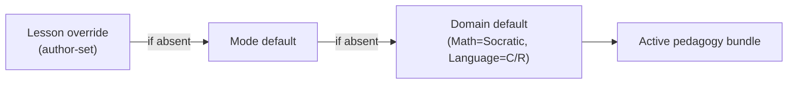
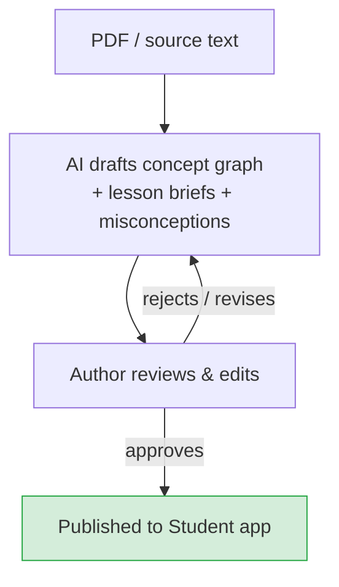

# Teaching & Sessions

Stemolly does not deliver content at students — it guides them to construct understanding themselves. The AI tutor holds a live conversation, asks questions, and adapts in real time. But the approach is not one-size-fits-all: the teaching method (called a *pedagogy*) varies by subject and is resolved fresh at the start of every session. This page explains how that works — what a lesson is, how probing operates in Socratic subjects, how stuck students get help, and how the curriculum is built.

---

## Two pedagogies, one pluggable system

Stemolly ships with two teaching methods.

- **Socratic** — used for Math, Physics, and Chemistry. The tutor asks questions that lead the student to construct the idea themselves. It never simply states the answer.
- **Correct / Reinforce** — used for Language. The tutor diagnoses errors, corrects them explicitly, and reinforces the correct pattern.

These are not hardcoded per subject. Pedagogy is a *declarative bundle* — a package of prompt instructions, guardrails, a checkpoint policy, and a scaffolding ladder. A small resolver picks the right bundle at the start of each session using a three-level cascade:

```
lesson override  →  mode default  →  domain default
```

If the lesson author has specified a pedagogy, that wins. Otherwise the mode default applies, then the domain default. In the current MVP only the domain defaults are populated (Math → Socratic, Language → Correct/Reinforce), but the mechanism works at lesson grain — an author can override the pedagogy for any single lesson without touching anything else.



**Why declarative bundles, not code hooks?** The alternative was to let pedagogy strategies be arbitrary code callbacks injected into the tutor's turn loop. That was rejected because code strategies are harder to read and compare, and — more importantly — Socratic assumptions would quietly leak into core engine paths. A declarative bundle is inspectable. Adding a new pedagogy means writing a new bundle and registering it; zero lines in the engine or tutor core change.

---

## Three study modes

Every session runs in one of three modes. The active pedagogy bundle applies in all three.

| Mode | What happens |
|---|---|
| **Lesson** | The student works through structured content. The tutor guides alongside, applying the domain pedagogy to surface and address misconceptions in real time. |
| **Assessment / Diagnostic** | The tutor poses problems to map the student's understanding. The goal is not a grade — it is a picture of the student's mental model. |
| **Assignment Help** | The student uploads an assignment. The tutor coaches them through it using the domain pedagogy — never giving direct answers in Socratic subjects. |

All three modes feed data back into the student's persistent mental model (see [../engine/mental-model.md](../engine/mental-model.md)).

---

## What a lesson actually is

A lesson in Stemolly is not a fixed piece of content shown to the student. It is an **authored teaching brief** handed to the tutor agent, which then conducts a live conversation from it.

The author owns:
- A **goal** — the concept or skill the session should leave the student owning.
- An **ordered set of steps** — for example: pose the opening problem, guide the student to understand it, help them construct the theory, extend, practice, assign.
- A **per-step intention** — what the tutor should be doing at each stage.
- **Vetted materials** — readings, examples, and probe seeds the tutor must draw from, not invent.

The tutor agent owns the conversation itself. It reads the brief, picks up the active pedagogy, and improvises — asking contextual questions in a Socratic lesson, or diagnosing and correcting in a Language lesson — while staying inside the author's stated intent and step structure. The vetted materials act as a grounding anchor: the tutor cannot fabricate content, which is critical for an education product where a wrong formula or fact causes real harm.

This design means the same brief can produce a different conversation for every student. The structure is repeatable; the dialogue is not.

---

## Probing: how the Socratic tutor surfaces fragility

*This section applies specifically to the Socratic pedagogy (Math, Physics, Chemistry).*

### Probes are not a separate mode

In Socratic teaching, questions **are** the teaching. So a "probe" is simply a type of Socratic question — the tutor does not switch into a special testing mode. It naturally mixes two kinds of questions in every lesson:

- **Constructive questions** — scaffold the student toward an idea. *"What does the distributive property tell us about (a+b)²?"*
- **Testing (elenctic) questions** — stress an idea the student seems to hold. *"Why does that work?", "What if we changed this sign?", a transfer problem in a new surface form.*

Fragility is read from how the student handles the testing questions. A fast, mechanical answer to constructive questions is a signal to shift toward testing. Every student turn in the dialogue is an evidence event: misconceptions surface, resolve, and prove fragile — all inside ordinary questioning, without any separate quiz mode.

### The probing policy: interleave, lean to test, enforce a floor

The tutor does not probe every concept exhaustively (that would wreck the experience), nor does it probe on a fixed schedule (that is too blunt). Instead it:

1. **Continuously interleaves** constructive and testing questions.
2. **Leans toward testing** when answers arrive quickly or sound mechanical — a pattern-matching signal.
3. **Enforces a hard floor**: a concept can never be marked *robust* until at least one genuine test — a transfer problem or a "why" question — has been passed.

The floor is the key design choice. It prevents "the student answered all the steps" from ever meaning "the student understands". A concept that has not been stressed cannot be called solid.

### What generates the probes?

The most effective probe is one tailored to what the student just said. For example: *"You wrote 4m² + 25 — how does that compare to what we found for (a+b)²?"* Only the tutor, live in the dialogue, can write that question. So probes are primarily **AI-generated and contextual**.

Authors may also provide a small number of *seed transfer problems* per concept node. These seeds give measurement consistency: when two students both answer the same seed problem, their results are directly comparable. Seed problems live inside the lesson brief's vetted materials. This is a hybrid: generation leads, authored seeds support measurement.

---

## The scaffolding ladder: help without spoiling the lesson

### The Socratic threshold

The Socratic no-direct-answer rule has a precise boundary: **the tutor never reveals the target insight a lesson exists to make the student construct.** It may supply incidental facts — a formula recall, an arithmetic step — that are not the thing being taught. The line is drawn at the lesson's core insight, not at every piece of information.

### How help works when a student is stuck

When a student cannot progress, the tutor climbs a **graduated scaffolding ladder** rather than repeating the same question. The current rungs are:

```
Reframe  →  Hint  →  Analogous worked example
```

*(Dropping to a prerequisite concept is a future rung — it requires a mature belief graph to identify the missing prerequisite reliably without interrupting lesson flow.)*

Help is **student-pulled** in the current version. The student triggers it — by typing "I'm stuck", pressing a hint control, or similar — and the system chooses which rung to offer. The tutor does not force help on every silence; a minimal safety net offers (but never imposes) help on a prolonged stall. This preserves productive struggle by default and avoids a brittle frustration detector.

### Why scaffolded success does not count as robust

Every scaffolded response is stamped on the evidence event. A success achieved with a hint is not evidence that the student can do it unaided. This mirrors the probing floor: just as "unprobed" cannot mean "robust", "scaffolded" cannot mean "robust". Both rules protect the integrity of the mental model's fragility measurement.

Scaffolding is also suppressed entirely during locked predictive-validity checkpoints, so assistance cannot leak into a graded outcome.

---

## Curriculum: team-built first, AI supplements on demand

The primary curriculum is **structured content created by the Stemolly team** (and eventually by teachers). This is not a generative-first product: AI does not write the course. During a live session the AI can generate supplementary material on demand — a fresh example, an extra practice problem — to reinforce a specific concept, but only as a targeted supplement to the structured lesson, not as a replacement for it.

This hybrid model keeps the learning experience coherent. The structure is authored and reviewed; the flexibility comes from the AI filling gaps in the moment.

### How curriculum authors build lessons

In the Console's Author area, the AI assists authors at authoring time (not session time). Given a source PDF textbook or pasted text, it:

- Drafts the **concept graph** — a prerequisite DAG for Math, or an error/skill taxonomy for Language.
- Proposes how curriculum items match to existing canonical concept nodes.
- Drafts **lesson briefs** — goal, ordered steps, per-step intent, vetted materials, and a pedagogy defaulting from the domain.
- Seeds misconceptions per concept node.

Every step is **human-in-the-loop**. The author reviews, edits, and approves each draft. Nothing reaches the Student app without explicit author approval — the AI drafts, it never auto-publishes.

This authoring-time AI assistance is distinct from the in-session supplement generation described above. The same hybrid principle applies at both layers: AI generates, humans verify.


