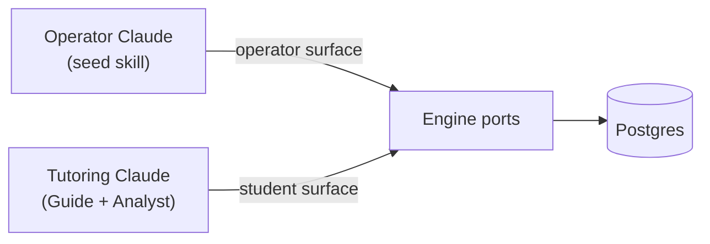
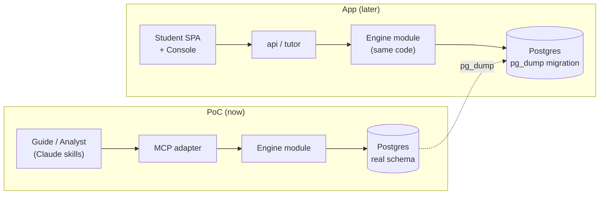

MVP-1 is Stemolly's first shipped product — but before building the full app, the team runs an **Engine-Validation PoC** with one real student. The PoC proves the belief-graph engine is worth the investment; only then does the app get built. This page covers both: what MVP-1 will ship, and how the PoC gets there first.

---

## MVP-1 App Scope

### Two apps, one team as the first user

MVP-1 ships two applications:

- **Student app** — the learning surface where students take lessons.
- **Console** — the educator/operator tool, with an **Author** area for building curriculum and an **Observe** area for reviewing engine metrics and student progress.

Teachers and schools as a managed user tier are deferred to a later phase. In MVP-1, the Stemolly team itself is the active Console user — building curriculum in Author, watching the engine in Observe, and validating that the mental-model signals are real.

### One study mode: Lesson

Stemolly has three study modes (Lesson, Assessment/Diagnostic, Assignment Help). MVP-1 ships **only Lesson**. The other modes are deferred.

The reason is deliberate. A Lesson session begins with a **structured curriculum path picker** — the student chooses a subject, path, and lesson from the team-authored curriculum. That picked path resolves directly to authored lesson briefs that the tutor conducts Socratically. A structured path also maps cleanly onto the concept graph: each lesson corresponds to known nodes and prerequisite edges, giving the engine stable anchors to attach evidence to from the very first turn.

**Why not free-text topic entry?** If a student typed any topic they liked, the AI would have to invent structure on the fly. There would be no stable concept nodes to anchor evidence to, which would undercut the main thing MVP-1 exists to validate — that the engine produces a real, grounded belief graph. Free-text entry can be added once the engine is proven on structured paths.

### Two subjects: deep on Math, thin on Language

MVP-1 launches with two subject areas:

| Subject | Content | Why |
|---|---|---|
| **Math — Vietnam K11** | Full depth, real prerequisite DAG | Misconceptions are crisp and groundable; provides the strongest engine-validation demo |
| **Language — IELTS Writing + Reading** | Thin launch | Proves the engine generalises across a very different domain and pedagogy |

The strong claim MVP-1 pursues is that **one engine produces a useful mental graph across two very different domains** — Socratic math tutoring and Correct/Reinforce language coaching. That is a bigger claim than "it works for algebra." Reading is the cleanest Lesson-mode fit; Writing carries the richest mental-model signal (grammar and writing patterns that are highly predictable for Vietnamese-L1 learners). SAT Math is anticipated in the shared-node design but is not necessarily built in MVP-1.

---

## The Engine-Validation PoC

### Why the PoC runs first

The only load-bearing bet in MVP-1 is the belief-graph engine. Building the full Student SPA, auth, and Console before knowing whether the engine produces valid signals would be expensive and risky. So MVP-1 runs a PoC first: **one real student uses the product for assignment help** (Math first, then Physics), delivered through **Claude skills** talking to the engine over an MCP, with the engine deployed to a VPS. No Student SPA. No auth. No Console.

The PoC is deliberately called a PoC — not "MVP-0" — to keep one thing explicit: **the shell is disposable, the engine data is not.** The app UI track is deferred behind the PoC, not cancelled.

### How the PoC runs: Claude as Guide and Analyst

Inside the PoC, Claude hosts both tutor roles:

```
Student message
      │
      ▼
 ┌──────────┐    MCP (student surface)       ┌────────────┐
 │  Guide   │ ─────────────────────────────> │   Engine   │
 │  (skill) │ <────────── Report ──────────  │  (Postgres)│
 └────┬─────┘                                └────────────┘
      │  invokes subagent at checkpoint
      ▼
 ┌──────────┐    MCP (student surface)
 │ Analyst  │ ──── append_evidence ──────────>  Engine
 │ (skill)  │ ──── propose_catalog_candidate >  Engine
 └──────────┘
```

- The **Guide** runs the tutoring session turn by turn — conversing with the student, reading their submitted materials directly (Claude reads PDFs and images natively; a lossy transcription would only hurt comprehension).
- The **Analyst** fires at checkpoints as a subagent. It reasons over the interaction, then writes evidence to the engine over the MCP.

Because there is only one student, the Analyst runs **synchronously**: the student submits → Guide invokes Analyst → Analyst appends evidence, the engine recomputes belief state, returns a Report → Guide continues. The async job runner, degraded-path fallback, and Report-lag handling that the full app needs are all dropped for the PoC. They are re-introduced only when real concurrency arrives.

This preserves the real two-agent architecture (Guide converses, Analyst diagnoses and writes beliefs), with Claude filling the model slot. The master plan already treats the model as a swappable slot, so the PoC is a legitimate dry-run of the orchestration — not a hack.

### The MCP: append-only by design

The MCP the PoC exposes to Claude is deliberately **append-only on the write side**.

| Tool direction | Tools |
|---|---|
| **Read** | `get_belief_state`, `match_catalog`, prior beliefs |
| **Write** | `append_evidence`, `propose_catalog_candidate` |
| **Forbidden** | Any tool that sets a belief projection directly |

There is no tool that lets Claude write "fragility = fragile" directly. Misconceptions, fragility signals, and reasoning patterns are always computed by engine code from the evidence log. If the MCP exposed a "set belief" write tool, the derived state would no longer be grounded in replayable evidence — and the whole engine-validation exercise would be undermined. Keeping writes append-only is what keeps the PoC's data trustworthy and migratable.

### Evidence is checkpoint-grained, not per-event

`append_evidence` takes one checkpoint's events as a **batch** and only appends — it returns an acknowledgement, nothing more. `get_belief_state` then folds the log at read time. There is no separate "close checkpoint" call and no materialized projection table in the PoC; at one-student scale, folding the log on every read is free.

Why batch-per-checkpoint rather than per-event? The fragility fold needs to net a *whole* checkpoint together. A self-correction is a `misconception_evidence(for)` and a `probe_outcome(correct)` in the same checkpoint that cancel each other out. Recomputing after a single event would net a half checkpoint and produce a wrong intermediate signal.

Projections will be materialized only if the log grows large enough to make read-time folding slow — which one student never will.

### Serializing tool results: guard the output, not the input

Every tool result in the MCP adapter passes through one shared wrapper before it goes over the wire. That wrapper must guard the serialized output — not the handler's return value — and the reason is subtle.

`JSON.stringify` returns the *value* `undefined` (not a string) when given `undefined`, a function, or a `Symbol`. It **never throws** for any of them, so a `try/catch` around the call sees nothing wrong. Any code that then assumes a string came back will emit a malformed reply and the error will appear to originate elsewhere.

The obvious fix — `JSON.stringify(result ?? null)` — guards against a handler returning nothing, which is the most common reported bug. But it leaves the class open: a function or a `Symbol` passes the `??` check untouched and still serializes to `undefined`. The correct defence guards **what came out**:

```js
// ✗ guards only the "nothing returned" case
const body = JSON.stringify(result ?? null);

// ✓ covers every value JSON.stringify turns into undefined
const body = JSON.stringify(result) ?? 'null';
```

The fallback is the JSON literal `"null"` — parseable by the client and honest: it means "no value", rather than inventing one.

In the PoC this rule lives in the single wrapper that every registered tool's result flows through, so it holds automatically for any tool added later, not just for `append_evidence` today. The broader lesson generalises beyond this adapter: **a serializer that signals failure by returning a value rather than throwing defeats exception-based error handling.** The check must sit on the output, because nothing on the input side announces the problem.

### Two MCP surfaces: student and operator

The student session must not hold seed or approve tools. Not for security reasons — the PoC runs in a trusted environment with no auth — but to protect the **"AI drafts, human approves" gate**. If the tutoring Claude held an `approve_candidate` tool it would eventually fire it, promoting a draft node to trusted without human review. No replay fixes that, because promotion is a trust state, not an appended event.

The solution is **configuration-time, not auth**: two MCP surfaces over the *same* engine ports.

The MCP process reads an `MCP_ROLE` environment variable **once at startup** and registers exactly one surface's tool map on the MCP server. The unselected surface's tools are never registered at all — they are absent from tool discovery entirely, not merely refused on call.

| Surface | Tools exposed |
|---|---|
| **student** | `append_evidence`, `propose_catalog_candidate`, `get_belief_state`, `match_catalog` |
| **operator** | `approve_candidate`, `seed_node`, `seed_edge`, `seed_catalog`, `get_belief_state`, `match_catalog` |

An unrecognized or missing `MCP_ROLE` makes the process **refuse to boot** — fail-closed by construction. There is no code path that produces a running server with an unintended tool map.

The deployment is two processes from one image, differing only by environment variable, both connected to the same database.



:::note[Trust boundary]
The role is enforced by configuration and the transport is stdio — so the trust boundary is **whoever spawns the process**. This holds for the PoC, where the tutoring skill spawns its own student-surface process. It would not hold over a shared network transport serving many clients from one server, which would need real authentication. The app enforces the same Console-vs-Student split with real auth — this PoC design does not block that.
:::

Seeding happens before the student starts a topic; candidate approvals happen between sessions — so the approve tools never need to appear on the student surface.

### Content seeding: operator seeds, AI drafts, human approves

Before a student uses a topic, the concept graph (nodes + prerequisite edges) and catalogs (known misconceptions, reasoning patterns) are seeded by the operator. The operator can run this by hand or use a dedicated **seed skill**: Claude reads the study materials, drafts nodes/edges/catalog entries as **candidates**, and persists them only after the operator approves. Nothing the AI drafts is auto-trusted.

The seeded graph lives in the engine's Postgres. During a tutoring session, the Guide maps each problem to seeded node IDs. When a problem touches a concept that was not seeded, the Analyst proposes a candidate node — the operator approves it before the next session. The student session never authors or approves nodes.

### What the engine receives: a thin anchor, not document content

The engine never sees equations, tables, or diagrams from the student's materials. It only needs **stable node identity** to hang evidence on. Claude reads the raw material (PDFs, images) and coaches from it; it then hands the engine a thin **problem anchor**:

```json
{ "id": "prob_001", "label": "Quadratic roots — discriminant", "nodeRefs": ["node_alg_quad_discriminant"] }
```

The same node IDs flow through the anchor, each evidence event, and the derived beliefs — that is the only thread the engine needs. A richer structured content format (for diagrams, tables, equations) is a good idea but belongs to the app's content design gate, where a renderer will finally consume it. The PoC builds no structured content contract.

The anchor shape is defined as a JSON Schema in `packages/contracts` (the shared-types package), following the same convention as all other cross-module contracts. It carries **no `schemaVersion` field** in the PoC: a version field only earns its place when two independently-deployed programs can disagree about a format. Here the producer and consumer run in the same process, so there is no skew to protect against. A version field can be added if the anchor ever crosses a true deployment boundary — which the monolith architecture never creates.

---

## What's Durable vs Disposable

The framing that governs everything downstream:

| PoC layer | Durability |
|---|---|
| Claude skills (Guide / Analyst) | Disposable — swapped for the in-house harness when the app ships |
| MCP adapter | Disposable — a thin driving adapter that is replaced by the app's `api`/`tutor` |
| Engine module (`packages/engine`) | **Durable** — built for real, reused unchanged when the app ships |
| Postgres schema (`nodes`, `edges`, `evidence_events`) | **Durable** — migrates into the app via `pg_dump`, not a rewrite |
| Evidence log | **Durable** — the student's belief history must not be lost when she moves to the app |

The student's belief history surviving the transition from PoC to app is a **hard requirement**. That requirement forces the engine to be built on its real schema now, not a throwaway store. It also forces the MCP to be a thin adapter over the engine's ports — the same port slot the app's API layer will later occupy. When the app arrives, only the driving adapter swaps; the engine code and its data stay.



The MCP and Claude skills are the disposable mouth. The engine — its code, its schema, its append-only evidence log — is the product, wearing a different mouth while the app is built.

---

## Related pages

- [Engine mental model and architecture](../engine/mental-model.md)
- [Tutor agent: Guide and Analyst](../engine/tutor-agent.md)
- [Belief graph and evidence](../engine/belief-graph.md)
